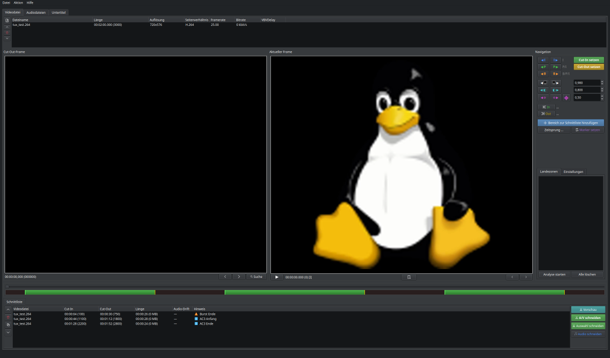

# TTCut-ng

[](COPYING)
[](https://github.com/MINIXJR/TTCut-ng/tags)
[]()

Framegenauer Videoschnitt für MPEG-2, H.264 und H.265 Elementary Streams.
Primär entwickelt zum Schneiden von [VDR](https://www.tvdr.de/)-Aufnahmen (Video Disk Recorder)
— Werbung entfernen ohne den gesamten Stream neu zu kodieren.
Nur die Frames an den Schnittpunkten werden selektiv neu kodiert.



## Funktionen

- **MPEG-2** — direktes Stream-Copy, Re-Encoding nur an Schnittpunkten (via ffmpeg)
- **H.264/H.265** — Smart Cut (~99,5% Stream-Copy, ~0,5% Re-Encode)
- **SRT-Untertitel** — automatisches Laden, Vorschau-Overlay, Schnitt zusammen mit dem Video
- **MKV-Ausgabe** mit Kapitelmarken (via mkvmerge)
- **ttcut-demux** — Multi-Core TS-Demuxer mit A/V-Sync-Korrektur, Audio-Padding und VDR-Marks-Unterstützung
- Tastaturkürzel für Frame-Navigation und Schnittpunkt-Auswahl (`?` für Hilfe)

## Installation

Entwickelt und getestet auf [Siduction](https://siduction.org/), einer Distribution
basierend auf Debian unstable (sid), die aktuelle Versionen von Qt, ffmpeg und
anderen Bibliotheken bereitstellt.

### Abhängigkeiten (Debian/Ubuntu)

```bash
sudo apt install qt5-qmake qtbase5-dev libmpeg2-4-dev \
  libavformat-dev libavcodec-dev libavutil-dev libswscale-dev \
  ffmpeg mpv mkvtoolnix mjpegtools
```

### Build

```bash
qmake ttcut-ng.pro && make -j$(nproc)
```

## Verwendung

1. **Demuxen** der TS-Aufnahme in Elementary Streams:
   ```bash
   # MPEG-2/H.264/H.265 (empfohlen)
   tools/ttcut-demux -e Aufnahme.ts    # -e = Elementary Streams extrahieren

   # Alternative für MPEG-2
   projectx Aufnahme.ts
   ```
   > **Hinweis:** ProjectX erzeugt keine `.info`-Metadatendatei. Ohne diese stehen
   > Funktionen wie Framerate-Erkennung und A/V-Sync-Korrektur nicht zur Verfügung.
   > `ttcut-demux` wird für alle Stream-Typen empfohlen.
2. **Öffnen** der Videodatei (.m2v, .264, .265) in TTCut-ng und Audiospuren hinzufügen (.ac3, .mp2)
3. **Navigieren** zu den gewünschten Positionen und Schnittpunkte setzen (Cut-In/Cut-Out)
4. **Schneiden** — das Ergebnis wird als MKV mit allen ausgewählten Audio- und Untertitelspuren geschrieben

> **Hinweis:** Unter Wayland benötigt TTCut-ng das XCB-Backend:
> `QT_QPA_PLATFORM=xcb ./ttcut-ng`

## Mitwirken

Issues und Pull Requests sind willkommen.

## Credits

Ursprünglich basierend auf TTCut von B. Altendorf (2005-2008).

## Lizenz

GPLv3+ — siehe [COPYING](COPYING).
