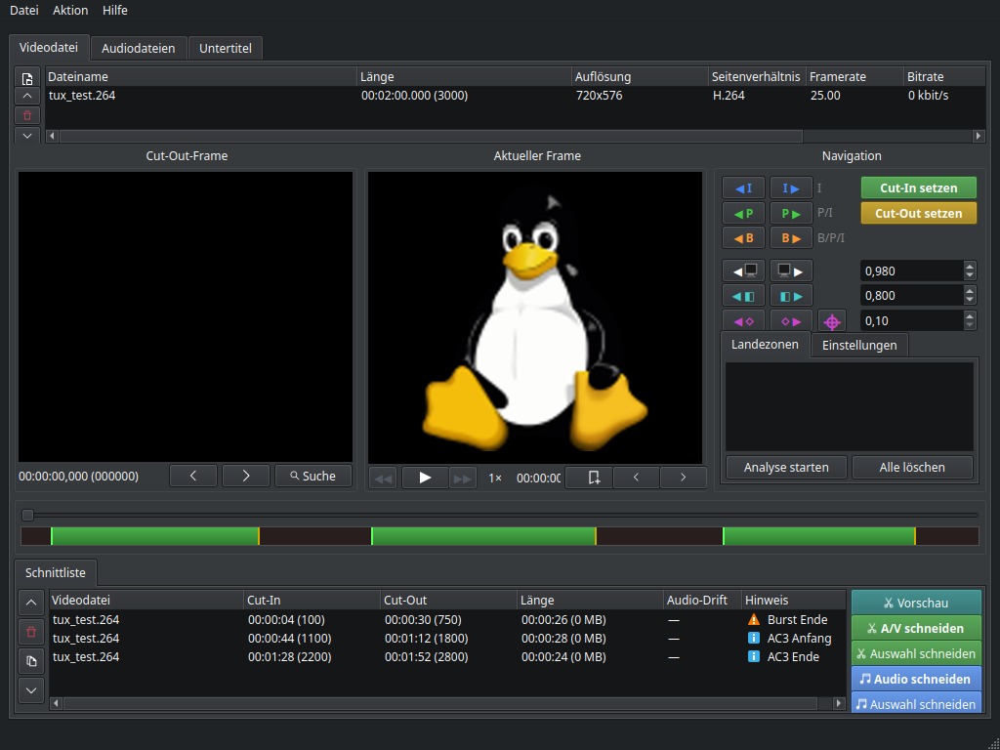

# TTCut-ng

[](LICENSE)
[](https://github.com/MINIXJR/TTCut-ng/tags)
[](https://claude.ai/code)
[]()

Framegenauer Videoschnitt für MPEG-2, H.264 und H.265 Elementary Streams.
Primär entwickelt zum Schneiden von [VDR](https://www.tvdr.de/)-Aufnahmen (Video Disk Recorder)
— Werbung entfernen ohne den gesamten Stream neu zu kodieren.
Nur die Frames an den Schnittpunkten werden selektiv neu kodiert.



## Funktionen

- **MPEG-2** — direktes Stream-Copy, Re-Encoding nur an Schnittpunkten (via libav)
- **H.264/H.265** — Smart Cut (~99,5% Stream-Copy, ~0,5% Re-Encode)
- **SRT-Untertitel** — automatisches Laden, Vorschau-Overlay, Schnitt zusammen mit dem Video
- **MKV-Ausgabe** mit Kapitelmarken (via libav matroska muxer)
- **Landezonen** — automatische Erkennung von Schwarzbildern, Stille, Audioformatwechsel,
  Szenenwechsel, Seitenverhältnisänderungen (4:3/16:9) und Pillarbox (4:3 in 16:9) mit Schnittvorschlägen
- **Logo-Erkennung** — Senderlogo-Detektion via markad PGM-Import oder manueller ROI-Selektion zur Werbeblock-Navigation
- **Zeitsprung** — Keyframe-Thumbnail-Browser für schnelle Navigation mit Intervallfilter
- **ttcut-demux** — Multi-Core TS-Demuxer mit A/V-Sync-Korrektur, Audio-Padding und VDR-Marks-Unterstützung
- Tastaturkürzel für Frame-Navigation und Schnittpunkt-Auswahl (`?` für Hilfe)

## Systemanforderungen

| | |
|---|---|
| Betriebssystem | Linux. Entwickelt und getestet auf [Siduction](https://siduction.org/) (Debian unstable), das aktuelle Qt- und libav-Versionen bereitstellt |
| Architektur | `linux-any` — der Quelltext enthält keinen architekturabhängigen Code; getestet wird ausschließlich auf x86_64 |
| Qt | 5.15 (Qt 6 wird nicht unterstützt), C++17 |
| libav/ffmpeg | 5.1 oder neuer — genutzt wird die `AVChannelLayout`-API, die ältere Versionen nicht kennen. Entwickelt gegen 8.x |
| libmpeg2 | 0.5.1 |
| Grafik | OpenGL für die Videoausgabe (libmpv rendert in ein `QOpenGLWidget`). Läuft nativ unter Wayland und X11 |

### Abhängigkeiten (Debian/Ubuntu)

```bash
# Build + erforderliche Laufzeit-Bibliotheken
sudo apt install cmake ninja-build qtbase5-dev libqt5opengl5-dev libmpeg2-4-dev \
  libavformat-dev libavcodec-dev libavutil-dev libswscale-dev \
  libavfilter-dev libswresample-dev libmpv-dev

# Optional: MP4-Output, MPEG-2 Multiplexing, Qualitätsprüfung
sudo apt install ffmpeg mjpegtools python3-numpy
```

> **libmpv ist nicht optional.** Der Player ist seit v0.71.0 als Bibliothek
> eingebunden (in-process Rendering für Wayland), nicht mehr als externer
> mpv-Prozess — ohne `libmpv-dev` bricht bereits `cmake` beim Konfigurieren ab.

### Plattenplatz

Die elementaren Streams entsprechen in der Summe ungefähr der TS-Aufnahme, und
das Schnittergebnis kommt daneben. Bei H.264/H.265 legt der erste Klick auf
*Play* zusätzlich eine temporäre MKV über die **gesamte** Länge des Streams an
(Elementary Streams tragen keine Zeitstempel, die zum Suchen taugen) — sie wird
über STOP→PLAY zwischengespeichert und im Temp-Verzeichnis abgelegt. Für eine
zweistündige HD-Aufnahme sollte man daher grob das Zweieinhalbfache der
Aufnahmegröße frei haben.

### Build

```bash
cmake -B build -G Ninja && cmake --build build
```

## Verwendung

1. **Demuxen** der TS-Aufnahme in Elementary Streams:
   ```bash
   # MPEG-2/H.264/H.265 (empfohlen)
   tools/ttcut-demux -e Aufnahme.ts    # -e = Elementary Streams extrahieren

   # Alternative für MPEG-2
   projectx Aufnahme.ts
   ```
   > **Hinweis:** ProjectX erzeugt keine `.info`-Metadatendatei. Ohne diese stehen
   > Funktionen wie Framerate-Erkennung und A/V-Sync-Korrektur nicht zur Verfügung.
   > `ttcut-demux` wird für alle Stream-Typen empfohlen.
2. **Öffnen** der Videodatei (.m2v, .264, .265) in TTCut-ng und Audiospuren hinzufügen (.ac3, .mp2)
3. **Navigieren** zu den gewünschten Positionen und Schnittpunkte setzen (Cut-In/Cut-Out)
4. **Schneiden** — das Ergebnis wird als MKV mit allen ausgewählten Audio- und Untertitelspuren geschrieben

> **Hinweis:** TTCut-ng läuft nativ unter Wayland und X11. Sollte ein
> Wayland-Compositor Darstellungsfehler zeigen, hilft ersatzweise
> `QT_QPA_PLATFORM=xcb ./build/ttcut-ng`.

## Dokumentation

Ausführliche Dokumentation im [Wiki](https://github.com/MINIXJR/TTCut-ng/wiki).

## Mitwirken

Issues und Pull Requests sind willkommen.

## Credits

Ursprünglich basierend auf TTCut von B. Altendorf (2005-2008).

Das Tux-Maskottchen (`ui/pixmaps/Tux.svg`) wurde 1996 von Larry Ewing
(`lewing@isc.tamu.edu`) mit The GIMP erstellt — Details und die vollständige
Erlaubnis in [CREDITS.md](CREDITS.md).

## Lizenz

GPLv3+ — siehe [LICENSE](LICENSE).
