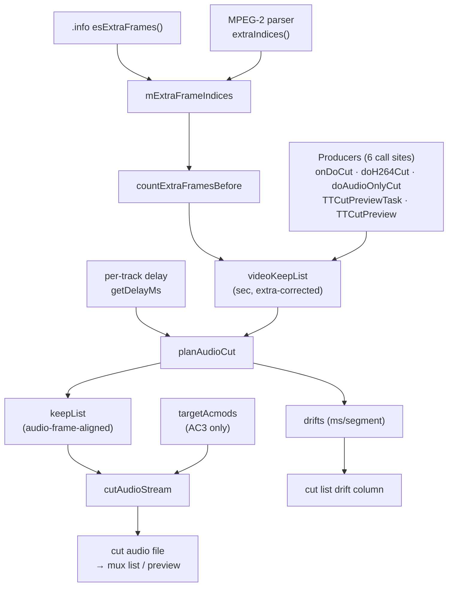

# Audio-Cut-Zeitkette (video-frame-index → audio-frame-aligned cut)

Wie ein Schnitt in **Video-Frame-Indizes** (Anzeige-Ordnung) zu einem
**tonrasteralignierten** Audio-Schnitt wird: Extra-Frame-Korrektur → Delay →
Raster-Snapping mit Feed-Forward-Drift → Einzeldurchlauf-Schnitt mit
fortlaufendem PTS und optionaler AC3-acmod-Umkodierung. Diese Kette hat uns beim
Benders-Burst 273 Frames ≈ 11 s verschoben (korrekt, weil Schnitt **und**
Burst-Prüfung dieselbe Formel nutzen — siehe `burst-detection.md`).

**Nicht** Teil dieser Karte: die Video-Schnitt-Semantik selbst (MPEG-2 →
`mpeg2-cut.md`, H.264/H.265 → `smart-cut.md`), die Burst-Erkennung
(`burst-detection.md`), die Anzeige-/Decode-Ordnung (`frame-order.md`).

## Diagramm

Durchgezogen = Datenfluss (Produzent → Konsument). Gestrichelt = Auslöser.

Seit `7849f66` ist die Spine `VKL → PLAN → KEEP → CUT` **einmal** in
`TTAVData::cutAudioTracks` implementiert (VKL via `buildVideoKeepList`); `PROD` sind
nur noch die Aufrufer, die Keep-List-Quelle + Ausgabe-Lambdas liefern. Die
Kanten-Semantik unten gilt unverändert (siehe Redundanz-Abschnitt).

## Kanten-Semantik (eine Zeile pro Grenze)

| von → nach | Daten / Reihenfolge / Invariante |
|---|---|
| `INFO → EXTRA` | H.264/H.265: `.info`-Feld `es_extra_frames` → `mExtraFrameIndices`, über den gemeinsamen Helfer `loadExtraFrameIndices(target, esInfo, vStream)` (no-op, falls `target` schon gefüllt). Für MPEG-2 nur Fallback, wenn der Parser keine Feldpaare liefert. Aufsteigend sortiert. Geladen **ausschließlich in `onOpenVideoFinished`** (nicht mehr im synchronen `openAVStreams` — der Parser-Index ist dort noch leer, siehe `fc2a573`) und erneut im Cut-Pfad (`onDoCut`), falls leer. |
| `MP2X → EXTRA` | Für MPEG-2 hat seit `b69dfcf` der Bitstream-Parser **Vorrang vor `.info`**: `loadExtraFrameIndices` bevorzugt `TTMpeg2VideoStream::extraIndices()` (Anzeige-Index-Raum, Feldbild-Zweiteinträge, siehe `mpeg2-cut.md`) vor `es_extra_frames` (Decode-Index-Raum, PTS-Heuristik) — Prioritätsumkehr ggü. vorher. `loadMpeg2FieldExtras` wurde entfernt; die MPEG-2-Parser-Bevorzugung sitzt jetzt in `loadExtraFrameIndices` selbst (nicht mehr als reiner Nur-wenn-leer-Fallback). |
| `EXTRA → CEFB` | Sortierte Extra-Index-Liste; `countExtraFramesBefore(idx)` zählt per Binärsuche die Einträge `< idx`. Invariante: Liste aufsteigend sortiert. |
| `CEFB → VKL` | Extra-Anzahl `N`; Zeit = `(index − N)/fps`. Cut-Out nutzt `index+1` (Grenze **hinter** den letzten behaltenen Frame). Bildet den aufgeblähten Anzeige-Index auf echte Audiozeit ab. |
| `PROD → VKL` | Alle Final-Cut-Produzenten (`onDoCut`, `doH264Cut`, `doAudioOnlyCut`, die Drift-only-Stelle) bauen die (start,end)-Sekundenliste jetzt **einheitlich** über `buildVideoKeepList`. `doH264Cut` hatte dafür noch einen eigenen offen-codierten `(index−extra)/fps`-Block (die 6. Kopie dieser Umrechnung); seit `1d5b956` ruft sie `buildVideoKeepList` direkt auf, kein Sonderfall mehr. Ohne Delay. Die zwei Vorschau-Pfade (`TTCutPreviewTask::createH264PreviewClip`, `TTCutPreview` 3-Arg-Aufruf) bauen weiterhin roh ohne Extra-Korrektur — bewusste Ausnahme, siehe Redundanz-Abschnitt (Option A). |
| `DELAY → PLAN` | Per-Track-Delay in ms (`TTAudioItem::getDelayMs`), als `delaySec` auf die Segmentzeiten addiert. Pro Tonspur eigener Wert. |
| `VKL → PLAN` | (start,end) Sekunden je Segment, extra-korrigiert, **noch ohne Delay**. Kontrakt: bereits anzeige-/B-Frame-korrekt — `planAudioCut` verschiebt nur, prüft nicht. |
| `PLAN → KEEP` | (start,end) auf das **Audio-Frame-Raster** gerundet (Vielfache der Frame-Dauer: MP2@48k = 24 ms, AC3@48k = 32 ms). Feed-Forward: `numFrames` je Segment so gewählt, dass die kumulierte Audiolänge der Videolänge folgt. |
| `PLAN → DRIFT` | Kumulierter A/V-Versatz in ms nach jedem Segment (Audiolänge − Videolänge, Summe aller vorherigen). Im eingeschwungenen Zustand ±½ Audioframe. |
| `KEEP → CUT` | Rasteralignierte (start,end). `cutAudioStream` behält nur Frames, die **komplett** ins Segment passen (`pktTime + frameDur > endTime` → stop) → verliert ≤1 Frame je Segmentende; genau das kompensiert `planAudioCut` per `numFrames`. |
| `ACMOD → CUT` | Ziel-`acmod` pro Segment (nur AC3, aus `analyzeAcmod` über die geplanten Fenster). Frames mit abweichendem `acmod` werden dekodiert → umkanaliert (`swr`) → neu kodiert; sonst Stream-Copy. |
| `CUT → OUT` | Einzeldurchlauf über alle Segmente. Fortlaufender PTS-Versatz (`ptsOffset = nextOutputPts − pkt->pts` je Segmentanfang) macht die Ausgabe lückenlos (entfernt die Zwischensegment-Lücke). Ausgabeformat aus Dateiendung. |
| `DRIFT → COL4` | Drift-ms pro Schnitt → Cut-Listen-Spalte 4 (`TTCutTreeView::onAudioDriftUpdated`, setzt Spalte 4). **Zwei** Signale speisen denselben Slot: `audioDriftCalculated` (Vorschau, `TTCutPreviewTask`) und `cutAudioDriftCalculated` (Final-Cut, `TTAVData`). Nur Track 0. |

## Annahmen & Kontrakte

- **`planAudioCut`** setzt voraus, dass `videoKeepList` schon extra-korrigiert und
  (für H.264/H.265) B-Frame-korrigiert ist. Es addiert nur den Delay und snappt
  aufs Raster — es prüft die Eingabe nicht. Eine unkorrigierte Zeit landet direkt
  im Ton, ohne Warnung.
- **`cutAudioStream`** setzt rasteralignierte Grenzen voraus (garantiert `planAudioCut`).
  Seine „komplett passen"-Regel verwirft ≤1 Frame je Segmentende; die
  `numFrames`-Wahl in `planAudioCut` ist genau darauf ausgelegt.
- **`countExtraFramesBefore`** setzt `mExtraFrameIndices` aufsteigend sortiert voraus
  (Binärsuche).
- **`cutAudioTracks`** prüft `trackIndices` seit `1d5b956` gegen `avItem->audioCount()`,
  bevor es `audioStreamAt`/`audioListItemAt` aufruft (beide asserten bei einem
  Index außerhalb des Bereichs). Ein außerhalb liegender Index wird geloggt und
  übersprungen statt die App abstürzen zu lassen — relevant, weil `cutAudioTracks`
  public ist und Aufrufer veraltete Indizes reichen könnten.
- **Synchron mit der Burst-Prüfung:** `detectCutOutBurst`/`detectCutInBurst`
  (`data/ttavdata.cpp`) nutzen dieselbe Grenzformel `(index[+1] − extra)/fps`.
  Ändert sich die Korrektur hier, muss sie dort mitgehen (siehe `burst-detection.md`).

## Bekannte Fallstricke

- **Die Extra-Korrektur kann die Grenze um Sekunden verschieben.** Gemessen am
  Benders-Beispiel (MPEG-2 SD, Comedy Central): 273 Extra-Frames vor dem Cut-Out
  → −10,9 s. Kein Fehler: Schnitt und Burst-Prüfung nutzen dieselbe Formel, sind
  also einig. Ein Konsument, der die Korrektur vergäße, läge Sekunden daneben.
- **`mAudioGapIndices` ist NICHT Teil dieser Kette.** Diese zweite Liste
  (`.info audioGapFrames`, in `ttavdata.cpp` zu Clustern verarbeitet) dient nur der
  Defekt-Meldung, nicht der Cut-Zeitrechnung. `countExtraFramesBefore` liest allein
  `mExtraFrameIndices`. Nicht verwechseln.
- **Delay ist pro Track, Drift-Anzeige nur Track 0.** Bei unterschiedlichen
  Per-Track-Delays zeigt Spalte 4 nur die erste Spur.

## Redundanz / Konsolidierungskandidaten

- **[KONSOLIDIERT `b28a7bd`..`7849f66`]** Die Producer bauen die Sequenz nicht mehr
  jeder selbst. `TTAVData::cutAudioTracks` ist die eine Implementierung von
  Spur-Schleife → `planAudioCut` → `targetAcmods` (AC3, interner
  `computeTargetAcmods`) → `cutAudioStream`; `TTAVData::buildVideoKeepList` ist die
  eine Stelle für `(index − extra)/fps` (löst zugleich die Audiozeit-Variante der in
  `frame-order.md` notierten Konvertierung). Migriert: `onDoCut`, `doH264Cut`,
  `doAudioOnlyCut` (Stage 1), der `TTCutPreviewTask`-Vollcut, die `TTCutPreview`-GUI-
  Vorschau und die Drift-only-Stelle — alle über `buildVideoKeepList`. `doH264Cut`
  baute die Keep-List anfangs noch mit eigenem `(index−extra)/fps`-Code (die 6. offene
  Kopie dieser Umrechnung); seit `1d5b956` (Review-Fix auf dem Konsolidierungsbranch)
  ruft auch sie `buildVideoKeepList` direkt auf, kein Sonderfall mehr. Die Producer
  liefern nur noch Keep-List-Quelle, `trackIndices` und Ausgabe-Lambdas.
  **Bit-identisch belegt** (Benders MP2 deu+eng, ServusTV AC3, `ffmpeg -c copy -f md5`
  vorher/nachher; nach dem Review-Fix erneut belegt: ServusTV H.264, Designermode H.265).
- **Bewusst NICHT konsolidiert (Option A):** die zwei abweichenden Vorschau-Pfade —
  `TTCutPreviewTask` Segment-Vollcut und `TTCutPreview` 3-Argument-Aufruf — bauen ihre
  Keep-List **ohne** Extra-Frame-Korrektur (der 3-Arg auch ohne Snapping/acmod). Sie
  durch `cutAudioTracks` zu leiten wäre eine **Verhaltensänderung** (Vorschau-
  Korrektheitsfix, separat zu rechtfertigen). Bleibt offen.
- **Zwei Drift-Signale** (`audioDriftCalculated`, `cutAudioDriftCalculated`) auf
  denselben Slot `onAudioDriftUpdated`. Nicht Teil von A1/A2 — weiterhin offen.
