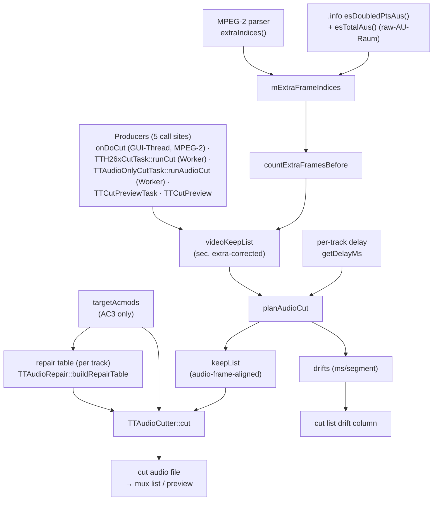

# Audio-Cut-Zeitkette (video-frame-index → audio-frame-aligned cut)

Wie ein Schnitt in **Video-Frame-Indizes** (Anzeige-Ordnung) zu einem
**tonrasteralignierten** Audio-Schnitt wird: Extra-Frame-Korrektur → Delay →
Raster-Snapping mit Feed-Forward-Drift → Einzeldurchlauf-Schnitt mit
fortlaufendem PTS und optionaler AC3-acmod-Umkodierung. Diese Kette hat uns beim
Benders-Burst 273 Frames ≈ 11 s verschoben (korrekt, weil Schnitt **und**
Burst-Prüfung dieselbe Formel nutzen — siehe `burst-detection.md`).

**Nicht** Teil dieser Karte: die Video-Schnitt-Semantik selbst (MPEG-2 →
`mpeg2-cut.md`, H.264/H.265 → `smart-cut.md`), die Burst-Erkennung
(`burst-detection.md`), die Anzeige-/Decode-Ordnung (`frame-order.md`).

## Diagramm

Durchgezogen = Datenfluss (Produzent → Konsument). Gestrichelt = Auslöser.

Seit `7849f66` ist die Spine `VKL → PLAN → KEEP → CUT` **einmal** in
`TTAVData::cutAudioTracks` implementiert (VKL via `buildVideoKeepList`); `PROD` sind
nur noch die Aufrufer, die Keep-List-Quelle + Ausgabe-Lambdas liefern. Die
Kanten-Semantik unten gilt unverändert (siehe Redundanz-Abschnitt).

Seit der Task-Pool-Umstellung (H.26x- und Audio-Only-Endschnitt laufen als
eigene `TTThreadTask`-Klassen) sind zwei der fünf `PROD`-Aufrufer nicht mehr
`TTAVData::doH264Cut`/`doAudioOnlyCut` selbst — die bauen nur noch `VKL`
(via `buildVideoKeepList`, GUI-Thread) und reichen sie per Wertkopie
(`TTH26xCutParams::keepList` / `TTAudioOnlyCutParams::videoKeepList`) an
`TTH26xCutTask::runCut` bzw. `TTAudioOnlyCutTask::runAudioCut` weiter, die
dann auf einem Pool-Worker-Thread `cutAudioTracks` aufrufen. `onDoCut`
(MPEG-2) bleibt die einzige Stelle, die `VKL` UND den `cutAudioTracks`-Aufruf
synchron im GUI-Thread hält.

```mermaid
flowchart TD
  INFO[".info esDoubledPtsAus()<br/>+ esTotalAus() (raw-AU-Raum)"]
  MP2X["MPEG-2 parser<br/>extraIndices()"]
  EXTRA["mExtraFrameIndices"]
  CEFB["countExtraFramesBefore"]
  PROD["Producers (5 call sites)<br/>onDoCut (GUI-Thread, MPEG-2) ·<br/>TTH26xCutTask::runCut (Worker) ·<br/>TTAudioOnlyCutTask::runAudioCut (Worker) ·<br/>TTCutPreviewTask · TTCutPreview"]
  VKL["videoKeepList<br/>(sec, extra-corrected)"]
  DELAY["per-track delay<br/>getDelayMs"]
  PLAN["planAudioCut"]
  KEEP["keepList<br/>(audio-frame-aligned)"]
  ACMOD["targetAcmods<br/>(AC3 only)"]
  REPAIR["repair table (per track)<br/>TTAudioRepair::buildRepairTable"]
  CUT["TTAudioCutter::cut"]
  OUT["cut audio file<br/>→ mux list / preview"]
  DRIFT["drifts (ms/segment)"]
  COL4["cut list drift column"]

  INFO --> EXTRA
  MP2X --> EXTRA
  EXTRA --> CEFB
  CEFB --> VKL
  PROD --> VKL
  DELAY --> PLAN
  VKL --> PLAN
  PLAN --> KEEP
  PLAN --> DRIFT
  KEEP --> CUT
  ACMOD --> CUT
  ACMOD --> REPAIR
  REPAIR --> CUT
  CUT --> OUT
  DRIFT --> COL4
```

## Kanten-Semantik (eine Zeile pro Grenze)

| von → nach | Daten / Reihenfolge / Invariante |
|---|---|
| `INFO → EXTRA` | H.264/H.265: `.info`-Felder `es_total_aus` + `es_doubled_pts_aus` → `mExtraFrameIndices`, über den gemeinsamen Helfer `loadExtraFrameIndices(target, esInfo, vStream)` (no-op, falls `target` schon gefüllt). **Der Altschlüssel `es_extra_frames` wird bewusst NICHT gelesen** — seine Nummerierung war mehrdeutig. Die Kandidaten sind **roh-AU-nummeriert** (ein AU je PES-Paket, PAFF-Felder getrennt) und werden über die raw→merged-Karte in den Anzeigeraum übersetzt (siehe `frame-order.md`); Vorbedingung ist `es_total_aus == rawAuCount()`, sonst werden sie verworfen und gewarnt. Kollabierte zweite Felder und Positionen ohne Anzeigeplatz fallen dabei heraus, nur echte Defekte bleiben übrig. Für MPEG-2 nur Fallback, wenn der Parser keine Feldpaare liefert. Aufsteigend sortiert. Geladen **ausschließlich in `onOpenVideoFinished`** (nicht mehr im synchronen `openAVStreams` — der Parser-Index ist dort noch leer, siehe `fc2a573`) und erneut im Cut-Pfad (`onDoCut`), falls leer. |
| `MP2X → EXTRA` | Für MPEG-2 hat der Bitstream-Parser **Vorrang vor `.info`**: `loadExtraFrameIndices` bevorzugt `TTMpeg2VideoStream::extraIndices()` (Anzeige-Index-Raum, Feldbild-Zweiteinträge, siehe `mpeg2-cut.md`) vor den `.info`-Kandidaten (Roh-AU-Raum, PTS-Heuristik). **Die beiden Räume fallen bei MPEG-2 zusammen** (gemessen 2026-07-26 an Comedy Central SD576i25, 1,29 GB TS: `ttcut-pts-analyze`s `doubled_pts_aus` und `extraIndices()` sind elementweise identisch — 150 Positionen, 444…74288). Der Vorrang ist also eine **Verlässlichkeits**-, keine Raum-Entscheidung: der Bitstream-Parser liest die Feldbild-Struktur direkt, die `.info`-Kandidaten stammen aus einer PTS-Heuristik. Bei H.264-PAFF fallen die Räume dagegen auseinander (jedes Halbbild eine eigene AU) — dort greift die raw→merged-Übersetzung. Die MPEG-2-Parser-Bevorzugung sitzt in `loadExtraFrameIndices` selbst (nicht mehr als reiner Nur-wenn-leer-Fallback). |
| `EXTRA → CEFB` | Sortierte Extra-Index-Liste; `countExtraFramesBefore(idx)` zählt per Binärsuche die Einträge `< idx`. Invariante: Liste aufsteigend sortiert. |
| `CEFB → VKL` | Extra-Anzahl `N`; Zeit = `(index − N)/fps`. Cut-Out nutzt `index+1` (Grenze **hinter** den letzten behaltenen Frame). Bildet den aufgeblähten Anzeige-Index auf echte Audiozeit ab. |
| `PROD → VKL` | Alle Final-Cut-Produzenten bauen die (start,end)-Sekundenliste **einheitlich** über `buildVideoKeepList`, ohne Delay. `TTAVData::onDoCut` (MPEG-2) baut `VKL` und ruft `cutAudioTracks` im selben Funktionskörper, synchron im GUI-Thread, noch bevor der Pool für die Video-Task startet. `TTAVData::doH264Cut`/`doAudioOnlyCut` bauen `VKL` ebenfalls im GUI-Thread, reichen sie aber nur noch als Wertkopie in `TTH26xCutParams`/`TTAudioOnlyCutParams` weiter — der eigentliche `cutAudioTracks`-Aufruf sitzt in `TTH26xCutTask::runCut` (`data/tth26xcuttask.cpp`) bzw. `TTAudioOnlyCutTask::runAudioCut` (`data/ttaudioonlycuttask.cpp`), beide auf einem Pool-Worker-Thread. Die zwei Vorschau-Pfade (`TTCutPreviewTask::createH264PreviewClip`, `TTCutPreview::regenerateSmartCutPreviewClip` 3-Arg-Aufruf) bauen weiterhin roh ohne Extra-Korrektur — bewusste Ausnahme, siehe Redundanz-Abschnitt (Option A). `TTCutPreviewTask`s MPEG-2-Segment-Zweig und `TTCutPreview::regenerateMpeg2PreviewClip` nutzen dagegen `buildVideoKeepList` (extra-korrigiert), unverändert seit `base_commit`. |
| `DELAY → PLAN` | Per-Track-Delay in ms (`TTAudioItem::getDelayMs`), als `delaySec` von den Segmentzeiten **subtrahiert** (mkvmerge-Konvention: positiv = Spur spielt später, Quellfenster rückt früher). Pro Tonspur eigener Wert. |
| `VKL → PLAN` | (start,end) Sekunden je Segment, extra-korrigiert, **noch ohne Delay**. Kontrakt: bereits anzeige-/B-Frame-korrekt — `planAudioCut` verschiebt nur, prüft nicht. |
| `PLAN → KEEP` | (start,end) auf das **Audio-Frame-Raster** gerundet (Vielfache der Frame-Dauer: MP2@48k = 24 ms, AC3@48k = 32 ms). Feed-Forward: `numFrames` je Segment so gewählt, dass die kumulierte Audiolänge der Videolänge folgt. |
| `PLAN → DRIFT` | Kumulierter A/V-Versatz in ms nach jedem Segment (Audiolänge − Videolänge, Summe aller vorherigen). Im eingeschwungenen Zustand ±½ Audioframe. |
| `KEEP → CUT` | Rasteralignierte (start,end). `TTAudioCutter::cut` behält nur Frames, die **komplett** ins Segment passen (`pktTime + frameDur > endTime` → stop) → verliert ≤1 Frame je Segmentende; genau das kompensiert `planAudioCut` per `numFrames`. `TTAudioCutter::cut` hat zwei neue optionale Parameter, beide von `cutAudioTracks` durchgereicht: `progressCb(int percent)` (0..100, aus geschriebener Sekundenmenge / `totalKeepSec`, nur bei Wertänderung, garantiert 100 am Ende außer bei Abbruch) und `shouldAbort()` (im Paket-Lesezyklus jedes Segments gepollt; bei `true` wird `mLastError = "aborted by user"` gesetzt, kein `setError()`-Log auf Warn-Ebene, Funktion räumt regulär auf und liefert `false`). Ein Abbruch ist damit von einem echten Fehler nur über die Textkonstante unterscheidbar (`TTAudioCutter::lastError()`). |
| `ACMOD → CUT` | Ziel-`acmod` pro Segment (nur AC3, aus `TTAudioCutter::analyzeAcmod` über die geplanten Fenster). Frames mit abweichendem `acmod` werden dekodiert → umkanaliert (`swr`) → neu kodiert; sonst Stream-Copy. |
| `ACMOD → REPAIR` / `REPAIR → CUT` | `cutAudioTracks` baut die Tabelle **nach** `computeTargetAcmods`, pro Spur und AC3 only: je aktiviertem `TTAudioRepairItem` (`isEnabled()`, `trackIndex() == idx`) ein Aufruf `TTAudioRepair::buildRepairTable(stream->filePath(), item, targetAcmod, &err)`, gemergt in eine `FrameTable`. `targetAcmod` ist der Ziel-acmod **desjenigen Keep-Segments**, in dem der komplette Item-Bereich liegt — das Item muss vollständig in genau einem `plan.keepList`-Fenster liegen. In `TTAudioCutter::cut` sitzt der Lookup **vor** der acmod-Prüfung im Paket-Loop: Frame-Nr. = Paketzeit aufs 32-ms-Raster gerundet → `repairTable->constFind(frameNo)` → Treffer schreibt die Ersatzbytes mit dem laufenden PTS-Offset und `continue`t, ohne den acmod-Reencode-Zweig je zu erreichen. Kein Treffer fällt in die normale Stream-Copy/Reencode-Logik. **Fehlerpfad = Spur-Abbruch, nicht Gesamtabbruch:** `buildRepairTable`-Fehler (Encoder fehlt, Decode-Fehler, Quell-acmod wechselt innerhalb des Item-Bereichs) setzt `repairFailed`; die Spur wird **vor** `TTAudioCutter::cut` übersprungen (`onCut(idx, outFile, lang, false); continue`) — dieselbe Teilfehlschlag-Meldung wie ein normaler Spurfehler, kein Byte dieser Spur wird geschrieben. **Ein Item-Bereich, der eine Segmentgrenze überspannt oder nicht vollständig in einem Fenster liegt** (`segIdx < 0` trotz `touchesAnyWindow`), zählt ebenso als `repairFailed` (Meldung „repair range spans a cut-segment boundary"); ein Item, dessen Bereich in **keinem** Fenster liegt (weggeschnitten), wird still übersprungen — `TTAudioCutter::cut` hätte diese Frames ohnehin nie geschrieben. Ein OOM bei der Ersatzpaket-Allokation fällt auf das unreparierte Originalpaket zurück (geloggte Warnung), statt eine Lücke zu schreiben. **Ergänzt 2026-08-20 (Final-Review):** ein durch die Lade-Validierung DEAKTIVIERTES Item (`isEnabled() == false`) wird weiterhin übersprungen, aber mit einer Warnzeile pro Item; und jeder Spur-Fehlschlag legt seinen Grund in `TTAVData::audioCutFailureReasons()` ab, aus der die Teilfehlschlag-Meldung der drei Schnittpfade (MPEG-2 `onDoCut`, `TTH26xCutTask`, `TTAudioOnlyCutTask`) ihren Text zieht — die handlungsanweisende Segmentgrenzen-Meldung erscheint in der Oberfläche, nicht nur im Log. |
| `CUT → OUT` | Einzeldurchlauf über alle Segmente. Fortlaufender PTS-Versatz (`ptsOffset = nextOutputPts − pkt->pts` je Segmentanfang) macht die Ausgabe lückenlos (entfernt die Zwischensegment-Lücke). Ausgabeformat aus Dateiendung. |
| `DRIFT → COL4` | Drift-ms pro Schnitt → Cut-Listen-Spalte 4 (`TTCutTreeView::onAudioDriftUpdated`, setzt Spalte 4). **Zwei** Signale speisen denselben Slot: `audioDriftCalculated` (Vorschau, `TTCutPreviewTask`) und `cutAudioDriftCalculated` (Final-Cut, `TTAVData`). Nur Track 0. |

## Annahmen & Kontrakte

- **`planAudioCut`** setzt voraus, dass `videoKeepList` schon extra-korrigiert und
  (für H.264/H.265) B-Frame-korrigiert ist. Es zieht nur den Delay ab
  (mkvmerge-Konvention) und snappt aufs Raster — es prüft die Eingabe nicht. Eine unkorrigierte Zeit landet direkt
  im Ton, ohne Warnung.
- **`TTAudioCutter::cut`** setzt rasteralignierte Grenzen voraus (garantiert `planAudioCut`).
  Seine „komplett passen"-Regel verwirft ≤1 Frame je Segmentende; die
  `numFrames`-Wahl in `planAudioCut` ist genau darauf ausgelegt.
- **`countExtraFramesBefore`** setzt `mExtraFrameIndices` aufsteigend sortiert voraus
  (Binärsuche).
- **`cutAudioTracks`** prüft `trackIndices` gegen `avItem->audioCount()`,
  bevor es `audioStreamAt`/`audioListItemAt` aufruft (beide asserten bei einem
  Index außerhalb des Bereichs). Ein außerhalb liegender Index wird geloggt und
  übersprungen statt die App abstürzen zu lassen — relevant, weil `cutAudioTracks`
  public ist und Aufrufer veraltete Indizes reichen könnten.
- **`outPath` ist eine reine Pfadfunktion.** Frühere Fassungen löschten
  einzelne Aufrufer-Lambdas eine vorhandene Vorgänger-Ausgabe und meldeten
  Fortschritt aus dem Pfad-Lambda heraus. Beides ist jetzt in `cutAudioTracks`
  zentralisiert: die Stale-Output-Löschung läuft für alle Aufrufer gleich (mit
  einheitlichem Log auf `info`-Ebene), Fortschritt/UI läuft über den neuen,
  optionalen `beforeCut(trackIdx)`-Hook, der unmittelbar vor dem Schnitt der
  Spur feuert. Reihenfolge-Kontrakt: Plan → `outPath` → Löschung → `beforeCut`
  → `computeTargetAcmods` → `TTAudioCutter::cut` → `onCut`. Ein Aufrufer, der in
  `outPath` wieder Seiteneffekte legt, läuft ihnen damit voraus.
- **Synchron mit der Burst-Prüfung:** `detectCutOutBurst`/`detectCutInBurst`
  (`data/ttavdata.cpp`) nutzen dieselbe Grenzformel `(index[+1] − extra)/fps`.
  Ändert sich die Korrektur hier, muss sie dort mitgehen (siehe `burst-detection.md`).
- **MPEG-2-Endschnitt cuttet Audio+Untertitel VOR der Video-Pool-Task.**
  `TTAVData::onDoCut` (MPEG-2-Zweig) ruft `cutAudioTracks` und danach
  `TTAVData::cutSubtitleTracks` synchron im GUI-Thread auf, **bevor**
  `mpThreadTaskPool->start(cutVideoTask)` läuft. Der Pool hat während dieser Phase noch nichts zu canceln;
  `onUserAbortRequest()` setzt stattdessen `mSyncPhaseAbort`
  (`std::atomic<bool>`), das die `shouldAbort`-Prädikate von `cutAudioTracks`
  und die Prüfung direkt nach dem `cutSubtitleTracks`-Aufruf pollen. Ein
  Abbruch in dieser Phase räumt `mCutProducedFiles` auf und meldet
  `finishCutOperation(CutOutcome::Cancelled, ...)`, ohne dass Pool-Start,
  `onCutFinished` oder `onCutAborted` je erreicht werden. `doH264Cut`
  (`TTH26xCutTask::runCut`) hat dieselbe Reihenfolge (Audio **und**
  Untertitel vor dem Mux, als Teil derselben Pool-Task — belegt durch den
  `cutAudioTracks`-Aufruf gefolgt vom `cutSubtitleTracks`-Aufruf in
  `TTH26xCutTask::runCut`). `doAudioOnlyCut`
  (`TTAudioOnlyCutTask::runAudioCut`) cuttet dagegen **nur** Audio — die
  Klasse ruft `cutSubtitleTracks` an keiner Stelle auf. Beide Ausgabeformen
  (Original-ES-Dateien je Spur, oder gemuxt in eine `.mka` über
  `TTMkvMergeProvider::muxAudioOnly`) tragen keine Untertitelspur.
- **`cutAudioTracks` hat jetzt einen Untertitel-Zwilling: `TTAVData::
  cutSubtitleTracks`** (All-Tracks- und Track-Index-Überladung, gleiches
  Callback-Schema `outPath`/`onCut`). Er teilt sich **dieselbe** `VKL`
  mit `cutAudioTracks`. Er wendet den Per-Track-Delay an
  (`TTSubtitleItem::getDelayMs`, mkvmerge-Konvention wie beim Audio):
  das Quellfenster je Segment wird um den Delay nach **früher** verschoben
  (`startMs/endMs − delayMs`); der bestehende `offsett`-Anker in
  `TTSrtSubtitleStream::cut` (Ausgabezeit = Quellzeit − Fensterstart)
  backt den Versatz damit in die geschriebenen Zeitstempel ein. Ein
  negativer `startMs` ist zulässig (`searchTimeIndex` läuft linear ab dem
  ersten Eintrag). Er bleibt synchron (kein Pool, kein
  `shouldAbort`-Parameter) und schreibt keinen MPEG-2-Sequence-End-Trailer
  (`TTCutParameter::lastCall()` wird bewusst nicht aufgerufen). Ein
  Segment ohne Untertiteleinträge ergibt eine 0-Byte-Datei; die wird
  gelöscht und mit `ok=false` gemeldet (mpv bricht sonst mit "Can not open
  external file" ab — `gui/ttcutpreview.cpp::onCutSelectionChanged` prüft
  seither zusätzlich `size() > 0` vor dem `--sub-file`). Alle drei
  Vorschau-Pfade (`TTCutPreviewTask`-Segmentschleife,
  `TTCutPreviewTask::createH264PreviewClip`, `TTCutPreview::
  regenerateMpeg2PreviewClip`) rufen `cutSubtitleTracks` nur mit
  Track-Index `{0}` auf — die Vorschau schneidet immer nur die erste
  Untertitelspur, unabhängig vom Codec. Der MPEG-2- und der H.26x-Endschnitt
  (`onDoCut`, `TTH26xCutTask::runCut`) rufen dagegen die All-Tracks-Überladung
  auf und schneiden jede Spur.
- **Teilfehlschlag-Prüfung existiert jetzt an drei Stellen**, nicht nur
  einer: `TTAVData::onDoCut` (MPEG-2, GUI-Thread), `TTH26xCutTask::runCut`
  (`data/tth26xcuttask.cpp`, Worker-Thread) und `TTAudioOnlyCutTask::
  runAudioCut` (`data/ttaudioonlycuttask.cpp`, Worker-Thread) zählen die
  `ok==true`-Callbacks von `cutAudioTracks` und vergleichen sie gegen
  `avItem->audioCount()` — `cutAudioTracks` selbst überspringt eine
  fehlgeschlagene Spur nur still (Log-Eintrag, kein Rückgabewert dafür).
  MPEG-2 und H.26x brechen **vor** dem Mux mit derselben Meldung
  "Only %1 of %2 audio track(s) could be cut - the finished streams were
  kept, see the log for the reason" ab (MPEG-2 über
  `finishCutOperation(CutOutcome::Failed, ...)` und `delete cutVideoTask`,
  H.26x über `TTThreadTask::fail(...)` + `return`); der Audio-Only-Pfad
  benutzt denselben Zähl-Ansatz, aber eine eigene Meldung ("Only %1 of %2
  audio track(s) could be cut", kürzer, ohne den Nachsatz) über
  `mError`/`mExitMessage`, die `onAudioOnlyCutFinished` an
  `finishCutOperation(CutOutcome::Failed, ...)` weiterreicht. In allen drei
  Fällen bleiben die bereits fertigen Track-Dateien für einen erneuten
  Versuch liegen (kein Aufräumen bei einem echten Fehler).

## Bekannte Fallstricke

- **Die Extra-Korrektur kann die Grenze um Sekunden verschieben.** Gemessen am
  Benders-Beispiel (MPEG-2 SD, Comedy Central): 273 Extra-Frames vor dem Cut-Out
  → −10,9 s. Kein Fehler: Schnitt und Burst-Prüfung nutzen dieselbe Formel, sind
  also einig. Ein Konsument, der die Korrektur vergäße, läge Sekunden daneben.
- **Die Reparaturbilanz des Demuxers erreicht diese Kette NICHT.** `TTESInfo`
  parst pro Tonspur `audio_N_silence_ms` (eingefügte Stille) und
  `audio_N_removed_ms` (entferntes Audio zur A/V-Korrektur) nach
  `TTESAudioTrack::silenceMs`/`removedMs`, abrufbar über `audioSilenceMs(track)`
  / `audioRemovedMs(track)`. **In der App ruft diese Getter niemand auf** (Stand
  2026-07-21; einziger Aufrufer im Baum ist der Diag-Harness
  `tools/diag/test_esinfo`). Das ist **kein Versehen in der Zeitkette**: die
  Demux-Reparatur ist zeitachsentreu — Audiolöcher werden mit Stille aufgefüllt,
  und für Videoverlust, den der Ton nicht teilt, wird genau die überschüssige
  Tonzeit entfernt (`emit_video_only_truncations`, negative `silence_ms`-Zeile).
  Nach der Reparatur laufen Bild und Ton also wieder synchron; die `.info`-Werte
  sind die **Rechenschaftsbilanz** darüber, keine noch anzuwendende Korrektur.
  Wer sie künftig doch in die Zeitrechnung einbezieht, korrigiert zweimal.
  **Auch als Anzeige wären sie redundant** (geprüft 2026-07-21): Beide Ursachen
  der Bilanz sind bereits markiert — eingefügte Stille stammt aus Audiolücken,
  die als `audio_gap_frames` → Marker „Audio-Gap: X–Y (Ts)" erscheinen;
  entfernter Ton stammt aus Videoverlust, der als `es_missing_ranges` → Marker
  „Videoverlust: X–Y (T s) — Audio angepasst" erscheint. Beide Marker tragen
  ihre Dauer, die Bilanz ist nur deren Summe. Die Spec
  (`project_demux_defect_repair`) sah TTCut-seitig konsequenterweise nur die
  Range-Felder vor. Damit sind Parser + Getter **Kandidaten für den nächsten
  Dead-Code-Audit**; das `.info`-Feld selbst bleibt als Rechenschaft des
  Demuxers sinnvoll.
- **`mAudioGapIndices` ist NICHT Teil dieser Kette.** Diese zweite Liste
  (`.info audioGapFrames`, in `ttavdata.cpp` zu Clustern verarbeitet) dient nur der
  Defekt-Meldung, nicht der Cut-Zeitrechnung. `countExtraFramesBefore` liest allein
  `mExtraFrameIndices`. Nicht verwechseln.
- **Delay ist pro Track, Drift-Anzeige nur Track 0.** Bei unterschiedlichen
  Per-Track-Delays zeigt Spalte 4 nur die erste Spur. Wer Track 0 ist,
  bestimmt allein die initiale Ladesortierung (Projekt-Load:
  gespeicherte `<Order>`); danach ist die Reihenfolge user-kontrolliert —
  eine manuelle Umsortierung ändert damit auch die Drift-Anzeige-Spur.

## Redundanz / Konsolidierungskandidaten

- **[2026-09-05, Code-Audit Batch E2, `717fcf5a`]** `TTAudioCutter::cut` hält
  seinen Zustand je Aufruf in einem `CutSession`-Struct (Container, Ausgabe-
  Zeitachse, Fortschritts-/`[DRIFT]`-Buchhaltung, AC3-Umkodierkette) und ruft
  aus der weiterhin EINEN Paketschleife `openCutSession`, `ensureAc3Codecs`,
  `writeRepairedPacket`, `writeReencodedPacket`, `writeStreamCopyPacket`;
  die dreifach kopierte „Paket ist im Muxer"-Buchhaltung ist
  `CutSession::notePacketWritten`. Einzel-Pass und fortlaufender PTS unverändert.
  Gate: `tools/diag/test_audiocutter_paths` (Stream-Copy, acmod→Stereo,
  acmod→5.1, Reparaturtabelle, Abbruch) byteidentisch, `gate_cut_identity.sh`
  auf fünf Tux-Fixtures identisch. **Befund dabei — GELÖST (2026-09-05,
  `de37d225`/`0259ae1a`, Details in `docs/completed-work.md`):** wechselnde
  Ziel-acmods zwischen Segmenten stürzten in `swr_convert` ab, weil Encoder
  und Resampler nur einmal, vom ersten umkodierten Frame, angelegt wurden.
  Fix: `ensureAc3Codecs` legt den Encoder neu an, sobald sich das
  Ziel-Layout ändert (`CutSession::ac3EncIs51`); `writeReencodedPacket` legt
  den Resampler neu an, sobald Layout/Format/Rate des dekodierten Frames von
  der eingerichteten Signatur abweichen (`CutSession::swrInLayout` /
  `swrInFormat` / `swrInRate`). Belegt durch `tools/diag/test_audiocutter_paths`
  Lauf B3 (`targetAcmods = {2, 2, 7}`).
- **[KONSOLIDIERT `b28a7bd`..`7849f66`]** Die Producer bauen die Sequenz nicht mehr
  jeder selbst. `TTAVData::cutAudioTracks` ist die eine Implementierung von
  Spur-Schleife → `planAudioCut` → `targetAcmods` (AC3, interner
  `computeTargetAcmods`) → `TTAudioCutter::cut`; `TTAVData::buildVideoKeepList` ist die
  eine Stelle für `(index − extra)/fps` (löst zugleich die Audiozeit-Variante der in
  `frame-order.md` notierten Konvertierung). Migriert: `onDoCut`, `doH264Cut`,
  `doAudioOnlyCut` (Stage 1), der `TTCutPreviewTask`-Vollcut, die `TTCutPreview`-GUI-
  Vorschau und die Drift-only-Stelle — alle über `buildVideoKeepList`. `doH264Cut`
  baute die Keep-List anfangs noch mit eigenem `(index−extra)/fps`-Code (die 6. offene
  Kopie dieser Umrechnung);
  ruft auch sie `buildVideoKeepList` direkt auf, kein Sonderfall mehr. Die Producer
  liefern nur noch Keep-List-Quelle, `trackIndices` und Ausgabe-Lambdas.
  Seit `4c56d9d9` entfällt auch `trackIndices` im Regelfall: eine
  Convenience-Überladung von `cutAudioTracks` ohne `trackIndices` baut die
  All-Tracks-Liste selbst und leitet weiter — die `QList<int> tracks; for(...)
  tracks << i;`-Schleife ist an allen drei All-Tracks-Stellen
  (`onDoCut`/`doH264Cut`/`doAudioOnlyCut`) verschwunden. Verhaltensneutral;
  bei `avItem == nullptr` bleibt die Liste leer, was die Hauptüberladung
  ohnehin ablehnt.
  **Bit-identisch belegt** (Benders MP2 deu+eng, ServusTV AC3, `ffmpeg -c copy -f md5`
  vorher/nachher; nach dem Review-Fix erneut belegt: ServusTV H.264, Designermode H.265).
- **Nachzug (Stand 2026-08-15): `doH264Cut`/`doAudioOnlyCut` sind seither selbst
  keine `cutAudioTracks`-Aufrufer mehr.** Die Task-Pool-Umstellung auf eigene
  `TTThreadTask`-Klassen hat den Aufruf aus `TTAVData::doH264Cut` nach
  `TTH26xCutTask::runCut` (`data/tth26xcuttask.cpp`) und aus `doAudioOnlyCut`
  nach `TTAudioOnlyCutTask::runAudioCut` (`data/ttaudioonlycuttask.cpp`)
  verschoben — beide jetzt auf einem Pool-Worker-Thread statt im GUI-Thread.
  `buildVideoKeepList` bleibt in `doH264Cut`/`doAudioOnlyCut` (GUI-Thread) und
  wird per Wertkopie in die Task-Params gereicht. Zählung aktuell (verifiziert):
  **5** `cutAudioTracks`-Aufrufstellen — `onDoCut`, `TTH26xCutTask::runCut`,
  `TTAudioOnlyCutTask::runAudioCut`, `TTCutPreviewTask` (Segmentschleife),
  `TTCutPreview::regenerateMpeg2PreviewClip` — die Spine selbst
  (`TTAVData::cutAudioTracks`) ist unverändert die einzige Implementierung.
  Für Untertitel gilt seit derselben Umstellung dieselbe Konsolidierung über
  `TTAVData::cutSubtitleTracks`, das `TTCutSubtitleTask` ersetzt (siehe
  Kanten-Semantik `PROD → VKL` und Annahmen-Abschnitt oben).
- **Bewusst NICHT konsolidiert (Option A):** die zwei abweichenden Vorschau-Pfade —
  `TTCutPreviewTask::createH264PreviewClip` und `TTCutPreview::
  regenerateSmartCutPreviewClip` (dessen 3-Arg-`TTAudioCutter::cut`-Aufruf, ohne
  `cutAudioTracks`) — bauen ihre Keep-List **ohne** Extra-Frame-Korrektur (der
  3-Arg-Aufruf auch ohne Snapping/acmod). `TTCutPreviewTask`s MPEG-2-Segmentschleife
  und `TTCutPreview::regenerateMpeg2PreviewClip` sind **keine** Ausnahme — beide
  nutzten schon vor diesem Update `buildVideoKeepList` (extra-korrigiert) und
  `cutAudioTracks`, unverändert. Die zwei verbliebenen Ausnahmen auf
  `cutAudioTracks`/`buildVideoKeepList` umzustellen wäre eine
  **Verhaltensänderung** (Vorschau-Korrektheitsfix, separat zu rechtfertigen).
  Bleibt offen.
- **Zwei Drift-Signale** (`audioDriftCalculated`, `cutAudioDriftCalculated`) auf
  denselben Slot `onAudioDriftUpdated`. Nicht Teil von A1/A2 — weiterhin offen.
