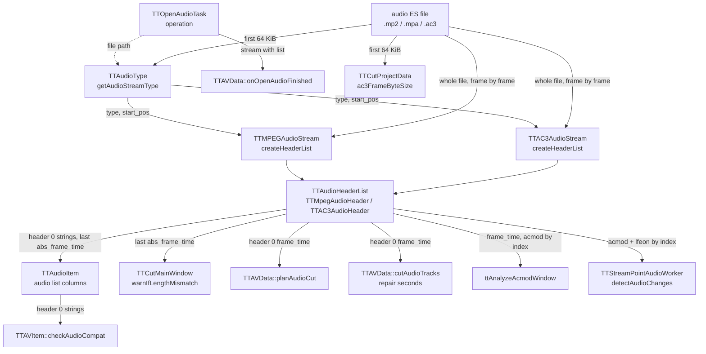

# Code Map: Audio ES input

**Scope:** how an audio elementary stream file becomes a `TTAudioStream`
with its header list, and what every reader of that list takes from it —
the type detection (`TTAudioType`, with the video and subtitle siblings of
`ttavtypes` up to the class they create), the MPEG audio and AC3 header
parsers, `TTAudioHeaderList`, and the values others build on:
`frame_time`, `abs_frame_time`, bit rate, sample rate, acmod, the frame's
byte offset and the stream length.

**Neighbours, not part of this map:** when the open task runs and how the
track joins the item ([stream-open-project-load.md](stream-open-project-load.md),
[track-management.md](track-management.md)); what the cut does with the grid
([audio-cut-timing.md](audio-cut-timing.md)); the acmod hints
([burst-detection.md](burst-detection.md)); the AC3 repair, whose scan,
table and cutter read the file through libav, not this list
([audio-repair.md](audio-repair.md)); the audio cut itself (`TTAudioCutter`,
libav); video headers and `TTVideoIndex`/`TTBreakObject` (same header file,
MPEG-2 video); SRT.

## Data flow

Legend: solid = data, dashed = trigger (who starts what).

## Edge semantics

| From → To | What crosses (data / order / invariant) |
|---|---|
| `OPEN` -.-> `TYPE` | `TTOpenAudioTask::operation`: `new TTAudioType(path)`. A missing file throws in `TTAVTypes` (`TTIOException`), rethrown as “Unsupported audio type or file not found”; any type other than `mpeg_audio`/`ac3_audio` throws “Unsupported audio type”. The file dialog also offers `.aac`, `.m4a`, `.eac3`, `.dts` — none of them has a parser here. |
| `FILE` → `TYPE` | One read of 65 536 bytes; the first byte offset where either test passes wins (AC3 tested before MPEG at the same offset). **AC3:** `0x0B77`, `frame_len = 2 · AC3FrameLength[fscod][frmsizecod]` from byte 4, and a second `0x0B77` exactly `frame_len` later. **MPEG:** `(sync & 0xFFE0) == 0xFFE0`, a throw-away `TTMPEGAudioStream::parseAudioHeader` for the frame length, and another MPEG sync that far on. No bsid check: E-AC3 is judged by the AC3 frame-size table. No pass → `unknown`. |
| `TYPE` → `MPS` / `AC3S` | `createAudioStream`: the stream class for the type, with `start_pos` = offset of the first confirmed sync. The video sibling `TTVideoType` decides via `ttProbeVideo` (libav), falling back to the file suffix, then to MPEG-2; `TTSubtitleType` by suffix only (`srt`). |
| `FILE` → `MPS` | From `start_pos`: `searchNextSyncByte` (any `0xFFE0` sync), 3 header bytes, header offset = sync start, `seekRelative(frame_length − 4)`. `frame_length` = `trunc(144 · bitrate / samplerate + padding)` (MPEG-1 Layer II/III), `(12 · … + padding) · 4` for Layer I; MPEG-2/2.5 use 72 and 6 for every layer. `frame_time` = `frame_length · 8000 / bitrate` ms — from the **byte length**, so it follows the padding bit. A frame with `frame_length < 4` **ends** the list (`break`); a read past the end ends it silently (`TTFileBufferException` caught). |
| `FILE` → `AC3S` | From `start_pos`: `searchNextSyncByte` (`0x0B77`), 6 header bytes, header offset = sync start, `seekRelative(2 · syncframe_words − 8)`. `frame_time = 1000 · 16 · syncframe_words / bitrate` ms (32 ms for every 48 kHz frame size). bsid > 10 (E-AC3) **ends** the list with a warning; reserved `fscod`/`frmsizecod` skips the header and resyncs (`continue`). acmod from byte 4, `lfeon` behind the acmod-dependent mix-level bits. |
| `MPS`/`AC3S` → `HL` | One header per frame in file order: `headerOffset`, `frame_length`, `frame_time`, and `abs_frame_time` = previous `abs_frame_time` + previous `frame_time` (0 for the first) — the **start** time of the frame in ms, a running `float` sum. `TTAudioHeaderList` is never sorted (`sort()` exists but has no caller). Abort: `mAbort` → `TTAbortException`. |
| `OPEN` → `FIN` | `finished(item, stream, order)` right after `createHeaderList`, whatever its count — also for an empty list. |
| `HL` → `ITEM` | `TTAudioItem::setItemData`: length column = `streamLengthTime()` = `abs_frame_time` of the **last** header (its start, so one frame short of the file), plus the byte size. Version, mode, bit rate and sample rate columns = the strings of **header 0** (`headerAt(0)`, which throws `TTIndexOutOfRangeException` on an empty list). |
| `ITEM` → `COMPAT` | `canCutWith` → `checkAudioCompat`: per track pair, header 0's bit-rate, sample-rate and version strings must be equal; the mode is not compared (commented out). |
| `HL` → `LEN` | `warnIfLengthMismatch`, only for a track opened by hand (`onReadAudioStream` → `onAudioItemAppended`), not for tracks of a video or project: `streamLengthTime()` of video and audio, warns above 1 s difference. |
| `HL` → `PLAN` | `planAudioCut`: **header 0's** `frame_time` is the grid for the whole file (segment snapping, feed-forward drift). `if (!hdr)` never fires — `headerAt(0)` throws on an empty list instead. |
| `HL` → `REP` | `cutAudioTracks`, `.ac3` only: repair frame numbers → seconds with header 0's `frame_time` (fallback 32 ms). |
| `HL` → `ACMOD` | `ttAnalyzeAcmodWindow`: frame index = `floor(seconds · 1000 / frame_time of header 0)`, clamped to the list; the headers **at those indices** give the acmod counts. Index = time / grid, not a search by `abs_frame_time`. Called by `computeTargetAcmods` and the cut list's acmod hint. |
| `HL` → `SPW` | `detectAudioChanges` walks every header, counts channels from `AC3AudioCodingMode[acmod]` + `lfeon`, and places a change at `qRound(i · 1536 / 48000 · fps)` — header index times a fixed 48 kHz AC3 frame, no extra-frame correction. MPEG headers are skipped (no acmod). |
| `FILE` → `PROJ` | `ac3FrameByteSize` for the `<Repair>` load validation reads the file itself: the first `0x0B77` with a valid code in the first 64 KiB, `2 · AC3FrameLength` — a third copy of the frame-size lookup, not the header list. |

## Assumptions, contracts & pitfalls

- **Header 0 speaks for the file.** Grid (`planAudioCut`, repair seconds,
  acmod window), list columns and the compatibility check all read header 0.
  A file that changes bit rate keeps a constant `frame_time` at 48 kHz AC3
  (32 ms for every size) and at 48 kHz MPEG-1 Layer II (24 ms), so the grid
  holds there; the columns and the compatibility check show only the first
  frame's bit rate (`tux_test.ac3` switches 192 / 384 kbit/s).
- **`frame_time` from bytes, not samples.** Exact where no padding exists
  (48 kHz). At 44.1 kHz the MPEG frame length alternates with the padding
  bit, so header 0's `frame_time` depends on whether the first frame is
  padded; only the running sum `abs_frame_time` averages it out.
- **Frame number = header index = time / grid.** `ttAnalyzeAcmodWindow` and
  `detectAudioChanges` count headers, the cut plan counts grid steps; they
  agree while every frame has the same `frame_time` and the list has no
  holes. A skipped AC3 header (reserved code) removes one index without
  removing its time.
- **`abs_frame_time` is a start time and a `float`.** `streamLengthTime()`
  is the last frame's start (157 AC3 frames read 00:00:04.992, measured in
  audit run 8). Sums of 32 or 24 ms stay exact in `float` for hours; other
  frame times accumulate rounding.
- **An empty list is possible and not caught at open.** E-AC3 ends the AC3
  list at its first frame; a first MPEG frame with `frame_length < 4` ends
  the MPEG list. The open task still emits `finished`; every `headerAt(0)`
  reader then throws.
- **Detection looks at 64 KiB only.** A file whose first valid frame pair
  starts later is `unknown`.
- **Dead fields.** `TTAudioStream::frame_time`, `frame_length`,
  `audio_delay`, `samples_count` are written or declared but never read;
  `TTAC3AudioHeader::crc1` is computed with a wrong shift and never read;
  `TTAudioHeaderList::sort` (whose `int` of `abs_frame_time · 1000` would
  overflow after 35 min) has no caller.

### Reading hypotheses for audit run 11

From reading only; each needs a runtime proof or refutation first.

- **H1 — 44.1 kHz MPEG audio cuts on a wrong grid.** Header 0's
  `frame_time` at 44.1 kHz / 192 kbit/s is 26.083 ms (626 bytes) or
  26.125 ms (627 bytes, padded), the true frame is 26.122 ms. `planAudioCut`
  snaps every segment on that grid, so the cut drifts by up to 0.15 % of the
  kept length (the earlier drift-rounding suspicion of audit run 9).
- **H2 — `.eac3` is offered but not readable.** The file dialog lists
  `*.eac3` (ttcut-demux writes it). Detection judges it by the AC3 table:
  mostly “Unsupported audio type”; if a frame size happens to line up, an
  empty list, and then the list columns throw.
- **H3 — one bad MPEG header cuts the list short.** `frame_length < 4`
  ends the list instead of resyncing (AC3 resyncs). Length column, length
  warning and grid range then describe only the part before it.
- **H4 — audio-change markers ignore extra frames and the sample rate.**
  `qRound(i · 1536 / 48000 · fps)` places the marker without the
  extra-frame correction the anomaly scan applies (`videoFrameForTime`), and
  assumes 48 kHz AC3 for every file.
- **H5 — MPEG-2/2.5 Layer I/II frames are parsed at half their length.**
  Layer II always carries 1152 samples and Layer I 384; only Layer III
  halves to 576 at the low sampling rates (22.05/24/16 kHz). The parser uses
  72 and 6 for all MPEG-2/2.5 layers, so a Layer I/II list at those rates
  would be garbage. Rare on DVB (MPEG-1 Layer II).
- **H6 — the compatibility check compares first frames only.** Two files
  whose first frames differ in bit rate are refused although the rest
  matches, and the other way round.

## Redundancy / consolidation candidates

- **AC3 frame size from the syncinfo**
  - sites: `avstream/ttavtypes.cpp:TTAudioType::getAudioStreamType`, `avstream/ttac3audiostream.cpp:TTAC3AudioStream::readAudioHeader`, `data/ttcutprojectdata.cpp:ac3FrameByteSize`
  - shared purpose: `fscod`/`frmsizecod` of byte 4 → `2 · AC3FrameLength`, with the reserved-code guard
  - status: kept separate → three small lookups on the shared table; worth one helper with H2 (a bsid check belongs in all three)
- **Sync search + header walk, MPEG vs AC3**
  - sites: `avstream/ttmpegaudiostream.cpp:TTMPEGAudioStream::createHeaderList` + `:searchNextSyncByte`, `avstream/ttac3audiostream.cpp:TTAC3AudioStream::createHeaderList` + `:searchNextSyncByte`
  - shared purpose: find sync, read header, chain `abs_frame_time`, skip the frame, report progress
  - status: kept separate → they differ in the error policy (end vs resync, H3) and the header size; unify only after H3 is decided
- **Throw-away stream for header parsing**
  - sites: `avstream/ttavtypes.cpp:TTAudioType::getAudioStreamType` (constructs a `TTMPEGAudioStream` per MPEG sync candidate to call `parseAudioHeader`)
  - shared purpose: MPEG frame length from three header bytes
  - status: kept separate → `parseAudioHeader` also sets stream fields; a free function would serve both
- **AC3 frame duration**
  - sites: header 0's `frame_time` (`planAudioCut`, `cutAudioTracks`, `ttAnalyzeAcmodWindow`), the fixed `1536 / 48000` in `TTStreamPointAudioWorker::detectAudioChanges`
  - shared purpose: seconds per AC3 frame
  - status: kept separate → decide with H4
