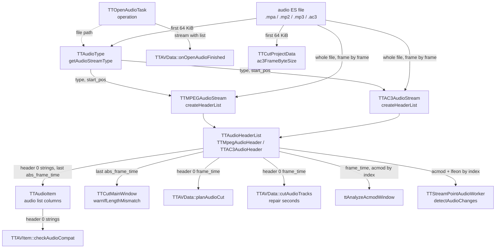

# Code Map: Audio ES input

**Scope:** how an audio elementary stream file becomes a `TTAudioStream`
with its header list, and what every reader of that list takes from it —
the type detection (`TTAudioType`, with the video and subtitle siblings of
`ttavtypes` up to the class they create), the MPEG audio and AC3 header
parsers, `TTAudioHeaderList`, and the values others build on:
`frame_time`, `abs_frame_time`, bit rate, sample rate, acmod, the frame's
byte offset and the stream length.

**Neighbours, not part of this map:** when the open task runs and how the
track joins the item ([stream-open-project-load.md](stream-open-project-load.md),
[track-management.md](track-management.md)); what the cut does with the grid
([audio-cut-timing.md](audio-cut-timing.md)); the acmod hints
([burst-detection.md](burst-detection.md)); the AC3 repair, whose scan,
table and cutter read the file through libav, not this list
([audio-repair.md](audio-repair.md)); the audio cut itself (`TTAudioCutter`,
libav); video headers and `TTVideoIndex`/`TTBreakObject` (same header file,
MPEG-2 video); SRT.

## Data flow

Legend: solid = data, dashed = trigger (who starts what).

## Edge semantics

| From → To | What crosses (data / order / invariant) |
|---|---|
| `OPEN` -.-> `TYPE` | `TTOpenAudioTask::operation`: `new TTAudioType(path)`. A missing file throws in `TTAVTypes` (`TTIOException`), rethrown as “Unsupported audio type or file not found”; any type other than `mpeg_audio`/`ac3_audio` throws “Unsupported audio type”. The open dialog and the automatic search (`TTAVData::getAudioNames`) offer exactly `TTAVTypes::readableAudioSuffixes` (mpa, mp2, mp3, ac3); AAC, E-AC3 and DTS have no parser (TODO). |
| `FILE` → `TYPE` | One read of 65 536 bytes; the first byte offset where either test passes wins (AC3 tested before MPEG at the same offset). **AC3:** `0x0B77`, `frame_len = 2 · AC3FrameLength[fscod][frmsizecod]` from byte 4, and a second `0x0B77` exactly `frame_len` later. **MPEG:** `(sync & 0xFFE0) == 0xFFE0`, the static `TTMPEGAudioStream::parseAudioHeader` on a stack header for the frame length, and another MPEG sync that far on. No bsid check: E-AC3 is judged by the AC3 frame-size table. No pass → `unknown`. |
| `TYPE` → `MPS` / `AC3S` | `createAudioStream`: the stream class for the type, with `start_pos` = offset of the first confirmed sync. The video sibling `TTVideoType` decides via `ttProbeVideo` (libav), falling back to the file suffix, then to MPEG-2; `TTSubtitleType` by suffix only (`srt`). |
| `FILE` → `MPS` | From `start_pos`: `searchNextSyncByte` (any `0xFFE0` sync), 3 header bytes, header offset = sync start, `seekRelative(frame_length − 4)`. Samples per frame: Layer I 384, Layer II 1152, Layer III 1152 (MPEG-1) or 576 (MPEG-2/2.5). `frame_length` = (samples / 8 / slot · bitrate / samplerate + padding) · slot, slot = 4 bytes for Layer I, else 1. `frame_time` = samples · 1000 / samplerate ms — the duration, independent of the padding bit. A header that yields no frame is skipped and the search resumes behind it (one summary warning); a read past the end ends the list silently (`TTFileBufferException` caught). |
| `FILE` → `AC3S` | From `start_pos`: `searchNextSyncByte` (`0x0B77`), 6 header bytes, header offset = sync start, `seekRelative(2 · syncframe_words − 8)`. `frame_time` = 1536 · 1000 / samplerate ms (32 ms at 48 kHz, 34.830 ms at 44.1 kHz for both 69- and 70-word frames). bsid > 10 (E-AC3) **ends** the list with a warning; reserved `fscod`/`frmsizecod` skips the header and resyncs (`continue`). acmod from byte 4, `lfeon` behind the acmod-dependent mix-level bits. |
| `MPS`/`AC3S` → `HL` | One header per frame in file order: `headerOffset`, `frame_length`, `frame_time`, and `abs_frame_time` = previous `abs_frame_time` + previous `frame_time` (0 for the first) — the **start** time of the frame in ms, a running `double` sum. `TTAudioHeaderList` is never sorted (`sort()` exists but has no caller). Abort: `mAbort` → `TTAbortException`. |
| `OPEN` → `FIN` | `finished(item, stream, order)` right after `createHeaderList`, whatever its count — also for an empty list. |
| `HL` → `ITEM` | `TTAudioItem::setItemData`: length column = `streamLengthTime()` = `abs_frame_time` of the **last** header (its start, so one frame short of the file), plus the byte size. Version, mode, bit rate and sample rate columns = the strings of **header 0** (`headerAt(0)`, which throws `TTIndexOutOfRangeException` on an empty list). |
| `ITEM` → `COMPAT` | `canCutWith` → `checkAudioCompat`: per track pair, header 0's bit-rate, sample-rate and version strings must be equal; the mode is not compared (commented out). |
| `HL` → `LEN` | `warnIfLengthMismatch`, only for a track opened by hand (`onReadAudioStream` → `onAudioItemAppended`), not for tracks of a video or project: `streamLengthTime()` of video and audio, warns above 1 s difference. |
| `HL` → `PLAN` | `planAudioCut`: **header 0's** `frame_time` is the grid for the whole file (segment snapping, feed-forward drift). `if (!hdr)` never fires — `headerAt(0)` throws on an empty list instead. |
| `HL` → `REP` | `cutAudioTracks`, `.ac3` only: repair frame numbers → seconds with header 0's `frame_time` (fallback 32 ms). |
| `HL` → `ACMOD` | `ttAnalyzeAcmodWindow`: frame index = `floor(seconds · 1000 / frame_time of header 0)`, clamped to the list; the headers **at those indices** give the acmod counts. Index = time / grid, not a search by `abs_frame_time`. Called by `computeTargetAcmods` and the cut list's acmod hint. |
| `HL` → `SPW` | `detectAudioChanges` walks every header, counts channels from `AC3AudioCodingMode[acmod]` + `lfeon`, and places a change at `TTAudioAnomalyScanTask::videoFrameForTime(abs_frame_time of that header, fps, extras)` — the extra-frame list comes from `onAnalyzeStreamPoints` (`TTAVData::extraFrameIndices`); the worker's silence markers map `silence_start` the same way. MPEG headers are skipped (no acmod). |
| `FILE` → `PROJ` | `ac3FrameByteSize` for the `<Repair>` load validation reads the file itself: the first `0x0B77` with a valid code in the first 64 KiB, `2 · AC3FrameLength` — a third copy of the frame-size lookup, not the header list. |

## Assumptions, contracts & pitfalls

- **Header 0 speaks for the file.** Grid (`planAudioCut`, repair seconds,
  acmod window), list columns and the compatibility check all read header 0.
  A file that changes bit rate keeps a constant `frame_time` (samples /
  rate), so the grid holds; the columns and `checkAudioCompat` show and
  compare only the first frame's bit rate, sample rate and version
  (`tux_test.ac3` switches 192 / 384 kbit/s) — a track whose first frame
  differs from the rest decides on that frame, kept as is (audit run 11).
- **`frame_time` is samples / sample rate**, the same for every frame of a
  constant sample rate; `frame_length` stays the byte length, which at
  44.1 kHz alternates with the padding bit.
- **Frame number = header index = time / grid** in `ttAnalyzeAcmodWindow`;
  the cut plan counts grid steps, `detectAudioChanges` reads each header's
  `abs_frame_time`. Index and time agree while the list has no holes.
- **`abs_frame_time` is a start time.** `streamLengthTime()`
  (`TTAudioStream`, one copy for both codecs) is the last frame's start
  (157 AC3 frames read 00:00:04.992, measured in audit run 8).
- **Skipped headers leave holes in the index.** A skipped header removes an
  index but not its time; a skipped MPEG header can also cost the next frame
  when the resync hits a false sync inside it (measured: 2498 of 2500 frames
  after one broken header). Index-based readers (`ttAnalyzeAcmodWindow`) then
  lag by that many frames.
- **An empty list is not caught at open.** Detection needs a valid frame
  pair, so the first header is normally valid; an AC3 file whose frames turn
  E-AC3 later ends the list there. The open task emits `finished` whatever
  the count, and every `headerAt(0)` reader throws on an empty list
  (`planAudioCut`'s `if (!hdr)` never fires).
- **Detection looks at 64 KiB only.** A file whose first valid frame pair
  starts later is `unknown`.
- **`TTAudioHeaderList::sort`** exists for the pure virtual of
  `TTHeaderList` and has no caller; the list is in file order by
  construction.

## Redundancy / consolidation candidates

- **AC3 frame size from the syncinfo**
  - sites: `avstream/ttavtypes.cpp:TTAudioType::getAudioStreamType`, `avstream/ttac3audiostream.cpp:TTAC3AudioStream::readAudioHeader`, `data/ttcutprojectdata.cpp:ac3FrameByteSize`
  - shared purpose: `fscod`/`frmsizecod` of byte 4 → `2 · AC3FrameLength`, with the reserved-code guard
  - status: kept separate → three small lookups on the shared table; one helper when E-AC3 gets a parser (a bsid check belongs in all three)
- **Sync search + header walk, MPEG vs AC3**
  - sites: `avstream/ttmpegaudiostream.cpp:TTMPEGAudioStream::createHeaderList` + `:searchNextSyncByte`, `avstream/ttac3audiostream.cpp:TTAC3AudioStream::createHeaderList` + `:searchNextSyncByte`
  - shared purpose: find sync, read header, chain `abs_frame_time`, skip the frame, report progress
  - status: documented → TODO P10 (one walk in `TTAudioStream`, a virtual header read per codec; both now skip an unusable header)
- **Audio time → display frame**
  - sites: `data/ttaudioanomalyscantask.cpp:TTAudioAnomalyScanTask::videoFrameForTime` (anomaly scan, `TTStreamPointAudioWorker` silence and audio change), `data/ttavdata.cpp:TTAVData::countExtraFramesBefore` (the inverse direction)
  - shared purpose: the extra-frame correction between audio time and display index
  - status: kept separate → the mapping lives in the anomaly-scan class the other workers call; a free function next to the extra-frame list belongs to the "extra frames below an index" consolidation of audio-repair.md
