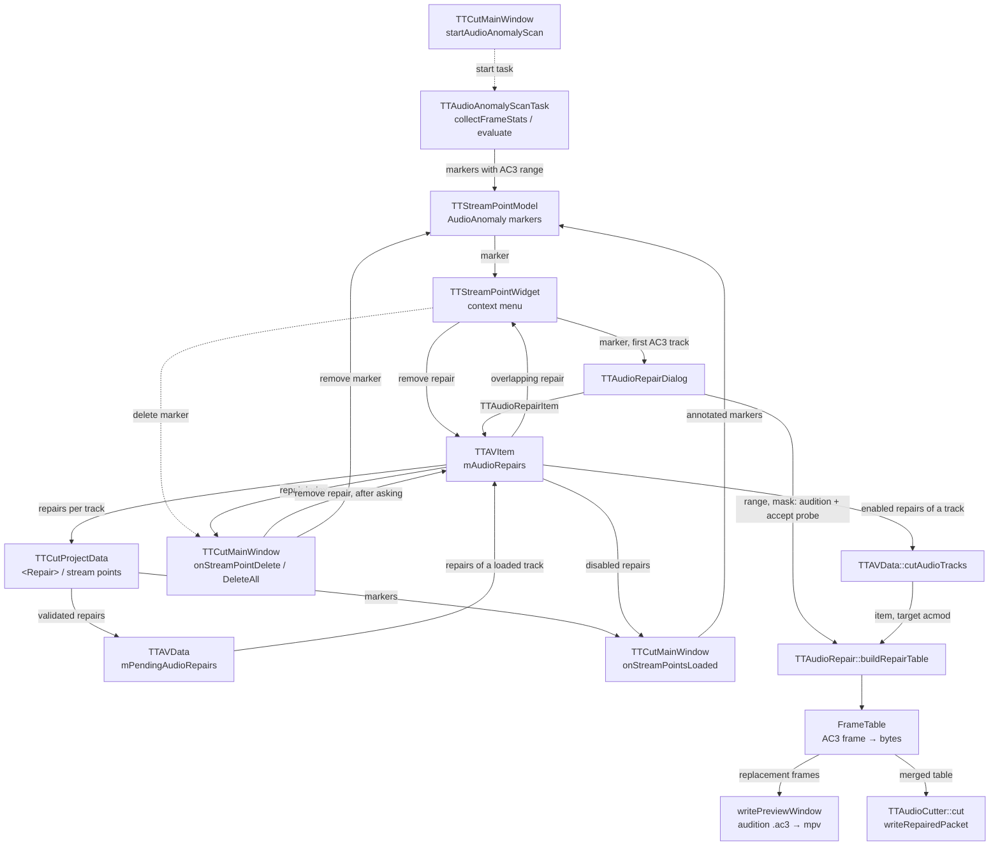

# Code Map: Audio anomaly repair

**Scope:** the way of one audio disturbance from detection to the cut
audio — the AC3 anomaly scan and its markers, the marker's context menu,
the repair dialog with its audition, the repair list on the AV item and
its track renumbering, the `<Repair>` entries of the project file with
their load validation, and how a repair becomes replacement frames in
every audio cut (final cut, audio-only cut, preview clips).

**Neighbours, not part of this map:** when the scan starts and how the
marker list behaves in general ([stream-points.md](stream-points.md)), the
keep list, delay and acmod arithmetic of the audio cut
([audio-cut-timing.md](audio-cut-timing.md)), the preview windows
([cut-preview.md](cut-preview.md)), mpv ([playback.md](playback.md)), the
project file in general ([project-lifecycle.md](project-lifecycle.md)) and
the track list ([track-management.md](track-management.md)). The decisions
behind the design are in `docs/superpowers/specs/2026-08-19-audio-anomaly-repair-design.md`;
deliberately postponed work is in `TODO.md` („Audio-Anomalie-Reparatur —
bewusste Folgearbeiten“).

## Data flow

Legend: solid = data, dashed = trigger (who starts what).

## Edge semantics

| From → To | What crosses (data / order / invariant) |
|---|---|
| `MW` -.-> `SCAN` | `startAudioAnomalyScan`: file of `TTAVItem::firstAc3TrackIndex()` only (one AC3 track, TODO M8), the video frame rate, `TTAVData::extraFrameIndices()` and `audioGapFrameRanges()`. Automatic start and its latch (`maybeStartAutoAnomalyScan`, `anomalyScanStarted`) are in stream-points.md. |
| `SCAN` → `PTS` | `pointsDetected` emits once, at the end of `operation()`; a cancel emits an empty list (partial results are discarded). One `TTStreamPoint` per finding: `frameIndex` = `videoFrameForTime(frameFrom · 32 ms)`, duration in seconds, description with the LFE peak (“overlaps gap repair” when it touches an audio-gap range), and the finding's own AC3 range via `setAudioFrameRange` (both bounds inclusive). The scan refuses any sample rate other than 48 kHz (empty stats, “not run”). |
| `PTS` → `WID` | The marker row; the menu offers repair actions only for `AudioAnomaly` markers and only when the item has an AC3 track. |
| `ITEM` → `WID` | `TTAudioRepairDialog::repairIndexForMarker(item, point, extras)` — the one marker ↔ repair link: on the item's first AC3 track, `findAudioRepairOverlapping(track, from, to)` over the marker's range (`approxAc3RangeForMarker`), i.e. the index of the first repair whose closed AC3 range touches it, or -1 (also for other marker types and items without AC3). Decides “Repair…” vs “Edit repair…”/“Remove repair”. |
| `WID` → `DLG` | Marker, `repairTrackIndex` = the item's **first** AC3 track, `mExtraFrameIndices`. The dialog is modal (`exec()`). On accept the widget appends the “(repair planned)” suffix to the marker text. |
| `WID` → `ITEM` | `removeAudioRepairAt(repairIndex)` and removal of the “planned” suffix (all language variants). |
| `WID` -.-> `DEL` / `ITEM` → `DEL` | “Delete” and “Delete all” of the marker list reach the main-window slots, which look up `repairIndexForMarker` per marker (the same link as the context menu). |
| `DEL` → `ITEM` / `DEL` → `PTS` | A marker with a repair goes only together with it: one question (“Delete all”: one question for all, `%n` repairs), No keeps both; Yes removes the repairs (highest index first, so the others stay valid) and then the marker(s). A marker without a repair is removed without a question. |
| `DLG` → `TABLE` | Audition and the probe build of `accept`: the current spin-box range (`currentFrameFrom` = round(start ms / frame ms), `currentFrameTo` = round(end ms / frame ms) − 1, end exclusive in the spin box) and channel mask, `targetAcmod = -1` (keep the source layout). |
| `FT` → `AUD` | `writePreviewWindow` walks the packets by ordinal and writes a ±3 s window around the range to `ttcut_repair_preview_<instance>_{before,after}.ac3` in the temp directory, replacement bytes where the table has the frame; mpv plays it. The files are removed in the destructor. |
| `DLG` → `ITEM` | `accept`: rejects end < start and an empty channel mask, then builds the table once in the source layout (`targetAcmod = -1`, like the audition) and rejects any build error with the message, the dialog staying open (channel-layout or frame-size change inside the range, a channel the track does not have, range past the file end). Only then it removes the edited repair (if any) and appends `TTAudioRepairItem(track, from, to, mask)`. The cut's target layout is unknown here; mixed target layouts are caught only at cut time (`ITEM` → `CUT`). |
| `ITEM` → `PROJ` | Save: `<Repair>` (FrameFrom, FrameTo, Channels, Method) under the `<Audio>` section whose position equals `trackIndex()`; the enabled flag is not written. Markers go to the stream-point section with `AudioFrameFrom`/`AudioFrameTo`. |
| `PROJ` → `PEND` | `parseAudioSection` builds items with `trackIndex = <Order>`, then validates: negative/reversed range, unknown AC3 frame size (`ac3FrameByteSize`) or `(frameTo + 1) · frameBytes > file size` → `setEnabled(false)` with a warning; never dropped. Parked by `(TTAVItem*, order)` via `setPendingAudioRepairs`. |
| `PEND` → `ITEM` | `onOpenAudioFinished` appends the parked repairs when the track with that order arrives; their `trackIndex` is the position the track reaches after `sortByProjectOrder`. |
| `PROJ` → `ANNO` / `ITEM` → `ANNO` | `onStreamPointsLoaded`: every `AudioAnomaly` marker whose approximate AC3 range overlaps a **disabled** repair gets the “(repair DISABLED …)” suffix instead of “planned”. |
| `ANNO` → `PTS` | The restored markers, annotated, go into the model in one `addPoints` call (the project path; a scan's markers take `onPointsDetected`). |
| `ITEM` → `CUT` | `cutAudioTracks`, `.ac3` tracks only: every repair of this track index; disabled ones are skipped with a warning. Item seconds = frame · `frame_time` of the first header. Touching no keep window → skipped. A repair may reach past the window(s) it touches — the cutter writes only frames inside the windows, so the part outside is never looked up; this holds for the short preview windows as for the final cut. Only when the touched windows want **different** target acmods (normalising) the whole track fails with “reaches into cut segments with different channel layouts”. |
| `CUT` → `TABLE` | The item and the common target acmod of the windows it touches (`targetAcmods[s]` when normalising, else -1). |
| `TABLE` → `FT` | Decode from `frameFrom − 2` (warm-up), silence the masked channels with 5 ms raised-cosine fades at both range ends, re-encode at the bit rate of the replaced frames (`frame bytes · 8 · rate / 1536`; one file may switch bit rate, e.g. stereo 192 / 5.1 384 kbit/s). Frame number = packet ordinal in the file. Hard errors (empty table + message): channel-mode change inside the range, frame-size change, mask bit beyond the channel count, encoded size ≠ source frame size, range past the file end. |
| `FT` → `CUTTER` | Tables of all items merged. In the packet loop the frame number is `qRound64(pktTime / frameDurSec)`; a hit writes the replacement bytes with the packet's PTS offset and skips the acmod re-encode check. |

## Assumptions, contracts & pitfalls

- **One AC3 frame numbering, two ways to count it.** The scan, the
  replacement table and the audition count packets (ordinal in the file);
  the cutter derives the number from the packet time (`pktTime / 32 ms`).
  They agree while the elementary stream's timestamps start at 0 and run
  without gaps — measured so on the test material and a real recording
  (audit run 10); not checked in the code.
- **Both bounds inclusive** in `TTAudioRepairItem`, `Finding` and
  `TTStreamPoint::audioFrameFrom/To`; `TTStreamPoint::duration()` and the
  dialog's end spin box are end-exclusive (hence the −1 in
  `currentFrameTo` and `approxAc3RangeForMarker`).
- **48 kHz only.** The scan refuses other rates; the dialog and the cut read
  the real frame duration, the fallback estimate in
  `approxAc3RangeForMarker` uses a fixed 32 ms.
- **CBR inside a repair range.** `buildRepairTable` fails on a frame-size
  change inside the range and encodes at that range's bit rate; the load
  validation checks the range against the file size with the **first**
  frame's size, i.e. assumes CBR over the whole file (not seen violated on
  real material, where all 140 654 packets had 1792 bytes; a file with a
  bit-rate switch before the range is unmeasured).
- **Track index = visible list position.** Kept right by
  `remapAudioRepairTracks` on remove and swap; on load by parking under
  `<Order>`. Hand-edited `<Order>` gaps are unvalidated (TODO).
- **Markers are display only** (spec: “Wahrheit ist die Repair-Liste”). The
  marker ↔ repair link is range overlap on the first AC3 track, computed
  anew each time (`repairIndexForMarker`); there is no other UI for the
  repair list — which is why deleting such a marker takes its repair along.
- **Disabled, never dropped.** A repair failing the load validation stays in
  the list, is skipped in the cut with a warning and marked on the marker.
- **Audition ≠ main-window playback.** Main-window playback plays the
  original by design (spec Komponente 4); the audition is a separate file.
- **Preview clips apply repairs** of audio track 0 (`cutAudioTracks(…, {0}, …)`
  in `TTCutPreviewTask` and `ttRebuild*PreviewClip`), under the same rule as
  the final cut; a preview window cutting through a repair keeps its audio.
- **Audition and cut differ only in the target layout.** Both build with the
  same table code; the audition (and the accept probe) with `targetAcmod = -1`,
  the cut with the segments' majority acmod when normalising (unmeasured for
  a repair in a segment whose target differs from the source).
- **A failed repair fails its track, and a failed track fails the cut**
  (`mRequireAllInputs`); for H.26x preview clips a failed audio cut only
  logs and the clip is muxed without audio (cut-preview.md).
- **Scan statistics:** one `FrameStat` per decoded frame, plus one failed
  entry for a packet the decoder rejects on send, to keep the numbering in
  step with the packet ordinal; a packet accepted on send that yields no
  frame adds nothing.
- **Material gate:** LFE must be (near) silent in ≥ `anomalyLfeNullPercent`
  of the 5.1 frames, otherwise “unsuitable, no statement” (logged, no
  markers).

## Redundancy / consolidation candidates

- **Extra frames below an index**
  - sites: `data/ttavdata.cpp:TTAVData::countExtraFramesBefore`, `data/ttaudioanomalyscantask.cpp:countExtrasBefore`, `gui/ttaudiorepairdialog.cpp:countExtrasBefore`
  - shared purpose: binary search in the sorted extra-frame list
  - status: consolidate → one free function next to the extra-frame list; the dialog's comment keeps its copy because it has no `TTAVData`, which a free function does not need
- **AC3 frame duration / size of a file**
  - sites: `data/ttaudioanomalyscantask.cpp:kFrameDurSec`, `gui/ttaudiorepairdialog.cpp:probeFrameDurationMs` (+ `kApproxFrameDurMs`), `data/ttavdata.cpp:TTAVData::cutAudioTracks` (`frame_time` of the first header), `extern/ttaudiocutter.cpp:TTAudioCutter::cut` (`frameDurSec`), `data/ttcutprojectdata.cpp:ac3FrameByteSize`
  - shared purpose: the 32 ms grid in time or bytes
  - status: kept separate → four of them read the real file, the scan's constant is guarded by its 48 kHz refusal; worth one helper only if the load validation stops assuming CBR over the whole file
- **Opening the first audio stream**
  - sites: `extern/ttaudiorepair.cpp:TTAudioRepair::openFirstAudioStream` (table + audition), `data/ttaudioanomalyscantask.cpp:TTAudioAnomalyScanTask::collectFrameStats` (own ladder, `av_find_best_stream`)
  - shared purpose: libav open + stream lookup for one audio file
  - status: documented → TODO P9 (audio decoder opening); the ladder of `avstream/ttavutil.cpp:ttOpenInput` and the dialog's `probeFrameDurationMs` belong to it as well (audit run 10)
- **Packet walk by frame ordinal**
  - sites: `extern/ttaudiorepair.cpp:TTAudioRepair::buildRepairTable`, `gui/ttaudiorepairdialog.cpp:TTAudioRepairDialog::writePreviewWindow`
  - shared purpose: count audio packets to reach an AC3 frame number
  - status: kept separate → a few lines each, with different work per packet
