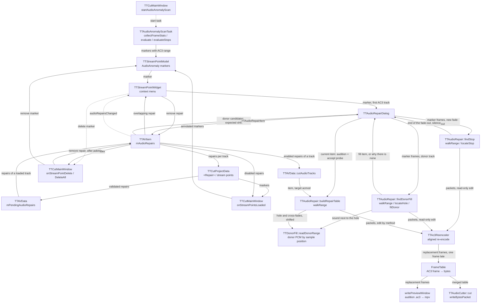

# Code Map: Audio anomaly repair

**Scope:** the way of one audio disturbance from detection to the cut
audio — the AC3 anomaly scan and its markers, the marker's context menu,
the repair dialog with its audition, the repair list on the AV item and
its track renumbering, the `<Repair>` entries of the project file with
their load validation, and how a repair becomes replacement frames in
every audio cut (final cut, audio-only cut, preview clips).

**Neighbours, not part of this map:** when the scan starts and how the
marker list behaves in general ([stream-points.md](stream-points.md)), the
keep list, delay and acmod arithmetic of the audio cut
([audio-cut-timing.md](audio-cut-timing.md)), the preview windows
([cut-preview.md](cut-preview.md)), mpv ([playback.md](playback.md)), the
project file in general ([project-lifecycle.md](project-lifecycle.md)) and
the track list ([track-management.md](track-management.md)). The decisions
behind the design are in `docs/superpowers/specs/2026-08-19-audio-anomaly-repair-design.md`
and, for the fade-out, `…/2026-10-05-audio-repair-fade-out-design.md`, for
the fill of a hole from a second track `…/2026-10-10-audio-repair-donor-fill-design.md`;
deliberately postponed work is in `TODO.md` („Audio-Anomalie-Reparatur —
bewusste Folgearbeiten“).

## Data flow

Legend: solid = data, dashed = trigger (who starts what).

```mermaid
flowchart TD
    MW["TTCutMainWindow<br/>startAudioAnomalyScan"]
    SCAN["TTAudioAnomalyScanTask<br/>collectFrameStats / evaluate / evaluateStops"]
    PTS["TTStreamPointModel<br/>AudioAnomaly markers"]
    WID["TTStreamPointWidget<br/>context menu"]
    DLG["TTAudioRepairDialog"]
    AUD["writePreviewWindow<br/>audition .ac3 → mpv"]
    ITEM["TTAVItem<br/>mAudioRepairs"]
    PROJ["TTCutProjectData<br/>&lt;Repair&gt; / stream points"]
    PEND["TTAVData<br/>mPendingAudioRepairs"]
    ANNO["TTCutMainWindow<br/>onStreamPointsLoaded"]
    DEL["TTCutMainWindow<br/>onStreamPointDelete / DeleteAll"]
    CUT["TTAVData::cutAudioTracks"]
    TABLE["TTAudioRepair::buildRepairTable<br/>walkRange"]
    STOP["TTAudioRepair::findStop<br/>walkRange / locateStop"]
    FILL["TTAudioRepair::findDonorFill<br/>walkRange / locateHole / fitDonor"]
    DONOR["TTDonorFill::readDonorRange<br/>donor PCM by sample position"]
    REENC["TTAc3Reencoder<br/>aligned re-encode"]
    FT["FrameTable<br/>AC3 frame → bytes"]
    CUTTER["TTAudioCutter::cut<br/>writeBytesPacket"]

    MW -.->|start task| SCAN
    SCAN -->|markers with AC3 range| PTS
    PTS -->|marker| WID
    ITEM -->|overlapping repair| WID
    WID -->|marker, first AC3 track| DLG
    WID -->|remove repair| ITEM
    WID -.->|delete marker| DEL
    ITEM -->|repair index| DEL
    DEL -->|remove repair, after asking| ITEM
    DEL -->|remove marker| PTS
    DLG -->|marker frames, new fade-out| STOP
    STOP -->|end of the fade-out, silence| DLG
    STOP -->|packets, read-only edit| REENC
    ITEM -->|donor candidates, expected shift| DLG
    DLG -->|marker frames, donor track| FILL
    FILL -->|fill item, or why there is none| DLG
    FILL -->|packets, read-only edit| REENC
    FILL -->|sound next to the hole| DONOR
    TABLE -->|hole and cross-fades, shifted| DONOR
    ITEM -.->|audioRepairsChanged| WID
    DLG -->|current item: audition + accept probe| TABLE
    FT -->|replacement frames| AUD
    DLG -->|TTAudioRepairItem| ITEM
    ITEM -->|repairs per track| PROJ
    PROJ -->|validated repairs| PEND
    PEND -->|repairs of a loaded track| ITEM
    PROJ -->|markers| ANNO
    ITEM -->|disabled repairs| ANNO
    ANNO -->|annotated markers| PTS
    ITEM -->|enabled repairs of a track| CUT
    CUT -->|item, target acmod| TABLE
    TABLE -->|packets, edit by method| REENC
    REENC -->|replacement frames, one frame late| FT
    FT -->|merged table| CUTTER
```

## Edge semantics

| From → To | What crosses (data / order / invariant) |
|---|---|
| `MW` -.-> `SCAN` | `startAudioAnomalyScan`: file of `TTAVItem::firstAc3TrackIndex()` only (one AC3 track, TODO M8), the video frame rate, `TTAVData::extraFrameIndices()` and `audioGapFrameRanges()`. Automatic start and its latch (`maybeStartAutoAnomalyScan`, `anomalyScanStarted`) are in stream-points.md. |
| `SCAN` → `PTS` | `pointsDetected` emits once, at the end of `operation()`; a cancel emits an empty list (partial results are discarded). One `TTStreamPoint` per finding of either search, sorted by position: `frameIndex` = `videoFrameForTime(frameFrom · 32 ms)`, duration in seconds, description with the LFE peak (LFE search) or the drop in dB (stop search; “overlaps gap repair” when it touches an audio-gap range), the finding's own AC3 range via `setAudioFrameRange` (both bounds inclusive) the planes of the finding via `setAudioChannelMask` — C+LFE for an LFE finding, every plane of its frames for a stop — and its kind via `setAudioAnomalyKind`: `LfeBurst`, or the form `evaluateStops` found — `LastingStop` (“sound stops abruptly”) or `Hole` (“hole in the sound”, depth in dB); several drops within 19 blocks are one finding with the kind of the largest. A stop or hole marker covers three AC3 frames: the one with the boundary and one on each side. The scan refuses any sample rate other than 48 kHz (empty stats, “not run”). |
| `PTS` → `WID` | The marker row; the menu offers repair actions only for `AudioAnomaly` markers and only when the item has an AC3 track. A **new** repair (“Repair…”) only when `TTStreamPoint::offersNewAudioRepair()`: for `LfeBurst`, for a marker without a kind (older project files — it was an LFE finding) and for `LastingStop`. Not for `AbruptStop`, the kind of projects saved on 2026-10-04/05, whose form was not recorded. For `Hole` the method says false and the menu decides (`buildContextMenu`): “Repair…” when `TTAVItem::donorCandidateTracks(first AC3 track)` is not empty — a hole is filled from a second track. |
| `ITEM` → `WID` | `TTAudioRepairDialog::repairIndexForMarker(item, point, extras)` — the one marker ↔ repair link: on the item's first AC3 track, `findAudioRepairOverlapping(track, from, to)` over the marker's range (`approxAc3RangeForMarker`), i.e. the index of the first repair whose closed AC3 range touches it, or -1 (also for other marker types and items without AC3). Decides “Repair…” vs “Edit repair…”/“Remove repair”; an existing repair stays editable and removable behind every kind of marker — except that a `donor-fill` repair offers “Edit repair…” only while the item has a donor candidate (“Remove repair” always). |
| `WID` → `DLG` | Marker, `repairTrackIndex` = the item's **first** AC3 track, `mExtraFrameIndices`. Before the dialog opens the widget emits `jumpToFrame(marker frame)`, so the main window shows the spot (a right click does not navigate; the dialog has no jump button). The dialog is modal (`exec()`). A menu closed without a choice does nothing (`handleContextAction` returns on a null action). The dialog has three views, chosen once in the constructor: the stored method when a repair is edited, else the marker's kind (`LastingStop` → fade-out, `Hole` → fill, everything else → silence). Silence view: channel boxes from the marker's `audioChannelMask()` (0, older project files: C+LFE; an existing repair's own mask wins), start/end of the range. Fade-out view: “Fade-out ends at”, “Length” (20 ms, 10–100), no channel boxes. Fill view: a combo of the donor candidates (the only input) and three read-only values — hole, offset, match. On accept the widget appends the “(repair planned)” suffix to the marker text and removes a “(repair DISABLED …)” suffix. |
| `WID` → `ITEM` | `removeAudioRepairAt(repairIndex)` and removal of the “planned” suffix (all language variants). |
| `WID` -.-> `DEL` / `ITEM` → `DEL` | “Delete” and “Delete all” of the marker list reach the main-window slots, which look up `repairIndexForMarker` per marker (the same link as the context menu). |
| `DEL` → `ITEM` / `DEL` → `PTS` | A marker with a repair goes only together with it: one question (“Delete all”: one question for all, `%n` repairs), No keeps both; Yes removes the repairs (highest index first, so the others stay valid) and then the marker(s). A marker without a repair is removed without a question. |
| `DLG` → `STOP` / `STOP` → `DLG` | Only for a **new** fade-out repair: `findStop(file, marker frames)` → `StopPlacement` (end of the fade-out, end of the sound, silence in samples). Nothing found: the field stands on the start of the marker's middle frame, silence 1 ms, and a hint asks to set it by ear. The position is kept in samples (`mFadeEndSample`); the spin box shows whole ms and a step moves the sample position by one ms, inside the marker's frames (so the repair stays linked to its marker). The silence moves along and is not adjustable. Editing shows the stored values, no new search. |
| `ITEM` → `DLG` | Fill view only. `donorCandidateTracks(track)`: every other track with two channels at 48 kHz — MPEG layer II not mono (dual-channel counts), or AC3 with two channels and no LFE — in list order, empty when the repaired track is not 48 kHz. `presetDonorTrack`: the first candidate with the repaired track's language, else the first. `expectedDonorShift(track, donor)`: (start offset of the repaired track − start offset of the donor, both from the `.info` next to the video) · 48 samples; 0 without video or `.info`. |
| `DLG` → `FILL` / `FILL` → `DLG` | `findDonorFill(file, track, marker frames, donor file, donor track, expected shift)` when the dialog opens and on every donor change; not when an enabled fill whose donor is still a candidate is edited (its stored values are shown). Result: a `TTAudioRepairItem` (`Found`) or one of `NoHole`, `NoSound`, `FormatChange`, `UnsupportedLayout`, `DonorUnreadable` (the donor file cannot be opened or does not start on a frame), `Error` (the track itself; its text is shown as it is), each a message in the dialog with “Plan repair” and “Play repaired” disabled; so is an item without any donor candidate. A fill whose frames lie outside the marker's frames is not accepted (“The hole lies next to the marker.”), so the repair stays linked to its marker. Editing a fill that is not applied searches with that fill's own donor while it is still a candidate, else with the preset one. A match below 0.80 shows a hint, planning stays possible. |
| `FILL` → `REENC` / `FILL` → `DONOR` | Two `walkRange` passes with a copying edit: frames `from − 2 … to + 2` (fewer at the end of the track) for `TTDonorFill::locateHole` — per filled plane the block boundary with the largest drop, then the longest run of samples at or below the level before − 30 dB; shorter than 2 ms or touching the region `from − 1 … to + 1` = no hole; two planes: earliest start to latest end — then exactly the frames covering 150 ms + 5 ms on each side of the hole. Filled planes by layout (`donorFillPlanes`): the centre of a 3/2 stream (mask 0x04), left and right of a 2/0 stream (0x03), nothing else. The donor's sound for that span ± 50 ms around the expected shift comes from `readDonorRange`; `fitDonor` takes the shift with the best correlation over both windows and all filled planes (the donor's mid (L+R)/2 against the centre, L and R against L and R), a least-squares gain per plane (never negative) and that correlation as the match. |
| `STOP` → `REENC` | `findStop` walks frames `frameFrom − 1 … frameTo + 1` (without the frame behind when the track ends there) through `walkRange` with an edit that only copies the planes (no LFE) — the same decode as the repair build, so its positions are positions in the samples the repair edits. `locateStop` (pure): the block boundary with the largest drop (≥ 20 dB, three 256-sample blocks before, two after); from one block behind it back to the first sample above the level before − 12 dB = end of the sound; the earliest sample step of ≥ 20 times the median step of the 20 ms before, within the 15 ms before the end of the sound = end of the fade-out, else the end of the sound. An error (file, layout change) → not found. |
| `DLG` → `TABLE` | Audition and the probe build of `accept`, both from `currentItem()`, `targetAcmod = -1` (keep the source layout). Silence view: the spin-box range (`currentFrameFrom` = round(start ms / frame ms), `currentFrameTo` = round(end ms / frame ms) − 1, end exclusive in the spin box) and channel mask. Fade-out view: `makeFadeOutItem(track, mask, end, length, silence)`, whose frame range is every frame the curve touches. Fill view: the item the search returned (or the stored one), with the file of its donor track as `buildRepairTable`'s fifth argument; without a fill the marker's frames, so that the original can be played. |
| `FT` → `AUD` | `writePreviewWindow` walks the packets by ordinal and writes a ±3 s window around the range to `ttcut_repair_preview_<instance>_{before,after}.ac3` in the temp directory, replacement bytes where the table has the frame; mpv plays it. The files are removed in the destructor. |
| `DLG` → `ITEM` | `accept` (the button reads “Plan repair”): in the silence view it rejects end < start and an empty channel mask; in the fill view it does nothing without a fill; then, in every view, it builds the table once in the source layout (`targetAcmod = -1`, like the audition) and rejects any build error with the message, the dialog staying open (channel-layout or frame-size change inside the range, a channel the track does not have, range past the file end, a fade-out that would start before the track). Only then it removes the edited repair (if any) and appends `currentItem()`. The cut's target layout is unknown here; mixed target layouts are caught only at cut time (`ITEM` → `CUT`). |
| `ITEM` → `PROJ` | Save: `<Repair>` (FrameFrom, FrameTo, Channels, Method; for `fade-out` also FadeEnd, FadeLength, Silence in samples; for `donor-fill` Donor — the donor's list position —, HoleStart, HoleEnd, DonorShift in samples, one Gain per filled channel, Match) under the `<Audio>` section whose position equals `trackIndex()`; the enabled flag is not written. Markers go to the stream-point section with `AudioFrameFrom`/`AudioFrameTo` and, when known, `AudioChannels` (read back only in 1…0x3F, anything else stays “unknown”) and `AnomalyKind` (`LfeBurst` / `LastingStop` / `Hole` / legacy `AbruptStop`; any other text reads as unknown). |
| `PROJ` → `PEND` | `parseAudioSection` builds items with `trackIndex = <Order>`, then validates. The method first: an unknown method, or a `fade-out` whose three values are missing or do not give its frame range (`makeFadeOutItem` at 48 kHz), is disabled — never applied as something else; so is a `donor-fill` with a value missing or with values `donorFillProblem` refuses (mask neither 0x04 nor 0x03, number or range of the gains, a hole position or shift beyond a week of samples, empty or over-long hole, values not giving its frame range at 48 kHz). Then: negative/reversed range, unknown AC3 frame size (`ac3FrameByteSize`) or `(frameTo + 1) · frameBytes > file size` → `setEnabled(false)` with a warning; never dropped. Parked by `(TTAVItem*, order)` via `setPendingAudioRepairs`. |
| `PEND` → `ITEM` | `onOpenAudioFinished` appends the parked repairs when the track with that order arrives; their `trackIndex` is the position the track reaches after `sortByProjectOrder`. A fill's `donorTrack` holds the donor's saved `<Order>` until loading ends (`donorIsSavedOrder`): `TTAVData::onThreadPoolExit` (before the markers are restored) runs `TTAVItem::resolveLoadedDonorFills`, which gives each loaded fill the list position of the track with that order — a track that failed to open leaves a gap, the ones behind it move up — and disables those whose donor is not loaded (`donorTrack` −1), is no candidate of its track, or whose values point outside the donor track. Every later pool run finds nothing left to resolve; a fill planned in the dialog is never touched by it. |
| `PROJ` → `ANNO` / `ITEM` → `ANNO` | `onStreamPointsLoaded`: every `AudioAnomaly` marker whose approximate AC3 range overlaps a **disabled** repair gets a “(repair DISABLED …)” suffix instead of “planned”. Which one, `TTStreamPointWidget::disabledRepairSuffix` decides: “its donor track is missing” for a fill whose donor is no candidate of its track, else “it no longer fits the audio file”. |
| `ANNO` → `PTS` | The restored markers, annotated, go into the model in one `addPoints` call (the project path; a scan's markers take `onPointsDetected`). |
| `ITEM` -.-> `WID` | `remapAudioRepairTracks` (track removed or swapped) emits `audioRepairsChanged`; `TTStreamPointWidget::refreshRepairSuffixes` gives every marker whose repair is disabled the suffix of `disabledRepairSuffix` (here: “its donor track is missing”) instead of “planned”. The widget holds its item in a `QPointer` — the main window resets it only after the item is deleted. |
| `ITEM` → `CUT` | `cutAudioTracks`, `.ac3` tracks only: every repair of this track index; disabled ones are skipped with a warning. Item seconds = frame · `frame_time` of the first header. Touching no keep window → skipped. A repair may reach past the window(s) it touches — the cutter writes only frames inside the windows, so the part outside is never looked up; this holds for the short preview windows as for the final cut. Only when the touched windows want **different** target acmods (normalising) the whole track fails with “reaches into cut segments with different channel layouts”. |
| `CUT` → `TABLE` | The item, the common target acmod of the windows it touches (`targetAcmods[s]` when normalising, else -1) and, for a fill, the file of the track at `donorTrack()` (empty when that track does not exist — the build then fails with “no donor track given”). |
| `TABLE` → `DONOR` | For a fill, before the walk: `donorFillProblem(item, file's sample rate)` must be empty, then `readDonorRange(donor file, holeStart − 2 ms + donorShift, hole + 4 ms)` — two planes, decoded from two frames before the range (MP2 or AC3, AC3 with `drc_scale` 0). A frame's position is its number in the file × 1152 (MP2) or 1536 (AC3); the number comes from the byte position of the first packet, because libavformat skips a first MP2 frame whose header differs from the second. Not two-channel there, before the start or past the end → `noSound`; a file that cannot be opened is an error. |
| `TABLE` → `REENC` | `buildRepairTable` refuses an unknown method, a fade-out with invalid values or a start before the track and a fill with unsound values or an unreadable donor range, then runs `walkRange`, which pushes every packet from `frameFrom − 2` (decoder warm-up) to one frame **behind** `frameTo`, in file order; the frames of the range with the edit of the item's method, in the source layout — `silence-fade`: the masked channels are silenced, with 5 ms raised-cosine fades on the first and the last frame; `fade-out`: every channel is multiplied by `fadeOutGain` (1, raised cosine to 0 ending at the end of the fade-out, 0 through the silence, back to 1 within 5 ms; the mask is not used) after a check that the values give the item's frame range at the file's sample rate; `donor-fill`: in the filled planes `(1 − w) · original + w · gain · donor` for hole ± 2 ms (`TTDonorFill::applyDonor`; `w` a raised cosine up before the hole, 1 inside, down behind it), after a check that the layout's filled planes are the item's mask and that track and donor have one sample rate — and a request: the common target acmod and the bit rate of the replaced frames (`frame bytes · 8 · rate / 1536`; one file may switch bit rate, e.g. stereo 192 / 5.1 384 kbit/s). The frame behind the range only supplies the 256 samples that complete the last replacement and is exempt from the checks; a range ending with the file is completed with silence. Hard errors raised here (empty table + message): frame-size change among warm-up and range frames, channel-mode change inside the range, mask bit beyond the channel count, range past the file end. |
| `REENC` → `FT` | One replacement per frame of the range, tagged with the frame number (= packet ordinal in the file), finished one push after its frame. Each is decoded with `drc_scale` 0 (the stream's dynamic range compression is not applied; the encoder cannot write compression words), carries the header fields of its source frame (`dialnorm`, mix levels incl. the extended ones, `dsurmod`, `bsmod`, production info, copyright, original — a field only when it means something in the source frame's own layout and its code is not reserved), and holds exactly the audio of the frame it replaces: the unit feeds the encoder 1280 zero samples first, drops the first packet and so compensates the encoder's 256-sample delay. A header change inside the range starts a new encoder without a seam. `buildRepairTable` rejects a replacement whose size differs from the source frame's. |
| `FT` → `CUTTER` | Tables of all items merged. In the packet loop the frame number is `qRound64(pktTime / frameDurSec)`; a hit writes the replacement bytes with the packet's PTS offset (`writeBytesPacket`) and is not re-encoded by the acmod normalisation (it was built in the target layout already). |

## Assumptions, contracts & pitfalls

- **What a replacement frame shares with the frame it replaces, and what
  not** (gate `ac3_reencode`; on a DVB recording `gate_ac3_reencode_real.sh`):
  header fields, position of the audio (lag 0) and the level when decoded
  without compression (within 0.1 dB) are the source's; the fades land on
  the first and the last sample of the range. Not shared: the compression
  word. A player that applies dynamic range compression plays the replaced
  range without it — 1 to 2 dB off on the measured recording (`TODO.md`).
- **The decoder's noise filling is random.** libav fills mantissas without
  bits from a running generator; two decodes of the same frame differ when
  the frames before it differ. Comparisons of decoded audio need the decoder
  option `cons_noisegen` (as `test_ac3_reencode` sets it).

- **One AC3 frame numbering, two ways to count it.** The scan, the
  replacement table and the audition count packets (ordinal in the file);
  the cutter derives the number from the packet time (`pktTime / 32 ms`).
  They agree while the elementary stream's timestamps start at 0 and run
  without gaps — measured so on the test material and a real recording
  (audit run 10); not checked in the code.
- **Both bounds inclusive** in `TTAudioRepairItem`, `Finding` and
  `TTStreamPoint::audioFrameFrom/To`; `TTStreamPoint::duration()` and the
  dialog's end spin box are end-exclusive (hence the −1 in
  `currentFrameTo` and `approxAc3RangeForMarker`).
- **48 kHz only.** The scan refuses other rates; the dialog and the cut read
  the real frame duration, the fallback estimate in
  `approxAc3RangeForMarker` uses a fixed 32 ms. The load validation of a
  fade-out repair computes its frame range with 48 kHz (the only rate a
  marker can come from); `buildRepairTable` checks again with the file's
  rate. A donor must be 48 kHz as well: `expectedDonorShift` turns ms into
  samples with 48, and the build refuses a donor of another rate.
- **A fade-out repair is three sample values** (`fadeEnd`, `fadeLength`,
  `silenceLength`; frame `k` starts at sample `k · 1536`) next to the frame
  range, which must be exactly the frames the curve touches — checked on
  load and in the build. The stop search's numbers (20 dB, 12 dB, factor
  20, 15 ms) rest on one real stop and generated samples
  (`docs/completed-work.md`, “Tonreparatur: Ausblenden vor dem Abbruch”).
- **A donor fill is its donor and five values**: `donorTrack` (list
  position, −1 once the donor is gone), the hole `[holeStart, holeEnd)` in
  samples of the AC3 track (end exclusive — unlike the frame range),
  `donorShift` = donor position − AC3 position of the same sound, one gain
  per filled channel in ascending plane order, and the match (shown, not
  used). The frame range must be exactly the frames hole ± 2 ms touches
  (`makeDonorFillItem`) — checked on load and in the build. The cut applies
  the stored values; only the dialog searches. What the rules rest on (two
  real holes of one recording, pretended holes, generated files):
  `docs/completed-work.md`, “Tonanomalie: Loch aus zweiter Tonspur füllen”.
- **CBR inside a repair range.** `buildRepairTable` fails on a frame-size
  change inside the range and encodes at that range's bit rate; the load
  validation checks the range against the file size with the **first**
  frame's size, i.e. assumes CBR over the whole file (not seen violated on
  real material, where all 140 654 packets had 1792 bytes; a file with a
  bit-rate switch before the range is unmeasured).
- **Track index = visible list position.** Kept right by
  `remapAudioRepairTracks` on remove and swap (it copies the item and sets
  the track, so method, values and the enabled flag survive); on load
  by parking under `<Order>` — the repair's own `trackIndex` is that number
  taken as a position, so a track of lower order that fails to open moves
  the repair to the wrong position (TODO); a fill's donor is looked up by
  order instead. A fill's donor reference is remapped the same
  way; a donor that is removed leaves the fill in the list, disabled, with
  `donorTrack()` −1. Hand-edited `<Order>` gaps are unvalidated (TODO).
- **Markers are display only** (spec: “Wahrheit ist die Repair-Liste”). The
  marker ↔ repair link is range overlap on the first AC3 track, computed
  anew each time (`repairIndexForMarker`); there is no other UI for the
  repair list — which is why deleting such a marker takes its repair along.
- **Disabled, never dropped.** A repair failing the load validation stays in
  the list, is skipped in the cut with a warning and marked on the marker.
  A fill is disabled in three places: the load validation of its values,
  the check against the loaded tracks when loading ends, and the removal of
  its donor track. Planning it anew in the dialog replaces it.
- **Gates of the fill:** `donorfill` (pure functions, reader, build and
  search on generated files), `donorfill_app` (item, cut, project file,
  dialog), case 8 of `marker_delete_repair` (menu and marker text); on a
  recording `gate_donorfill_real.sh`. The generated files
  (`make_donorfill_sample.sh`) carry noise of its own in every channel;
  ffmpeg's AC3 encoder smears the edges of their holes, so the hole found
  there is shorter than the one made.
- **Audition ≠ main-window playback.** Main-window playback plays the
  original by design (spec Komponente 4); the audition is a separate file.
- **Preview clips apply repairs** of audio track 0 (`cutAudioTracks(…, {0}, …)`
  in `TTCutPreviewTask` and `ttRebuild*PreviewClip`), under the same rule as
  the final cut; a preview window cutting through a repair keeps its audio.
- **Audition and cut differ only in the target layout.** Both build with the
  same table code; the audition (and the accept probe) with `targetAcmod = -1`,
  the cut with the segments' majority acmod when normalising (unmeasured for
  a repair in a segment whose target differs from the source).
- **A cut reports its repairs.** `cutAudioTracks` keeps one line per track
  with repairs in `TTAVData::audioRepairNotes()` (applied, frames the cutter
  wrote from the table — `TTAudioCutter::repairedFrames()` —, outside the
  cut, disabled), logs it, and `TTCutMainWindow::onCutFinished` appends the
  lines to the completion box. Cleared with each `cutAudioTracks` call, so
  after a preview they describe the preview clip.
- **A failed repair fails its track, and a failed track fails the cut**
  (`mRequireAllInputs`); for H.26x preview clips a failed audio cut only
  logs and the clip is muxed without audio (cut-preview.md).
- **Scan statistics:** one `FrameStat` per decoded frame, plus one failed
  entry for a packet the decoder rejects on send, to keep the numbering in
  step with the packet ordinal; a packet accepted on send that yields no
  frame adds nothing. Besides the 5.1 fields of the LFE search a `FrameStat`
  carries the power of the six 256-sample blocks of the frame (all planes
  but the LFE added) and the number of planes; `channels == 0` marks a frame
  the stop search must not use (decode failure, sample format, frame size).
- **Two searches, both pure functions over the statistics.** `evaluate()`
  (LFE search): a burst in centre and LFE, dropped when the reported range
  is longer than `kMaxLfeFindingFrames` (15 frames, 0.48 s). `evaluateStops()`
  (stop search): at a block boundary the level falls from the three blocks
  before (above −35 dBFS) to the two after; a **hole** — one of the six
  blocks from the boundary is back within 10 dB of the level before — counts
  from 45 dB, a **lasting stop** from 30 dB; boundaries within 19 blocks are
  one event; a stop followed only by silence (< −80 dBFS) up to the end of
  the track is `ttcut-demux`'s padding and is not reported. The thresholds
  are constants in the task's header, not settings; what they rest on:
  `docs/completed-work.md`, “Tonanomalie-Scan: LFE-Grenze und Abbruch-Suche”.
- **Material gate, LFE search only:** LFE must be (near) silent in
  ≥ `anomalyLfeNullPercent` of the 5.1 frames, otherwise “unsuitable, no
  statement” (logged, no LFE markers). The stop search runs on every decoded
  frame, whatever its layout, and does not depend on the gate.
- **The channel preset is a mask of decoder planes** (bit n = plane n, the
  convention of `TTAudioRepairItem::channelMask()`), carried
  `Finding::channelMask` → `TTStreamPoint::audioChannelMask()` →
  `<AudioChannels>` → dialog. 0 means unknown. A fade-out repair stores the
  mask of its marker but applies its curve to every channel of the frames.
- **The kind of an anomaly marker** (`AudioAnomalyKind`, one enum for the
  scan's `Finding` and the marker) travels `Finding::kind` →
  `TTStreamPoint::audioAnomalyKind()` → `<AnomalyKind>` and decides two
  things: whether a new repair is offered, and which view the dialog shows
  for it.

## Redundancy / consolidation candidates

- **Extra frames below an index**
  - sites: `data/ttavdata.cpp:TTAVData::countExtraFramesBefore`, `data/ttaudioanomalyscantask.cpp:countExtrasBefore`, `gui/ttaudiorepairdialog.cpp:countExtrasBefore`
  - shared purpose: binary search in the sorted extra-frame list
  - status: consolidate → one free function next to the extra-frame list; the dialog's comment keeps its copy because it has no `TTAVData`, which a free function does not need
- **AC3 frame duration / size of a file**
  - sites: `data/ttaudioanomalyscantask.cpp:kFrameDurSec`, `gui/ttaudiorepairdialog.cpp:probeFrameDurationMs` (+ `kApproxFrameDurMs`), `data/ttavdata.cpp:TTAVData::cutAudioTracks` (`frame_time` of the first header), `extern/ttaudiocutter.cpp:TTAudioCutter::cut` (`frameDurSec`), `data/ttcutprojectdata.cpp:ac3FrameByteSize`
  - shared purpose: the 32 ms grid in time or bytes
  - status: kept separate → four of them read the real file, the scan's constant is guarded by its 48 kHz refusal; worth one helper only if the load validation stops assuming CBR over the whole file
- **Opening the first audio stream**
  - sites: `extern/ttaudiorepair.cpp:TTAudioRepair::openFirstAudioStream` (table + audition), `data/ttaudioanomalyscantask.cpp:TTAudioAnomalyScanTask::collectFrameStats` (own ladder, `av_find_best_stream`)
  - shared purpose: libav open + stream lookup for one audio file
  - status: documented → TODO P9 (audio decoder opening); the ladder of `avstream/ttavutil.cpp:ttOpenInput` and the dialog's `probeFrameDurationMs` belong to it as well (audit run 10)
- **Packet walk by frame ordinal**
  - sites: `extern/ttaudiorepair.cpp:walkRange` (table, audition, stop search, hole search), `gui/ttaudiorepairdialog.cpp:TTAudioRepairDialog::writePreviewWindow`, `extern/ttdonorfill.cpp:readDonorRange`
  - shared purpose: count audio packets to reach a frame number
  - status: kept separate → a few lines each, with different work per packet; the donor reader starts its count from the first packet's byte position (MP2 first-frame skip), the AC3 walks from 0
