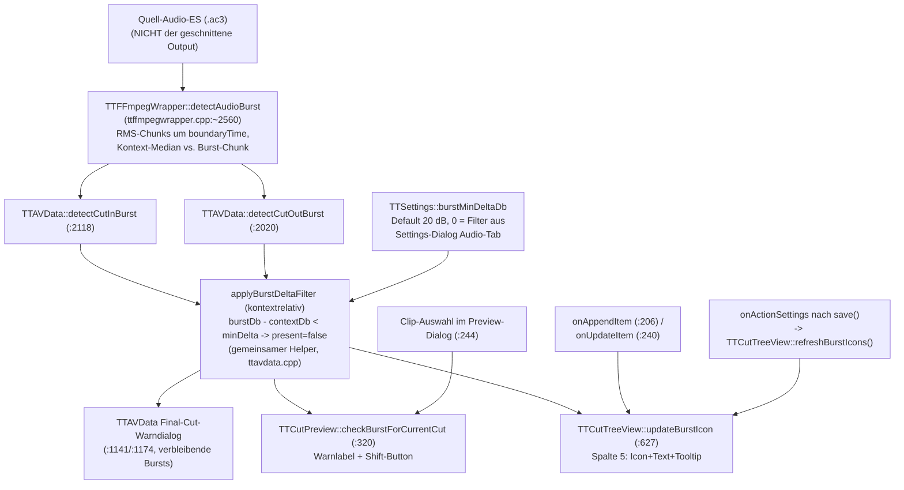

# Burst-Erkennung: Detektor → Threshold-Filter → zwei UI-Konsumenten

Audio-Burst = Werbe-Knall unmittelbar an einer Schnittgrenze (DVB: Werbung
startet ~1 Frame vor/nach dem Content-Übergang). Ein Detektor, ein
Nachfilter, zwei Anzeigen (Schnittliste + Preview-Dialog).

## Datenfluss

## Edge-Semantik

| Kante | Daten / Ordnung / Invariante |
|---|---|
| CutItem → detectCut{In,Out}Burst | **Video-Frame-Index** → Zeit `index/frameRate`; CutIn korrigiert um `countExtraFramesBefore` (MPEG-2-Field-Extras). Analysiert wird immer das **Quell**-AC3 — unabhängig von Smart-Cut-/Mux-/PTS-Pfaden. |
| detectAudioBurst → Wrapper | `bool` + `burstRmsDb`/`contextRmsDb`. Kriterium detektorintern **kontextrelativ** (Chunk sticht aus Umgebungs-Median heraus). |
| Wrapper → Konsument (`present`) | Detektor-Ergebnis **UND** kontextrelativer Filter (`applyBurstDeltaFilter`): Burst zählt, wenn `burstDb − contextDb ≥ burstMinDeltaDb` (Default 20; 0 = Filter aus). Seit `48cf828`; der frühere ABSOLUTE Filter (Default −30, kontraintuitive Skala) verwarf reale DVB-Bursts — s. Pitfalls (historisch). |
| onAppendItem/onUpdateItem → updateBurstIcon | Läuft bei Anlage/Änderung eines Cuts (inkl. Projekt-Laden, das appended). |
| onActionSettings → refreshBurstIcons | Seit `48cf828`: nach Settings-OK (`save()`) werden ALLE Spalte-5-Icons neu bewertet (Tree-Reihenfolge == CutList-Reihenfolge, Zähl-Guard `qMin`). |
| Clip-Auswahl → checkBurstForCurrentCut | Pro **ausgewähltem** Clip: iCut==0 → nur CutIn Schnitt 1; sonst CutOut Schnitt iCut (Priorität, return) dann CutIn Schnitt iCut+1. Kein globaler Überblick im Dialog. |

## Annahmen & Verträge

- Detektor: Quell-Audio Track 0; boundaryTime in Sekunden der Quell-Zeitachse
  (Audio-Start = Video-Frame 0, ttcut-demux-Trim).
- `burstMinDeltaDb == 0` schaltet den Nachfilter ab (nur Detektor-Entscheidung; im Settings-Tooltip dokumentiert).
- Preview-Dialog und Schnittliste zeigen IMMER dieselbe `present`-Entscheidung
  (gemeinsame Wrapper) — Diskrepanzen zwischen beiden UIs sind ausgeschlossen;
  „Icon fehlt" und „Warnung fehlt" haben zwangsläufig dieselbe Ursache.

## Pitfalls

1. **[BEHOBEN `48cf828`]** Historie (empirisch belegt 2026-07-04): Der
   frühere ABSOLUTE Filter (Default −30) verwarf reale DVB-Bursts
   (−37,5/−36,5/−27,3 dB bei −79…−87 dB Kontext = 50-dB-Sprung), die Skala
   war kontraintuitiv (−1 = unempfindlichste Stellung), und es gab keinen
   Listen-Refresh bei Threshold-Änderung. Alle drei durch kontextrelativen
   Filter + refreshBurstIcons ersetzt; alter Key `BurstThresholdDb/` im
   Orphan-Cleanup.
2. **Frequenz unbewertet**: Detektor misst breitbandiges RMS — unhörbare
   Anteile (Infraschall, >16 kHz) zählen mit. Für DVB-Programmton praktisch
   irrelevant; Follow-up K-Weighting (ITU BS.1770) im Spec
   `2026-07-04-burst-context-filter-design.md` dokumentiert.
3. i18n: Burst-UI-Strings seit `abf9001` englische Sources + dt.
   Übersetzung (waren hardcoded deutsch aus v0.58).

## Redundanz / Konsolidierungskandidaten

- `detectCutInBurst` und `detectCutOutBurst` sind bis auf
  boundaryTime-Berechnung und `isCutOut`-Flag identisch; der Filter ist
  seit `48cf828` in `applyBurstDeltaFilter` konsolidiert (Rest-Duplikat:
  Rahmencode der beiden Wrapper).
- Drei Konsumenten reimplementieren die „welcher Text/welches UI"-Logik
  (TreeView-Icon, Preview-Label, Final-Warndialog) über denselben zwei
  Wrappern — bei Filter-Änderungen alle drei Pfade gegentesten.
