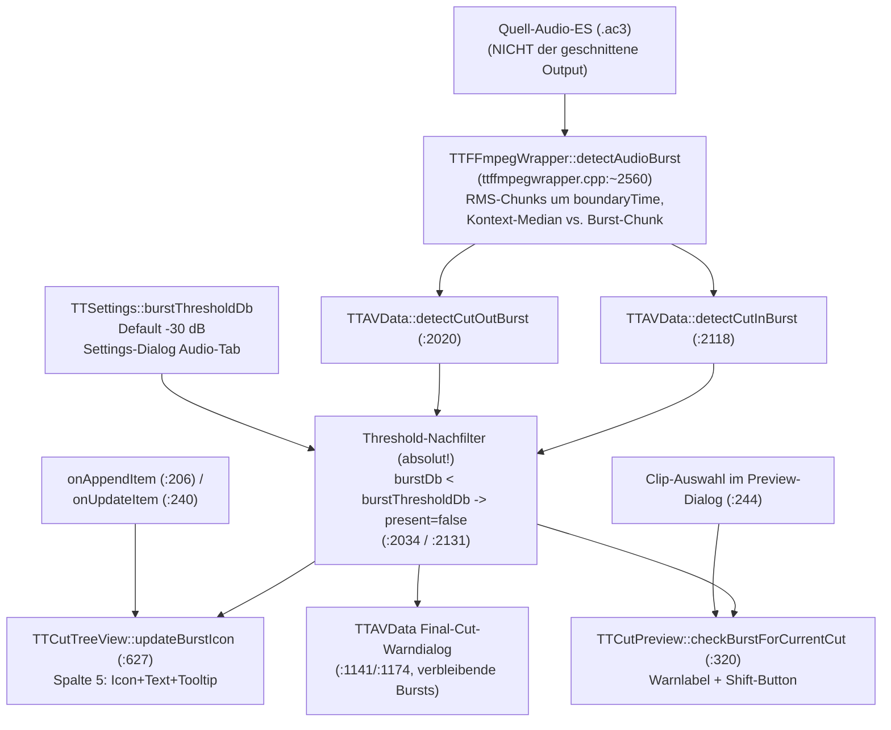

# Burst-Erkennung: Detektor → Threshold-Filter → zwei UI-Konsumenten

Audio-Burst = Werbe-Knall unmittelbar an einer Schnittgrenze (DVB: Werbung
startet ~1 Frame vor/nach dem Content-Übergang). Ein Detektor, ein
Nachfilter, zwei Anzeigen (Schnittliste + Preview-Dialog).

## Datenfluss

## Edge-Semantik

| Kante | Daten / Ordnung / Invariante |
|---|---|
| CutItem → detectCut{In,Out}Burst | **Video-Frame-Index** → Zeit `index/frameRate`; CutIn korrigiert um `countExtraFramesBefore` (MPEG-2-Field-Extras). Analysiert wird immer das **Quell**-AC3 — unabhängig von Smart-Cut-/Mux-/PTS-Pfaden. |
| detectAudioBurst → Wrapper | `bool` + `burstRmsDb`/`contextRmsDb`. Kriterium detektorintern **kontextrelativ** (Chunk sticht aus Umgebungs-Median heraus). |
| Wrapper → Konsument (`present`) | Detektor-Ergebnis **UND** absoluter Filter: `threshold != 0 && burstDb < threshold → false`. Semantik: „Burst muss LAUTER als Schwellwert sein" — niedriger Wert (−60) = empfindlich, hoher (−1) = praktisch aus. **Kontraintuitiv**, s. Pitfalls. |
| onAppendItem/onUpdateItem → updateBurstIcon | Läuft NUR bei Anlage/Änderung eines Cuts (inkl. Projekt-Laden, das appended). **Kein Re-Scan bei Threshold-Änderung** — Settings-Änderung wird in der bestehenden Liste erst nach Cut-Update sichtbar. |
| Clip-Auswahl → checkBurstForCurrentCut | Pro **ausgewähltem** Clip: iCut==0 → nur CutIn Schnitt 1; sonst CutOut Schnitt iCut (Priorität, return) dann CutIn Schnitt iCut+1. Kein globaler Überblick im Dialog. |

## Annahmen & Verträge

- Detektor: Quell-Audio Track 0; boundaryTime in Sekunden der Quell-Zeitachse
  (Audio-Start = Video-Frame 0, ttcut-demux-Trim).
- `threshold == 0` schaltet den Nachfilter ab (undokumentierter Bypass).
- Preview-Dialog und Schnittliste zeigen IMMER dieselbe `present`-Entscheidung
  (gemeinsame Wrapper) — Diskrepanzen zwischen beiden UIs sind ausgeschlossen;
  „Icon fehlt" und „Warnung fehlt" haben zwangsläufig dieselbe Ursache.

## Pitfalls (empirisch belegt 2026-07-04, ServusTV-Korpus)

1. **Default −30 verwirft reale DVB-Bursts**: gemessene Werbe-Bursts −37,5 /
   −36,5 / −27,3 dB bei Kontext −79…−87 dB (50-dB-Sprung!). Zwei von drei
   liegen unter −30 → `present=false` → weder Icon noch Warnung, obwohl der
   Detektor ansprang (Log „detectAudioBurst: BURST").
2. **Skalenrichtung missverständlich**: „−1" wirkt wie „sehr empfindlich",
   ist aber die unempfindlichste Einstellung (verlangt ≈Vollpegel).
3. **Kein Listen-Refresh bei Threshold-Änderung**: Nach Umstellen in den
   Settings bleiben die Spalte-5-Icons unverändert, bis ein Cut
   angelegt/geändert oder das Projekt neu geladen wird.
4. Der absolute Nachfilter sitzt ÜBER einem bereits kontextrelativen
   Detektor — er zerstört dessen Stärke (leiser Kontext + moderater Burst
   wird verworfen, obwohl der Sprung riesig ist).

## Redundanz / Konsolidierungskandidaten

- `detectCutInBurst` (:2118) und `detectCutOutBurst` (:2020) sind bis auf
  boundaryTime-Berechnung und `isCutOut`-Flag identisch (inkl. dupliziertem
  Threshold-Filter) → ein gemeinsamer Helper.
- Drei Konsumenten reimplementieren die „welcher Text/welches UI"-Logik
  (TreeView-Icon, Preview-Label, Final-Warndialog) über denselben zwei
  Wrappern — bei Filter-Änderungen alle drei Pfade gegentesten.
