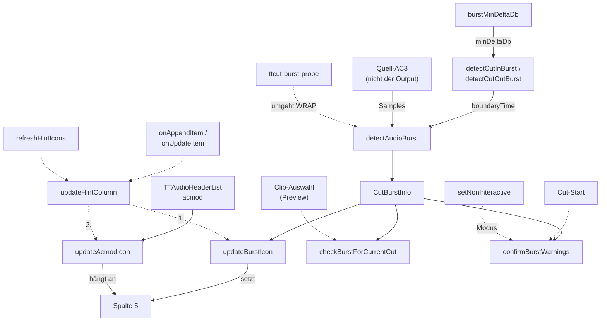

# Burst-Erkennung: Detektor → zwei UI-Konsumenten

Audio-Burst = Werbe-Knall unmittelbar an einer Schnittgrenze (DVB: Werbung
startet ~1 Frame vor/nach dem Content-Übergang). Ein Detektor (Schwelle als
Parameter, kein separater Nachfilter mehr), zwei Anzeigen (Schnittliste +
Preview-Dialog).

**Spalte 5 der Schnittliste hat zwei Produzenten**: `updateBurstIcon` (RMS-Burst,
libav-Dekodierung) und `updateAcmodIcon` (AC3-Formatwechsel, nur In-Memory-Header).
Der zweite hängt seinen Text an den ersten an — die Aufrufreihenfolge ist damit ein
Vertrag. Seit `666ed08` kapselt ihn `updateHintColumn()` als **einziger Eingang**; beide
Produzenten sind `private` und werden von nirgends sonst gerufen. Der acmod-Pfad ist
deshalb hier mitkartiert, obwohl er kein Burst ist.

**Die Erkennung ist ein Hinweis, kein Urteil.** Ihre Auflösungsgrenzen sind gemessen
und stehen unter Pitfalls; eine fehlende Warnung heißt *nicht*, dass der Schnitt
sauber ist. Anwenderfassung in `TODO.md` → „Known Limitations".

## Datenfluss

**Legende:** durchgezogene Kante = *Daten fließen* (Produzent → Konsument);
gestrichelte Kante = *löst aus* (Kontrollfluss, keine Nutzdaten).

`RES` (`CutBurstInfo`) ist bewusst ein Datenknoten statt einer Komponente: sonst
müsste das Detektor-Ergebnis als Rückwärtskante `DET → WRAP` gegen den Aufrufpfeil
laufen und würde alle anderen Kanten kreuzen. Alle Datenkanten zeigen so in eine
Richtung. Die Knoten tragen nur Symbol und Rolle — das Verhalten steht in der
Edge-Semantik-Tabelle, eine Zeile pro Kante.

## Edge-Semantik

Eine Zeile pro Diagramm-Kante, in Diagramm-Reihenfolge. Die Knoten-IDs sind die
aus dem Mermaid-Block. Durchgezogen = Daten, gestrichelt = löst aus.

| Kante | Daten / Ordnung / Invariante |
|---|---|
| `SET → WRAP` | `TTSettings::burstMinDeltaDb()`, Default 20 dB. **`<= 0` ⇒ Frühausstieg im Wrapper, ohne die Audiodatei zu öffnen** (verifiziert: 0 `openat`). Werte 1–19 wirken erst seit `a7d1c0e`; vorher blockierte die im Detektor hartcodierte 20 dB die untere Reglerhälfte. |
| `WRAP → DET` | `boundaryTime` in Sekunden der **Quell**-Zeitachse, aus dem Video-Frame-Index: CutIn `(cutInIndex − extraIn)/frameRate`, CutOut `(cutOutIndex + 1 − extraOut)/frameRate`. Das `+1` legt die Grenze hinter den letzten behaltenen Frame; `extraIn/Out` = `countExtraFramesBefore` (MPEG-2-Field-Extras, siehe `mpeg2-cut.md`). Dazu `minDeltaDb` durchgereicht. |
| `SRC → DET` | Dekodierte Samples des **Quell**-AC3 (Track 0), nicht des geschnittenen Outputs — daher unabhängig von Smart-Cut-, Mux- und PTS-Pfaden. |
| `DET → RES` | `bool present` + `burstRmsDb`/`contextRmsDb` (**nur bei Treffer gesetzt**). Kriterium: **Peak** der zwei Randchunks, `peak − median >= minDeltaDb` **UND** `peak > kBurstAbsoluteFloorDb` (−40 dB, absolutes Hörbarkeits-Gate). Peak statt First-Hit, weil die Anstiegsflanke 38–51 dB pro 32-ms-Frame steigt und der erste überschwellige Chunk sonst rasterabhängig irgendwo darauf landet. **Merke:** Peak vs. First-Hit ändert nur den *angezeigten* `burstRmsDb` (beide Bedingungen monoton in rms ⇒ `present` invariant); der Erkennungs-Fix war die Schwellen-Vereinheitlichung. |
| `RES → BURST`, `RES → PREV`, `RES → FINAL` | Dasselbe `CutBurstInfo` an alle drei Konsumenten, kein Nachfilter mehr (`a7d1c0e`). Deshalb zeigen Schnittliste, Preview-Dialog und Final-Warndialog **zwangsläufig dieselbe `present`-Entscheidung** — „Icon fehlt" und „Warnung fehlt" haben immer dieselbe Ursache. |
| `HDR → ACMOD` | `acmod` aus der **In-Memory** `TTAudioHeaderList` (`TTAC3AudioHeader`): kein File-I/O, kein libav — anders als der Burst-Pfad. Rand-acmod am CutIn-/CutOut-Frame vs. Mehrheits-acmod (Stichprobe erste/letzte ~100 AC3-Frames des Segments). Nur AC3 (`dynamic_cast`), sonst stiller Rückweg. |
| `BURST → COL5` | **Setzt** Icon, Text und Tooltip — und **leert sie in allen Rückwegen**, wenn kein Burst vorliegt (seit `666ed08`; der Kein-Audio-Ausstieg ließ den Text zuvor stehen). |
| `ACMOD → COL5` | **Hängt an**: liest `text(5)`/`toolTip(5)` aus dem Widget zurück und ergänzt `" + AC3 …"`. Abweichung ⇒ `„AC3 start/end"`. Das Tree-Widget dient damit als Zwischenspeicher zwischen zwei Produzenten (siehe Redundanz). |
| `APPEND -.-> HINT`, `REFRESH -.-> HINT` | Die drei Aufrufstellen (`onAppendItem`, `onUpdateItem`, `refreshHintIcons`) gehen seit `666ed08` **ausschließlich** über den Helper. `onAppend/onUpdate` bei Anlage/Änderung eines Cuts, inklusive Projekt-Laden (das appended). `refreshHintIcons` wird aus `onActionSettings` gerufen — **auch bei „Abbrechen"**, weil der Rückgabewert von `settingsDlg->exec()` nicht ausgewertet wird und `save()` + Refresh unbedingt laufen. Tree-Reihenfolge == CutList-Reihenfolge, Zähl-Guard `qMin`. |
| `HINT -.-> BURST` (1.), `HINT -.-> ACMOD` (2.) | **Reihenfolge ist Vertrag:** erst `updateBurstIcon` (setzt/leert Spalte 5), dann `updateAcmodIcon` (hängt an). Vertauscht ⇒ Burst überschreibt den acmod-Hinweis; nur den ersten rufen ⇒ Hinweis geht ganz verloren (genau der Defekt vor `666ed08`). Beide Callees sind `private`; der Vertrag ist von außen nicht brechbar. |
| `SEL -.-> PREV` | Pro **ausgewähltem** Clip: `iCut == 0` ⇒ nur CutIn von Schnitt 1; sonst CutOut von Schnitt `iCut` (Priorität, `return`), danach CutIn von Schnitt `iCut+1`. Kein globaler Überblick im Dialog. |
| `CUTRUN -.-> FINAL` | `confirmBurstWarnings()` hängt an **beiden** Cut-Pfaden in `TTAVData` (audio-only und Normalpfad); vor `27f8f29` existierte der Dialog dort doppelt. Bewertet die gesamte `TTCutList` erneut über dieselben Wrapper. |
| `NONINT -.-> FINAL` | `--auto-cut` (`runAutoCutMode`) setzt `mNonInteractive = true` (`27f8f29`). Dann wird jede verbleibende Warnung via `TTMessageLogger::warningMsg` geloggt, plus eine „proceeding (auto-cut)"-Sammelzeile, und der Schnitt läuft weiter (Semantik = „Cut anyway"). GUI-Pfad (`false`) zeigt den modalen Dialog, „Cancel" bricht ab. Verhindert Hängen im Headless-Betrieb. |
| `PROBE -.-> DET` | `tools/ttcut-burst-probe` ruft `detectAudioBurst` **direkt** auf und umgeht damit beide Wrapper samt ihrem `minDelta <= 0`-Frühausstieg. **Genau deshalb** steht derselbe Guard ein zweites Mal am Anfang von `detectAudioBurst` („Callers short-circuit on <= 0 before opening the file; guard anyway"). |

## Annahmen & Verträge

- Detektor: Quell-Audio Track 0; boundaryTime in Sekunden der Quell-Zeitachse
  (Audio-Start = Video-Frame 0, ttcut-demux-Trim).
- `burstMinDeltaDb == 0` schaltet die **Erkennung** ab (Frühausstieg vor dem Dateizugriff; im Settings-Tooltip dokumentiert). Früher (vor `a7d1c0e`) übersprang 0 nur den Nachfilter und wirkte damit wie 20.
- Der `minDeltaDb <= 0`-Ausstieg steht **zweimal**: in beiden Wrappern (spart den
  Dateizugriff) und als Guard gleich am Anfang von `detectAudioBurst` selbst
  (Kommentar dort: „Callers short-circuit on <= 0 before opening the file; guard
  anyway"). Der Guard greift für Direktaufrufer, die an den Wrappern vorbeigehen —
  `tools/ttcut-burst-probe` ruft `detectAudioBurst` unmittelbar auf.
- Der Detektor braucht **mindestens 3 RMS-Chunks**, sonst `false` + Warnung. Der
  „Median" ist `sorted[size/2]`, bei gerader Chunk-Zahl also das obere der beiden
  mittleren Elemente — für die Kontextschätzung unerheblich, beim Nachrechnen von
  `contextRmsDb` gegen eigene Messungen aber zu beachten.
- Spalte 5 wird nur über `updateHintColumn()` geschrieben. `updateBurstIcon` leert
  seit `666ed08` in **allen** Rückwegen Icon, Text und Tooltip (der Kein-Audio-Ausstieg
  ließ zuvor den Text stehen).
- Preview-Dialog und Schnittliste zeigen IMMER dieselbe `present`-Entscheidung
  (gemeinsame Wrapper) — Diskrepanzen zwischen beiden UIs sind ausgeschlossen;
  „Icon fehlt" und „Warnung fehlt" haben zwangsläufig dieselbe Ursache.

## Pitfalls

1. **[BEHOBEN `48cf828`]** Historie (empirisch belegt 2026-07-04): Der
   frühere ABSOLUTE Filter (Default −30) verwarf reale DVB-Bursts
   (−37,5/−36,5/−27,3 dB bei −79…−87 dB Kontext = 50-dB-Sprung), die Skala
   war kontraintuitiv (−1 = unempfindlichste Stellung), und es gab keinen
   Listen-Refresh bei Threshold-Änderung. Alle drei durch kontextrelativen
   Filter + refreshBurstIcons ersetzt; alter Key `BurstThresholdDb/` im
   Orphan-Cleanup.
2. **Frequenz unbewertet**: Detektor misst breitbandiges RMS — unhörbare
   Anteile (Infraschall, >16 kHz) zählen mit. Für DVB-Programmton praktisch
   irrelevant; Follow-up K-Weighting (ITU BS.1770) im Spec
   `2026-07-04-burst-context-filter-design.md` dokumentiert.
3. **Zeitauflösung = ein Audio-Frame (AC3: 32 ms).** RMS wird pro dekodiertem
   Audio-Frame gebildet. Ein Transient von wenigen Millisekunden wird
   weggemittelt und bleibt unsichtbar, selbst wenn sein Sample-Peak 0 dBFS
   erreicht. Empirisch 2026-07-09: an beiden acmod-Wechseln in `TEST_deu.ac3`
   (83,808 s / 624,128 s) zeigt **weder RMS noch Sample-Peak** einen Ausschlag
   nach oben.
4. **Nur die äußersten zwei Chunks (~64 ms) werden geprüft**, das Fenster
   spannt aber 200 ms. Alles weiter innen geht **ausschließlich in den
   Kontext-Median** ein.
5. **Ein ungeprüfter lauter Chunk verschlechtert die Erkennung aktiv.** Liegt er
   im Fenster, aber außerhalb des Prüfbereichs, hebt er den Median und damit die
   Latte, die die Randchunks reißen müssen. Der Detektor ist also genau dann am
   unempfindlichsten, wenn nebenan etwas Lautes liegt.
6. **`peak − median` trennt Ausreißer nicht von Pegelstufe.** Ein kurzer Klick
   und ein Werbe-Einsatz, der laut *bleibt*, feuern gleich (gemessen: 55-dB-Stufe
   bei 624,128 s in `TEST_deu.ac3`). Ein Nachbarschaftskontrast (laut, während
   die 1–3 Chunks **davor und danach** leise sind) könnte beides trennen — offene
   Design-Idee, siehe `TODO.md`.
7. **Das Absolut-Gate verwirft leise Bursts lautlos.** `kBurstAbsoluteFloorDb`
   (−40 dB) weist ab, egal wie weit der Chunk herausragt. Reale Werbe-Bursts der
   Referenzaufnahme liegen bei −37,5 / −27,3 / −36,5 dB — **zwei von dreien
   passieren das Gate um unter 4 dB**. Ein leiserer Sender wird stumm verfehlt.
   Absenken ist keine Option: bei −50 dB kämen 709 weitere Stellen derselben
   Aufnahme durch.
8. **[BEHOBEN `666ed08`]** `refreshBurstIcons()` rief `updateAcmodIcon` nicht → der
   acmod-Zusatz in Spalte 5 ging nach jedem Schließen des Settings-Dialogs verloren
   (auch bei „Abbrechen"), bis der Cut neu angelegt/aktualisiert wurde. GUI-verifiziert
   mit einem Cut über beide acmod-Wechsel von `TEST_deu.ac3` (2075/15624), bewusst ohne
   Burst an den Grenzen: Spalte 5 trug nur `„AC3 start+end"` und wurde komplett leer.
   Behoben durch `updateHintColumn()` als einzigen Eingang.
9. i18n: Burst-UI-Strings seit `abf9001` englische Sources + dt.
   Übersetzung (waren hardcoded deutsch aus v0.58).

## Redundanz / Konsolidierungskandidaten

- **[BEHOBEN `a7d1c0e`]** `applyBurstDeltaFilter` prüfte die Relativschwelle
  ein zweites Mal, die der Detektor bereits hartcodiert (20 dB) enthielt — ein
  Filter kann nur abweisen, also war jeder Wert < 20 wirkungslos. Schwelle jetzt
  als Parameter im Detektor, Filter entfällt.
- `detectCutInBurst` und `detectCutOutBurst` sind bis auf
  boundaryTime-Berechnung und `isCutOut`-Flag identisch (Rest-Duplikat:
  Rahmencode der beiden Wrapper inkl. `minDelta <= 0`-Frühausstieg).
- Drei Konsumenten reimplementieren die „welcher Text/welches UI"-Logik
  (TreeView-Icon, Preview-Label, Final-Warndialog) über denselben zwei
  Wrappern — bei Filter-Änderungen alle drei Pfade gegentesten.
- **Append-Semantik über das Widget** (offen, bewusst nicht in `666ed08`): `updateAcmodIcon`
  liest `text(5)`/`toolTip(5)` zurück und prüft `icon(5).isNull()`, um zu entscheiden, ob
  es ein Icon setzt. Das Tree-Widget dient damit als Zwischenspeicher zwischen zwei
  Produzenten. `updateHintColumn()` kapselt die Reihenfolge, beseitigt die Ursache aber
  nicht. Sauberer wäre: beide liefern `{icon, text, tooltip}` zurück, ein Setter komponiert
  und schreibt **einmal**.
- **acmod-Mehrheitslogik doppelt implementiert:** `TTFFmpegWrapper::analyzeAcmod`
  (scannt die AC3-Datei per Syncword, dient der Cut-Normalisierung `targetAcmods`)
  und `TTCutTreeView::updateAcmodIcon` (nutzt die In-Memory-`TTAudioHeaderList`,
  dient der Anzeige) bestimmen beide „Mehrheits-acmod aus ~100 Randframes" mit
  eigenem Code. Divergierende Stichprobenbereiche → beide können unterschiedliche
  `mainAcmod` liefern.
- **[BEHOBEN 2026-07-12]** `AcmodInfo::cutInChangeTime` / `cutOutChangeTime`
  waren tote Felder (nie berechnet, nirgends gelesen) — auf User-Entscheid
  ersatzlos entfernt: für den Anwendungsfall zählt nur, ob am Schnittpunkt ein
  Burst liegt, nicht wo der Formatwechsel ist. Falls die Angabe „Distanz des
  Formatwechsels zur Schnittgrenze" je gewünscht wird: über die
  `TTAudioHeaderList` ohne File-I/O berechenbar (das war die ursprüngliche
  Idee hinter den Feldern).
- **[BEHOBEN `27f8f29`]** Der Final-Warndialog existierte doppelt (audio-only-
  Pfad + Normalpfad, nahezu identisch — Stand vor `27f8f29`); beide sind jetzt in
  `confirmBurstWarnings()` konsolidiert — plus GUI/headless-Verzweigung über
  `mNonInteractive`. Rest-Duplikat also nur noch die zwei Detektor-Wrapper.
