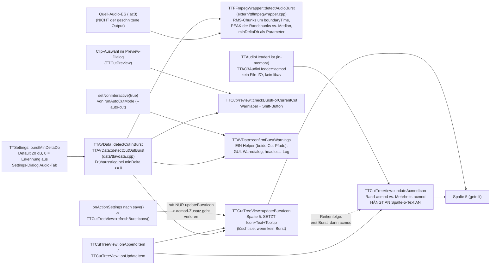

# Burst-Erkennung: Detektor → zwei UI-Konsumenten

Audio-Burst = Werbe-Knall unmittelbar an einer Schnittgrenze (DVB: Werbung
startet ~1 Frame vor/nach dem Content-Übergang). Ein Detektor (Schwelle als
Parameter, kein separater Nachfilter mehr), zwei Anzeigen (Schnittliste +
Preview-Dialog).

**Spalte 5 der Schnittliste hat zwei Produzenten**: `updateBurstIcon` (RMS-Burst,
libav-Dekodierung) und `updateAcmodIcon` (AC3-Formatwechsel, nur In-Memory-Header).
Der zweite hängt seinen Text an den ersten an — daher die Reihenfolge-Invariante in
der Edge-Tabelle. Der acmod-Pfad ist deshalb hier mitkartiert, obwohl er kein Burst ist.

**Die Erkennung ist ein Hinweis, kein Urteil.** Ihre Auflösungsgrenzen sind gemessen
und stehen unter Pitfalls; eine fehlende Warnung heißt *nicht*, dass der Schnitt
sauber ist. Anwenderfassung in `TODO.md` → „Known Limitations".

## Datenfluss

## Edge-Semantik

| Kante | Daten / Ordnung / Invariante |
|---|---|
| CutItem → detectCut{In,Out}Burst | **Video-Frame-Index** → Zeit `index/frameRate`. **Beide** Pfade korrigieren um `countExtraFramesBefore` (MPEG-2-Field-Extras): CutIn rechnet `(cutInIndex − extraIn)/frameRate`, CutOut `(cutOutIndex + 1 − extraOut)/frameRate` — das `+1` legt die Grenze hinter den letzten behaltenen Frame. Analysiert wird immer das **Quell**-AC3 — unabhängig von Smart-Cut-/Mux-/PTS-Pfaden. |
| detectAudioBurst → Wrapper | `bool` + `burstRmsDb`/`contextRmsDb` (nur bei Treffer gesetzt). Kriterium: **Peak** der zwei Randchunks, `peak − median >= minDeltaDb` **UND** `peak > kBurstAbsoluteFloorDb` (−40 dB, absolutes Hörbarkeits-Gate). `minDeltaDb` kommt als Parameter aus `TTSettings::burstMinDeltaDb()`. Peak statt First-Hit, weil die Burst-Anstiegsflanke 38–51 dB pro 32-ms-Frame steigt und der erste überschwellige Chunk sonst rasterabhängig irgendwo darauf landet. **Merke:** Peak vs. First-Hit ändert nur den *angezeigten* `burstRmsDb` (beide Bedingungen monoton in rms → `present` invariant); der Erkennungs-Fix ist die Schwellen-Vereinheitlichung. |
| Wrapper → Konsument (`present`) | Detektor-Ergebnis direkt (kein Nachfilter mehr, `a7d1c0e`). `burstMinDeltaDb <= 0` → Frühausstieg in `detectCutIn/OutBurst`, **ohne** die Audiodatei zu öffnen (verifiziert: 0 `openat`). Werte 1–19 wirken seit `a7d1c0e` erstmals (vorher blockierte die hartcodierte 20 dB die untere Reglerhälfte). |
| onAppendItem/onUpdateItem → updateBurstIcon, updateAcmodIcon | Läuft bei Anlage/Änderung eines Cuts (inkl. Projekt-Laden, das appended). **Reihenfolge ist Vertrag:** erst `updateBurstIcon` (setzt Spalte 5), dann `updateAcmodIcon` (liest den vorhandenen Text/Tooltip und hängt `" + AC3 …"` an). Vertauscht man sie, überschreibt der Burst den acmod-Hinweis. |
| updateAcmodIcon → Spalte 5 | Liest `acmod` aus der **In-Memory** `TTAudioHeaderList` (`TTAC3AudioHeader`), kein File-I/O, kein libav — anders als der Burst-Pfad. Rand-acmod am CutIn-/CutOut-Frame vs. Mehrheits-acmod (Stichprobe erste/letzte ~100 AC3-Frames des Segments). Abweichung → `„AC3 start/end"`. Nur AC3 (`dynamic_cast`), sonst stiller Rückweg. |
| onActionSettings → refreshBurstIcons | Seit `48cf828`: nach Settings-OK (`save()`) werden ALLE Spalte-5-Icons neu bewertet (Tree-Reihenfolge == CutList-Reihenfolge, Zähl-Guard `qMin`). **Aber nur `updateBurstIcon`** — `updateAcmodIcon` wird nicht mitgerufen. Da `updateBurstIcon` Spalte 5 überschreibt bzw. bei `!present` leert, **verliert die Liste nach jedem Settings-OK den acmod-Hinweis**, bis der Cut neu angelegt/aktualisiert wird. Aus dem Code gelesen, in der GUI **nicht** gegengeprüft (Referenzmaterial ServusTV hat 0 acmod-Wechsel, daher unauffällig). |
| Clip-Auswahl → checkBurstForCurrentCut | Pro **ausgewähltem** Clip: iCut==0 → nur CutIn Schnitt 1; sonst CutOut Schnitt iCut (Priorität, return) dann CutIn Schnitt iCut+1. Kein globaler Überblick im Dialog. |
| setNonInteractive → confirmBurstWarnings | Seit `27f8f29`: `--auto-cut` (`runAutoCutMode`) setzt `mNonInteractive=true`. Bei verbleibenden Bursts wird dann jede Warnung via `TTMessageLogger::warningMsg` geloggt + eine „proceeding (auto-cut)"-Sammelzeile, und der Schnitt läuft weiter (Semantik = „Cut anyway"); GUI-Pfad (`false`) zeigt weiter den modalen Dialog, „Cancel" bricht ab. Verhindert Hängen headless. |

## Annahmen & Verträge

- Detektor: Quell-Audio Track 0; boundaryTime in Sekunden der Quell-Zeitachse
  (Audio-Start = Video-Frame 0, ttcut-demux-Trim).
- `burstMinDeltaDb == 0` schaltet die **Erkennung** ab (Frühausstieg vor dem Dateizugriff; im Settings-Tooltip dokumentiert). Früher (vor `a7d1c0e`) übersprang 0 nur den Nachfilter und wirkte damit wie 20.
- Der `minDeltaDb <= 0`-Ausstieg steht **zweimal**: in beiden Wrappern (spart den
  Dateizugriff) und als Guard gleich am Anfang von `detectAudioBurst` selbst
  (Kommentar dort: „Callers short-circuit on <= 0 before opening the file; guard
  anyway"). Der Guard greift für Direktaufrufer, die an den Wrappern vorbeigehen —
  `tools/ttcut-burst-probe` ruft `detectAudioBurst` unmittelbar auf.
- Der Detektor braucht **mindestens 3 RMS-Chunks**, sonst `false` + Warnung. Der
  „Median" ist `sorted[size/2]`, bei gerader Chunk-Zahl also das obere der beiden
  mittleren Elemente — für die Kontextschätzung unerheblich, beim Nachrechnen von
  `contextRmsDb` gegen eigene Messungen aber zu beachten.
- Preview-Dialog und Schnittliste zeigen IMMER dieselbe `present`-Entscheidung
  (gemeinsame Wrapper) — Diskrepanzen zwischen beiden UIs sind ausgeschlossen;
  „Icon fehlt" und „Warnung fehlt" haben zwangsläufig dieselbe Ursache.

## Pitfalls

1. **[BEHOBEN `48cf828`]** Historie (empirisch belegt 2026-07-04): Der
   frühere ABSOLUTE Filter (Default −30) verwarf reale DVB-Bursts
   (−37,5/−36,5/−27,3 dB bei −79…−87 dB Kontext = 50-dB-Sprung), die Skala
   war kontraintuitiv (−1 = unempfindlichste Stellung), und es gab keinen
   Listen-Refresh bei Threshold-Änderung. Alle drei durch kontextrelativen
   Filter + refreshBurstIcons ersetzt; alter Key `BurstThresholdDb/` im
   Orphan-Cleanup.
2. **Frequenz unbewertet**: Detektor misst breitbandiges RMS — unhörbare
   Anteile (Infraschall, >16 kHz) zählen mit. Für DVB-Programmton praktisch
   irrelevant; Follow-up K-Weighting (ITU BS.1770) im Spec
   `2026-07-04-burst-context-filter-design.md` dokumentiert.
3. **Zeitauflösung = ein Audio-Frame (AC3: 32 ms).** RMS wird pro dekodiertem
   Audio-Frame gebildet. Ein Transient von wenigen Millisekunden wird
   weggemittelt und bleibt unsichtbar, selbst wenn sein Sample-Peak 0 dBFS
   erreicht. Empirisch 2026-07-09: an beiden acmod-Wechseln in `TEST_deu.ac3`
   (83,808 s / 624,128 s) zeigt **weder RMS noch Sample-Peak** einen Ausschlag
   nach oben.
4. **Nur die äußersten zwei Chunks (~64 ms) werden geprüft**, das Fenster
   spannt aber 200 ms. Alles weiter innen geht **ausschließlich in den
   Kontext-Median** ein.
5. **Ein ungeprüfter lauter Chunk verschlechtert die Erkennung aktiv.** Liegt er
   im Fenster, aber außerhalb des Prüfbereichs, hebt er den Median und damit die
   Latte, die die Randchunks reißen müssen. Der Detektor ist also genau dann am
   unempfindlichsten, wenn nebenan etwas Lautes liegt.
6. **`peak − median` trennt Ausreißer nicht von Pegelstufe.** Ein kurzer Klick
   und ein Werbe-Einsatz, der laut *bleibt*, feuern gleich (gemessen: 55-dB-Stufe
   bei 624,128 s in `TEST_deu.ac3`). Ein Nachbarschaftskontrast (laut, während
   die 1–3 Chunks **davor und danach** leise sind) könnte beides trennen — offene
   Design-Idee, siehe `TODO.md`.
7. **Das Absolut-Gate verwirft leise Bursts lautlos.** `kBurstAbsoluteFloorDb`
   (−40 dB) weist ab, egal wie weit der Chunk herausragt. Reale Werbe-Bursts der
   Referenzaufnahme liegen bei −37,5 / −27,3 / −36,5 dB — **zwei von dreien
   passieren das Gate um unter 4 dB**. Ein leiserer Sender wird stumm verfehlt.
   Absenken ist keine Option: bei −50 dB kämen 709 weitere Stellen derselben
   Aufnahme durch.
8. **`refreshBurstIcons()` ruft `updateAcmodIcon` nicht** → der acmod-Zusatz in
   Spalte 5 geht nach jedem Settings-OK verloren. Siehe Edge-Tabelle; aus dem Code
   gelesen, GUI-Gegenprobe steht aus.
9. i18n: Burst-UI-Strings seit `abf9001` englische Sources + dt.
   Übersetzung (waren hardcoded deutsch aus v0.58).

## Redundanz / Konsolidierungskandidaten

- **[BEHOBEN `a7d1c0e`]** `applyBurstDeltaFilter` prüfte die Relativschwelle
  ein zweites Mal, die der Detektor bereits hartcodiert (20 dB) enthielt — ein
  Filter kann nur abweisen, also war jeder Wert < 20 wirkungslos. Schwelle jetzt
  als Parameter im Detektor, Filter entfällt.
- `detectCutInBurst` und `detectCutOutBurst` sind bis auf
  boundaryTime-Berechnung und `isCutOut`-Flag identisch (Rest-Duplikat:
  Rahmencode der beiden Wrapper inkl. `minDelta <= 0`-Frühausstieg).
- Drei Konsumenten reimplementieren die „welcher Text/welches UI"-Logik
  (TreeView-Icon, Preview-Label, Final-Warndialog) über denselben zwei
  Wrappern — bei Filter-Änderungen alle drei Pfade gegentesten.
- **acmod-Mehrheitslogik doppelt implementiert:** `TTFFmpegWrapper::analyzeAcmod`
  (scannt die AC3-Datei per Syncword, dient der Cut-Normalisierung `targetAcmods`)
  und `TTCutTreeView::updateAcmodIcon` (nutzt die In-Memory-`TTAudioHeaderList`,
  dient der Anzeige) bestimmen beide „Mehrheits-acmod aus ~100 Randframes" mit
  eigenem Code. Divergierende Stichprobenbereiche → beide können unterschiedliche
  `mainAcmod` liefern.
- **`AcmodInfo::cutInChangeTime` / `cutOutChangeTime` sind tote Felder**: in
  `analyzeAcmod` auf `0.0` initialisiert, nie berechnet, nirgends gelesen (Symbol
  existiert nur in `extern/ttffmpegwrapper.h`). Sie waren als Distanz des
  Formatwechsels zur Schnittgrenze gedacht — genau die Angabe, die der Anwender
  bräuchte, um zu wissen, um wie viele Frames er schieben muss. Über die
  `TTAudioHeaderList` wäre sie ohne File-I/O zu haben.
- **[BEHOBEN `27f8f29`]** Der Final-Warndialog existierte doppelt (audio-only-
  Pfad + Normalpfad, nahezu identisch — Stand vor `27f8f29`); beide sind jetzt in
  `confirmBurstWarnings()` konsolidiert — plus GUI/headless-Verzweigung über
  `mNonInteractive`. Rest-Duplikat also nur noch die zwei Detektor-Wrapper.
