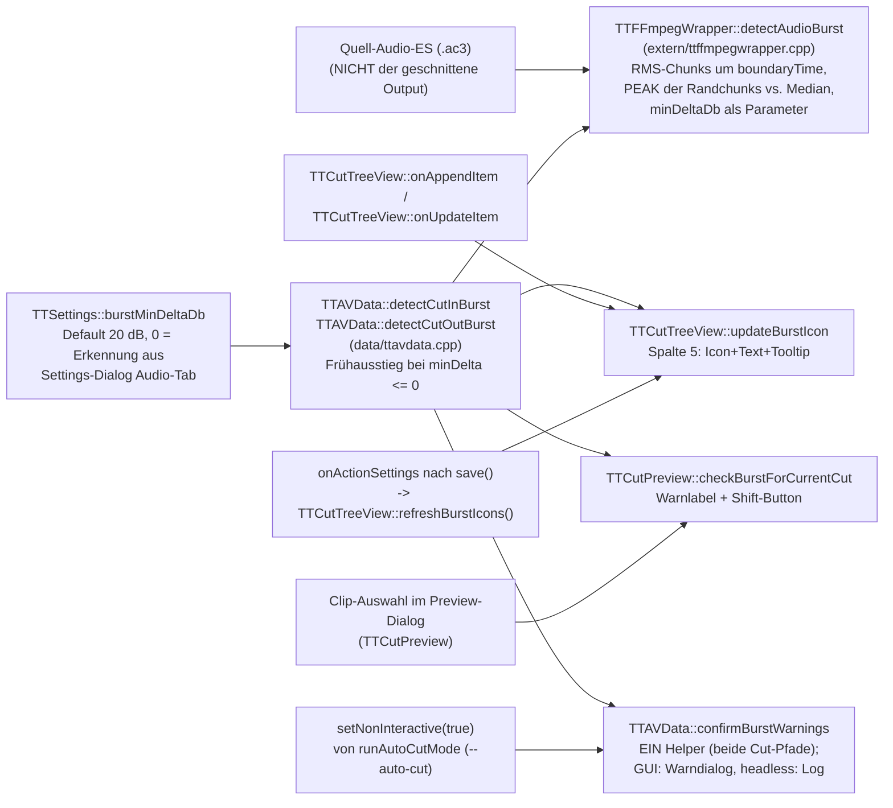

# Burst-Erkennung: Detektor → zwei UI-Konsumenten

Audio-Burst = Werbe-Knall unmittelbar an einer Schnittgrenze (DVB: Werbung
startet ~1 Frame vor/nach dem Content-Übergang). Ein Detektor (Schwelle als
Parameter, kein separater Nachfilter mehr), zwei Anzeigen (Schnittliste +
Preview-Dialog).

## Datenfluss

## Edge-Semantik

| Kante | Daten / Ordnung / Invariante |
|---|---|
| CutItem → detectCut{In,Out}Burst | **Video-Frame-Index** → Zeit `index/frameRate`; CutIn korrigiert um `countExtraFramesBefore` (MPEG-2-Field-Extras). Analysiert wird immer das **Quell**-AC3 — unabhängig von Smart-Cut-/Mux-/PTS-Pfaden. |
| detectAudioBurst → Wrapper | `bool` + `burstRmsDb`/`contextRmsDb` (nur bei Treffer gesetzt). Kriterium: **Peak** der zwei Randchunks, `peak − median >= minDeltaDb` **UND** `peak > kBurstAbsoluteFloorDb` (−40 dB, absolutes Hörbarkeits-Gate). `minDeltaDb` kommt als Parameter aus `TTSettings::burstMinDeltaDb()`. Peak statt First-Hit, weil die Burst-Anstiegsflanke 38–51 dB pro 32-ms-Frame steigt und der erste überschwellige Chunk sonst rasterabhängig irgendwo darauf landet. **Merke:** Peak vs. First-Hit ändert nur den *angezeigten* `burstRmsDb` (beide Bedingungen monoton in rms → `present` invariant); der Erkennungs-Fix ist die Schwellen-Vereinheitlichung. |
| Wrapper → Konsument (`present`) | Detektor-Ergebnis direkt (kein Nachfilter mehr, `a7d1c0e`). `burstMinDeltaDb <= 0` → Frühausstieg in `detectCutIn/OutBurst`, **ohne** die Audiodatei zu öffnen (verifiziert: 0 `openat`). Werte 1–19 wirken seit `a7d1c0e` erstmals (vorher blockierte die hartcodierte 20 dB die untere Reglerhälfte). |
| onAppendItem/onUpdateItem → updateBurstIcon | Läuft bei Anlage/Änderung eines Cuts (inkl. Projekt-Laden, das appended). |
| onActionSettings → refreshBurstIcons | Seit `48cf828`: nach Settings-OK (`save()`) werden ALLE Spalte-5-Icons neu bewertet (Tree-Reihenfolge == CutList-Reihenfolge, Zähl-Guard `qMin`). |
| Clip-Auswahl → checkBurstForCurrentCut | Pro **ausgewähltem** Clip: iCut==0 → nur CutIn Schnitt 1; sonst CutOut Schnitt iCut (Priorität, return) dann CutIn Schnitt iCut+1. Kein globaler Überblick im Dialog. |
| setNonInteractive → confirmBurstWarnings | Seit `27f8f29`: `--auto-cut` (`runAutoCutMode`) setzt `mNonInteractive=true`. Bei verbleibenden Bursts wird dann jede Warnung via `TTMessageLogger::warningMsg` geloggt + eine „proceeding (auto-cut)"-Sammelzeile, und der Schnitt läuft weiter (Semantik = „Cut anyway"); GUI-Pfad (`false`) zeigt weiter den modalen Dialog, „Cancel" bricht ab. Verhindert Hängen headless. |

## Annahmen & Verträge

- Detektor: Quell-Audio Track 0; boundaryTime in Sekunden der Quell-Zeitachse
  (Audio-Start = Video-Frame 0, ttcut-demux-Trim).
- `burstMinDeltaDb == 0` schaltet die **Erkennung** ab (Frühausstieg vor dem Dateizugriff; im Settings-Tooltip dokumentiert). Früher (vor `a7d1c0e`) übersprang 0 nur den Nachfilter und wirkte damit wie 20.
- Preview-Dialog und Schnittliste zeigen IMMER dieselbe `present`-Entscheidung
  (gemeinsame Wrapper) — Diskrepanzen zwischen beiden UIs sind ausgeschlossen;
  „Icon fehlt" und „Warnung fehlt" haben zwangsläufig dieselbe Ursache.

## Pitfalls

1. **[BEHOBEN `48cf828`]** Historie (empirisch belegt 2026-07-04): Der
   frühere ABSOLUTE Filter (Default −30) verwarf reale DVB-Bursts
   (−37,5/−36,5/−27,3 dB bei −79…−87 dB Kontext = 50-dB-Sprung), die Skala
   war kontraintuitiv (−1 = unempfindlichste Stellung), und es gab keinen
   Listen-Refresh bei Threshold-Änderung. Alle drei durch kontextrelativen
   Filter + refreshBurstIcons ersetzt; alter Key `BurstThresholdDb/` im
   Orphan-Cleanup.
2. **Frequenz unbewertet**: Detektor misst breitbandiges RMS — unhörbare
   Anteile (Infraschall, >16 kHz) zählen mit. Für DVB-Programmton praktisch
   irrelevant; Follow-up K-Weighting (ITU BS.1770) im Spec
   `2026-07-04-burst-context-filter-design.md` dokumentiert.
3. i18n: Burst-UI-Strings seit `abf9001` englische Sources + dt.
   Übersetzung (waren hardcoded deutsch aus v0.58).

## Redundanz / Konsolidierungskandidaten

- **[BEHOBEN `a7d1c0e`]** `applyBurstDeltaFilter` prüfte die Relativschwelle
  ein zweites Mal, die der Detektor bereits hartcodiert (20 dB) enthielt — ein
  Filter kann nur abweisen, also war jeder Wert < 20 wirkungslos. Schwelle jetzt
  als Parameter im Detektor, Filter entfällt.
- `detectCutInBurst` und `detectCutOutBurst` sind bis auf
  boundaryTime-Berechnung und `isCutOut`-Flag identisch (Rest-Duplikat:
  Rahmencode der beiden Wrapper inkl. `minDelta <= 0`-Frühausstieg).
- Drei Konsumenten reimplementieren die „welcher Text/welches UI"-Logik
  (TreeView-Icon, Preview-Label, Final-Warndialog) über denselben zwei
  Wrappern — bei Filter-Änderungen alle drei Pfade gegentesten.
- **[BEHOBEN `27f8f29`]** Der Final-Warndialog existierte doppelt (audio-only-
  Pfad + Normalpfad, nahezu identisch — Stand vor `27f8f29`); beide sind jetzt in
  `confirmBurstWarnings()` konsolidiert — plus GUI/headless-Verzweigung über
  `mNonInteractive`. Rest-Duplikat also nur noch die zwei Detektor-Wrapper.
