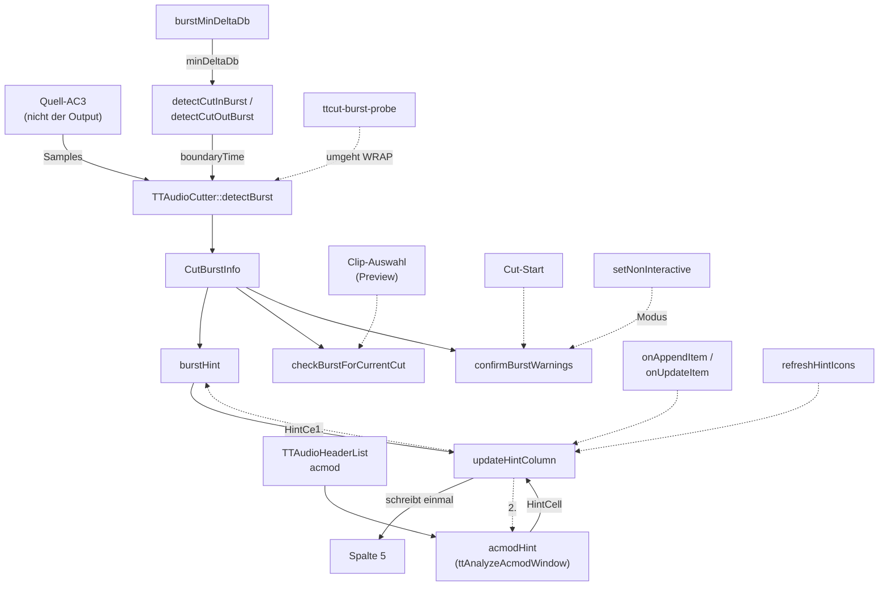

# Burst-Erkennung: Detektor → zwei UI-Konsumenten

Audio-Burst = Werbe-Knall unmittelbar an einer Schnittgrenze (DVB: Werbung
startet ~1 Frame vor/nach dem Content-Übergang). Ein Detektor (Schwelle als
Parameter, kein separater Nachfilter mehr), zwei Anzeigen (Schnittliste +
Preview-Dialog).

**Spalte 5 der Schnittliste hat zwei Produzenten**: `burstHint` (RMS-Burst,
libav-Dekodierung) und `acmodHint` (AC3-Formatwechsel, nur In-Memory-Header —
teilt sich seit `ada97fd2` die Mehrheits-acmod-Logik mit der Cut-Pipeline über
`ttAnalyzeAcmodWindow`, `avstream/ttac3acmod.cpp`). Beide sind seit derselben
Änderung reine Funktionen, die ein `HintCell{text, tip}` zurückgeben, ohne das
Baum-Widget zu berühren; `updateHintColumn()` — weiterhin der **einzige
Eingang** — ruft beide, komponiert Text/Tooltip/Icon aus den zwei Rückgaben
und schreibt Spalte 5 **einmal**. Die frühere Append-an-die-Zelle-Gefahr
(Aufrufreihenfolge zweier Setzer als Vertrag) ist damit entfallen, siehe
Redundanz-Abschnitt. Beide Helfer sind weiterhin `private` und werden von
nirgends sonst gerufen. Der acmod-Pfad ist deshalb hier mitkartiert, obwohl
er kein Burst ist.

**Die Erkennung ist ein Hinweis, kein Urteil.** Ihre Auflösungsgrenzen sind gemessen
und stehen unter Pitfalls; eine fehlende Warnung heißt *nicht*, dass der Schnitt
sauber ist. Anwenderfassung in `TODO.md` → „Known Limitations".

## Datenfluss

**Legende:** durchgezogene Kante = *Daten fließen* (Produzent → Konsument);
gestrichelte Kante = *löst aus* (Kontrollfluss, keine Nutzdaten).

`RES` (`CutBurstInfo`) ist bewusst ein Datenknoten statt einer Komponente: sonst
müsste das Detektor-Ergebnis als Rückwärtskante `DET → WRAP` gegen den Aufrufpfeil
laufen und würde alle anderen Kanten kreuzen. Alle Datenkanten zeigen so in eine
Richtung. Die Knoten tragen nur Symbol und Rolle — das Verhalten steht in der
Edge-Semantik-Tabelle, eine Zeile pro Kante.

```mermaid
flowchart TD
    SRC["Quell-AC3<br/>(nicht der Output)"]
    SET["burstMinDeltaDb"]
    HDR["TTAudioHeaderList<br/>acmod"]

    WRAP["detectCutInBurst /<br/>detectCutOutBurst"]
    DET["TTAudioCutter::detectBurst"]
    RES["CutBurstInfo"]

    BURST["burstHint"]
    ACMOD["acmodHint<br/>(ttAnalyzeAcmodWindow)"]
    COL5["Spalte 5"]
    PREV["checkBurstForCurrentCut"]
    FINAL["confirmBurstWarnings"]

    HINT["updateHintColumn"]
    APPEND["onAppendItem /<br/>onUpdateItem"]
    REFRESH["refreshHintIcons"]
    SEL["Clip-Auswahl<br/>(Preview)"]
    CUTRUN["Cut-Start"]
    NONINT["setNonInteractive"]
    PROBE["ttcut-burst-probe"]

    SET -->|"minDeltaDb"| WRAP
    WRAP -->|"boundaryTime"| DET
    SRC -->|"Samples"| DET
    DET --> RES
    RES --> BURST
    RES --> PREV
    RES --> FINAL
    HDR --> ACMOD
    BURST -->|"HintCell"| HINT
    ACMOD -->|"HintCell"| HINT
    HINT -->|"schreibt einmal"| COL5

    APPEND -.-> HINT
    REFRESH -.-> HINT
    HINT -. "1." .-> BURST
    HINT -. "2." .-> ACMOD
    SEL -.-> PREV
    CUTRUN -.-> FINAL
    NONINT -. "Modus" .-> FINAL
    PROBE -. "umgeht WRAP" .-> DET
```

## Edge-Semantik

Eine Zeile pro Diagramm-Kante, in Diagramm-Reihenfolge. Die Knoten-IDs sind die
aus dem Mermaid-Block. Durchgezogen = Daten, gestrichelt = löst aus.

| Kante | Daten / Ordnung / Invariante |
|---|---|
| `SET → WRAP` | `TTSettings::burstMinDeltaDb()`, Default 20 dB. **`<= 0` ⇒ Frühausstieg im Wrapper, ohne die Audiodatei zu öffnen** (verifiziert: 0 `openat`). Werte 1–19 wirken; die Schwelle ist Parameter des Detektors, nicht hartcodiert. |
| `WRAP → DET` | `boundaryTime` in Sekunden der **Quell**-Zeitachse, aus dem Video-Frame-Index: CutIn `(cutInIndex − extraIn)/frameRate`, CutOut `(cutOutIndex + 1 − extraOut)/frameRate`. Das `+1` legt die Grenze hinter den letzten behaltenen Frame; `extraIn/Out` = `countExtraFramesBefore` (MPEG-2-Field-Extras, siehe `mpeg2-cut.md`). Dazu `minDeltaDb` durchgereicht. |
| `SRC → DET` | Dekodierte Samples des **Quell**-AC3 (Track 0 = Position 0 der Audio-Liste), nicht des geschnittenen Outputs — daher unabhängig von Smart-Cut-, Mux- und PTS-Pfaden. Wer Track 0 ist, bestimmt allein die initiale Ladesortierung (AC3 > Sprachpräferenz; Projekt-Load: gespeicherte `<Order>`) — danach ist die Reihenfolge dauerhaft user-kontrolliert (Up/Down-Knöpfe); ein Re-Sort bei Pool-Exit findet nicht statt. Der per-Append-Sort in `onOpenAudioFinished` garantiert weiterhin, dass Track 0 schon **vor** dem Pool-Exit die präferierte Spur ist (Burst-Detection beim initialen VDR-Cut-Add). |
| `DET → RES` | `bool present` + `burstRmsDb`/`contextRmsDb` (**nur bei Treffer gesetzt**). Kriterium: **Peak** der zwei Randchunks, `peak − median >= minDeltaDb` **UND** `peak > kBurstAbsoluteFloorDb` (−40 dB, absolutes Hörbarkeits-Gate). Peak statt First-Hit, weil die Anstiegsflanke 38–51 dB pro 32-ms-Frame steigt und der erste überschwellige Chunk sonst rasterabhängig irgendwo darauf landet. **Merke:** Peak vs. First-Hit ändert nur den *angezeigten* `burstRmsDb` (beide Bedingungen monoton in rms ⇒ `present` invariant); der Erkennungs-Fix war die Schwellen-Vereinheitlichung. |
| `RES → BURST`, `RES → PREV`, `RES → FINAL` | Dasselbe `CutBurstInfo` an alle drei Konsumenten, kein Nachfilter mehr (`a7d1c0e`). Deshalb zeigen Schnittliste, Preview-Dialog und Final-Warndialog **zwangsläufig dieselbe `present`-Entscheidung** — „Icon fehlt" und „Warnung fehlt" haben immer dieselbe Ursache. |
| `HDR → ACMOD` | `acmodHint` liest `item.avDataItem()->audioStreamAt(0)` und ruft `ttAnalyzeAcmodWindow(stream, cutInSec, cutOutSec)` (`avstream/ttac3acmod.cpp`) — **dieselbe Funktion, die `TTAVData::computeTargetAcmods` für die Cut-Pipeline aufruft** (seit `ada97fd2`, siehe `audio-cut-timing.md`, Kante `ACMOD → CUT`). Arbeitet auf der **In-Memory** `TTAudioHeaderList` (`TTAC3AudioHeader`): kein File-I/O, kein libav — anders als der Burst-Pfad. Fenster `[floor(cutIn/frameDur), floor(cutOut/frameDur) − 1]` in AC3-Frames (frameDur aus dem ersten Header der Liste, Default 32 ms bei 48 kHz); Mehrheit über die ersten und letzten `kAcmodSampleFrames` (100) Frames des Fensters, jeder Frame einmal gezählt — ein kürzeres Fenster wird komplett gesampelt. Nur AC3 (`streamType() == ac3_audio`), sonst leerer `TTAcmodInfo` (`mainAcmod == -1`). |
| `BURST → HINT`, `ACMOD → HINT` | Beide liefern ein `HintCell{text, tip}` zurück (leere Felder, wenn nichts zu melden ist) — kein Seiteneffekt auf das Widget. |
| `HINT → COL5` | `updateHintColumn` komponiert **einmal**: `text = burst.text`, ergänzt um `" + " + acmod.text`, falls beide etwas melden (Burst-Text steht immer zuerst); `tip` ebenso mit `"\n"` als Trenner. Icon-Priorität: Burst-Text vorhanden ⇒ Warn-Icon, sonst Acmod-Text vorhanden ⇒ Info-Icon, sonst kein Icon. Schreibt Icon/Text/Tooltip **unbedingt** bei jedem Aufruf — deckt das Leeren der Zelle (auch im Kein-Audio-Ausstieg) ohne eigenen Sonderfall ab. |
| `APPEND -.-> HINT`, `REFRESH -.-> HINT` | Die drei Aufrufstellen (`onAppendItem`, `onUpdateItem`, `refreshHintIcons`) gehen **ausschließlich** über den Helper. `onAppend/onUpdate` bei Anlage/Änderung eines Cuts, inklusive Projekt-Laden (das appended). `refreshHintIcons` wird aus `TTCutMainWindow::openSettingsDialog` gerufen (von `onActionSettings` und dem Audio-Kategorie-Kurzweg aufgerufen) — **seit `9e5511f0` NUR bei „OK"** (`if (settingsDlg->exec() == QDialog::Accepted) { …; cutList->refreshHintIcons(); }`); bei „Abbrechen" laufen weder `TTSettings::save()` noch der Refresh mehr (vorher liefen beide unbedingt, siehe Gate `tools/diag/test_settings_cancel`). Tree-Reihenfolge == CutList-Reihenfolge, Zähl-Guard `qMin`. |
| `APPEND -.-> HINT`, `REFRESH -.-> HINT` | Die zwei Auslöser derselben Aktualisierung: `onAppendItem`/`onUpdateItem` bauen bzw. ändern eine Zeile und rufen `updateHintColumn` für genau diese, `refreshHintIcons` läuft über alle Zeilen — seit `9e5511f0` nur nach **Annahme** des Einstellungsdialogs, nicht mehr auch nach Abbrechen (Gate `test_settings_cancel`). |
| `HINT -.-> BURST` (1.), `HINT -.-> ACMOD` (2.) | Aufrufreihenfolge in `updateHintColumn()`: erst `burstHint`, dann `acmodHint` — bestimmt nur noch die Kompositionsreihenfolge (Burst-Text zuerst, Warn-Icon hat Vorrang vor Info-Icon), nicht mehr, ob ein Wert überschrieben wird: beide Rückgaben werden erst am Ende zusammengesetzt (siehe `HINT → COL5`). Beide Callees sind weiterhin `private`. |
| `SEL -.-> PREV` | Pro **ausgewähltem** Clip: `iCut == 0` ⇒ nur CutIn von Schnitt 1; sonst CutOut von Schnitt `iCut` (Priorität, `return`), danach CutIn von Schnitt `iCut+1`. Kein globaler Überblick im Dialog. Die Darstellung liegt in einer **eigenen, volle Breite spannenden Grid-Zeile**. Der Shift-Knopf behält seinen Platz auch im versteckten Zustand, damit das Videobild beim Clip-Wechsel nicht springt. |
| `CUTRUN -.-> FINAL` | `confirmBurstWarnings()` hängt an **beiden** Cut-Pfaden in `TTAVData` (audio-only und Normalpfad); vor `27f8f29` existierte der Dialog dort doppelt. Bewertet die gesamte `TTCutList` erneut über dieselben Wrapper. |
| `NONINT -.-> FINAL` | `--auto-cut` (`TTCutMainWindow::runAutoCutMode`, seit `ab3fae4d` in `gui/ttcutmainwindow_headless.cpp` statt `gui/ttcutmainwindow.cpp`) setzt `mNonInteractive = true` (`27f8f29`). Dann wird jede verbleibende Warnung via `TTMessageLogger::warningMsg` geloggt, plus eine „proceeding (auto-cut)"-Sammelzeile, und der Schnitt läuft weiter (Semantik = „Cut anyway"). GUI-Pfad (`false`) zeigt den modalen Dialog, „Cancel" bricht ab. Verhindert Hängen im Headless-Betrieb. |
| `PROBE -.-> DET` | `tools/ttcut-burst-probe` ruft `TTAudioCutter::detectBurst` **direkt** auf und umgeht damit beide Wrapper samt ihrem `minDelta <= 0`-Frühausstieg. **Genau deshalb** steht derselbe Guard ein zweites Mal am Anfang von `TTAudioCutter::detectBurst` („Callers short-circuit on <= 0 before opening the file; guard anyway"). |

## Annahmen & Verträge

- Detektor: Quell-Audio Track 0; boundaryTime in Sekunden der Quell-Zeitachse
  (Audio-Start = Video-Frame 0, ttcut-demux-Trim). Track 0 ist nach dem
  initialen Laden user-kontrolliert (siehe `SRC → DET`) —
  eine manuelle Umsortierung ändert also auch die Burst-Analyse-Spur.
- `burstMinDeltaDb == 0` schaltet die **Erkennung** ab (Frühausstieg vor dem Dateizugriff; im Settings-Tooltip dokumentiert).
- Der `minDeltaDb <= 0`-Ausstieg steht **zweimal**: in beiden Wrappern (spart den
  Dateizugriff) und als Guard gleich am Anfang von `TTAudioCutter::detectBurst`
  selbst (Kommentar dort: „Callers short-circuit on <= 0 before opening the file;
  guard anyway"). Der Guard greift für Direktaufrufer, die an den Wrappern
  vorbeigehen — `tools/ttcut-burst-probe` ruft `TTAudioCutter::detectBurst`
  unmittelbar auf.
- Der Detektor braucht **mindestens 3 RMS-Chunks**, sonst `false` + Warnung. Der
  „Median" ist `sorted[size/2]`, bei gerader Chunk-Zahl also das obere der beiden
  mittleren Elemente — für die Kontextschätzung unerheblich, beim Nachrechnen von
  `contextRmsDb` gegen eigene Messungen aber zu beachten.
- Spalte 5 wird nur über `updateHintColumn()` geschrieben, und zwar **unbedingt**
  bei jedem Aufruf (Icon/Text/Tooltip) — unabhängig davon, ob `burstHint`/
  `acmodHint` etwas melden. Ein eigener „leeren"-Sonderfall für den
  Kein-Audio-Ausstieg entfällt damit; das unbedingte Schreiben deckt ihn ab.
- `refreshHintIcons()` läuft seit `9e5511f0` nur noch, wenn der Einstellungs-
  dialog mit „OK" verlassen wurde (`TTCutMainWindow::openSettingsDialog`);
  ein „Abbrechen" ändert weder `TTSettings` noch Spalte 5.
- Preview-Dialog und Schnittliste zeigen IMMER dieselbe `present`-Entscheidung
  (gemeinsame Wrapper) — Diskrepanzen zwischen beiden UIs sind ausgeschlossen;
  „Icon fehlt" und „Warnung fehlt" haben zwangsläufig dieselbe Ursache.

## Pitfalls

1. **Frequenz unbewertet**: Detektor misst breitbandiges RMS — unhörbare
   Anteile (Infraschall, >16 kHz) zählen mit. Für DVB-Programmton praktisch
   irrelevant; Follow-up K-Weighting (ITU BS.1770) im Spec
   `2026-07-04-burst-context-filter-design.md` dokumentiert.
2. **Zeitauflösung = ein Audio-Frame (AC3: 32 ms).** RMS wird pro dekodiertem
   Audio-Frame gebildet. Ein Transient von wenigen Millisekunden wird
   weggemittelt und bleibt unsichtbar, selbst wenn sein Sample-Peak 0 dBFS
   erreicht. Empirisch 2026-07-09: an beiden acmod-Wechseln in `TEST_deu.ac3`
   (83,808 s / 624,128 s) zeigt **weder RMS noch Sample-Peak** einen Ausschlag
   nach oben.
3. **Nur die äußersten zwei Chunks (~64 ms) werden geprüft**, das Fenster
   spannt aber 200 ms. Alles weiter innen geht **ausschließlich in den
   Kontext-Median** ein.
4. **Ein ungeprüfter lauter Chunk verschlechtert die Erkennung aktiv.** Liegt er
   im Fenster, aber außerhalb des Prüfbereichs, hebt er den Median und damit die
   Latte, die die Randchunks reißen müssen. Der Detektor ist also genau dann am
   unempfindlichsten, wenn nebenan etwas Lautes liegt.
5. **`peak − median` trennt Ausreißer nicht von Pegelstufe.** Ein kurzer Klick
   und ein Werbe-Einsatz, der laut *bleibt*, feuern gleich (gemessen: 55-dB-Stufe
   bei 624,128 s in `TEST_deu.ac3`). Ein Nachbarschaftskontrast (laut, während
   die 1–3 Chunks **davor und danach** leise sind) könnte beides trennen — offene
   Design-Idee, siehe `TODO.md`.
6. **Das Absolut-Gate verwirft leise Bursts lautlos.** `kBurstAbsoluteFloorDb`
   (−40 dB) weist ab, egal wie weit der Chunk herausragt. Reale Werbe-Bursts der
   Referenzaufnahme liegen bei −37,5 / −27,3 / −36,5 dB — **zwei von dreien
   passieren das Gate um unter 4 dB**. Ein leiserer Sender wird stumm verfehlt.
   Absenken ist keine Option: bei −50 dB kämen 709 weitere Stellen derselben
   Aufnahme durch.
7. i18n: Burst-UI-Strings sind englische Sources mit deutscher Übersetzung.
8. **Ein einen Frame langer Schnitt hat keinen Spielraum für den Shift-Knopf.**
   `TTCutPreview::onBurstShift()` prüft seit `91e088ff` (Audit-Lauf 6), ob die
   Verschiebung das Cut-Ende über das Cut-In (oder umgekehrt) hinaus schieben
   würde (`wouldInvert`), und bricht mit einer Meldung „The cut is only one
   frame long …" ab, statt den Knopf wirkungslos erscheinen zu lassen.

## Redundanz / Konsolidierungskandidaten

- Die Relativschwelle (`burstMinDeltaDb`) ist Parameter des Detektors; einen
  nachgelagerten Filter gibt es nicht — er könnte nur abweisen und wäre
  unterhalb der Detektorschwelle wirkungslos.
- `detectCutInBurst` und `detectCutOutBurst` sind bis auf
  boundaryTime-Berechnung und `isCutOut`-Flag identisch (Rest-Duplikat:
  Rahmencode der beiden Wrapper inkl. `minDelta <= 0`-Frühausstieg).
- Drei Konsumenten reimplementieren die „welcher Text/welches UI"-Logik
  (TreeView-Icon, Preview-Label, Final-Warndialog) über denselben zwei
  Wrappern — bei Filter-Änderungen alle drei Pfade gegentesten.
- `configureBurstShiftButton(isCutOut)` besitzt Beschriftung, Icon und Tooltip
  des Shift-Knopfs im Preview-Dialog als einzige Stelle.
- **Append-Semantik über das Widget**
  - sites: `TTCutTreeView::updateBurstIcon` / `updateAcmodIcon` (vor `ada97fd2`)
  - shared purpose: zwei Produzenten schreiben nacheinander in dieselbe Zelle
  - status: done `ada97fd2` — `burstHint`/`acmodHint` sind jetzt reine Funktionen,
    die `{text, tip}` zurückgeben, ohne das Widget zu berühren; `updateHintColumn()`
    komponiert Text/Tooltip/Icon aus beiden Rückgaben und schreibt Spalte 5 einmal.
    Die Aufrufreihenfolge (Burst zuerst) bestimmt nur noch Text-/Icon-Priorität im
    Kompositionscode, nicht mehr, ob ein Wert überschrieben wird — kein Vertrag
    zwischen zwei Setzern mehr, siehe Kante `HINT → COL5`.
- **acmod-Mehrheitslogik doppelt implementiert**
  - sites: (ehemals) `TTAudioCutter::analyzeAcmod` (Sync-Word-Dateiscan, feste
    32-ms-Frame, Cut-Normalisierung `targetAcmods`), `TTCutTreeView::updateAcmodIcon`
    (In-Memory-`TTAudioHeaderList`, abweichende Sampling-Regel, Anzeige)
  - shared purpose: „Mehrheits-acmod aus ~100 Randframes" pro Segment bestimmen
  - status: done `ada97fd2` — beide durch `ttAnalyzeAcmodWindow` (`avstream/
    ttac3acmod.cpp`) ersetzt, `TTAudioCutter::analyzeAcmod` + `AcmodInfo` entfernt
    (114 Zeilen). Der alte Dateiscan hatte bei Fenstern < 100 Frames einen echten
    Fehler: sein Cut-Out-Samplebereich begann vor dem Cut-In, sodass Cut-In-acmod
    und Mehrheit teils von außerhalb des Fensters stammten und ein kurzes Segment
    auf die Nachbarschaft statt auf sich selbst normalisiert werden konnte — mit der
    gemeinsamen Funktion behoben (7/7/7 statt fehlerhaft, Kurzfenster-Testfall).
    Gates: `test_acmod_majority` (520 Fenster ≥100 Frames gegen den alten Dateiscan
    als Referenz, keine Abweichung), `gate_cut_identity.sh` (fünf Fixtures identisch),
    `test_hint_column` (neu: Hinweis-Spalte „AC3 start/end/start+end", Tooltip nennt
    beide Modi).
- Der Final-Warndialog liegt einfach in `confirmBurstWarnings()`, mit
  GUI/headless-Verzweigung über `mNonInteractive`. Verbleibendes Duplikat
  sind allein die zwei Detektor-Wrapper.
