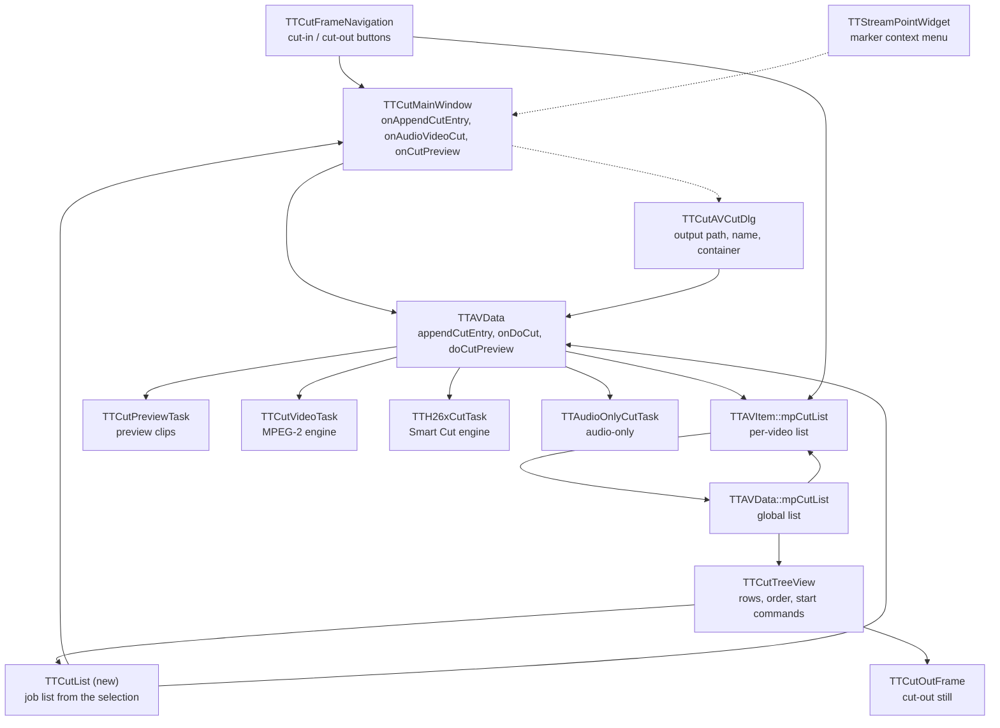

# Code Map: Editing and starting a cut

From the user's gesture to the moment a cut task is handed its job: where a
cut range comes from, the **two** cut lists it lives in, how the tree view
turns a selection into a job list, what the start dialog contributes, and
what each of the three engines receives.

**Neighbours, not part of this map:** the engines themselves
([mpeg2-cut.md](mpeg2-cut.md), [smart-cut.md](smart-cut.md)), the audio
timing chain ([audio-cut-timing.md](audio-cut-timing.md)), the progress
brackets ([progress-reporting.md](progress-reporting.md)), where markers come
from ([stream-points.md](stream-points.md)), what the dialog writes into the
settings ([settings-state.md](settings-state.md)), and the preview player's
internals ([playback.md](playback.md) covers `TTCutPreview` as a second
user of the mpv stack).

Legend: solid = data, dashed = trigger only.

## Edge semantics

| from → to | data / order / invariant carried |
|---|---|
| `TTCutFrameNavigation` → `TTCutMainWindow::onAppendCutEntry` | `addCutRange(cutIn, cutOut)`, emitted by `onAddCutRange` only when **both** positions were set since the last append; the two labels reset to "..." and the flags clear before the signal. The positions are display-order stream indices, taken from `currentPosition` at the moment the button was pressed — the widget never re-reads the stream. |
| `TTStreamPointWidget` → `onStreamPointSetCutIn` / `SetCutOut` | Trigger only: the marker's frame index moves the current frame (`currentFrame->onGotoFrame`), then `navigation->onSetCutIn()/onSetCutOut()` reads the position back out of the navigation widget. The marker index never reaches the cut list directly. |
| `onAppendCutEntry` → `TTAVData::appendCutEntry` | `(mpCurrentAVDataItem, cutIn, cutOut)` — the **current** item, not the one the tree selection points at. Wrapped in a `try` for `TTInvalidOperationException`, which `canCutWith` raises. |
| `TTCutFrameNavigation` → `TTAVItem::mpCutList` | The edit branch of `onAddCutRange`: with `isEditCut` set it calls `editCutData->avDataItem()->updateCutEntry(*editCutData, cutInPosition, cutOutPosition)` on the item the edited entry belongs to, deletes its copy and returns. This is the one write that reaches a cut list without passing `TTAVData` — no `canCutWith`, no exception handler, and the global list learns of it only through `itemUpdated`. |
| `TTAVData::appendCutEntry` → `TTAVItem::appendCutEntry` | Before appending, `canCutWith` runs against **every** item of `TTAVList` (frame rate equal, same audio-track count, compatible stream type) — the compatibility contract for a cut list spanning several videos. `TTAVItem::checkCut` is then called and does nothing: its only check is commented out. |
| `TTAVItem::mpCutList` → `TTAVData::mpCutList` | `itemAppended` / `itemRemoved(const TTCutItem&)` / `itemUpdated` are wired in `createAVItem` to the global list's `onAppendItem` / `onRemoveItem` / `onUpdateItem`. The per-item list is the **content** source; entries enter the global list in the order the item emits them. |
| `TTAVData::mpCutList` → `TTAVItem::mpCutList` | The reverse edge carries **order only**: `orderUpdated` → `onUpdateOrder` writes the new `mOrder` back into the item's copy. Reordering therefore originates in the global list, content does not. |
| `TTAVData::mpCutList` → `TTCutTreeView` | `itemAppended` → `onAppendItem` builds one row with six columns (file, cut-in, cut-out, length, drift placeholder, hint). Row *i* of the tree and `TTAVData::cutItemAt(i)` are the same entry — the view keeps no item of its own and re-reads the model by position. |
| `TTCutTreeView` → job `TTCutList` | `cutListFromSelection(ignoreSelection)` allocates a **new** `TTCutList` and appends `(avDataItem, cutIn, cutOut)` per row — either all rows or the selected ones. The four-argument `append` leaves `order` at its default `-1` for every entry, so a job list carries no usable order. |
| job list → `onCutPreview` / `onAudioVideoCut` | `previewCut(list, skipFirst, skipLast)` and `audioVideoCut(audioOnly, list)`. `skipFirst`/`skipLast` mark neighbour clips that `onEntryPreview` added for transition context and that the preview must not present as selected cuts. |
| `onAudioVideoCut` → `TTCutAVCutDlg` | Trigger only. Before the dialog opens, the encoder codec is set from **`mpCurrentAVDataItem`'s** stream type and a still-empty `cutVideoName` is derived from that stream's file name (plus `_cut` when `cutAddSuffix`). |
| `TTCutAVCutDlg` → `TTSettings` → `TTAVData` | On Start only (`onDlgStart` → `setGlobalData`, `done(Accepted)`): output directory, suffix flag, container and the encoder values. `getCommonData` strips the **UI** container extension and re-attaches the codec's **ES** extension, so `cutVideoName` leaves the dialog as the intermediate elementary-stream name (`architecture_cutvideoname_split`). `TTSettings::save()` runs after Accepted, never after Cancel. |
| job list → `TTAVData::onDoCut` | `(tgtFileName, cutList, audioOnly)`; `tgtFileName` is `cutDirPath` + `cutVideoName` joined absolutely. A null list falls back to the global list; `mpRunningCutList` records which one this operation runs on, because `onCutFinished` needs the same list the muxer read its codec and frame rate from. |
| `onDoCut` → `doAudioOnlyCut` / `doH264Cut` / MPEG-2 branch | Three-way switch: `audioOnly` first, then `cutList->isH26xCut()` — which asks the **first entry's** stream type. Both video branches reach their engine only after `confirmBurstWarnings(cutList)` returned true; a refusal ends the operation with a `Finished` bracket and the text "Cut cancelled". |
| `onDoCut` → `TTCutVideoTask::init` | `(tgtFilePath, cutList)` — the MPEG-2 task keeps the list itself and walks it entry by entry. Source stream, frame rate and audio tracks are taken from `cutList->at(0).avDataItem()`. |
| `doH264Cut` → `TTH26xCutTask::init` | A flat `TTH26xCutParams`: source path, targets, frame rate, A/V offset, codec and PAFF flags, `cutFrames` (display-order pairs from `frameRanges()`), the seconds-based `keepList` and the display-order map. The list itself does not travel — everything was resolved from entry 0 plus the ranges. |
| `doAudioOnlyCut` → `TTAudioOnlyCutTask::init` | `TTAudioOnlyCutParams`: target name, the same seconds-based keep list, acmod normalisation flag, the audio-only output format copied **at dispatch time**, and the pre-computed `.mka` path. |
| `TTAVData::doCutPreview` → `TTCutPreviewTask` | The job list is handed to the constructor and kept as `mpCutList`; the task builds its **own** `mpPreviewCutList` in `operation()` and owns only that one. The pool is initialised with `cutList->count()*2` steps. |
| `TTCutTreeView` → `TTCutOutFrame` | `itemUpdated` → `onCutOutChanged`: the cut-out still follows the edited entry. The reverse direction is `onEditCutOut`, where the view writes a new cut-out straight into `avDataItem()->updateCutEntry` and then reports `cutOutUpdated`. |

## Assumptions and contracts

- **Two lists, two responsibilities.** Every `TTAVItem` owns a cut list; `TTAVData` owns a global one that mirrors all of them. Content flows upward, order flows downward. Anything that reads "the cut list" in the GUI means the global one.
- **Entry 0 is the source of record.** Video stream, frame rate, audio tracks, `.info` timing and the codec switch are all read from `cutList->at(0).avDataItem()`, in all three branches. A job list is a sequence of ranges, not a sequence of sources — `canCutWith` is what makes that safe, and it runs at append time against the AV list, not at start time against the job list.
- **Positions are display-order stream indices** end to end (`frame-order.md`); `frameRanges()` hands exactly those pairs to the Smart Cut engine.
- **A cut range is only complete when both ends were set.** `onAddCutRange` is the sole gate; it clears both flags, so the next range starts empty.
- **Edit mode bypasses the main window.** With `isEditCut` armed, `onAddCutRange` calls `editCutData->avDataItem()->updateCutEntry(...)` directly and returns — the `addCutRange` signal is not emitted and `TTAVData::appendCutEntry`, with its `canCutWith` check, never runs.
- **The view moves first, the model follows.** `onEntryUp`/`onEntryDown` re-order the tree rows themselves and report `itemOrderChanged(old, new)` afterwards, which swaps the global list. Row *i* ↔ `cutItemAt(i)` only holds while both stay in step.
- **Job lists are transient by intent but nobody frees them.** See the pitfalls.
- **Cancel changes nothing.** The start dialog persists settings only on Accept, and `onDlgStart` refuses to accept while the output file exists unless the overwrite question is answered with Yes.

## Known pitfalls

- **`TTAVItem::checkCut` is an empty shell.** Both parameters are unnamed, the only check (`cutOut > frameCount`) is commented out with a `TODO`. No `cutIn <= cutOut`, no range check — neither here nor anywhere else on the path. `TTCutItem::cutLengthFrames` takes the absolute difference, so an inverted range even reports a plausible length.
- **`TTCutList::remove` does not check `indexOf`.** `data.takeAt(index)` with `index == -1` on an item that is not in this list. Its siblings `update` and `onUpdateOrder` both guard; `remove` does not.
- **The two `append` overloads disagree about `order`.** `append(const TTCutItem&)` assigns `count()` when the order is negative and announces it; `append(avItem, cutIn, cutOut, order = -1)` stores whatever it got. Every job list goes through the second one, so all its entries carry `-1` — `sortByOrder()` on such a list is `std::sort` over equal keys and not stable.
- **Nobody owns the job list.** `cutListFromSelection` returns a `new TTCutList` (a `QObject` without parent); the preview task explicitly owns only the list it builds itself, and the cut path stores the pointer in `mpRunningCutList`. There is no `delete` for it anywhere — one leak per preview and per started cut.
- **`editCutData` outlives a second edit.** `onEditCut` does `new TTCutItem(cutData)` every time; only a completed `onAddCutRange` deletes it. Two "Edit" clicks in a row leak the first copy, and the member is never initialised in the constructor (only `isEditCut = false` protects the read).
- **The codec is decided twice from two different places.** `onAudioVideoCut` sets the encoder codec from `mpCurrentAVDataItem`, the dispatch in `onDoCut` switches on `cutList->isH26xCut()`, which asks entry 0. With a job list whose entry 0 belongs to a different item than the current one, the two disagree.
- **`clear()` emits two removal signals per entry** — the `TTCutItem` overload and the index overload — because the global list and the tree view listen to different ones.
- **`onEntryUp` re-orders while iterating.** It walks rows front to back and moves each selected row up by one, reporting each move separately; with a multi-row selection the rows it has already moved shift the ones it has not.
- **A failed cut also emits `cutFinished`.** Since the headless `--auto-cut` route must not hang, telling success from failure is the receiving slot's job — `onCutFinished` checks `lastCutError()` first.

## Redundancy / consolidation candidates

- **five start commands, two booleans**
  - sites: `gui/ttcuttreeview.cpp:TTCutTreeView::onEntryCut`, `:onAVCut`, `:onAVSelCut`, `:onAudioCut`, `:onAudioSelCut`
  - shared purpose: emit `audioVideoCut(audioOnly, cutListFromSelection(ignoreSelection))` — the five differ only in the two flags
  - status: consolidate → one slot taking the two flags, or two thin wrappers; the menu/action layer already knows which combination it wants
- **cut-out written from two directions**
  - sites: `gui/ttcuttreeview.cpp:TTCutTreeView::onEditCutOut`, `gui/ttcutframenavigation.cpp:TTCutFrameNavigation::onAddCutRange` (edit branch)
  - shared purpose: change an existing entry through `TTAVItem::updateCutEntry`
  - status: deliberate → different gestures (in-place column edit vs. re-set both ends), same one-line call; consolidating would only move the call
- **"no data" guard in the tree view**
  - sites: `onEntryPreview`, `onEntryCut`, `onAVCut`, `onAVSelCut`, `onAudioCut`, `onAudioSelCut`, `onEditCutOut`, `onContextMenuRequest` (`mAVData == 0` → return)
  - shared purpose: every command needs a model
  - status: deliberate → eight one-liners; the real gap is that the actions are not disabled instead, the same finding `project-lifecycle.md` records for the menu actions
- **source resolution from entry 0**
  - sites: `data/ttavdata.cpp:TTAVData::onDoCut`, `:doH264Cut`, `:doAudioOnlyCut`, `data/ttcutvideotask.cpp`
  - shared purpose: video stream, frame rate, audio tracks and `.info` timing of "the" source
  - status: consolidate → one accessor returning the job's source item plus its timing, so the entry-0 assumption is stated once rather than repeated in each branch
- **list-mirroring wiring**
  - sites: `data/ttavdata.cpp:TTAVData::createAVItem` (cut list and marker list, four connects each in the same shape)
  - shared purpose: mirror a per-item list into the global one and push the order back
  - status: deliberate → the two list types share no base class; a template helper would need one first

## Read findings for audit run 6

Read, not measured — the same status the `project-lifecycle.md` findings had
before run 5 confirmed them:

1. `checkCut` validates nothing, so an inverted or out-of-range cut range
   reaches the engines.
2. `TTCutList::remove` can call `takeAt(-1)`.
3. The job list from `cutListFromSelection` has no owner.
4. `editCutData` leaks on a second edit and is uninitialised until the first.
5. Codec decided from the current item, dispatch decided from entry 0.
