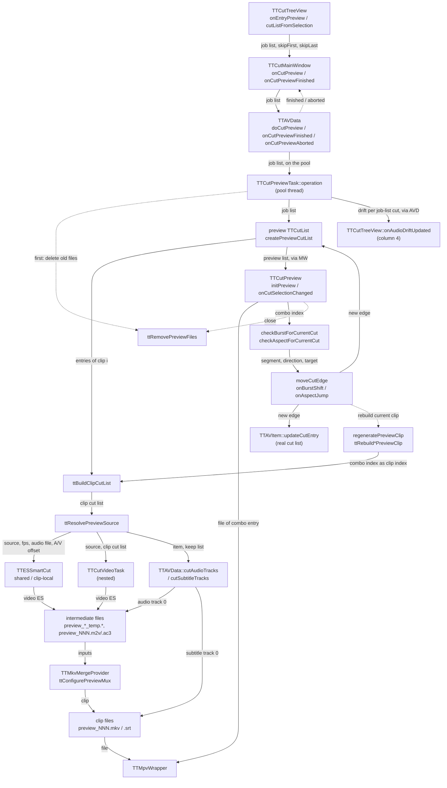

# Code Map: Cut preview

**Scope:** from the preview action in the cut list to the closed preview
dialog — how the job list becomes a list of short preview windows, how
`TTCutPreviewTask` turns each clip into `preview_NNN.mkv` in the temp
directory (MPEG-2 through a nested cut task, H.264/H.265 through a shared
Smart Cut engine), how the drift column gets its values, how the dialog
loads clips, shows the burst and aspect hints of the selected transition,
moves a cut edge and rebuilds one clip, and how the files are removed again.

**Neighbours, not part of this map:** where the job list comes from and what
`skipFirst`/`skipLast` mean to the selection ([cut-edit-and-start.md](cut-edit-and-start.md)),
the Smart Cut engine itself ([smart-cut.md](smart-cut.md)), the MPEG-2 cut
engine ([mpeg2-cut.md](mpeg2-cut.md)), the audio keep list, delay and drift
arithmetic ([audio-cut-timing.md](audio-cut-timing.md)), the muxer
configuration ([output-mux.md](output-mux.md)), mpv
([playback.md](playback.md)), progress brackets and cancel mechanics
([progress-reporting.md](progress-reporting.md)), the burst detector
([burst-detection.md](burst-detection.md)) and the aspect analysis
([detection-and-search.md](detection-and-search.md)).

## Data flow

Legend: solid arrows carry data (producer → consumer); dashed arrows are
triggers only.

Direction measured with `mmdc` (2026-09-25): `TD` viewBox ratio 0.57, `LR` 10.41.

## Edge semantics

| From → To | What crosses (data / order / invariant) |
|---|---|
| `TV` → `MW` | `previewCut(list, skipFirst, skipLast)`. `onEntryPreview` puts the selected cuts **plus their neighbours** into a fresh job list (`newJobCutList`, owned by the view, replaced by the next job); `skipFirst`/`skipLast` are true when the first/last list entry is only a neighbour. Selecting one cut in the middle therefore gives three entries and `skipFirst = skipLast = true`. |
| `MW` → `AVD` | `onCutPreview` stores the job list as `mpPreviewOriginalCutList` and the two flags, re-arms (disconnect, connect) `cutPreviewFinished` → `onCutPreviewFinished` and `cutAudioDriftCalculated` → `TTCutTreeView::onAudioDriftUpdated`, then `doCutPreview(list)`. |
| `AVD` → `TASK` | `doCutPreview` deletes the previous task, creates `TTCutPreviewTask(avData, jobList)`, connects `finished`, `audioDriftCalculated` and the pool's `aborted` → `onCutPreviewAborted`, `init(count * 2)`, `start`. The task owns its nested `TTCutVideoTask` and the preview list; it lives until the next preview starts or until `onCutPreviewAborted` deletes it — the dialog's pointer to the preview list relies on that. |
| `TASK` -.-> `CLEAN` | First thing in `operation()`: `ttRemovePreviewFiles` deletes **every** `preview*` file in `TTSettings::tempDirPath()`. |
| `TASK` → `PL` | `createPreviewCutList`: two entries per job cut. `previewFrames = cutPreviewSeconds · fps / 2` (half the setting per side). Entry 2k: `[cutIn, cutIn + previewFrames]`, the end moved forward past B-frames (`frameType == 3`) and clamped to the stream. Entry 2k+1: `[cutOut − previewFrames, cutOut]`, the start moved back to `findIDRBefore`. Frame numbers of the **first** entry's video stream decide the length for all. |
| `PL` → `BCL` | `ttBuildClipCutList(list, i)`: `numPreview = count / 2 + 1` clips. Clip 0 = entry 0 (first cut-in), clip i (0 &lt; i &lt; last) = entries `2i−1` and `2i` (cut-out of cut i, cut-in of cut i+1), last clip = entry `2(n−1)+1` (last cut-out). Entries keep their `avDataItem`, so a clip can span two videos. |
| `BCL` → `SRC` | `ttResolvePreviewSource` reads everything off clip entry 0: item, video stream, source file, suffix, frame rate (stream first, `.info` only when the stream has none), `.info` A/V offset, audio track 0 (`hasAudio`, `audioFile`). |
| `SRC` → `ENG` | H.26x: one shared `TTESSmartCut` for the whole run, `initialize(source, fps)` (full ES parse), preview preset and the stream's display-order map (`ttApplyPreviewEncoderSettings`). Registered in `mpActiveSmartCut` under `mSmartCutMutex` before the parse, so a cancel reaches it. If the shared init fails, `createH264PreviewClip` builds a clip-local engine per clip — never registered, so not cancellable. |
| `SRC` → `M2V` | MPEG-2: `cutVideoTask->init(preview_NNN.m2v, clipList)` and `threadTaskPool()->startNested` (synchronous, outside the pool queue; `onUserAbort` forwards the cancel to it). |
| `SRC` → `AUD` | `cutAudioTracks(item, {0}, keepList, normalizeAcmod, …, shouldAbort)` — track 0 only, keep list from `buildVideoKeepList(clipList, fps)`; `cutSubtitleTracks(item, {0}, …)` — subtitle 0 only. The audio file keeps the source suffix. |
| `ENG` / `M2V` / `AUD` → `TMP` | H.26x: `preview_video_temp.<suffix>` and `preview_audio_temp.<ext>` (fixed names, one at a time); MPEG-2: `preview_NNN.m2v` and `preview_NNN.<audio ext>`. The H.26x temp video is kept after the mux ("for debugging"); the audio is removed. |
| `AUD` → `CLIP` | `preview_NNN.srt` next to the clip; the dialog picks it up by name. |
| `TMP` → `MUX` | `ttConfigurePreviewMux`: video options for the stream and fps, `.info` A/V offset, the engine's output display order (H.26x), `setRequireAllInputs(false)` — a clip without its audio still gets made. MPEG-2 without audio skips the mux and renames the `.m2v` to `preview_NNN.mkv`. |
| `MUX` → `CLIP` | `preview_NNN.mkv`, `NNN` = clip index + 1. A failed mux throws `TTIOException` with `mErrorMessage` set. |
| `TASK` → `CTV` | After the last clip: `planAudioCut(track 0, buildVideoKeepList(jobList), delay of track 0).drifts` over the **job list**, emitted as `audioDriftCalculated`, relayed by `onCutPreviewAudioDrift` as `cutAudioDriftCalculated`. `onAudioDriftUpdated` writes value i into **row i** of the cut list. |
| `AVD` -.-> `MW` | Success: `onCutPreviewFinished` drops the abort connection and emits `cutPreviewFinished(previewList)`. Abort: `onCutPreviewAborted` deletes the task; empty `errorMessage()` = user cancel → `Canceled` bracket (arms `mCutOperationActive`), otherwise "Preview not possible" warning. `onCutPreviewFinished` never runs then; the next `onCutPreview` re-arms its connections. |
| `PL` → `DLG` | `onCutPreviewFinished` creates `TTCutPreview`, `initPreview(previewList, jobList, avData, skipFirst, skipLast)`, `exec()` (modal), deletes it, disconnects both signals. `initPreview` fills the combo (`Start`, `Cut i-(i+1)`, `End`, the first/last skipped per flag) with signals blocked; `mClipOffset = skipFirst ? 1 : 0`. The first load waits for `showEvent` + one event-loop turn (render context). |
| `DLG` → `PLAYER` / `CLIP` → `PLAYER` | `onCutSelectionChanged(iCut)`: file index `iCut + 1 + mClipOffset`, `.mkv` first, `.mpg` as fallback; `preview_NNN.srt` as `--sub-file` when non-empty; output channels pinned from audio 0; load paused on dialog open, playing on later selections. |
| `DLG` → `HINT` | Both checks get the **combo index** `iCut` and treat it as the clip index: 0 = cut-in of cut 1; otherwise entry `2·iCut − 1` (cut-out) first, then `2·iCut` (cut-in). Burst reads the preview entries, aspect reads the job-list cut (`originalCutItem(segmentIdx) = job[segmentIdx / 2]`). |
| `HINT` → `MOVE` | `mBurstSegmentIdx` / `mAspectSegmentIdx`, cut-in or cut-out, and for the aspect jump `mAspectTarget`. Burst shift: ±1 frame with a one-frame-cut guard; aspect jump: to the first/last picture of the cut's majority aspect. |
| `MOVE` → `MODEL` | `updateRealCutItem`: finds the real cut by `(cutIn, cutOut, avItem)` equality with the job-list copy and calls `TTAVItem::updateCutEntry` — the project's cut list changes. The shared video stream's position is saved and restored around the whole move + rebuild. |
| `MOVE` → `PL` | `applyEdgeMoveToLists`: the job-list copy and the preview entry get the new edge (`TTCutItem::update`, `TTCutList::update`) — the preview entry keeps its other end. |
| `MOVE` -.-> `REB` | `regeneratePreviewClip(combo index)`: GUI thread, modal `QProgressDialog` without cancel, `processEvents` per stage. Output file index `iCut + 1 + mClipOffset`. |
| `REB` → `BCL` | `ttBuildClipCutList(previewList, iCut)` — the combo index as clip index — then `ttRebuildMpeg2PreviewClip` (a stack `TTCutVideoTask` run through `threadTaskPool()->start(task, /*runSyncron=*/true)`, audio 0, mux or rename) or `ttRebuildSmartCutPreviewClip` (a new `TTESSmartCut`, full ES parse, same temp names, temp files removed after the mux). No subtitle cut. Afterwards reload paused and re-run both checks. |
| `DLG` -.-> `CLEAN` | `closeEvent` → `cleanUp`: stop the player, `ttRemovePreviewFiles`. |

## Assumptions, contracts & pitfalls

- **Clip arithmetic lives in five places** (`numPreview = count / 2 + 1`,
  `iPos = (i − 1)·2 + 1`): `ttBuildClipCutList`, `initPreview`,
  `checkBurstForCurrentCut`, `checkAspectForCurrentCut`,
  `regeneratePreviewClip`. The file index adds `mClipOffset`, the checks and
  the rebuild do not.
- **The preview list is not the job list.** Two entries per cut, each only
  a window of half the preview length around one edge. Analyses that need
  the whole cut (aspect) go back to the job list; burst reads the window.
- **Temp directory is shared state.** `ttRemovePreviewFiles` deletes every
  `preview*` file at task start and on dialog close; the H.26x temp names
  are fixed. A second TTCut-ng instance or harness on the same temp
  directory collides (TODO „Weitere geteilte Temp-Namen“).
- **Cancel reaches:** the shared engine (registered), the nested MPEG-2
  video task (forwarded), the audio cut (predicate), the clip loop (top of
  each iteration). **Not:** a clip-local fallback engine, the mux, the
  dialog's rebuild.
- **Error reporting differs by codec.** MPEG-2: a failed audio cut or mux
  throws with a message. H.26x: a failed mux throws; a failed audio cut
  only logs and the clip is muxed without audio; a failed local-engine init
  or an invalid source returns without a clip and without a message.
- **Pitfall — `preview_NNN.mkv` can be raw MPEG-2.** Without audio the
  `.m2v` is renamed, not muxed; mpv sniffs the content.
- **Pitfall — the dialog's `.mpg` fallback** can no longer match: the task
  writes `.mkv` for both codecs.

### Reading hypotheses for audit run 9

From reading only; each needs a runtime proof or refutation first.

- **H1 — with `skipFirst` the hints, the edge move and the rebuild work on
  the wrong clip.** The combo index is used as the clip index by
  `checkBurstForCurrentCut`, `checkAspectForCurrentCut` and
  `regeneratePreviewClip`, while the file index adds `mClipOffset`.
  `skipFirst` is the normal case of previewing one cut with its neighbours.
  Expected symptom: hints of the previous transition, a burst shift that
  moves the neighbour's edge, a rebuilt file with the wrong clip's content.
- **H2 — drift values of a neighbour preview land in the wrong rows.**
  The drifts are computed over the job list (selected cuts + neighbours)
  and written to rows 0…n−1 of the whole cut list; the cumulative drift also
  starts at the first job-list cut, not at the first project cut.
- **H3 — an aspect jump outside the preview window inverts the preview
  entry.** `applyEdgeMoveToLists` keeps the entry's other end; a target
  beyond it gives `cutIn > cutOut` for the rebuild.
- **H4 — a rebuilt clip keeps the old subtitle file.** Neither rebuild
  function cuts subtitles; `preview_NNN.srt` still covers the old range.
- **H5 — silent H.26x clip failures.** Local-engine init failure or an
  invalid source return without a clip; the task reports the clip as
  created and the dialog loads a missing file. A failed audio cut yields a
  clip without sound, logged only.
- **H6 — the audio-only cut's drift has no receiver.** `cutAudioDriftCalculated`
  is connected to the cut list only between `onCutPreview` and
  `onCutPreviewFinished`; `onAudioOnlyCutFinished` emits it outside that window.
- **H7 — the preview-length comment is off by a factor of two.**
  `createH264PreviewClip` says a clip is at most twice `cutPreviewSeconds`;
  the code gives each side half of it (`createPreviewCutList`), so a
  transition clip is one setting long, a start or end clip half of it.

## Redundancy / consolidation candidates

- **Clip production twice** (TODO.md P3)
  - sites: `data/ttcutpreviewtask.cpp:TTCutPreviewTask::operation` (MPEG-2 branch) + `:createH264PreviewClip`, `data/ttpreviewclip.cpp:ttRebuildMpeg2PreviewClip` + `:ttRebuildSmartCutPreviewClip`
  - shared purpose: one clip cut list → video, audio 0, mux → `preview_NNN.mkv`
  - status: documented → TODO.md P3; the two copies already differ in error handling, subtitles, temp cleanup and cancel (H4, H5)
- **Clip index arithmetic**
  - sites: `data/ttpreviewclip.cpp:ttBuildClipCutList`, `gui/ttcutpreview.cpp:initPreview`, `:checkBurstForCurrentCut`, `:checkAspectForCurrentCut`, `:regeneratePreviewClip`, `data/ttcutpreviewtask.cpp:operation`
  - shared purpose: clip count and the entry indices of clip i
  - status: consolidate → one mapping (combo index → clip index → entries/file index); the missing offset (H1) is exactly what a single mapping prevents
- **Preview file names**
  - sites: `data/ttcutpreviewtask.cpp:createPreviewFileName`, `gui/ttcutpreview.cpp:initPreview` and `:onCutSelectionChanged` (build `preview_%1.mkv` / `.srt` themselves), the fixed temp names in `createH264PreviewClip` and `ttRebuildSmartCutPreviewClip`
  - shared purpose: where a clip and its parts live
  - status: consolidate → `createPreviewFileName` for all; the temp names with P3 and the shared-temp TODO
