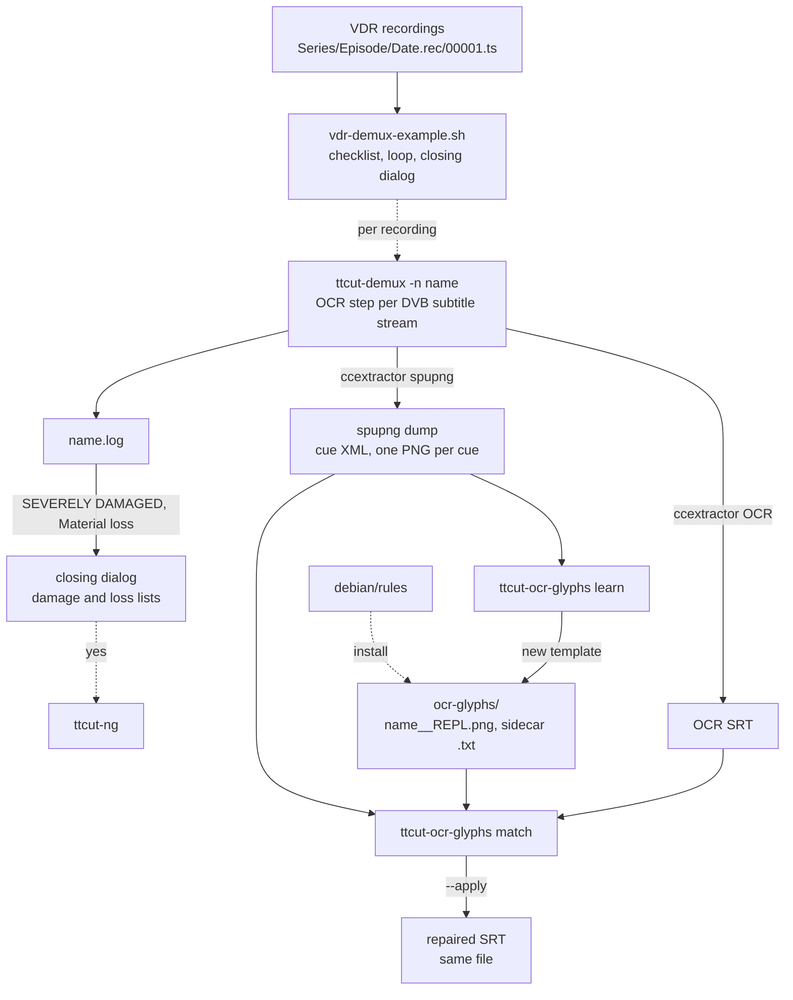

# Code Map: Demux helpers (glyph repair, VDR example)

**Scope:** two helpers around `tools/ttcut-demux`:
`ttcut-ocr-glyphs` — the deterministic repair of edge glyphs (music note) in
OCRed DVB subtitles, with its template library `tools/ttcut-demux/ocr-glyphs/`
— and `tools/vdr-demux-example.sh`, the anonymised template of a VDR demux
run (choose recordings, demux each, collect the damage findings, offer to
start TTCut-ng).

**Neighbours, not part of this map:** everything `ttcut-demux` does itself —
the subtitle export, the OCR run, the timing flags, the repair and the
damage model ([ttcut-demux.md](ttcut-demux.md); its subtitle row describes the
glyph repair from the caller's side). The author's own `VDR_Demux.sh` lives
outside the repository.

## Data flow

Legend: solid = data, dashed = trigger / configuration.

## Edge semantics

| From → To | What crosses (data / order / invariant) |
|---|---|
| `REC` → `VDR` | Every `*.rec` directory below `IN_PFAD` that holds `*.ts` or `*.vdr`; label = unmasked name of the directory above `.rec` (`vdr_unmask`: VFAT `#XX` escapes, `#23` last, `/` → `_`) plus the date from the `.rec` name. Checklist via `kdialog`, else `dialog`, else all. The first segment `00001.ts` (or `001.vdr`) is what is handed on; `ttcut-demux` finds the siblings itself. |
| `VDR` -.-> `DEMUX` | Sequential, foreground: `ttcut-demux -n "$show_name" <first segment> "$OUT_PFAD" > "$OUT_PFAD/$show_name.log" 2>&1`. No `--subs` (subtitle export off by default). The output name is the episode directory's name only — two recordings with the same name in one run write to the same files. `set -e` is on; a failing demux is counted, not fatal. |
| `DEMUX` → `LOG` → `SUM` | After each recording: the first `SEVERELY DAMAGED RECORDING` line (percent of missing pictures, audio gaps per minute) and the first `[WARN] Material loss:` line (text up to the first `-`) go into two lists; the closing `kdialog --yesno` carries both above “TTCut starten?”. `grep … || true` because of `set -e`. The log itself is shown coloured afterwards (`colorize_log`, `sed` on the plain file). |
| `SUM` -.-> `TT` | “yes” starts `ttcut-ng` (`command -v`, else the fallback path at the top of the script) in the background; a second dialog offers the logs of this run (`-newermt @SCRIPT_START`) in `kwrite`. |
| `DEMUX` → `SPU` | Inside the OCR step, after the SRT is sanitised and only when helper, template directory, `python3` and at least one PNG exist: a second ccextractor run with `--out=spupng --no-spupngocr --ignoreptsjumps -delay <same as OCR>`, from inside `spu_glyphs_tmp_<n>` with the dot-free name `cue` (ccextractor strips after the last dot of the whole path). Helper lookup: next to the script, else the source tree, templates else `/usr/share/ttcut-ng/ocr-glyphs`. |
| `DEMUX` → `SRT` | The sanitised OCR SRT (CRLF, markup kept) — see [ttcut-demux.md](ttcut-demux.md). |
| `SPU`, `SRT`, `TPL` → `MATCH` | `match --srt --spuxml cue --templates --delay-ms 0 --apply`; its stdout becomes `info "  glyph: …"` lines, **stderr is discarded**. Per spupng entry: the SRT cue with the nearest start within `TIME_SLACK_MS` = 400 ms; per line index K of that cue the K-th ink band of the PNG (rows with ink, split at empty rows); per band the first (start) and last (end) glyph group (split at gaps ≥ ¼ band height, at least 3 px). A glyph equals a template when both sizes differ by ≤ `SIZE_SLACK` = 2 px and ≥ `MATCH_RATIO` = 93 % of the common top-left area agree after binarising at 128. First matching template wins. |
| `MATCH` → `OUTSRT` | `fix_line` per matched edge: leading/trailing tags kept, line end kept (CRLF, LF, none). The edge character is replaced when it is not a word character, or when it is listed in the template's sidecar **and** stands alone; otherwise the glyph is inserted/appended and the text stays. Idempotent (a line that already carries the glyph is left). The file is rewritten only with `--apply` and at least one change. |
| `SPU` → `LEARN` → `TPL` | Manual: `learn --spuxml … --cue N (1-based spupng index, not SRT cue) --edge --line --out <dir>/<name>__<REPL>.png` crops the edge glyph of one bitmap; the sidecar `<stem>.txt` is written by hand (`2JF` for the note). Templates are renderer-specific (size gate). |
| `PKG` -.-> `TPL` | `debian/rules` installs the helper to `/usr/bin`, `ocr-glyphs/*.png` **and** `*.txt` to `/usr/share/ttcut-ng/ocr-glyphs`; a missing sidecar silently reduces the repair to non-word characters. |

## Assumptions, contracts & pitfalls

- **One timeline for dump and OCR:** both ccextractor runs use the same
  `-delay` and `--ignoreptsjumps`, and `--delay-ms 0` in `match`; different
  flags drift apart (1.28 s by minute 25, measured — see
  [ttcut-demux.md](ttcut-demux.md)).
- **Bitmap decides, text never does:** a matched template proves the glyph;
  an ambiguous word character is kept and the glyph inserted, so no word is
  ever lost. `ttcut-ocr-glyphs --selftest` checks these rules on 19 built-in
  cases without test material.
- **Example vs. author's script:** `vdr-demux-example.sh` and
  `~/Skripte/VDR_Demux.sh` share `vdr_unmask`, `colorize_log`, the damage
  and loss lists and the closing dialog; a fix in one is checked in the
  other. The author's script adds a subtitle choice (`--subs`/`--no-subs`),
  runs each demux in its own process group (`setsid`) with a progress file,
  and a DEV-build entry — the example deliberately waits in the foreground.

### Reading hypotheses for audit run 17

From reading; each needs proof first.

- **D1 — the example's TTCut fallback path is dead.** `TTCUT` falls back to
  `/usr/local/src/TTCut-ng/ttcut-ng`, the pre-CMake path (checked: the file
  does not exist; the author's script uses `build/ttcut-ng`).
- **D2 — two recordings with the same episode name overwrite each other.**
  `-n "$show_name"` and `$show_name.log` depend only on the directory above
  `.rec`; a repeat recording in the same episode directory lands on the same
  output files (in both scripts).
- **D3 — without Pillow the glyph repair is skipped silently.** The helper
  imports `PIL` at start; the call discards stderr and the package only
  suggests `python3-pil`.
- **D4 — `--selftest` is not a gate.** No `run-gates.sh` entry runs it.
- **D5 — SRT line K is paired with ink band K.** A bitmap whose ink splits
  into more or fewer bands than the OCR produced lines (umlaut dots above a
  lowercase line, two OCR lines merged) pairs an edge with the wrong line.
- **D6 — a neighbouring cue within 400 ms.** Two cues closer than
  `TIME_SLACK_MS` can pair a bitmap with the wrong cue.

## Redundancy / consolidation candidates

- **Tool lookup “installed, else source tree”**
  - sites: `tools/vdr-demux-example.sh` (top: `TTCUT`, `TTCUT_DEMUX`), `tools/ttcut-demux/ttcut-demux` (OCR step: `GLYPH_HELPER`, `GLYPH_DIR`)
  - shared purpose: find a companion program in the installed or the development layout
  - status: deliberate — two separate programs, one Bash line each; the example is a template for users
