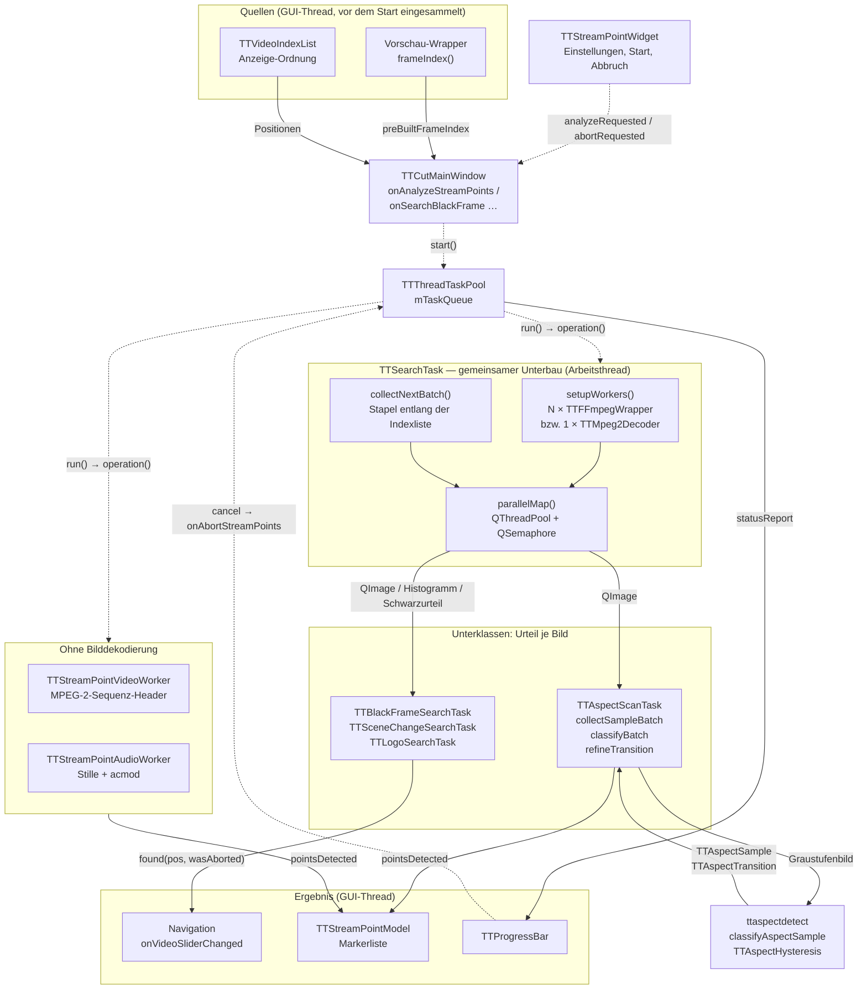

# Erkennung und Suche: ein Dekodier-Unterbau, zwei Ergebnisformen

Alle automatischen Bildanalysen der Anwendung sitzen auf **einer** Basisklasse,
`TTSearchTask`. Sie liefert das Dekodieren (N parallele Dekoder, geteilter
Bildindex, Stapelbildung entlang der Indexliste); die Unterklassen liefern nur
das Urteil über ein Einzelbild.

Die Familie zerfällt nach **Ergebnisform**, nicht nach Codec:

| Form | Signal | Abbruch bei | Klassen |
|---|---|---|---|
| **Gerichtete Suche** — „nächster Treffer ab hier" | `found(pos, wasAborted)` | erstem Treffer | `TTBlackFrameSearchTask`, `TTSceneChangeSearchTask`, `TTLogoSearchTask` |
| **Voll-Scan** — „alle Wechsel im Strom" | `pointsDetected(QList<TTStreamPoint>)` | Dateiende | `TTAspectScanTask` |

Daneben stehen zwei Analysen, die **kein** Bild dekodieren und deshalb nicht von
`TTSearchTask` erben, aber in denselben Aufgaben-Pool und dieselbe Marker-Liste
münden: `TTStreamPointVideoWorker` (MPEG-2-Sequenz-Header) und
`TTStreamPointAudioWorker` (Stille, AC3-Formatwechsel).

**Der Bildindex wird nie zweimal gebaut.** Jeder Aufruf zieht ihn aus dem
Vorschau-Wrapper (`currentFrame->videoWindow()->ffmpegWrapper()->frameIndex()`)
und reicht ihn als `preBuiltFrameIndex` durch. Das spart ~2 s je Lauf — und ist
für H.264/H.265 **Voraussetzung**, nicht Optimierung (siehe Fallstricke).

## Datenfluss

**Legende:** durchgezogene Kante = *Daten fließen*; gestrichelte Kante = *löst
aus* (Kontrollfluss, keine Nutzdaten).

## Kanten-Semantik

| Kante | Bedeutung | Fallstrick |
|---|---|---|
| `PREV → MW → Task` (`preBuiltFrameIndex`) | Kopie der `QList<TTFrameInfo>` des Vorschau-Wrappers. Leer ⇒ jeder Sub-Dekoder ruft `buildFrameIndex()` selbst. | Bei H.26x ist die Liste die **einzige** Quelle für Anzeige↔Dekodier-Zuordnung. Ein Worker ohne Index gibt aus `decodeFrame()` leere `QImage` zurück — genau der zweite der beiden Ur-Defekte der Pillarbox-Erkennung. |
| `IDX → collectNextBatch/collectSampleBatch` | Positionen stammen aus `moveToNextIndexPos`/`moveToPrevIndexPos`, also **Anzeige**-Positionen für alle Codecs. | Nicht in Dekodier-/AU-Indizes umrechnen. Die ganze Kette (Positionsauswahl → `decodeFrame` → `found`/`pointsDetected` → `onVideoSliderChanged`) ist durchgehend anzeigeordnungs-konsistent. |
| `setupWorkers → parallelMap` | N Wrapper mit `setAnalysisMode(true)` **und** `setSearchMode(true)`; `parallelMap` verteilt Index *i* fest auf Wrapper *i*. | `setSearchMode(true)` = direkter Keyframe-Sprung ohne DPB-Vorlauf. Gemessen 34 ms statt 111 ms je I-Frame — aber Open-GOP-B-Bilder unmittelbar nach dem Sprung sind dabei nicht garantiert korrekt. Für Stichproben-Analysen belanglos, für Standbildanzeige **nicht** (dort ist der Vorlauf Pflicht, siehe `frame-order.md`). |
| `parallelMap` Worker-Zahl | `TTSettings::searchWorkerCount()`, 0 = automatisch (`idealThreadCount()/2`, gedeckelt 4), geklemmt auf [1, 16]. | MPEG-2 wird hart auf `mWorkerCount = 1` gesetzt — libmpeg2-Dekoder sind nicht mehrfach instanziierbar. Für MPEG-2 fällt `parallelMap` deshalb in den Inline-Zweig. |
| `ASPECT → PURE` | `classifyAspectSample()` bekommt ein `Format_Grayscale8`-Bild und liefert drei Werte: `Pillarbox`, `NoPillarbox`, `NoStatement`. | `NoStatement` ist **kein** Fehlerwert, sondern die Aussage „dieses Bild darf den Zustand nicht bewegen": Schwarzbild (mittlere Luminanz ≤ 20) oder Dekodierfehler. Die Hysterese ignoriert solche Proben, statt den Kandidatenlauf zurückzusetzen. |
| `PURE → ASPECT` (`TTAspectTransition`) | Die Hysterese meldet einen Wechsel erst, wenn der neue Zustand `10 s × fps` Frames durchgehalten hat; `firstFrame` ist die **erste** Probe des Laufs, nicht die bestätigende. | Der Stichprobenabstand darf das Hysteresefenster nicht überschreiten, sonst ist die Hysterese wirkungslos. Seit `aed01838` klemmt der Konstruktor `mSampleStride` auf das Fenster; beide Seiten lesen `kHysteresisWindowSeconds`. |
| `ASPECT.refineTransition` | Zweiter, engerer Durchlauf über **jeden** I-Frame zwischen der letzten Probe des alten Zustands und `firstFrame`; liefert den ersten Frame mit dem gesuchten Zustand. | Ohne den Nachlauf wäre der Marker nur auf den Stichprobenabstand genau. Der Nachlauf läuft nur über I-Frames — auf Bildgenauigkeit *zwischen* zwei I-Frames kommt er nicht. |
| `DIR → found(pos, wasAborted)` | Ein Signal für beide Ausgänge: `pos ≥ 0` Treffer, `pos = -1` kein Treffer. Das zweite Argument trennt „nichts gefunden" von „abgebrochen". | Bei `-1` springt die GUI auf `mLastSearchStartPos` zurück, damit der Abbruch die Anzeige nicht verschiebt. |
| `SCAN → pointsDetected` | Wird **auch bei Abbruch** ausgesendet, mit den bis dahin gefundenen Punkten. | Bewusst: Teilergebnisse sind brauchbar. Die Statuszeile des Widgets kennzeichnet den Lauf über `setAnalysisRunning(false, aborted)` als unvollständig. |
| `POOLQ → BAR` (`statusReport`) | Jede Aufgabe meldet `Init`/`Start`/`Step`/`Finished`; der `Start`-Zweig in `onStatusReport` öffnet den Dialog. | Zwei Aufgaben ⇒ zwei `Start`. Das Kreuz des Dialogs bricht deshalb ab (`closeEvent → onBtnCancelClicked`, `7d6dad0d`): reines Verstecken hätte die zweite `Start`-Meldung wieder aufgezogen. |
| `BAR.cancel → onAbortStreamPoints` | Nicht direkt an den Pool, sondern über die Fenstermethode, damit `mStreamPointAnalysisAborted` gesetzt wird. | Ohne dieses Flag meldet das Widget einen abgebrochenen Lauf als normal beendet. |
| `finished` **und** `aborted` → `deleteLater` | `TTThreadTask::run()` wirft `TTAbortException`, wenn die Aufgabe schon vor dem Start abgebrochen wurde — dann kommt **nur** `aborted`, nie `finished`. | Nur `finished` zu verbinden leckt jede vor dem Start abgebrochene Aufgabe. `TTAspectScanTask` verbindet beide; die drei gerichteten Suchen verbinden bis heute nur `finished` (offen, siehe Redundanz). |

## Varianten-Matrix

| | MPEG-2 (`mpeg2_demuxed_video`) | H.264 / H.265 |
|---|---|---|
| Dekoder | 1 × `TTMpeg2Decoder` (libmpeg2, RGB32) | N × `TTFFmpegWrapper` |
| Parallelität | keine (`mWorkerCount = 1`, Inline-Zweig) | N (Voreinstellung ≤ 4) |
| Bildindex | `TTVideoIndexList` + `TTVideoHeaderList` aus dem Parser | `preBuiltFrameIndex` bzw. `buildFrameIndex()` |
| Header-Liste | vorhanden (`ttmpeg2videostream.cpp:73`) | **null** — `TTH26xVideoStream` legt keine an |
| Seitenverhältnis über Header | ja (`TTStreamPointVideoWorker`, liest `aspect_ratio_information`) | nein — Elementarströme tragen keine Sequenz-Header |
| Pillarbox über Bildanalyse | ja | ja |
| Schwarzbild-Prüfung | Eigenimplementierung in `TTSearchTask::isFrameBlackAt` | `TTFFmpegWrapper::isFrameBlack` |

Die Zeile „Header-Liste" ist der **erste** der beiden Ur-Defekte: bis
`1f1797d9` hing der gesamte Video-Worker an `videoHeaders->size() > 0`, womit
die Pillarbox-Erkennung für H.264/H.265 nie startete. Die beiden Erkennungen
sind seither getrennt verdrahtet — Header-Seitenverhältnis an
`spDetectAspectChange()` **und** eine nicht-leere Header-Liste, Pillarbox an
`spDetectPillarbox()` **und** eine nicht-leere Indexliste.

## Der Klassifizierer im Detail

`classifyAspectSample()` (`data/ttaspectdetect.cpp`), reine Funktion, ohne Qt-GUI
testbar (`tools/diag/test_aspectdetect`):

1. Messband = mittlere 40 % der Bildhöhe (`0.30 h … 0.70 h`).
2. Spalte gilt als schwarz, wenn ≥ 90 % der jeden zweiten abgetasteten Zeilen
   unter dem Luminanz-Schwellwert liegen (Voreinstellung 20).
3. Von beiden Rändern nach innen zählen, bis die erste nicht-schwarze Spalte
   kommt. Beide Balken müssen ≥ 10 % der Bildbreite messen.
4. **Gegenprobe in der Mitte**: liegt die mittlere Luminanz zwischen den Balken
   bei ≤ 20, ist es `NoStatement` — sonst läse ein Schwarzbild als Pillarbox,
   weil seine „Balken" in der Mitte zusammenstoßen. Das spiegelt
   `TTFFmpegWrapper::isFrameBlack`, das seinerseits die äußeren 10 % ignoriert.

Der Schwellwert ist ein **Bild**-Wert (swscale-Ausgabe, Schwarz = 0), nicht der
Videobereichs-Y-Wert des Stroms (Schwarz ≈ 16).

## Fallstricke

- **Dekodier- gegen Anzeige-Ordnung.** `TTFFmpegWrapper::frameIndex()` ist in
  **Dekodier**-Reihenfolge; `decodeFrame()` erwartet eine **Anzeige**-Position.
  Wer über `frameIndex()` iteriert und die Einträge an `decodeFrame()` gibt,
  misst falsch. Genau das tat die erste Fassung von `tools/diag/test_pillarbox`
  und lieferte 49726 statt 49719 (behoben in `61c36f5c`).
- **Zu kleines Messfenster.** Vor jeder Aussage „der Wechsel ist bei Frame X"
  prüfen, ob der neue Zustand *anhält*. Auf `pb43.m2v` liegt bei 715 ein
  1,4-s-Pillarbox-Einschub, dann 3,0 s 16:9, der bleibende Wechsel erst bei 825
  — die Hysterese unterdrückt den Einschub absichtlich, 830 ist richtig, 722
  wäre falsch.
- **ffmpeg-`n` ≠ TTCut-Anzeigeindex bei MPEG-2.** Für `pb43.m2v` Versatz +2
  (135000 Indexeinträge gegen 134998 ffmpeg-Ausgabeframes = 2 verworfene
  führende B-Bilder). Gleiche Falle wie in `mpeg2-cut.md`.
- **Abbruch räumt synchron auf.** `TTThreadTaskPool::onUserAbortRequest()`
  bricht auch noch nicht gestartete Aufgaben ab, und `TTThreadTask::run()`
  prüft `mIsAborted` **vor** `operation()`. Eine abgebrochene Aufgabe meldet
  deshalb nie `Start`. Darauf ruht die Kreuz-gleich-Abbrechen-Lösung.
- **`onUserAbortRequest()` darf `finished` nicht trennen.** Genau dieser Slot
  nimmt die Aufgabe über `removeAll()` aus `mTaskQueue`; trennt man ihn und
  löscht die Aufgabe per `deleteLater`, behält der Pool einen toten Zeiger
  (Absturz, behoben in `e247dbda`, nachstellbar mit
  `tools/diag/test_pool_abort 16 400`). Die Schleife iteriert seither eine
  `QPointer`-Momentaufnahme, weil `TTThreadTask::abort()` selbst
  `processEvents()` ruft.
- **`cleanUp()` ist absichtlich leer.** Der Dekoder wird nur im Destruktor
  freigegeben (GUI-Thread über `deleteLater`). Ein Aufräumen im Arbeitsthread
  läuft ohne Happens-before-Kante gegen den Destruktor und kann doppelt
  freigeben.
- **Leerer Indexlisten-Fall meldet nichts.** `TTAspectScanTask::operation()`
  kehrt bei `mIndexList->count() == 0` zurück, ohne `onStatusReport` zu rufen;
  die GUI schirmt den Fall zwar ab, der Harness-Pfad aber nicht. Kleinigkeit,
  offen.

## Redundanz / offene Punkte

- Die drei gerichteten Suchen (`operation()` in `_blackframe`, `_logo`,
  `_scenechange`) haben denselben Rumpf: `setupWorkers` → erste Position →
  Schleife aus `collectNextBatch` + `parallelMap` + erster Treffer → `found` →
  `teardownWorkers`. Unterschied ist ausschließlich das Urteil pro Bild (und
  bei Logo/Szenenwechsel ein Anfangszustand aus Worker 0). Kandidat für eine
  Schablonenmethode `bool matchesAt(int pos, int workerIndex)` in der Basis.
- `TTSearchTask::isFrameBlackAt` und `buildHistogramAt` enthalten je eine
  MPEG-2-Zweitimplementierung dessen, was `TTFFmpegWrapper` für H.26x tut —
  inklusive der 10-%-Randmaske und der `step = 2`-Abtastung. Drei Kopien
  derselben Abtastregel im Baum (dazu `centreMeanLuma` in `ttaspectdetect.cpp`).
- Die drei gerichteten Suchen verbinden nur `finished → deleteLater`, nicht
  `aborted`. Gleiches Leck-Muster wie das in `TTAspectScanTask` behobene.
  Nicht beauftragt.
- `TTCutPreviewTask`/`TTCutVideoTask` rufen `pool->start()` aus Arbeitsthreads
  und verändern `mTaskQueue` threadübergreifend ohne Absicherung. Berührt
  denselben Pool wie diese Familie. Nicht beauftragt.

## Prüfwerkzeuge

| Werkzeug | Aufruf | Prüft |
|---|---|---|
| `tools/diag/test_aspectdetect` | ohne Argumente | Klassifizierer + Hysterese, synthetische Bilder |
| `tools/diag/test_aspectscan` | `<datei> <fps> <stichprobe_s> [erwarteter_frame]` | Voll-Scan über H.264/H.265 |
| `tools/diag/test_aspectscan_mpeg2` | `<datei> <stichprobe_s> [erwartete_anzahl]` | dito für MPEG-2 — **andere Argumentreihenfolge**, kein fps |
| `tools/diag/test_pillarbox` | `<datei> <fps> <von> <bis>` | Einzelbild-Klassifikation über den echten Dekodierpfad |
| `tools/diag/test_pool_abort` | `[anzahl] [millisekunden]` | Abbruch-Absturz aus `e247dbda` |
