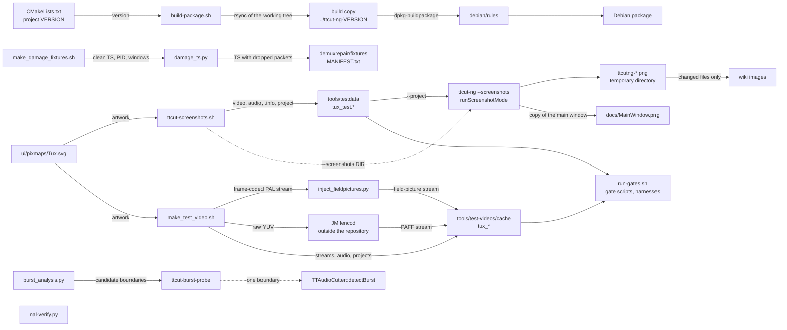

# Code Map: Developer tools (package, screenshots, test material, probes)

**Scope:** the scripts and small programs a developer runs by hand and that
are not shipped: the Debian package build (`build-package.sh`), the wiki
screenshot run (`tools/ttcut-screenshots.sh` with the application's
`--screenshots` mode), the two generators of test material
(`tools/test-videos/`), and three measuring aids for single questions
(`burst_analysis.py`, `ttcut-burst-probe`, `nal-verify.py`). Five separate
flows; they share the Tux artwork and the two fixture directories that the
gate runner reads.

**Neighbours, not part of this map:** the gates and harnesses themselves
(`tools/diag/`, table in `run-gates.sh`); the shipped tools
([ttcut-demux.md](ttcut-demux.md), [ttcut-ac3fix.md](ttcut-ac3fix.md),
[demux-helpers.md](demux-helpers.md), [quality-check.md](quality-check.md));
the detector the burst aids look at ([burst-detection.md](burst-detection.md));
what the screenshot mode does to the loaded project
([stream-open-project-load.md](stream-open-project-load.md),
[stream-points.md](stream-points.md)).

## Data flow

Legend: solid = data, dashed = trigger / configuration.

`nal-verify.py` has no edge: nothing in the repository calls it and it reads
only the file named on its command line.

## Edge semantics

| From → To | What crosses (data / order / invariant) |
|---|---|
| `VER` → `PKG` | The version is taken with `grep` from the single line `project(ttcut-ng VERSION …)`; an empty result ends the script. Package version = `VERSION+git<commit date>.<commit count>.<short hash>~<distribution>` — dots, no hyphen, because the source format is native. |
| `PKG` → `BDIR` | `rsync -a` of the **working tree**, not of the git index, into a sibling directory of the repository; an existing copy is removed first. Excluded by explicit rules: `.git`, objects, the three build directories, the test-video cache, `docs/`, and of `tools/diag` the binaries named `test_*` plus three named ones — sources (`.cpp`, `.sh`, `.py`, `.txt`) stay because `CMakeLists.txt` adds the directory. Before the copy `dch` writes a new entry into `debian/changelog`; an `EXIT` trap restores that file in the repository. The changelog text is asked for on stdin (empty or no terminal → "Git snapshot"). |
| `BDIR` → `RULES` → `DEB` | `dpkg-buildpackage -b` (binary only, unsigned) in the copy; `debian/rules` builds with CMake and Ninja in `build-deb` and installs the program and the shipped tools. The script then expects `../ttcut-ng_<version>_<arch>.deb` and lists its content; a missing file is exit 1. |
| `SVG` → `SHOT` → `TDATA` | From the Tux artwork: 120 s H.264 at 720×576, 25 fps (`tux_test.264`), an AC3 track of seven segments that alternate tone and silence and stereo (192 kbit/s) and 5.1 (384 kbit/s) (`tux_test.ac3`), a hand-written `.info` (`frame_rate=25/1`, one audio track, language `deu`) and a project from the template `tools/ttcut-test.ttcut` (three cuts, placeholders replaced by absolute paths). Video and audio are rebuilt only when missing or older than the SVG; `.info` and project are rewritten on every run. |
| `TDATA` → `APP`, `SHOT` ⇢ `APP` | `ttcut-ng --screenshots <dir> --project <file>`, started with `QT_QPA_PLATFORM=xcb`. `main` stores both values in `TTSettings` and calls `TTCutMainWindow::runScreenshotMode` after 500 ms. Without `--project` the mode quits at once. The script shows only output lines containing "Screenshot" and ignores the exit status. |
| `APP` → `PNG` | Window fixed to 1920×1080, project loaded (wait up to 30 s; a timeout is a warning, the run goes on), then one PNG per step: main window, frame pair, navigation, cut list, controls, landing zones after `onAnalyzeStreamPoints`, quick-jump dialog, every settings page, every cut-dialog tab, about dialog (`TTCutAboutDlg`), integrity warning, go-to-frame dialog, cut-complete box. The mode ends with `QApplication::quit()`. |
| `APP` → `DOCPNG` | Last step: `ttcutng-main.png` is copied to `docs/MainWindow.png` next to the binary's parent directory — a **tracked** file outside the output directory, on every run. |
| `PNG` → `WIKI` | The script compares each `ttcutng-*.png` byte for byte with the file of the same name in the output directory (default: the wiki's `images`) and copies only those that differ; the temporary directory is removed. |
| `TDATA` → `GATES` | `run-gates.sh` (`TESTDATA`) and six harnesses read `tools/testdata/tux_test.*`; the directory is gitignored, so those gates need one screenshot-script run first. |
| `SVG` → `MTV` → `CACHE` | Per variant a video stream, a 1 kHz stereo audio track (AC3 or MP2, 192 kbit/s) and a video-plus-audio project, all on one 120 s timeline (three colour segments with a moving Tux, three 1 s black gaps, a logo in the third segment, a test pattern) or the 30 s "duplicate" timeline (the same 10 s sequence twice). Variants: HEVC 4K, H.264 1080p progressive, 1080i MBAFF, 1080i PAFF, MPEG-2 576i, 720p, 576i with field pictures, a two-segment `.rec` directory; six duplicates. An output is reused when it exists, is not empty and is **newer than the script**; `--force` regenerates. A reused variant still gets its project rewritten. |
| `MTV` → `INJ` → `CACHE` | The frame-coded PAL stream; every 50th picture block is written twice with `picture_structure` set to top and to bottom field. Bitstream-valid, visually broken (same payload for both fields). |
| `MTV` → `JM` → `CACHE` | PAFF only: raw YUV of the timeline (about 7 GB, deleted afterwards) through the JM reference encoder with `paff.cfg`, limit two hours; the result must carry VUI and `field_pic_flag`. Without the encoder the variant is skipped with a message and exit 0. |
| `CACHE` → `GATES` | The gate runner and the gate scripts name the cache files directly (`V264`, `A264`, `MBAFF`, `PAFF`, `MP2`, …); a missing file makes a gate SKIP. `EXPECTED.md` holds the expected frame numbers of the search markers per file. The cache directory is gitignored and on this machine a symbolic link. |
| `MDF` → `DMG` → `DFIX` | Two clean 60 s transport streams (H.264 and MPEG-2, one video and two audio PIDs); `damage_ts.py` drops the packets of one PID whose PES time stamp lies in a window relative to that PID's first time stamp, continuation packets included. Three passes per stream (video, first audio, second audio), then `ffprobe` measures the gaps into `MANIFEST.txt`. The target directory is a fixed path under `CLAUDE_TMP`. |
| `BA` → `BP` | `burst_analysis.py scan` reads the RMS level per audio frame with ffmpeg `astats` and lists boundary times where the rebuilt window logic would or would not fire; `dump` prints the chunks around given cut indices. Its numbers are candidates; the README says the C++ tool decides. |
| `BP` ⇢ `DET` | `ttcut-burst-probe <audio> <seconds> [--cutin] [--min-delta dB]` calls the detector once and prints `present=1 burstDb=… contextDb=… delta=…` or `present=0`; exit 0 = burst, 1 = none, 2 = usage error. Built only on request (`EXCLUDE_FROM_ALL`), from `extern/ttaudiocutter.cpp` and three more sources. |

## Assumptions, contracts & pitfalls

- **Two fixture directories, two makers** — `tools/testdata` comes from the
  screenshot script, `tools/test-videos/cache` from `make_test_video.sh`;
  both are gitignored and both feed gates. Neither maker is called by the
  gate runner.
- **`build-package.sh` copies what is on disk** — a file that is neither
  tracked nor named in an exclude rule ends up in the build copy. The header
  comment records that harness binaries and a sanitizer build once made up
  1.9 GB of it.
- **The screenshot mode has a side effect outside its output directory**
  (`docs/MainWindow.png`); after a run `git status` shows the file as
  modified unless the main window is unchanged.
- **Screenshots depend on the fixed window size and on the fixture**, not
  on the screen; the cut dialog shows free disk space, which changes two
  images between runs of the same tree.
- **`make_test_video.sh` invalidates its whole cache when the script
  changes** (the "newer than the script" rule) — the PAFF variant then costs
  the JM run again.
- **`damage_ts.py` windows are relative to the damaged PID's own first time
  stamp**, so the same `--drop-at` on video and audio does not mean the same
  instant when the tracks start apart.
- **`burst_analysis.py` is a rebuild, not the detector** — window bounds,
  context median and the two tested chunks are written out again in Python.

### Reading hypotheses for audit run 20 (not measured)

- **T1** `nal-verify.py`: the two external decoders are looked up with
  `os.path.exists` on a bare program name and so are skipped unless an
  absolute path is given in the environment; the documented arguments (NAL
  offset, `--transform`, `--transition`) are not read; four functions have
  no caller.
- **T2** `burst_analysis.py` and both READMEs name `extern/ttffmpegwrapper.cpp`
  as the place of the window logic (it is `extern/ttaudiocutter.cpp`); the
  probe's README does not list `--min-delta` and says the build recompiles
  the wrapper. Open: does the rebuilt logic still agree with the detector.
- **T3** `make_damage_fixtures.sh` has no caller, and nothing in the
  repository reads `demuxrepair/fixtures`.
- **T4** `make_test_video.sh`: the Tux artwork is an absolute path; header
  and `EXPECTED.md` speak of six videos; the usage text lacks three
  arguments; the note about hand-made `.info` files.
- **T5** `ttcut-screenshots.sh`: a failing application run looks like
  "0 updated"; `xcb` opens a window although the mode runs offscreen; the
  fallback to `/tmp`.
- **T6** `build-package.sh`: which untracked files reach the build copy
  today, and how large is it.
- **T7** `inject_fieldpictures.py`: `find_next_start_code` has no caller.

## Redundancy / consolidation candidates

- **Tux test audio with tone, silence and a layout change**
  - sites: `tools/ttcut-screenshots.sh:gen_ac3_segment`, `tools/test-videos/make_test_video.sh:gen_audio`, `tools/diag/run-gates.sh:make_mixed_ac3`
  - shared purpose: synthetic AC3/MP2 tracks from ffmpeg `lavfi` sources
  - status: kept separate → three different tracks for three purposes (silence and layout switches for the landing-zone screenshots, a steady tone for the search fixtures, layout switches at one frame size for the audio gates)
- **Project file written by a script**
  - sites: `tools/ttcut-screenshots.sh` (template `tools/ttcut-test.ttcut` through `sed`), `tools/test-videos/make_test_video.sh:write_ttcut_project`
  - shared purpose: a `.ttcut` file with absolute paths for a generated fixture
  - status: kept separate → the screenshot project carries three cuts from a template, the cache projects none
- **Burst window logic**
  - sites: `extern/ttaudiocutter.cpp:TTAudioCutter::detectBurst`, `tools/burst-analysis/burst_analysis.py:window_bounds`, `tools/burst-analysis/burst_analysis.py:chunks_in_window`
  - shared purpose: which audio frames belong to the window at a cut boundary and which of them are tested
  - status: kept separate → the Python copy exists to scan a whole stream without the detector; audit run 20 checks that both still agree (T2)
