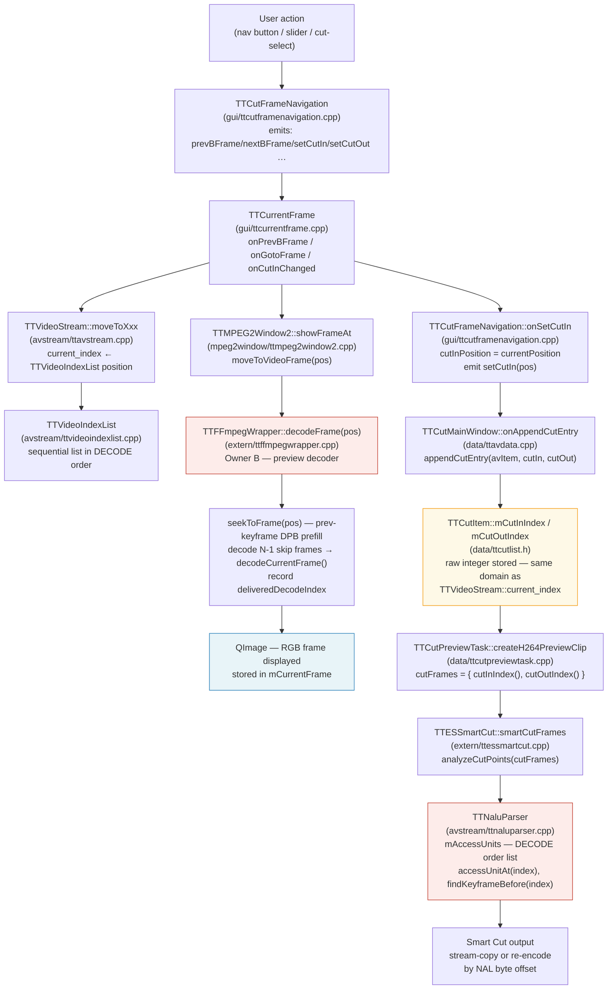

# Code Map: Frame-Order Pipeline

**Scope:** In which frame-order domain (decode order vs display order) does each
component work, and where do the still-image display path and the Smart Cut
execution path diverge? The central diagnostic question is: why does the Cut-In
still-image preview show a different frame than the one that ends up in the output?

## Data flow

## Edge semantics

One row per boundary in the diagram. The order-domain column is the critical fact.

| From → To | What crosses | Order domain |
|---|---|---|
| `TTCutFrameNavigation::onSetCutIn()` → `TTCurrentFrame` slot | `currentPosition` — the integer last stored by `checkCutPosition(avData, pos)` | **DECODE order** (see below) |
| `TTVideoStream::moveToXxx()` → caller (TTCurrentFrame, TTCutOutFrame) | return value = `current_index` = position in `TTVideoIndexList` | **DECODE order** for H.26x; **display order** for MPEG-2 after `sortDisplayOrder()` |
| `TTVideoIndexList::moveToNextIndexPos(pos, type)` → TTVideoStream | next list position ≥ pos+1 matching frame type | **DECODE order** for H.26x (list built frame-by-frame from `mFrameIndex`, no POC sort); **display order** for MPEG-2 (list is sorted by `display_order` via `sortDisplayOrder()`) |
| `TTCurrentFrame` → `TTMPEG2Window2::showFrameAt(newFramePos)` | integer `newFramePos` — the return value of the `moveTo*` call | **DECODE order** (H.26x); **display order** (MPEG-2) |
| `TTMPEG2Window2::moveToVideoFrame(iFramePos)` → `TTFFmpegWrapper::decodeFrame(iFramePos)` | integer `iFramePos` interpreted as index into `mFrameIndex` (Owner B) | **DECODE order** — `mFrameIndex` was built by scanning packets sequentially (decode order) |
| `TTFFmpegWrapper::decodeFrame(n)` → caller | `QImage` of the frame that libav's decoder delivers when stepping through decode positions up to n; **NOT necessarily the frame whose display-time equals n/fps** | **Frame delivered is at DECODE position n** — under B-frame reorder this is DISPLAY frame n+delay (or n-delay depending on direction) |
| `TTFFmpegWrapper::decodeFrame(n)` → `mFrameIndex[n].deliveredDecodeIndex` | true decode-order index of the picture actually emitted by `avcodec_receive_frame`; differs from n when B-frame reorder applies | DECODE order tag set at packet-send time; maps packet-send-order → delivered-display-frame |
| `TTCutFrameNavigation::onSetCutIn()` → `TTCutItem::mCutInIndex` (via `appendCutEntry`) | `currentPosition` as plain `int` | **DECODE order** (same value that TTCurrentFrame received from `moveTo*`) |
| `TTCutItem::cutInIndex()` → `TTCutPreviewTask::createH264PreviewClip` | `mCutInIndex` | **DECODE order** |
| `TTCutPreviewTask` → `TTESSmartCut::smartCutFrames(cutFrames)` | `QList<QPair<int,int>>` of (cutIn, cutOut) integer positions | **DECODE order** — passed directly as `seg.startFrame` / `seg.endFrame` |
| `TTESSmartCut::analyzeCutPoints` → `TTNaluParser::accessUnitAt(index)` | `index` into `mAccessUnits` | **DECODE order** — TTNaluParser builds its AU list in bitstream order (no POC reordering); `TTAccessUnit::index` is a sequential counter, not a POC-sorted display position |
| `TTNaluParser::accessUnitPtr(index, size)` → Smart Cut write path | byte offset + size of NAL units at decode position `index` | **DECODE order** → byte position in file (correct for stream-copy) |
| `TTCutFrameNavigation::checkCutPosition(avData, pos)` ← `TTCutMainWindow::onNewFramePos(pos)` | explicit `pos` parameter; stored as `currentPosition` | **DECODE order** (same pos returned by `moveToXxx` in TTCurrentFrame) |
| `TTCurrentFrame::onPlayVideo()` → `mPlayer->load(…, startSec)` | `startSec` corrected via `deliveredDecodeIndex / frameRate` for H.26x | **DISPLAY order** — `deliveredDecodeIndex` is the decode tag of the frame actually shown, mapping it to its correct display-time in the temp MKV |

## Assumptions, contracts & pitfalls

- **`TTVideoIndexList` (H.26x)** — assumes: built from `mFFmpeg->frameIndex()` in the order packets were demuxed (decode order); `display_order` field is set to the same sequential counter as the list position (`vidIndex->setDisplayOrder(i)` in `createIndexList`), so `displayOrder(i) == i` always for H.26x. There is no POC-based reordering. Pitfall: the field is named `display_order` but for H.26x it carries a decode-order index.

- **`TTVideoIndexList` (MPEG-2)** — `sortDisplayOrder()` IS called after building the list; the list is then sorted by the `display_order` field from the MPEG-2 picture headers. Navigation then walks in display order. `current_index` and all returned positions are display-order indices.

- **`TTFFmpegWrapper::decodeFrame(n)`** — assumes: `n` is a decode-order index into `mFrameIndex`. Guarantees: returns the QImage delivered by the libav decoder for the packet at decode position n, which under B-frame reorder is the frame whose DISPLAY time is `n + reorderDelay`. Does NOT return display-frame n. Pitfall: the caller (TTMPEG2Window2) and the cut-list both use the same integer n, but they interpret it differently — display shows the wrong picture when B-frames are present.

- **`TTCutItem::mCutInIndex / mCutOutIndex`** — assumes: stores whatever integer TTCurrentFrame had as `currentPosition` at the moment the user pressed Set Cut-In / Set Cut-Out. No conversion is performed. Pitfall: for H.26x this is a decode-order index; for MPEG-2 it is a display-order index. The Smart Cut path receives the H.26x index and passes it to TTNaluParser which also uses decode order — so the H.26x cut execution is **consistent in decode order**.

- **`TTNaluParser::mAccessUnits`** — assumes: populated in bitstream (decode) order. `TTAccessUnit::index` is a sequential counter assigned during `buildAccessUnits()`, not a POC-sorted display index (despite the header comment saying "display order based on POC" — that comment is misleading; POC values are parsed but no sort by POC is performed). `findKeyframeBefore(n)` and `findKeyframeAfter(n)` scan linearly in decode order.

- **`TTFFmpegWrapper::seekToFrame(n)`** — does NOT seek to the keyframe of the GOP that displays at position n. It seeks to the keyframe of the GOP that **decodes at or before** position n (one further keyframe back in non-search mode for DPB prefill). This is correct for decode-order access but means the visible frame may differ from the frame the user selected if B-frame reorder is large.

- **`deliveredDecodeIndex`** — lazily filled on first `decodeFrame()` call; -1 until decoded. The `onPlayVideo()` path falls back to `currentIndex/frameRate` if -1, which points to the wrong time when B-frames are present.

- **`TTCutFrameNavigation::checkCutPosition(avData, pos)`** — receives an explicit `pos` parameter (the same value returned by `moveToXxx` in TTCurrentFrame) and stores it as `currentPosition`. The fix in v0.61.2 ensures this value is never re-read from the shared `videoStream->currentIndex()` after a signal cascade. `onSetCutIn()` emits `setCutIn(cutInPosition)` where `cutInPosition` equals the `currentPosition` set by the last `checkCutPosition` call.

## Order-domain summary per path

| Path | Which frames are accessed | Index domain | Consistent? |
|---|---|---|---|
| **Still-image display** (H.26x) | `decodeFrame(n)` delivers frame at decode position n; with B-frame reorder this is NOT display-frame n | DECODE order throughout | Internal: yes. Vs user expectation (display frame n): **NO** — shows decode-position n, not display-position n |
| **Still-image display** (MPEG-2) | `TTVideoIndexList` sorted by display order; index positions ARE display-frame numbers | DISPLAY order throughout | Yes |
| **Cut-point setting** (H.26x and MPEG-2) | Stores the integer returned by `moveToXxx` in `mCutInIndex`/`mCutOutIndex` | DECODE order (H.26x); DISPLAY order (MPEG-2) | Internally consistent per codec; mirrors the same integer that the display path used |
| **Smart Cut execution** (H.26x) | `TTNaluParser::mAccessUnits[index]` indexed by `mCutInIndex` from TTCutItem | DECODE order | Yes — TTNaluParser is also decode-order; cut and parser agree |

## The B-frame display bug

The still-image preview bug (Cut-In shows the wrong frame) is a consequence of the
display path using decode-order indices with a libav decoder that delivers in display
order:

1. User navigates to a B-frame that appears at display-position D.
2. Under B-frame reorder, that B-frame was encoded at decode-position D-k (k = reorder delay).
3. `moveToNextFrame()` returns decode-position D, stored as `current_index`.
4. `decodeFrame(D)` seeks to the keyframe before decode-position D and steps forward, delivering the display-order frame that libav emits at decode step D. This is NOT display-frame D; it is the frame that would be displayed at position D if PTS were assigned in decode order — which for B-frames is a different picture than the one whose POC == D.
5. The still-image widget shows this "wrong" picture.
6. `mCutInIndex` is set to decode-position D. The Smart Cut engine also uses decode-position D as its start frame in TTNaluParser — so the **cut itself** happens at the correct byte boundary in the stream (decode-order D is the correct NAL offset). The still-image is misleading but the cut is correct.

**In short:** the display is decode-order indexed, the decoder delivers display-order frames, and B-frame reorder causes a position mismatch. The cut execution does not have this bug (it works entirely in decode order via TTNaluParser). The bug is purely in the still-image presentation.

For MPEG-2 the bug does not occur because the index list is sorted to display order before any navigation, so `current_index` IS display-frame n.

## Redundancy / consolidation candidates

- **Frame-index construction** (`TTH26xVideoStream::createHeaderList` → `mFFmpeg->buildFrameIndex()`) and (`TTMPEG2Window2::openVideoStream` → Owner B `mpFFmpegWrapper`): Both previously scanned the entire file. Resolved in v0.72.0 by Owner A → Owner B index sharing via `provideFrameIndexTo()` (Qt COW, O(1)). Owner C (search sub-decoders) also adopts via the same mechanism. No longer redundant.

- **Decode-order-to-display-order conversion**: Three separate ad-hoc corrections exist for mapping between decode-order indices and display-time seconds:
  - `onPlayVideo()` uses `deliveredDecodeIndex / frameRate` (H.26x playback seek).
  - `onPlaybackFinished()` uses `lastRenderedTimePos * frameRate` + MPEG-2 field-picture fixup (stop position).
  - `onPlaybackPositionChanged()` uses `seconds * frameRate` (live display during playback).
  None of these corrections is applied to the still-image display path itself. A shared helper `decodeIndexToDisplaySeconds(int decodeIdx)` and `displaySecondsToDecodeIndex(double seconds)` would reduce duplication and make a future fix to the still-image display easier.

- **MPEG-2 field-picture extra-index correction** appears in both `onPlayVideo()` and `onPlaybackFinished()` (binary-search into `mpeg2vs->extraIndices()`). Same logic, duplicated. Consolidation candidate: a method on `TTMpeg2VideoStream` that converts between raw index and display-frame index.
