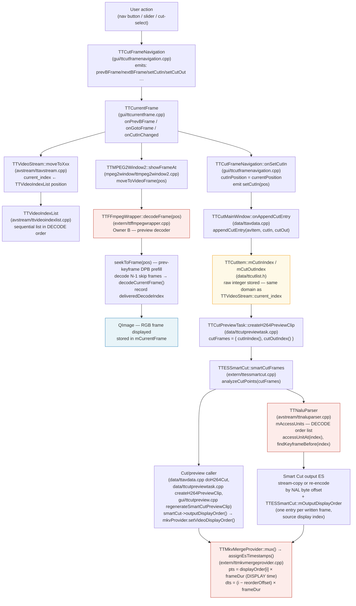

# Code Map: Frame-Order Pipeline

**Scope:** In which frame-order domain (decode order vs display order) does each
component work, and where do the still-image display path and the Smart Cut
execution path diverge? The central diagnostic question is: why does the Cut-In
still-image preview show a different frame than the one that ends up in the output?

## Data flow



## Edge semantics

One row per boundary in the diagram. The order-domain column is the critical fact.

| From → To | What crosses | Order domain |
|---|---|---|
| `TTCutFrameNavigation::onSetCutIn()` → `TTCurrentFrame` slot | `currentPosition` — the integer last stored by `checkCutPosition(avData, pos)` | **DECODE order** (see below) |
| `TTVideoStream::moveToXxx()` → caller (TTCurrentFrame, TTCutOutFrame) | return value = `current_index` = position in `TTVideoIndexList` | **DECODE order** for H.26x; **display order** for MPEG-2 after `sortDisplayOrder()` |
| `TTVideoIndexList::moveToNextIndexPos(pos, type)` → TTVideoStream | next list position ≥ pos+1 matching frame type | **DECODE order** for H.26x (list built frame-by-frame from `mFrameIndex`, no POC sort); **display order** for MPEG-2 (list is sorted by `display_order` via `sortDisplayOrder()`) |
| `TTCurrentFrame` → `TTMPEG2Window2::showFrameAt(newFramePos)` | integer `newFramePos` — the return value of the `moveTo*` call | **DECODE order** (H.26x); **display order** (MPEG-2) |
| `TTMPEG2Window2::moveToVideoFrame(iFramePos)` → `TTFFmpegWrapper::decodeFrame(iFramePos)` | integer `iFramePos` interpreted as index into `mFrameIndex` (Owner B) | **DECODE order** — `mFrameIndex` was built by scanning packets sequentially (decode order) |
| `TTFFmpegWrapper::decodeFrame(n)` → caller | `QImage` shown in the still-image widget | **Shows the DISPLAY-RANK frame, not decode-frame n (KNOT RESOLVED 2026-06-08)** — `decodeFrame(n)` seeks to the keyframe and runs a skip-loop that counts **decoder *output* frames (display order)** until `mDecoderFrameIndex == n`. So `n` is a *decode-order* index, but the content shown is the frame at *display rank* (n − seekKeyframe) within the GOP. Near GOP boundaries this looks display-accurate; the true AU shown is `deliveredDecodeIndex[n]`. |
| `TTFFmpegWrapper::decodeFrame(n)` → `mFrameIndex[n].deliveredDecodeIndex` | true decode-order index of the picture actually emitted by `avcodec_receive_frame`; differs from n when B-frame reorder applies | DECODE order tag set at packet-send time; maps packet-send-order → delivered-display-frame |
| `TTCutFrameNavigation::onSetCutIn()` → `TTCutItem::mCutInIndex` (via `appendCutEntry`) | `currentPosition` as plain `int` | **DECODE order** (same value that TTCurrentFrame received from `moveTo*`) |
| `TTCutItem::cutInIndex()` → `TTCutPreviewTask::createH264PreviewClip` | `mCutInIndex` | **DECODE order** |
| `TTCutPreviewTask` → `TTESSmartCut::smartCutFrames(cutFrames)` | `QList<QPair<int,int>>` of (cutIn, cutOut) integer positions | **DISPLAY order (since v0.72.0)** — `analyzeCutPoints` converts to AU via `mDisplayMap.displayToDecode()`; `seg.startDisplay/endDisplay` hold the display positions, `seg.startFrame/endFrame` the derived AUs. (Rows below describing nav/cut indices as "DECODE order" are pre-v0.72.0; superseded by the RESOLVED note under the table.) |
| `TTESSmartCut::analyzeCutPoints` → `TTNaluParser::accessUnitAt(index)` | `index` into `mAccessUnits` | **DECODE order** — TTNaluParser builds its AU list in bitstream order (no POC reordering); `TTAccessUnit::index` is a sequential counter, not a POC-sorted display position |
| `TTNaluParser::accessUnitPtr(index, size)` → Smart Cut write path | byte offset + size of NAL units at decode position `index` | **DECODE order** → byte position in file (correct for stream-copy) |
| `TTCutFrameNavigation::checkCutPosition(avData, pos)` ← `TTCutMainWindow::onNewFramePos(pos)` | explicit `pos` parameter; stored as `currentPosition` | **DECODE order** (same pos returned by `moveToXxx` in TTCurrentFrame) |
| `TTCurrentFrame::onPlayVideo()` → `mPlayer->load(…, startSec)` | `startSec` corrected via `deliveredDecodeIndex / frameRate` for H.26x | **DISPLAY order** — `deliveredDecodeIndex` is the decode tag of the frame actually shown, mapping it to its correct display-time in the temp MKV |
| `TTESSmartCut::processSegment/streamCopyFrames/reencodeFrames/bufferAndWriteEncoderPacket` → `TTESSmartCut::mOutputDisplayOrder` (`appendOutputDisplay`, ttessmartcut.cpp:372) | one `mDisplayMap.decodeToDisplay(au)` value appended per written frame, in ES write order (call sites: ttessmartcut.cpp:1217 IDR, :2274/:2333 stream-copy, :3243 encoder packet via `ctx.encodeAuOrder`) | **DISPLAY order** (source-domain, absolute) — `ctx.encodeAuOrder` (ttessmartcut.cpp:2380-2382) captures each submitted frame's source AU (`AVFrame::pts`) at submission time so it survives `runEncodePass()` freeing `framesToEncode`; with `bf=0` the encoder returns packets 1:1 in submission order, so `ctx.packetsReceived` indexes `encodeAuOrder` correctly even though most x264 packets only arrive during `flushEncoder()` |
| `TTESSmartCut::outputDisplayOrder()` (ttessmartcut.cpp:397) → caller → `TTMkvMergeProvider::setVideoDisplayOrder()` | `QVector<int>` — source display indices re-numbered to a compact, gap-free, order-preserving RANK (sort + `QHash` rank lookup) | **DISPLAY order**, output-local (segments leave gaps in source display numbering, so the absolute source index is not usable as a packet-count-based array index in the muxer) — returns an **empty** `QVector` (fallback) on: a negative `decodeToDisplay()` result (HEVC dropped-RASL slot, ttessmartcut.cpp:378), an encoder-packet/submitted-frame-count mismatch (ttessmartcut.cpp:3246), or a duplicate source display index (ttessmartcut.cpp:407-413) — all three warn loudly via `TTMessageLogger` |
| `TTMkvMergeProvider::assignEsTimestamps(in)` (ttmkvmergeprovider.cpp:690) | `pkt->pts = displayOrder[frameCount] × frameDur`; `pkt->dts = (frameCount − reorderOffset) × frameDur` | **PTS: DISPLAY order (true display time); DTS: approximated decode order** — `reorderOffset = max(i − displayOrder[i])` over the whole list (computed once in `setupVideoInput`, ttmkvmergeprovider.cpp:496-500) so `dts ≤ pts` always holds by lowering DTS, never raising PTS (raising PTS would shift video against the untouched audio streams); a resulting negative start DTS is normalized by `avoid_negative_ts` across **all** muxed streams together, not just video. Called once per output **frame** (`in.frameCount`) — PAFF field pairs are merged into one call by `processPAFFFieldPair()` first, matching `TTNaluParser`'s own field-pair merge 1:1 in count. Empty `displayOrder` (MPEG-2 task path: `data/ttavdata.cpp` MPEG-2 branch never calls `setVideoDisplayOrder`; playback temp MKV: `gui/ttcurrentframe.cpp:866` `TTMkvMergeProvider` instance also never does; or any invalidated H.26x run) falls back line-for-line to the pre-existing `pts = dts = frameCount × frameDur` linear stamping |

## Assumptions, contracts & pitfalls

- **`TTVideoIndexList` (H.26x)** — assumes: built from `mFFmpeg->frameIndex()` in the order packets were demuxed (decode order); `display_order` field is set to the same sequential counter as the list position (`vidIndex->setDisplayOrder(i)` in `createIndexList`), so `displayOrder(i) == i` always for H.26x. There is no POC-based reordering. Pitfall: the field is named `display_order` but for H.26x it carries a decode-order index.

- **`TTVideoIndexList` (MPEG-2)** — `sortDisplayOrder()` IS called after building the list; the list is then sorted by the `display_order` field from the MPEG-2 picture headers. Navigation then walks in display order. `current_index` and all returned positions are display-order indices.

- **`TTFFmpegWrapper::decodeFrame(n)`** — assumes: `n` is a decode-order index into `mFrameIndex`. Guarantees: returns the QImage delivered by the libav decoder for the packet at decode position n, which under B-frame reorder is the frame whose DISPLAY time is `n + reorderDelay`. Does NOT return display-frame n. Pitfall: the caller (TTMPEG2Window2) and the cut-list both use the same integer n, but they interpret it differently — display shows the wrong picture when B-frames are present.

- **`TTCutItem::mCutInIndex / mCutOutIndex`** — assumes: stores whatever integer TTCurrentFrame had as `currentPosition` at the moment the user pressed Set Cut-In / Set Cut-Out. No conversion is performed. Pitfall: for H.26x this is a decode-order index; for MPEG-2 it is a display-order index. The Smart Cut path receives the H.26x index and passes it to TTNaluParser which also uses decode order — so the H.26x cut execution is **consistent in decode order**.

- **`TTNaluParser::mAccessUnits`** — assumes: populated in bitstream (decode) order. `TTAccessUnit::index == decodeIndex` (a sequential decode-order counter), NOT a POC-sorted display index (the header comment "display order based on POC" is wrong). **POC is NOT computed at all (verified 2026-06-08): `currentAU.poc` is hard-set to `-1` everywhere; `pic_order_cnt_type` is read from the SPS but no per-frame POC is derived.** So there is currently no display-order information available from the parser without either implementing POC or a decode pass. `findKeyframeBefore(n)` and `findKeyframeAfter(n)` scan linearly in decode order.

- **`TTFFmpegWrapper::seekToFrame(n)`** — does NOT seek to the keyframe of the GOP that displays at position n. It seeks to the keyframe of the GOP that **decodes at or before** position n (one further keyframe back in non-search mode for DPB prefill). This is correct for decode-order access but means the visible frame may differ from the frame the user selected if B-frame reorder is large.

- **`deliveredDecodeIndex`** — lazily filled on first `decodeFrame()` call; -1 until decoded. The `onPlayVideo()` path falls back to `currentIndex/frameRate` if -1, which points to the wrong time when B-frames are present.

- **`TTCutFrameNavigation::checkCutPosition(avData, pos)`** — receives an explicit `pos` parameter (the same value returned by `moveToXxx` in TTCurrentFrame) and stores it as `currentPosition`. The fix in v0.61.2 ensures this value is never re-read from the shared `videoStream->currentIndex()` after a signal cascade. `onSetCutIn()` emits `setCutIn(cutInPosition)` where `cutInPosition` equals the `currentPosition` set by the last `checkCutPosition` call.

## Root cause & knot — RESOLVED 2026-06-08 (two-harness empirical proof)

Verified with two standalone harnesses against the real code paths (`tools/diag/test_stillframe`
drives `TTESSmartCut::smartCutFrames`; `test_displaymap` drives `TTFFmpegWrapper::decodeFrame`),
on MBAFF.264 around the 36384/36386 ad→programme transition.

**The knot (why decode-order index looks display-accurate) — SOLVED:**
- `mFrameIndex` and `mAccessUnits` are **both pure decode order** (`scanPacketsIntoRawIndex` appends in `av_read_frame` order, no PTS sort; position n = AU n). The map's "no off-by-N between the two index systems" holds.
- `decodeFrame(n)` only *appears* display-accurate because its skip-loop counts **decoder output (display order)**: it shows the frame at *display rank* (n − seekKeyframe). Navigation index n = decode position; shown content = display-rank frame. That mismatch is the whole problem.

**The bug (one line) — `selectFramesNonPAFF`, ttessmartcut.cpp:2449-2450:**
```
int uiKeyframe    = mParser.findKeyframeBefore(ctx.startFrame); // AU/DECODE index
int displayOffset = ctx.startFrame - uiKeyframe;                // startFrame = DISPLAY index (contract ttessmartcut.h:38)
```
Mixed index spaces: subtracting the keyframe's **decode index** from a **display index**. The
walk then counts `displayOffset` steps in display order from the keyframe's *display* position →
overshoots by (keyframe display-pos − keyframe decode-index) = the local reorder amount.
Cut-In display-36384 → realStartAU 36388 → output begins **~4 display-frames late** (inside programme).

**Falsified earlier hypotheses (do not reintroduce):**
- "~2 frames late": measured **~4**.
- "Open-GOP B-skip (`if (au < uiKeyframe) continue;`) is the cause": **FALSE** — harness showed `delta=0` between with-skip and no-skip walks; no `au<uiKeyframe` frames in the window.
- "POC parsed but not sorted": **FALSE** — POC is never computed (`currentAU.poc == -1` everywhere).

**`deliveredDecodeIndex` caveat:** it carries the true AU of the shown frame in *most* cases, but its
seek/DPB-prefill delay accounting does not always match the cut's `decodeFramesIntoList` accounting
(observed ±2 at non-GOP-boundary indices). Not a reliable absolute cross-component reference on its own.

| Path | What index N maps to | Consistent with display? |
|---|---|---|
| **Still-image display** (H.26x) | shows display-rank frame for decode-index N (= the reference the user sees) | — (reference) |
| **Smart Cut** (H.26x) | display→AU via `TTDisplayOrderMap`; Cut-In 36384 → AU 36385 | **Yes** (fixed v0.72.0; cut-in + cut-out frame-accurate) |
| **Both** (MPEG-2) | `TTVideoIndexList` `sortDisplayOrder()`-sorted (via `temporal_reference`); paths agree | Yes (no bug) |

> **RESOLVED (cut-IN v0.72.0, cut-OUT 2026-06-19).** The mixed-index bug above is
> fixed. Cut positions are now **display positions** end to end, converted to AU via
> `TTDisplayOrderMap` (`avstream/ttdisplayordermap.{h,cpp}`), built from the libav
> parser's `output_picture_number` (no decode pass). `selectFramesByDisplayOrder`
> (renamed from `selectFramesNonPAFF`) selects by display position; the historical
> "Root cause & knot" analysis below is a point-in-time record, superseded by this.
>
> **Cut-OUT (frame-accurate, 2026-06-19) — `TTESSmartCut` tail re-encode:**
> `streamCopyFrames` copies a contiguous **decode-order** AU range, so B-frames that
> *display* after the cut-out but decode within the range used to leak in (extra
> trailing frames + accumulating A/V drift). `analyzeCutPoints` now pulls the
> stream-copy back to the last keyframe before the first display-late AU
> (`tailStartFrame`) and `processSegment` appends a **tail GOP re-encode**
> (`reencodeTail`, forced-IDR) that keeps only `display ≤ cutOutDisplay`. Partition
> per kept display position (exactly once): head re-encode `display ≥ startDisplay &&
> au < streamCopyLimit`; stream-copy `au < tailStart`; tail `au ≥ tailStart &&
> display ≤ endDisplay`; short segments fold to one pure re-encode bounded by both
> display limits. The stream-copy→tail-IDR transition is clean by IDR flush (no
> frameNumDelta/MMCO/SPS-unification needed). Each segment outputs exactly
> `cutOut − cutIn + 1` display frames; the audio keepList already expects that, so
> A/V sync is automatic (no audio change). Optimization: tail re-encode is skipped
> when the contiguous stream-copy is already frame-accurate. Verified: MBAFF full cut
> frame-exact (140411) + A/V 42 ms; PAFF improved vs baseline (deficit 7→3, A/V
> 376→232 ms; residual −3 = pre-existing seg-0 stream-start cut-IN, not the cut-out).

**Fix direction (decided 2026-06-08):** A — the cut must land on the frame the still shows.
Chosen approach: architectural single-source-of-truth via an authoritative display↔decode(AU) map.
The blocker is that H.26x has **no display-order source** (POC absent); obtaining it (implement POC
vs. a decode-pass ground-truth vs. hybrid) is the open design decision. MPEG-2 already has it for free
(temporal_reference) — the codecs stay separate; only the index *semantic* (nav index = display position)
would be aligned. See `memory/project_stillframe_cut_offset.md`.

## HEVC RASL leading-pic alignment — RESOLVED 2026-06-21

The display↔decode map (`TTDisplayOrderMap`, POC-based, built since v0.72.0) was
ffmpeg/playback-aligned for H.264/MPEG-2 but **off by a constant for HEVC** (+7 on
`Ausdrucksstarke_Designermode.265`). Root cause: the first CRA (NAL 21) has
`NoRaslOutputFlag=1`, so its **RASL leading pictures** (NAL 8/9 — POC < CRA, decoded
after it) are dropped by every conforming decoder. The map still ranked them, putting
them at display 0..k-1 and shifting the CRA (the first actually-displayed frame) to
display k. ffmpeg/mpv drop them → map-display N == ffmpeg-display (N−k).

**Fix (Ansatz A — raw decode dimension kept, display dimension compacted):**
- `TTLeadingPicClassifier` (avstream/ttdisplayordermap.cpp) — stateful per-AU NAL-walk
  implementing the HEVC `NoRaslOutputFlag` rule (first IRAP / post-EOS NAL 36 / BLA
  16-18). HEVC-only; H.264/MPEG-2 → always false. The dropped count is detected
  dynamically, never hardcoded.
- `displayRanksFromPoc` skips entries flagged `isDroppedLeading` → `decodeToDisplay[i]=-1`
  (dropped AUs keep their raw decode slot but get no display position).
- `buildFromRanks` allows -1 holes; `displayCount()` (m = decodable frames) is exposed
  alongside `count()` (n = raw decode AUs). `displayToDecode` returns the **raw** decode
  AU, so the decode-tag match (`pts==targetAU`) in the decoders is unchanged.
- `decodeFrame` (still) and `decodeFrameYUV` (search) both map display→raw-AU via
  `displayToDecode` and bound on `displayCount()`. `createIndexList` skips AUs with
  `decodeToDisplayIndex(i)<0`, so `frameCount()` == m == the player frame count.
  `isCutInPoint`/`isCutOutPoint` bound on `frameCount()` (display space), not
  `accessUnitCount()` (raw n).

**Result:** still, search, the cut (`mDisplayMap.displayToDecode` in `selectFramesByDisplayOrder`),
and the navigable count all agree with ffmpeg/mpv display order. Verified: `decodeFrame(N)`/
search vs ffmpeg-display-N Pearson r≈1.0 (N=0 is the CRA); full HEVC cut output frame 0 ==
ffmpeg source display(cut-in) r=1.0, vs the old +k position r≈0.03. Gate:
`tools/diag/gate_hevc_align.sh`.

> **Supersedes** these earlier "Assumptions" bullets (pre-display-map era): "decodeFrame(n)
> returns display-frame n+reorderDelay" (now returns true display frame N via the map);
> "displayOrder(i)==i always for H.26x / setDisplayOrder(i)" (now `setDisplayOrder(disp)` from
> the map, dropped AUs excluded); "POC is NOT computed" (the map derives display ranks from
> libav parser POC). The `deliveredDecodeIndex` value being a raw decode AU used as a
> presentation-order seek time in `onPlayVideo()` is a separate latent item (pre-existing,
> H.264-correct where display==decode), tracked outside this change.

## H.264 open-GOP cold-start leading-pic alignment — RESOLVED 2026-07-05 (v0.72.1)

The RASL fix above dropped HEVC leading pics but `TTLeadingPicClassifier` is
**HEVC-only** (`H.264/MPEG-2 → always false`). A demuxed H.264 elementary stream
whose first coded picture is a **non-IDR open-GOP I-frame with leading pictures**
(`I B B B P …`, the leading Bs display before the I and reference a GOP before it
that does not exist at cold start) therefore mis-ranked those leading pics as
display 0..k-1. libav **drops** them (undecodable at stream start), so
`decodeFrame(display 0)` targeted an AU the decoder never emits → drained the whole
file to EOF (~11 min on 3.4 GB), then retried forever. **v0.72.0 regression** (the
pre-map `decodeFrame` counted decoder outputs and showed the first output = the I,
so it never hung). Real-world reach: any ZDF-neo / Das-Erste-HD 720p50 open-GOP
recording (measured 3 and 7 dropped pics respectively).

**Fix (POC-analytic, mirrors the HEVC drop but H.264 has no RASL NAL type):**
`TTDisplayOrderMap::markH264ColdStartLeadingPics(entries, codecId)`
(ttdisplayordermap.cpp) marks, for H.264 only and only at the first keyframe (cold
start), the contiguous run of AUs after it with `poc < keyframePoc` as
`isDroppedLeading`. Guards: no-op for non-H.264, for an IDR cold start (DPB-flushing,
self-contained → 0 drops), and for streams whose first trailing pic (`poc >=
keyframePoc`) immediately follows (→ 0 drops). Needs a keyframe anchor, so `TTPocEntry`
gained `bool key`, populated from `AV_PKT_FLAG_KEY` (buildFromFile) /
`TTFrameInfo::isKeyframe` (wrapper). Called in **both** build paths before `build()`:
`TTFFmpegWrapper::buildDisplayOrderMap()` (ttffmpegwrapper.cpp) and
`TTDisplayOrderMap::buildFromFile()` — so still/search/nav and the cut path get the
same map. All downstream machinery (`displayRanksFromPoc` skips `isDroppedLeading`,
`displayCount()`, `createIndexList`, `decodeFrame`/`decodeFrameYUV`,
`selectFramesByDisplayOrder`) was already codec-agnostic and unchanged.

**Result:** `decodeFrame(0)` maps display 0 → AU 0 (the I), returns in ~8 s incl.
index build on the 3.4 GB file (was an 11-min hang). Gate `tools/diag/test_h264_leading`
(built map vs decoder ground truth): open-GOP 3 drops + 0 mismatches; 720p50 7 drops;
MBAFF 0 drops; Tux (IDR) 0 drops; HEVC RASL 7 drops (unchanged) — all aligned.

## Output-ES POC continuity & MKV display-PTS — done 2026-07-02/03

Two related fixes for decode-vs-display confusion downstream of the cut itself:
in the WRITTEN ES bitstream's own POC field (consumed by any external playback
decoder, not TTCut-ng's own index systems), and in the MKV muxer's packet
timestamps.

**1. Muxer PTS was decode-order, not display-order (pre-`b4f3ada`).**
`TTMkvMergeProvider::mux()` / `processPAFFFieldPair()` stamped every video
packet `pts = dts = frameCount × frameDur` — a purely linear, write-order
timestamp (`frameCount` counts output frames as written, not display
positions). That is correct for TTCut's own re-encoded segments (`bf=0`, no
reorder) but WRONG for stream-copied original GOPs that still contain
B-frames: their true display time differs from their write-order position.
Gate evidence (spec `docs/superpowers/specs/2026-07-03-es-mux-display-pts-design.md`,
gate G2): the legacy linear stamping produced 69262 PTS-monotonicity
violations on a 140419-frame MBAFF file; the fixed version produces 0 (frame
counts unchanged — G1 confirms the ES bytes themselves are bit-identical,
only the muxed timestamps change).

**Fix:** `TTESSmartCut::appendOutputDisplay()` (ttessmartcut.cpp:372, added in
`09cc8e5`) records the SOURCE display index (`mDisplayMap.decodeToDisplay(au)`)
of every frame written to the ES, in write order, at all four write sites
(IDR at ttessmartcut.cpp:1217, stream-copy bulk/per-AU at :2274/:2333, and
encoder packets at :3243 via `ctx.encodeAuOrder` — the latter captures each
submitted frame's source AU at *submission* time, ttessmartcut.cpp:2380-2382,
because `runEncodePass()` frees `ctx.framesToEncode` before most x264 packets
actually arrive in `flushEncoder()`; with `bf=0` packets return 1:1 in
submission order so `ctx.packetsReceived` still indexes correctly).
`outputDisplayOrder()` (ttessmartcut.cpp:397, `b4f3ada`) compacts the
recorded source indices into gap-free output-local ranks (segments leave
gaps in source display numbering). `TTMkvMergeProvider::assignEsTimestamps()`
(ttmkvmergeprovider.cpp:690) then sets `pts = displayOrder[i] × frameDur`
(true display time) and `dts = (i − reorderOffset) × frameDur`, where
`reorderOffset = max(i − displayOrder[i])` (ttmkvmergeprovider.cpp:496-500)
lowers DTS just enough that `pts ≥ dts` always holds — PTS is never raised,
since that would shift video against the untouched (unaltered) audio
streams; a resulting negative start DTS is normalized by `avoid_negative_ts`
across all muxed streams together. Any anomaly (negative display index from
a dropped HEVC RASL slot, an encoder-packet/frame-count mismatch, a
duplicate source display index, or a plain empty list — MPEG-2 task path,
playback temp MKV) falls back line-for-line to the pre-existing linear
stamping; all fallbacks warn loudly via `TTMessageLogger` except the
plain-empty-list case, which is normal/expected on those two paths.

**2. Rewritten encoder POC anchoring was wrong at the seam (`466497a`,
corrected by `88445b3`).** `TTESSmartCut::processSegment()`
(ttessmartcut.cpp:1003-1045) decides per-segment — not just for PAFF as
before — whether the H.264 non-PAFF stream-copy start POC is reachable from
the encoder's 4-bit POC domain (`pocDomainBridgeable()`,
ttessmartcut.cpp:114-121: same linear-distance rule `applyPocDomainFix()`
already used for its post-hoc patch search) and enables per-segment SPS
unification when it is not. When unification runs for such a seam,
`reencodeFrames()` (ttessmartcut.cpp:2390-2400) anchors the rewritten
encoder POCs on `mSpsUnificationPocAnchor`, computed by scanning
`[streamCopyStartFrame, min(+16, nextKeyframe))` in DECODE order for the AU
with the MINIMUM `mDisplayMap.decodeToDisplay()` value (ttessmartcut.cpp:1012-1020)
— i.e. the first frame the copy GOP actually *displays*, which is a leading
B-picture of the copy-start keyframe, not the keyframe itself (the keyframe's
own leading B-pictures decode after it but display before it and carry
SMALLER POCs). `base = (anchor − 2×N) mod srcMaxPocLsb` (ttessmartcut.cpp:2393)
then makes the encoder's LAST rewritten POC land directly below that anchor,
so a standards-compliant playback decoder's own output-reordering runs
monotonically across the seam instead of interleaving it (the original bug,
anchoring on the copy-start/keyframe POC directly, let the encoder's last
POCs land above/collide with the leading Bs — confirmed via `h264_analyze`
in spec `docs/superpowers/specs/2026-07-03-poc-anchor-min-display-design.md`,
which also documents that the EOS NAL preceding the copy-start AU is observed
to be packetized together with (swallowed into) the following copy-I packet
by the playback-side demuxer, so its DPB-flush has no effect there — making
correct POC *values* across the seam necessary regardless of the EOS).
The bridgeability CLASSIFICATION deliberately stays on the copy-start
(keyframe) AU's own POC only (ttessmartcut.cpp:1026-1031) — widening it to
the min-display POC would flag benign leading-B seams that the standard
(non-unification) path already bridges correctly (full-scan gate: 0
output-order violations, per the `88445b3` commit message). PAFF keeps the
pre-existing linear POC numbering (`mSpsUnificationPocAnchor = -1`) —
byte-identical output, unaffected by this fix.

> Both fixes address the same class of decode-vs-display divergence this map
> otherwise tracks for TTCut-ng's own navigation/cut-index systems
> (`TTDisplayOrderMap`, `mFrameIndex`, `mAccessUnits`) — here the affected
> "decoder" is an external playback decoder consuming the WRITTEN ES/MKV, but
> the mechanism (a decode-first AU is not the display-first AU) is identical.

## Redundancy / consolidation candidates

- **Frame-index construction** (`TTH26xVideoStream::createHeaderList` → `mFFmpeg->buildFrameIndex()`) and (`TTMPEG2Window2::openVideoStream` → Owner B `mpFFmpegWrapper`): Both previously scanned the entire file. Resolved in v0.72.0 by Owner A → Owner B index sharing via `provideFrameIndexTo()` (Qt COW, O(1)). Owner C (search sub-decoders) also adopts via the same mechanism. No longer redundant.

- **Decode-order-to-display-order conversion**: RESOLVED (`95da7f3`). The three
  ad-hoc corrections are consolidated into two flag-aware helpers in
  TTCurrentFrame — `playbackSecondsForCurrentStill()` (used by `onPlayVideo`)
  and `streamIndexForPlaybackSlot()` (used by `onPlaybackPositionChanged` and
  `onPlaybackFinished`; the MPEG-2 field-picture fixup runs after the identity
  mapping there). Both key off `mTempPlaybackHasDisplayPts`: the playback temp
  MKV now carries TRUE display PTS (source display-order map passed to the
  muxer; dropped-RASL AUs parked behind the last real slot — they never
  render), so real frames satisfy pts == display index with no offset. The
  linear fallback branches keep the pre-fix formulas verbatim (invalid/empty
  map only). Measured: playback MKV output order 50% non-monotonic → 0.

- **MPEG-2 field-picture extra-index correction** appears in both `onPlayVideo()` and `onPlaybackFinished()` (binary-search into `mpeg2vs->extraIndices()`). Same logic, duplicated. Consolidation candidate: a method on `TTMpeg2VideoStream` that converts between raw index and display-frame index.
