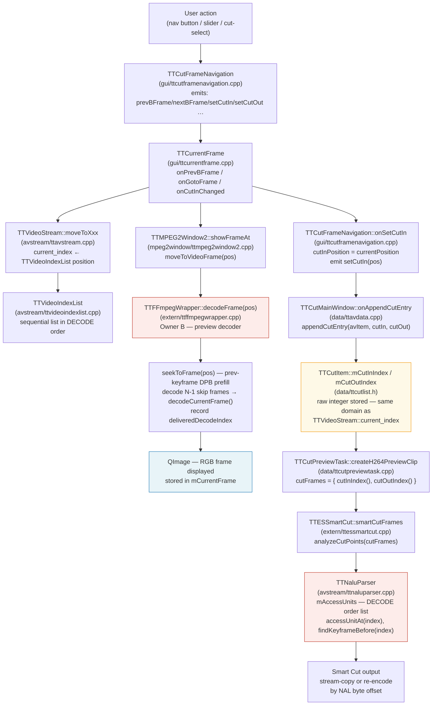

# Code Map: Frame-Order Pipeline

**Scope:** In which frame-order domain (decode order vs display order) does each
component work, and where do the still-image display path and the Smart Cut
execution path diverge? The central diagnostic question is: why does the Cut-In
still-image preview show a different frame than the one that ends up in the output?

## Data flow



## Edge semantics

One row per boundary in the diagram. The order-domain column is the critical fact.

| From → To | What crosses | Order domain |
|---|---|---|
| `TTCutFrameNavigation::onSetCutIn()` → `TTCurrentFrame` slot | `currentPosition` — the integer last stored by `checkCutPosition(avData, pos)` | **DECODE order** (see below) |
| `TTVideoStream::moveToXxx()` → caller (TTCurrentFrame, TTCutOutFrame) | return value = `current_index` = position in `TTVideoIndexList` | **DECODE order** for H.26x; **display order** for MPEG-2 after `sortDisplayOrder()` |
| `TTVideoIndexList::moveToNextIndexPos(pos, type)` → TTVideoStream | next list position ≥ pos+1 matching frame type | **DECODE order** for H.26x (list built frame-by-frame from `mFrameIndex`, no POC sort); **display order** for MPEG-2 (list is sorted by `display_order` via `sortDisplayOrder()`) |
| `TTCurrentFrame` → `TTMPEG2Window2::showFrameAt(newFramePos)` | integer `newFramePos` — the return value of the `moveTo*` call | **DECODE order** (H.26x); **display order** (MPEG-2) |
| `TTMPEG2Window2::moveToVideoFrame(iFramePos)` → `TTFFmpegWrapper::decodeFrame(iFramePos)` | integer `iFramePos` interpreted as index into `mFrameIndex` (Owner B) | **DECODE order** — `mFrameIndex` was built by scanning packets sequentially (decode order) |
| `TTFFmpegWrapper::decodeFrame(n)` → caller | `QImage` shown in the still-image widget | **Shows the DISPLAY-RANK frame, not decode-frame n (KNOT RESOLVED 2026-06-08)** — `decodeFrame(n)` seeks to the keyframe and runs a skip-loop that counts **decoder *output* frames (display order)** until `mDecoderFrameIndex == n`. So `n` is a *decode-order* index, but the content shown is the frame at *display rank* (n − seekKeyframe) within the GOP. Near GOP boundaries this looks display-accurate; the true AU shown is `deliveredDecodeIndex[n]`. |
| `TTFFmpegWrapper::decodeFrame(n)` → `mFrameIndex[n].deliveredDecodeIndex` | true decode-order index of the picture actually emitted by `avcodec_receive_frame`; differs from n when B-frame reorder applies | DECODE order tag set at packet-send time; maps packet-send-order → delivered-display-frame |
| `TTCutFrameNavigation::onSetCutIn()` → `TTCutItem::mCutInIndex` (via `appendCutEntry`) | `currentPosition` as plain `int` | **DECODE order** (same value that TTCurrentFrame received from `moveTo*`) |
| `TTCutItem::cutInIndex()` → `TTCutPreviewTask::createH264PreviewClip` | `mCutInIndex` | **DECODE order** |
| `TTCutPreviewTask` → `TTESSmartCut::smartCutFrames(cutFrames)` | `QList<QPair<int,int>>` of (cutIn, cutOut) integer positions | **DECODE order** — passed directly as `seg.startFrame` / `seg.endFrame` |
| `TTESSmartCut::analyzeCutPoints` → `TTNaluParser::accessUnitAt(index)` | `index` into `mAccessUnits` | **DECODE order** — TTNaluParser builds its AU list in bitstream order (no POC reordering); `TTAccessUnit::index` is a sequential counter, not a POC-sorted display position |
| `TTNaluParser::accessUnitPtr(index, size)` → Smart Cut write path | byte offset + size of NAL units at decode position `index` | **DECODE order** → byte position in file (correct for stream-copy) |
| `TTCutFrameNavigation::checkCutPosition(avData, pos)` ← `TTCutMainWindow::onNewFramePos(pos)` | explicit `pos` parameter; stored as `currentPosition` | **DECODE order** (same pos returned by `moveToXxx` in TTCurrentFrame) |
| `TTCurrentFrame::onPlayVideo()` → `mPlayer->load(…, startSec)` | `startSec` corrected via `deliveredDecodeIndex / frameRate` for H.26x | **DISPLAY order** — `deliveredDecodeIndex` is the decode tag of the frame actually shown, mapping it to its correct display-time in the temp MKV |

## Assumptions, contracts & pitfalls

- **`TTVideoIndexList` (H.26x)** — assumes: built from `mFFmpeg->frameIndex()` in the order packets were demuxed (decode order); `display_order` field is set to the same sequential counter as the list position (`vidIndex->setDisplayOrder(i)` in `createIndexList`), so `displayOrder(i) == i` always for H.26x. There is no POC-based reordering. Pitfall: the field is named `display_order` but for H.26x it carries a decode-order index.

- **`TTVideoIndexList` (MPEG-2)** — `sortDisplayOrder()` IS called after building the list; the list is then sorted by the `display_order` field from the MPEG-2 picture headers. Navigation then walks in display order. `current_index` and all returned positions are display-order indices.

- **`TTFFmpegWrapper::decodeFrame(n)`** — assumes: `n` is a decode-order index into `mFrameIndex`. Guarantees: returns the QImage delivered by the libav decoder for the packet at decode position n, which under B-frame reorder is the frame whose DISPLAY time is `n + reorderDelay`. Does NOT return display-frame n. Pitfall: the caller (TTMPEG2Window2) and the cut-list both use the same integer n, but they interpret it differently — display shows the wrong picture when B-frames are present.

- **`TTCutItem::mCutInIndex / mCutOutIndex`** — assumes: stores whatever integer TTCurrentFrame had as `currentPosition` at the moment the user pressed Set Cut-In / Set Cut-Out. No conversion is performed. Pitfall: for H.26x this is a decode-order index; for MPEG-2 it is a display-order index. The Smart Cut path receives the H.26x index and passes it to TTNaluParser which also uses decode order — so the H.26x cut execution is **consistent in decode order**.

- **`TTNaluParser::mAccessUnits`** — assumes: populated in bitstream (decode) order. `TTAccessUnit::index == decodeIndex` (a sequential decode-order counter), NOT a POC-sorted display index (the header comment "display order based on POC" is wrong). **POC is NOT computed at all (verified 2026-06-08): `currentAU.poc` is hard-set to `-1` everywhere; `pic_order_cnt_type` is read from the SPS but no per-frame POC is derived.** So there is currently no display-order information available from the parser without either implementing POC or a decode pass. `findKeyframeBefore(n)` and `findKeyframeAfter(n)` scan linearly in decode order.

- **`TTFFmpegWrapper::seekToFrame(n)`** — does NOT seek to the keyframe of the GOP that displays at position n. It seeks to the keyframe of the GOP that **decodes at or before** position n (one further keyframe back in non-search mode for DPB prefill). This is correct for decode-order access but means the visible frame may differ from the frame the user selected if B-frame reorder is large.

- **`deliveredDecodeIndex`** — lazily filled on first `decodeFrame()` call; -1 until decoded. The `onPlayVideo()` path falls back to `currentIndex/frameRate` if -1, which points to the wrong time when B-frames are present.

- **`TTCutFrameNavigation::checkCutPosition(avData, pos)`** — receives an explicit `pos` parameter (the same value returned by `moveToXxx` in TTCurrentFrame) and stores it as `currentPosition`. The fix in v0.61.2 ensures this value is never re-read from the shared `videoStream->currentIndex()` after a signal cascade. `onSetCutIn()` emits `setCutIn(cutInPosition)` where `cutInPosition` equals the `currentPosition` set by the last `checkCutPosition` call.

## Root cause & knot — RESOLVED 2026-06-08 (two-harness empirical proof)

Verified with two standalone harnesses against the real code paths (`tools/diag/test_stillframe`
drives `TTESSmartCut::smartCutFrames`; `test_displaymap` drives `TTFFmpegWrapper::decodeFrame`),
on MBAFF.264 around the 36384/36386 ad→programme transition.

**The knot (why decode-order index looks display-accurate) — SOLVED:**
- `mFrameIndex` and `mAccessUnits` are **both pure decode order** (`scanPacketsIntoRawIndex` appends in `av_read_frame` order, no PTS sort; position n = AU n). The map's "no off-by-N between the two index systems" holds.
- `decodeFrame(n)` only *appears* display-accurate because its skip-loop counts **decoder output (display order)**: it shows the frame at *display rank* (n − seekKeyframe). Navigation index n = decode position; shown content = display-rank frame. That mismatch is the whole problem.

**The bug (one line) — `selectFramesNonPAFF`, ttessmartcut.cpp:2449-2450:**
```
int uiKeyframe    = mParser.findKeyframeBefore(ctx.startFrame); // AU/DECODE index
int displayOffset = ctx.startFrame - uiKeyframe;                // startFrame = DISPLAY index (contract ttessmartcut.h:38)
```
Mixed index spaces: subtracting the keyframe's **decode index** from a **display index**. The
walk then counts `displayOffset` steps in display order from the keyframe's *display* position →
overshoots by (keyframe display-pos − keyframe decode-index) = the local reorder amount.
Cut-In display-36384 → realStartAU 36388 → output begins **~4 display-frames late** (inside programme).

**Falsified earlier hypotheses (do not reintroduce):**
- "~2 frames late": measured **~4**.
- "Open-GOP B-skip (`if (au < uiKeyframe) continue;`) is the cause": **FALSE** — harness showed `delta=0` between with-skip and no-skip walks; no `au<uiKeyframe` frames in the window.
- "POC parsed but not sorted": **FALSE** — POC is never computed (`currentAU.poc == -1` everywhere).

**`deliveredDecodeIndex` caveat:** it carries the true AU of the shown frame in *most* cases, but its
seek/DPB-prefill delay accounting does not always match the cut's `decodeFramesIntoList` accounting
(observed ±2 at non-GOP-boundary indices). Not a reliable absolute cross-component reference on its own.

| Path | What index N maps to | Consistent with display? |
|---|---|---|
| **Still-image display** (H.26x) | shows display-rank frame for decode-index N (= the reference the user sees) | — (reference) |
| **Smart Cut** (H.26x) | mixed-space `displayOffset` walk → realStartAU; Cut-In 36384 → 36388 | **NO** — ~4 display-frames late |
| **Both** (MPEG-2) | `TTVideoIndexList` `sortDisplayOrder()`-sorted (via `temporal_reference`); paths agree | Yes (no bug) |

**Fix direction (decided 2026-06-08):** A — the cut must land on the frame the still shows.
Chosen approach: architectural single-source-of-truth via an authoritative display↔decode(AU) map.
The blocker is that H.26x has **no display-order source** (POC absent); obtaining it (implement POC
vs. a decode-pass ground-truth vs. hybrid) is the open design decision. MPEG-2 already has it for free
(temporal_reference) — the codecs stay separate; only the index *semantic* (nav index = display position)
would be aligned. See `memory/project_stillframe_cut_offset.md`.

## Redundancy / consolidation candidates

- **Frame-index construction** (`TTH26xVideoStream::createHeaderList` → `mFFmpeg->buildFrameIndex()`) and (`TTMPEG2Window2::openVideoStream` → Owner B `mpFFmpegWrapper`): Both previously scanned the entire file. Resolved in v0.72.0 by Owner A → Owner B index sharing via `provideFrameIndexTo()` (Qt COW, O(1)). Owner C (search sub-decoders) also adopts via the same mechanism. No longer redundant.

- **Decode-order-to-display-order conversion**: Three separate ad-hoc corrections exist for mapping between decode-order indices and display-time seconds:
  - `onPlayVideo()` uses `deliveredDecodeIndex / frameRate` (H.26x playback seek).
  - `onPlaybackFinished()` uses `lastRenderedTimePos * frameRate` + MPEG-2 field-picture fixup (stop position).
  - `onPlaybackPositionChanged()` uses `seconds * frameRate` (live display during playback).
  None of these corrections is applied to the still-image display path itself. A shared helper `decodeIndexToDisplaySeconds(int decodeIdx)` and `displaySecondsToDecodeIndex(double seconds)` would reduce duplication and make a future fix to the still-image display easier.

- **MPEG-2 field-picture extra-index correction** appears in both `onPlayVideo()` and `onPlaybackFinished()` (binary-search into `mpeg2vs->extraIndices()`). Same logic, duplicated. Consolidation candidate: a method on `TTMpeg2VideoStream` that converts between raw index and display-frame index.
