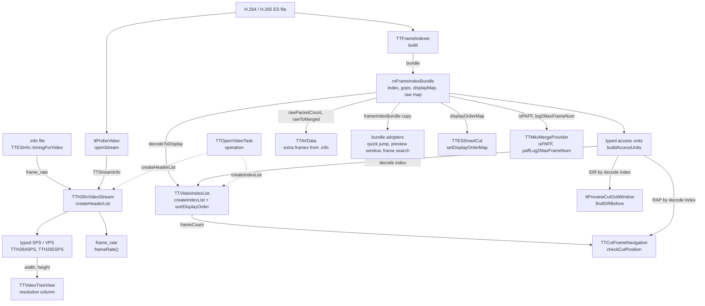

# Code Map: H.26x video stream

**Scope:** what `TTH264VideoStream` and `TTH265VideoStream` are after the
stream-ownership split — the shared base `TTH26xVideoStream`
(`createHeaderList`, `createIndexList`, cut-point tests, display↔decode
conversion, the raw-AU accessors), the two codec subclasses with their typed
SPS/VPS and access-unit lists (`tth264videoheader`, `tth265videoheader`), and
what each reader takes from the stream: frame rate, the index list, the
bundle, the display-order map, the typed SPS.

**Neighbours, not part of this map:** how the packet scan, PAFF merge, POC
collection and the display-order map are built (`TTFrameIndexer`,
`TTDisplayOrderMap` — [frame-order.md](frame-order.md)); when the open task
runs and what the finish handlers do
([stream-open-project-load.md](stream-open-project-load.md)); the adopters of
the bundle ([quick-jump.md](quick-jump.md),
[detection-and-search.md](detection-and-search.md), [playback.md](playback.md));
the Smart Cut engine and its own NAL parser `TTNaluParser`
([smart-cut.md](smart-cut.md)); the MKV mux reading `isPAFF`
([output-mux.md](output-mux.md)); the preview window rules
([cut-preview.md](cut-preview.md)).

## Data flow

Legend: solid = data, dashed = trigger (who starts what).

## Edge semantics

| From → To | What crosses (data / order / invariant) |
|---|---|
| `OPEN` -.-> `HL` | `TTOpenVideoTask::operation`: `TTVideoType::createVideoStream` builds the subclass from the libav probe (`h264_video` / `h265_video`), then `createHeaderList()`. A return `<= 0` throws `TTDataFormatException` — for H.26x that is `-1` (probe, codec or index failure) or an index without frames. |
| `FILE` → `PROBE` | `openStream`: `ttProbeVideo` once per stream (`mProbed`); the detected codec must equal `expectedCodec()` or the open fails with “File is not H.264/H.265”. |
| `PROBE` → `HL` | `TTStreamInfo` of the best video stream: width, height, profile, level, bit rate, frame rate. `frameRate` = `r_frame_rate`, else `avg_frame_rate` (`ttStreamInfo`). |
| `INFO` → `HL` | `frame_rate` of the `.info` file, when positive, **replaces** the libav rate (`frame_rate` and the SPS copy). Without `.info` a raw H.264 ES gets libav's `time_scale / num_units_in_tick`, i.e. **twice** the real rate for progressive material — known, left as is; `ttcut-demux` always writes `.info`. |
| `HL` → `FR` | `frame_rate` (float): libav or `.info`, then halved when H.264, `isPAFF` and `> 30` (a field rate). `TTH26xVideoStream::frameRate()` returns it; it is the rate of every time column and time↔index conversion of the video. H.265 is never halved (`isPAFFCorrectionApplicable` false). |
| `FILE` → `IDXR` → `BUN` | `TTFrameIndexer::build` (progress mapped onto 10–80 % of the byte total), copied into `mFrameIndexBundle`: one `TTFrameInfo` per (merged) access unit in **decode order**, GOP table, raw→merged map, PAFF flags, display-order map. Failure → `-1`. |
| `HL` → `SPS` | `buildSPSFromStreamInfo`: width/height/profile/level from the probe, not from the bitstream SPS; the H.265 VPS is an empty placeholder. Rebuilt on every `createHeaderList` (`resetSPS` first). |
| `BUN` → `AU` | `buildAccessUnits`: one typed AU per bundle entry, same decode index. **IDR = `TTFrameInfo::isKeyframe`** = libav `AV_PKT_FLAG_KEY` (H.264: IDR slice, a recovery-point SEI, or the parser's single-reference I heuristic; H.265: every IRAP — IDR, CRA, BLA), **not** `TTFrameInfo::isIDR` (the NAL-scan IDR the display map uses). H.264: RAP = IDR; a non-key I picture is slice type I, neither IDR nor RAP. H.265: a non-key I picture is marked RAP (“could be CRA”), though every IRAP already carries the key flag. `createHeaderList` returns the AU count (decode units, dropped RASL included). |
| `AU` + `BUN` → `VIL` (trigger `OPEN` -.-> `VIL`) | `createIndexList`, called by `TTOpenVideoTask` after the header list: per decode index `i` with `decodeToDisplay(i) >= 0` one `TTVideoIndex` (display order = display rank, header-list index = `i`, coding type 1/2/3 from `accessUnitToCodingType`). Dropped HEVC RASL pictures get no entry. `TTOpenVideoTask` then calls `sortDisplayOrder()`: **list position = display position**, `headerListIndex(pos)` = decode AU. `frameCount()` = display count. |
| `AU` + `VIL` → `NAV` | `isCutInPoint(pos)` / `isCutOutPoint(pos)`, `pos` a display position: with the encoder mode on (default) always `true`. Off: cut-in needs `accessUnitIsRAP(displayToDecode(pos))`; cut-out needs the last displayed frame or a RAP at display `pos + 1`. Bounds in display space (`frameCount()`). Only reader: the Set-Cut-In/Out buttons (`checkCutPosition`). |
| `AU` → `PREV` | `findIDRBefore(frameIndex)`, display position in, display position out: walks **decode** indices down from `displayToDecode(frameIndex)` to the first `accessUnitIsIDR`, returns its display position, `-1` if none. Only caller: `ttPreviewCutOutWindow`, which starts the cut-out preview there when it is not before the cut-in. |
| `BUN` → `EXTRA` | `TTAVData` (extra-frame source for H.26x): `.info es_doubled_pts_aus` are raw-AU numbered; used only when `es_total_aus == rawAuCount()`. `rawAuIsCollapsedField` → legitimate PAFF field pair, skipped; else `mapRawAuToDisplayIndex` = raw → merged → display; `-1` (dropped leading picture) skipped. |
| `SPS` → `TREE` | `TTVideoTreeView`: resolution column from `getSPS()->width()/height()`, ratio column the codec name. The only reader of the typed SPS outside the log line (`spsDescription`). |
| `BUN` → `ADOPT` | `frameIndexBundle()` returns a copy (Qt COW). Quick jump (`TTQuickJumpDialog`, per-codec `static_cast`), preview window (`TTMPEG2Window2`, `adoptOrBuildFrameIndex`) and frame search (`TTFrameSearchTask`) adopt it instead of rescanning; empty bundle = “not built”, the adopter indexes itself. |
| `BUN` → `SMART` | `displayOrderMap()` by reference: `TTAVData` copies it into the cut parameters (`params.displayMap`), `ttpreviewclip` hands it to its engine; Smart Cut maps display cut positions to AUs with it (PAFF: frame granularity, which its own file fallback lacks). |
| `BUN` → `MKV` | `isPAFF()` (H.264 override; base default `false`) and `paffLog2MaxFrameNum()` (H.264: bundle `log2MaxFrameNum`; base default 4) for the MKV mux of PAFF material. |

## Assumptions, contracts & pitfalls

- **Two index spaces, one conversion.** The typed AU lists and the bundle
  are in decode order; everything a caller passes (`isCutInPoint`,
  `isCutOutPoint`, `findIDRBefore`, the index list after the sort) is in
  display order. `decodeToDisplayIndex` / `displayToDecodeIndex` are the
  bundle's map; an index outside the map comes back unchanged.
- **Two notions of “IDR”.** The display-order map flushes its reorder
  buffer on `TTFrameInfo::isIDR` (NAL scan, strict IDR); the stream's
  `accessUnitIsIDR` — documented in the header as “strict IDR (DPB reset)”
  — reads `isKeyframe`, the libav key flag (see the `BUN` → `AU` row). GOP
  numbering (`gopIndex`) follows the key flag too.
- **`findIDRBefore` walks decode order.** From a leading picture (open-GOP
  B or RASL, displayed before its key picture but decoded after it) the
  first key picture found is the one that follows in display order.
- **Encoder mode decides the cut-point gates.** With it on (default) every
  display position may be a cut-in or cut-out; the RAP rules only apply
  with it off. Smart Cut does not read the setting.
- **Frame rate has three sources and two PAFF halvings.** libav, `.info`,
  then the PAFF rule `> 30 → / 2` — applied here to `frame_rate` and, for
  the PTS synthesis only, again inside `TTFrameIndexer::assignPtsFromFrameRate`
  on its own copy.
- **The typed SPS is the probe, not the bitstream.** H.264 `profileString`
  switches on the raw libav profile, which carries constraint flags
  (constrained baseline = 66 | 512 = 578, High 10 Intra = 110 | 2048 = 2158) and then prints
  “Unknown (…)” — log line only.
- **Ownership.** The stream owns the one canonical index of the file
  (“Owner A”); every other wrapper adopts the bundle. Handing the bare
  `QList<TTFrameInfo>` across an object boundary loses the PAFF metadata
  (see `ttframeindex.h`).
- **`cut()` throws** (`TTInvalidOperationException`): H.26x is cut by
  `TTESSmartCut`, never through the stream.
- **`stream_type`** is set in the H.264 constructor only; nothing reads the
  member outside the constructors, `streamType()` is overridden in both.

### Reading hypotheses for audit run 12

From reading only; each needs a runtime proof or refutation first.

- **H1 — `accessUnitIsIDR` is the key flag, not an IDR.** On H.264 with
  recovery-point SEI and on every H.265 CRA, `findIDRBefore` returns a
  non-IDR picture; `ttPreviewCutOutWindow` starts there although its
  comment wants an IDR (“non-IDR I-frames cause decoder stall”). Measure on
  H.265 CRA material and an H.264 stream without IDR: which picture the
  cut-out preview starts on, and whether the clip stalls.
- **H2 — `findIDRBefore` can return a position after its argument.** For a
  leading picture of the next key picture (open GOP / RASL) the walk in
  decode order hits that key picture first; the preview window then starts
  after `startIndex`, for a cut of only a few frames even after the
  cut-out. Measure with an open-GOP fixture.
- **H3 — the two codecs gate a non-key I picture differently.** With the
  encoder mode off, H.265 allows a cut-in at a non-IRAP I picture (marked
  RAP), H.264 does not. Which one is right, and does a cut-in there survive
  Smart Cut unchanged?
- **H4 — the typed AU and SPS lists are a second copy of the index.**
  Readers use only IDR/RAP/coding type of the AUs and width/height of the
  SPS; the VPS, `TTH264SPS::spsId/frameRate/hasFrameRate`, the AU
  `pts/dts/frameNum/poc/frameSize/temporalId/isReference` and the codec
  enums beyond the slice types are never read. The unknown-type defaults
  differ (H.264 → P, H.265 → B) but are unreachable — the indexer only
  writes I/P/B.
- **H5 — the comment in `ttStreamInfo` calls `r_frame_rate` reliable for
  raw ES**, while for raw H.264 it is twice the real rate (the `.info`
  override hides it). Doc fix or a VUI-based rate.

## Redundancy / consolidation candidates

- **Typed access units vs the bundle**
  - sites: `avstream/tth264videostream.cpp:TTH264VideoStream::buildAccessUnits`, `avstream/tth265videostream.cpp:TTH265VideoStream::buildAccessUnits`, `avstream/tth26xvideostream.h:TTH26xVideoStream::mFrameIndexBundle`
  - shared purpose: one record per decode-order AU with the frame type and the random-access flag
  - status: candidate → the base class can answer IDR/RAP/coding type from `TTFrameInfo` directly; the two AU classes and hooks go (H4)
- **H.264 vs H.265 stream subclass**
  - sites: `avstream/tth264videostream.cpp`, `avstream/tth265videostream.cpp` (every hook)
  - shared purpose: build the typed SPS from the probe, map the frame type, answer the per-AU hooks
  - status: candidate → what differs is the codec id, the label, the RAP rule and the PAFF flag; falls with the previous entry
- **PAFF frame-rate halving**
  - sites: `avstream/tth26xvideostream.cpp:TTH26xVideoStream::createHeaderList`, `avstream/ttframeindexer.cpp:TTFrameIndexer::assignPtsFromFrameRate`
  - shared purpose: `isPAFF && rate > 30 → rate / 2`, each after its own `.info` lookup
  - status: candidate → one rule (the bundle could carry the corrected rate)
- **Getting the bundle from either subclass**
  - sites: `gui/ttquickjumpdialog.cpp:TTQuickJumpDialog` (per-codec `static_cast` on `streamType()`), `data/ttframesearchtask.cpp` (two `dynamic_cast` for the decoder kind)
  - shared purpose: “is this an H.26x stream” — the base `TTH26xVideoStream` answers it in one cast (as `mpeg2window/ttmpeg2window2.cpp` and `data/ttavdata.cpp` do)
  - status: candidate → one `dynamic_cast<TTH26xVideoStream*>`
