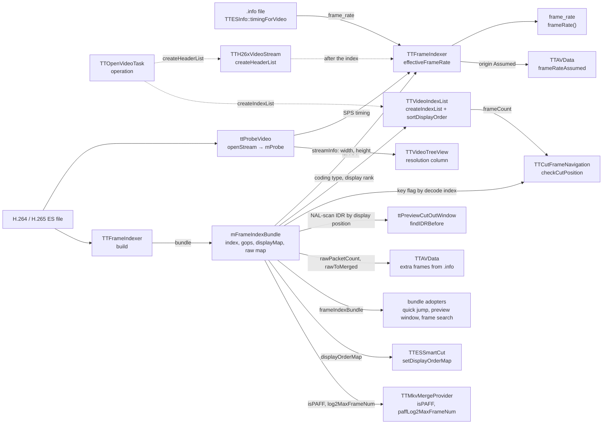

# Code Map: H.26x video stream

**Scope:** what `TTH264VideoStream` and `TTH265VideoStream` are after the
stream-ownership split and audit run 12 — the shared base
`TTH26xVideoStream` (`createHeaderList`, `createIndexList`, cut-point tests,
`findIDRBefore`, display↔decode conversion, the raw-AU accessors), which
answers every per-frame question from the frame index bundle, the two
subclasses that only carry the codec identity (and PAFF for H.264), and what
each reader takes from the stream: frame rate, the index list, the bundle,
the display-order map, the probe info.

**Neighbours, not part of this map:** how the packet scan, PAFF merge, POC
collection and the display-order map are built (`TTFrameIndexer::build`,
`TTDisplayOrderMap` — [frame-order.md](frame-order.md)); when the open task
runs and what the finish handlers do
([stream-open-project-load.md](stream-open-project-load.md)); the adopters of
the bundle ([quick-jump.md](quick-jump.md),
[detection-and-search.md](detection-and-search.md), [playback.md](playback.md));
the Smart Cut engine and its own NAL parser `TTNaluParser`
([smart-cut.md](smart-cut.md)); the MKV mux reading `isPAFF`
([output-mux.md](output-mux.md)); the preview window rules
([cut-preview.md](cut-preview.md)).

## Data flow

Legend: solid = data, dashed = trigger (who starts what).

## Edge semantics

| From → To | What crosses (data / order / invariant) |
|---|---|
| `OPEN` -.-> `HL` | `TTOpenVideoTask::operation`: `TTVideoType::createVideoStream` builds the subclass from the libav probe (`h264_video` / `h265_video`), then `createHeaderList()`. A return `<= 0` throws `TTDataFormatException` — for H.26x that is `-1` (probe, codec or index failure) or an index without frames. |
| `FILE` → `PROBE` | `openStream`: `ttProbeVideo` once per stream (`mProbed`); the detected codec must equal `expectedCodec()` or the open fails with “File is not H.264/H.265”. The result stays in `mProbe`; `streamInfo()` exposes its `TTStreamInfo` (width, height, profile, level, bit rate, and `frameRate` = `codecpar->framerate`, the SPS/VPS timing libav's parser read — H.264 `time_scale / (2·num_units_in_tick)`, HEVC VPS or VUI timing — 0 when the stream has none). `r_frame_rate`/`avg_frame_rate` are not used: for a raw ES they are 2× (H.264 progressive/MBAFF), the field rate (PAFF), 1200000/1 without timing, and the raw demuxer's default 25 respectively (measured, libav 9.0.2). |
| `FILE` → `IDXR` → `BUN` | `TTFrameIndexer::build` (progress mapped onto 10–80 % of the byte total), copied into `mFrameIndexBundle`: one `TTFrameInfo` per (merged) access unit in **decode order**, GOP table, raw→merged map, PAFF flags, display-order map. Failure → `-1`. `createHeaderList` returns the AU count (dropped RASL included). |
| `PROBE` / `INFO` / `BUN` → `RATE` (trigger `HL` -.-> `RATE`) | `TTFrameIndexer::effectiveFrameRate(streamTiming, path, isPAFF, &origin)`, called after the index is built — **one rule**: the `.info` `frame_rate` when the file carries a usable one (`TTESInfo::hasFrameRate` — a `.info` without it no longer passes TTESInfo's 25/1 default on as its rate), halved when `isPAFF` and `> 30` (origin `Info`); else the SPS timing, never halved — it already is the frame rate, PAFF included (`StreamTiming`); else `kTTAssumedFrameRate` = 25 (`Assumed`). The indexer's PTS synthesis (`assignPtsFromFrameRate`, ES without timestamps) uses the same rule and then clamps to 25 fps outside 0–120. |
| `RATE` → `FR` | `frame_rate` (float), returned by `TTH26xVideoStream::frameRate()`: the rate of every time column and time↔index conversion of the video; `frameRateOrigin()` says where it came from. The open log line shows it next to the SPS timing, PAFF, profile and level; `StreamTiming` logs “no .info” (or “.info without frame_rate”) “, frame rate from the SPS timing”, `Assumed` a warning, and a `.info` that differs from the SPS timing by more than 0.1 % a warning naming both (`.info` wins). |
| `RATE` → `HINT` | `TTAVData::onOpenVideoFinished` collects videos with origin `Assumed`; `onThreadPoolExit` emits `frameRateAssumed(files)` and, interactive only, a `QMessageBox::warning` (file list, assumed 25 fps, “demux with ttcut-demux”); headless only the log. Cleared with the other open outcomes (`clearOpenOutcome`). |
| `BUN` → `VIL` (trigger `OPEN` -.-> `VIL`) | `createIndexList`, called by `TTOpenVideoTask` after the header list: per decode index `i` with `decodeToDisplay(i) >= 0` one `TTVideoIndex` (display order = display rank, header-list index = `i`, coding type = `TTFrameInfo::frameType`, 1/2/3 — the indexer writes I for every key picture, I/P/B from the slice type otherwise). Dropped HEVC RASL pictures get no entry. `TTOpenVideoTask` then calls `sortDisplayOrder()`: **list position = display position**, `headerListIndex(pos)` = decode AU. `frameCount()` = display count. |
| `BUN` + `VIL` → `NAV` | `isCutInPoint(pos)` / `isCutOutPoint(pos)`, `pos` a display position: with the encoder mode on (default) always `true`. Off: cut-in needs random access at `displayToDecode(pos)`; cut-out needs the last displayed frame or random access at display `pos + 1`. **Random access = `TTFrameInfo::isKeyframe`**, the libav key flag (H.264: IDR slice, a recovery-point SEI, or the parser's single-reference I heuristic; H.265: every IRAP — IDR, CRA, BLA), the same rule for both codecs. Bounds in display space (`frameCount()`). Only reader: the Set-Cut-In/Out buttons (`checkCutPosition`). |
| `BUN` → `PREV` | `findIDRBefore(frameIndex)`, display position in and out: walks **display** positions down from `frameIndex` to the first one whose AU has `TTFrameInfo::isIDR` (the NAL-scan IDR the display-order map uses), `-1` if none. Only caller: `ttPreviewCutOutWindow`, which starts the cut-out preview there when it is not before the cut-in; on material without IDRs (DVB H.264, x264/x265 open GOP after frame 0) the window keeps its plain start, “preview length before the cut-out”. |
| `BUN` → `EXTRA` | `TTAVData` (extra-frame source for H.26x): `.info es_doubled_pts_aus` are raw-AU numbered; used only when `es_total_aus == rawAuCount()`. `rawAuIsCollapsedField` → legitimate PAFF field pair, skipped; else `mapRawAuToDisplayIndex` = raw → merged → display; `-1` (dropped leading picture) skipped. |
| `PROBE` → `TREE` | `TTVideoTreeView`: resolution column from `streamInfo().width/height`, ratio column `codecLabel()`. |
| `BUN` → `ADOPT` | `frameIndexBundle()` returns a const reference; quick jump (`TTQuickJumpDialog`), preview window (`TTMPEG2Window2`, `adoptOrBuildFrameIndex`) and frame search (`TTFrameSearchTask`) copy it (Qt COW) instead of rescanning, each after one `dynamic_cast` on `TTH26xVideoStream`; empty bundle = “not built”, the adopter indexes itself. |
| `BUN` → `SMART` | `displayOrderMap()` by reference: `TTAVData` copies it into the cut parameters (`params.displayMap`), `ttpreviewclip` hands it to its engine; Smart Cut maps display cut positions to AUs with it (PAFF: frame granularity, which its own file fallback lacks). |
| `BUN` → `MKV` | `isPAFF()` (H.264 override; base default `false`) and `paffLog2MaxFrameNum()` (H.264: bundle `log2MaxFrameNum`; base default 4) for the MKV mux of PAFF material. |

## Assumptions, contracts & pitfalls

- **Two index spaces, one conversion.** The bundle is in decode order;
  everything a caller passes (`isCutInPoint`, `isCutOutPoint`,
  `findIDRBefore`, the index list after the sort) is in display order.
  `decodeToDisplayIndex` / `displayToDecodeIndex` are the bundle's map; an
  index outside the map comes back unchanged.
- **Two flags, two meanings.** `TTFrameInfo::isKeyframe` (libav key flag) is
  random access: cut-point gates, GOP numbering. `TTFrameInfo::isIDR` (NAL
  scan) is a DPB reset: the display-order map flushes on it, and
  `findIDRBefore` looks for it. On open-GOP material the two differ almost
  everywhere (Tux progressive H.264 and HEVC CRA: 120 key pictures, 1 IDR;
  a DVB H.264 recording: 434 key pictures, 0 IDR).
- **Walk display positions, not decode indices, for “the last X at or
  before a position”.** A picture decoded after a key picture can display
  before it (open-GOP B, HEVC RASL, and RADL even after an IDR); a decode-
  order walk from such a picture lands behind the position (audit run 12:
  `findIDRBefore(25) = 32`, cut [25, 28] → preview window [32, 28]).
- **Encoder mode decides the cut-point gates.** With it on (default) every
  display position may be a cut-in or cut-out; the random-access rules only
  apply with it off. Smart Cut does not read the setting.
- **One frame-rate rule.** `.info` (PAFF field rate halved) → SPS timing →
  25 assumed, in `TTFrameIndexer::effectiveFrameRate` for the stream and the
  PTS synthesis. libav's `r_frame_rate` is not a frame rate for a raw ES.
- **Ownership.** The stream owns the one canonical index of the file
  (“Owner A”); every other wrapper adopts the bundle. Handing the bare
  `QList<TTFrameInfo>` across an object boundary loses the PAFF metadata
  (see `ttframeindex.h`).
- **`cut()` throws** (`TTInvalidOperationException`): H.26x is cut by
  `TTESSmartCut`, never through the stream.

### Audit run 12 (reading hypotheses H1–H5, measured)

Probe over the Tux progressive/PAFF/MBAFF H.264 and HEVC CRA fixtures and a
400 MB DVB H.264 head; gate `h26x_idr_before`.

- **H1 confirmed and fixed.** `findIDRBefore` read the typed access unit's
  `isIDR`, which both codecs filled from the key flag — the IDR preference of
  `3535f922` never worked. Now `TTFrameInfo::isIDR`.
- **H2 confirmed and fixed.** Decode-order walk; ~20 % of the DVB positions
  got a later key picture, 1439 of the 4-frame cuts an inverted window. Now a
  display-order walk.
- **H3 not observed.** No non-key I picture in any file; the H.265 rule that
  called one random access is gone with C1 (same rule as H.264).
- **H4 confirmed, rebuilt (C1).** The typed SPS/VPS/access-unit classes are
  removed; the base answers from the bundle, behaviour identical per display
  position on all five files.
- **H5 confirmed, comment corrected.** `ttStreamInfo` called `r_frame_rate`
  reliable for a raw ES. Measured: raw H.264 progressive and MBAFF report
  twice the frame rate (50p → 100, 25i MBAFF → 50), PAFF the field rate
  (halved), raw HEVC right (50p → 50); `avg_frame_rate` is the raw
  demuxer's `framerate` option (default 25). A cut without `.info`
  (progressive H.264, frames 1000–2499 at real 50 fps) gave a 15.008 s MKV
  with audio from 10.016–25.024 s instead of 30.016 s and 20.000–50.016 s.
  Fixed on `fix/frame-rate-source` (spec 2026-09-27-frame-rate-source): the
  rate comes from the SPS timing (`codecpar->framerate`), a stream without
  it opens at an announced 25 fps; the same cut now gives 30.016 s with
  audio from 20.000–50.016 s. Gates `h26x_framerate`, `framerate_assumed`,
  `framerate_hint`. `ttcut-demux` halves the TS field rate against the TS
  `avg_frame_rate` now (was the ES one, always 25) — `ttcut-demux.md`.

## Redundancy / consolidation candidates

- **Typed access units vs the bundle**
  - sites: `TTH264VideoStream::buildAccessUnits`, `TTH265VideoStream::buildAccessUnits` (removed), `avstream/tth26xvideostream.h:TTH26xVideoStream::mFrameIndexBundle`
  - shared purpose: one record per decode-order AU with the frame type and the random-access flag
  - status: done (audit run 12, C1) → `TTH26xVideoStream::accessUnitIsRAP` / `accessUnitCodingType` read the bundle
- **H.264 vs H.265 stream subclass**
  - sites: `avstream/tth264videostream.cpp`, `avstream/tth265videostream.cpp`
  - shared purpose: codec identity
  - status: done (C1) → what is left differs per codec (stream type, label, expected codec, PAFF accessors)
- **PAFF frame-rate halving**
  - sites: `avstream/tth26xvideostream.cpp:TTH26xVideoStream::createHeaderList`, `avstream/ttframeindexer.cpp:TTFrameIndexer::assignPtsFromFrameRate`
  - shared purpose: `.info` over libav, `isPAFF && rate > 30 → rate / 2`
  - status: done (C1) → `TTFrameIndexer::effectiveFrameRate`
- **Getting the bundle from either subclass**
  - sites: `gui/ttquickjumpdialog.cpp`, `data/ttframesearchtask.cpp:TTFrameSearchTask::decoderKindFor`
  - shared purpose: “is this an H.26x stream”
  - status: done (C2) → one `dynamic_cast<TTH26xVideoStream*>` each
