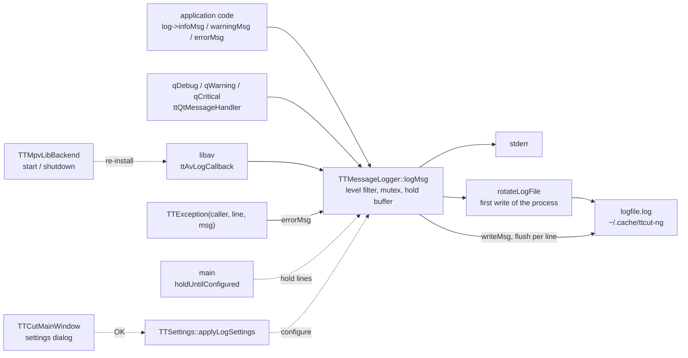

# Code Map: Logging

**Scope:** every way a message reaches the log file or stderr —
`TTMessageLogger` (singleton, level filter, console mode, lazy file open with
rotation), the Qt message handler that routes `qDebug`/`qWarning`/…, the
libav log callback, the FATAL line every located `TTException` writes, and
how the settings (log file on/off, console, extended, path, the per-subsystem
switches, libav) reach the logger.

**Neighbours, not part of this map:** what each subsystem logs behind its own
switch (`TTSettings::logSmartCut()` and friends); the progress dialog's
detail panel (`TTAnalysisLog`, [progress-reporting.md](progress-reporting.md));
the settings state machine itself ([settings-state.md](settings-state.md)).

## Data flow

Legend: solid = data, dashed = trigger / configuration.

## Edge semantics

| From → To | What crosses (data / order / invariant) |
|---|---|
| `CODE` → `LOG` | `infoMsg`/`warningMsg`/`errorMsg`/`fatalMsg`/`debugMsg` (QString or printf form) with `__FILE__`, `__LINE__` → one line `[type][hh:mm:ss][file-basename:line] text`, type one of `info`, `warning`, `error`, `fatal`, `debug`. `ttSetLastError` logs a class's last-error text as WARNING (or ERROR). `fatalMsg` is called directly by `TTMpeg2VideoStream` (three places) and `TTAVData::createAVItem`. |
| `QT` → `LOG` | `ttQtMessageHandler`, installed in `main` before `QApplication`: debug → DEBUG, info → INFO, warning → WARNING, critical → ERROR, fatal → ERROR + `abort()`. Caller = `context.file`; the build defines `QT_MESSAGELOGCONTEXT`, so TTCut-ng's own lines carry file and line and only Qt's internal ones (Qt built without context) come as `"qt"`. |
| `AV` → `LOG` | `ttAvLogCallback`, installed in `main`, replaces libav's own stderr printer. AV_LOG_ERROR and worse always pass; everything below only with `TTSettings::logLibav()` (default off), then level-filtered by `av_log_get_level()`. Mapped ERROR/WARNING/INFO/DEBUG, caller `"libav"`. Runs on libav's worker threads. |
| `MPV` -.-> `AV` | libmpv takes the process-global av_log callback when its context starts and restores ffmpeg's default when the last context is destroyed. `TTMpvLibBackend::start` re-installs ours right after `mpv_initialize` (and after a failed initialize), `shutdown` after `mpv_terminate_destroy`. Without that every libav message of the process — TTCut-ng's own decoders and encoders included — reached mpv's log, and only its errors came back through `mpv_request_log_messages("error")` as `Playback error: [mpv:ffmpeg/video] …` (measured 2026-09-27). mpv's own messages still arrive that way. |
| `EXC` → `LOG` | The `(caller, line, msg)` constructor of `TTException` (inherited by every subclass) calls `errorMsg` at construction, whether or not the exception is later caught and handled. The message-only constructors log nothing — `TTAbortableTask::abortNow` uses one on purpose, so a cancel leaves no failure line. |
| `LOG` level filter | `passesLevel`: ERROR and FATAL always; otherwise `sLogLevel` ALL (default, and “extended” on) or MINIMAL (“extended” off: WARNING too). EXTENDED and NONE exist but are never set. |
| `LOG` → `ERR` | Console mode (setting), or any ERROR or FATAL line: `fprintf(stderr)` directly (not `qDebug`, which would re-enter the handler). |
| `MAIN` -.-> `LOG` | `main` calls `holdUntilConfigured()` before installing the handlers: until `configure()` runs, lines are kept in memory (ERROR/FATAL still reach stderr at once), nothing opens or rotates the file. Harnesses do not hold and log with the defaults. |
| `SET` -.-> `LOG` | `TTSettings::applyLogSettings` — at the end of every `load()` and after the settings dialog's OK — calls `configure(path, createLogFile, console, extended)` under the logger's mutex: empty path = `~/.cache/ttcut-ng/logfile.log` via XDG cache, same path = no change. It then releases held lines through the configured level, console mode and file switch. `setLogFilePath` / `setLogModeConsole` stay for harnesses; a harness sets them after the settings load, which would override them. |
| `MW` -.-> `SET` | `TTCutMainWindow::openSettingsDialog`: on OK, `applyLogSettings` then `save`. The pages only write `TTSettings`. |
| `LOG` → `ROT` → `FILE` | Under the logger's mutex, on the **first** line a process writes with the file enabled: `logfile.log` → `.1`, `.1` → `.2.gz` (zlib in-process; if that fails the older session is dropped with a stderr note), `.N.gz` → `.N+1.gz`, `.10.gz` dropped; then the new file is opened truncated. A path change makes the next line rotate again. Every line is flushed. |

## Assumptions, contracts & pitfalls

- **One logger per process, one rotation per process.** Any process that
  logs — the app, a second instance, `--auto-cut`, a diagnostic harness or
  probe — rotates the same `logfile.log` on its first line unless it sets its
  own `XDG_CACHE_HOME` or path. `tools/diag/run-gates.sh` gives each gate its
  own `XDG_CACHE_HOME`, `tools/diag/acm-cut.sh` and `qc-autocut.sh` one below
  their output directory. **Measured 2026-09-27:** ten direct probe runs
  replaced all eleven generations of the user's log.
- **Not measured:** a second instance renames the file a running instance
  still has open; that instance then keeps writing into what is now
  `logfile.log.1`.
- **The mutex is not recursive.** Nothing inside `logMsg` or `configure` may
  log through `qDebug` (it would re-enter the handler and deadlock); the code
  writes to stderr directly there.
- **Held lines are formatted early.** Their time stamp is the time they were
  logged, the level filter is applied again on release.
- `show` in `logMsg` is unused (“message window display” was never built).

## Redundancy / consolidation candidates

None open: the logger options reach `TTMessageLogger` only through
`TTSettings::applyLogSettings`.
