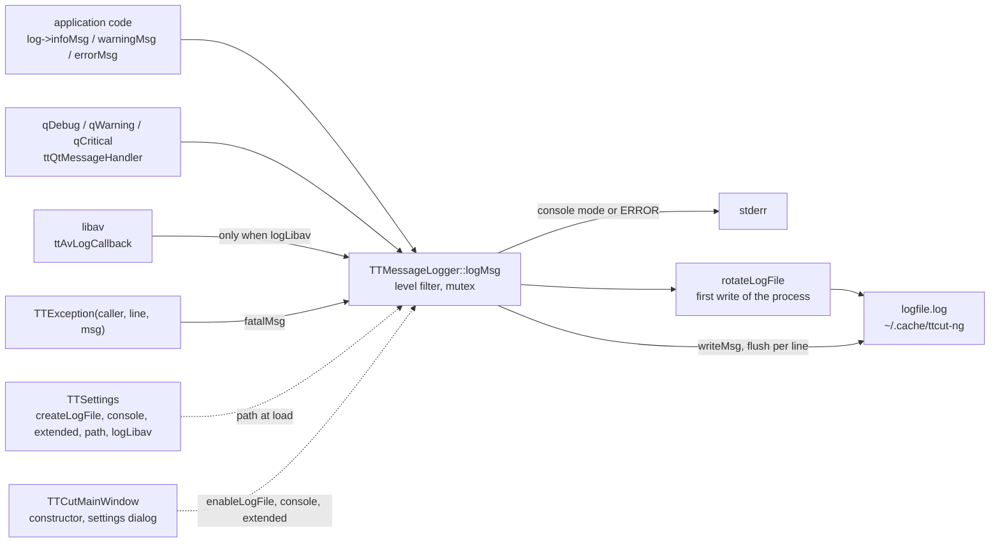

# Code Map: Logging

**Scope:** every way a message reaches the log file or stderr —
`TTMessageLogger` (singleton, level filter, console mode, lazy file open with
rotation), the Qt message handler that routes `qDebug`/`qWarning`/…, the
libav log callback, the FATAL line every located `TTException` writes, and
how the settings (log file on/off, console, extended, path, the per-subsystem
switches, libav) reach the logger.

**Neighbours, not part of this map:** what each subsystem logs behind its own
switch (`TTSettings::logSmartCut()` and friends); the progress dialog's
detail panel (`TTAnalysisLog`, [progress-reporting.md](progress-reporting.md));
the settings state machine itself ([settings-state.md](settings-state.md)).

## Data flow

Legend: solid = data, dashed = trigger / configuration.

## Edge semantics

| From → To | What crosses (data / order / invariant) |
|---|---|
| `CODE` → `LOG` | `infoMsg`/`warningMsg`/`errorMsg`/`debugMsg` (QString or printf form) with `__FILE__`, `__LINE__` → one line `[type][hh:mm:ss][file-basename:line] text`. `ttSetLastError` logs a class's last-error text as WARNING (or ERROR). |
| `QT` → `LOG` | `ttQtMessageHandler`, installed in `main` before `QApplication`: debug → DEBUG, info → INFO, warning → WARNING, critical → ERROR, fatal → ERROR + `abort()`. Caller = `context.file`, `"qt"` when the build carries no message context. |
| `AV` → `LOG` | `ttAvLogCallback`, installed in `main`, replaces libav's own stderr printer: returns at once unless `TTSettings::logLibav()` (default off) — for every level, errors included; otherwise level-filtered by `av_log_get_level()`, mapped ERROR/WARNING/INFO/DEBUG, caller `"libav"`. Runs on libav's worker threads. |
| `EXC` → `LOG` | The `(caller, line, msg)` constructor of `TTException` and every subclass calls `fatalMsg` — at construction, whether or not the exception is later caught and handled. The message-only constructors log nothing. `TTMpeg2VideoStream` calls `fatalMsg` directly in three places. |
| `LOG` level filter | `sLogLevel`: ALL (default, and “extended” on) or MINIMAL (“extended” off: only ERROR/FATAL/WARNING); EXTENDED and NONE exist but are never set. FATAL gets **no type tag** (`[][hh:mm:ss]…`); `test_previewcut_abort` matches on that empty tag. |
| `LOG` → `ERR` | Console mode (setting) or any ERROR line: `fprintf(stderr)` directly (not `qDebug`, which would re-enter the handler). FATAL is not written to stderr unless console mode is on. |
| `LOG` → `ROT` → `FILE` | Under the logger's mutex, on the **first** line a process writes with the file enabled: `logfile.log` → `.1`, `.1` → `.2.gz` (a `gzip` child process, 30 s timeout; on failure `.2.gz.uncompressed`), `.N.gz` → `.N+1.gz`, `.10.gz` dropped; then the new file is opened truncated. A path change (`setLogFilePath` with another path) makes the next line rotate again. Every line is flushed. |
| `SET` -.-> `LOG` | `TTSettings::load` → `setLogFilePath(mLogFilePath)` (empty = `~/.cache/ttcut-ng/logfile.log` via XDG cache; same path = no-op). The paths settings page sets it again on save. |
| `MW` -.-> `LOG` | `TTCutMainWindow` constructor and the settings dialog's OK: `enableLogFile(createLogFile)`, `setLogModeConsole`, `setLogModeExtended`. Before that — in `main`, in every harness and probe — the logger runs with its defaults: file on, level ALL, console off, default path. |

## Assumptions, contracts & pitfalls

- **One logger per process, one rotation per process.** Any process that
  logs — the app, a second instance, `--auto-cut`, a diagnostic harness or
  probe — rotates the same `logfile.log` on its first line unless it sets its
  own `XDG_CACHE_HOME` or path. `tools/diag/run-gates.sh` gives each gate its
  own `XDG_CACHE_HOME`; `tools/diag/acm-cut.sh` does not. **Measured
  2026-09-27:** ten direct probe runs replaced all eleven generations of the
  user's log.
- **The mutex is not recursive.** Nothing inside `logMsg` may log through
  `qDebug` (it would re-enter the handler and deadlock); the code writes to
  stderr directly there.
- **Settings arrive late.** Log file off, console and extended mode apply
  from the main window's constructor on; lines before that use the defaults.
- `show` in `logMsg` is unused (“message window display” was never built).

### Reading hypotheses for audit run 15

From reading only (H1 is already measured); each needs proof first.

- **H1 — a harness or second instance rotates the user's log away**
  (measured, see above). Also: a second process renames the file a running
  app still has open, so that app keeps writing into `logfile.log.1`.
- **H2 — “create log file” off still rotates and creates the file.** Lines
  written before the main window applies the setting (settings load, early
  `qDebug`) open and rotate it with the defaults.
- **H3 — libav errors are swallowed by default.** With `logLibav` off the
  callback drops every level, so a libav error reaches neither the log nor
  stderr (libav's own printer is replaced).
- **H4 — FATAL has no tag and every located exception is FATAL.** Handled
  exceptions (e.g. an unreadable file the caller reports) leave `[][…]`
  lines that read like crashes; FATAL does not reach stderr the way ERROR
  does.
- **H5 — `.uncompressed` fallbacks are never cleaned.** A failed `gzip`
  leaves `logfile.log.2.gz.uncompressed`, which no later rotation moves or
  removes (one from 2026-08-12 is still there).
- **H6 — the application's own `qDebug` lines lose file and line.** The
  build defines no `QT_MESSAGELOGCONTEXT`, so the handler sees no context
  and writes `[qt]`.

## Redundancy / consolidation candidates

- **Logger configuration from the settings**
  - sites: `gui/ttcutmainwindow.cpp:TTCutMainWindow::TTCutMainWindow`, `gui/ttcutmainwindow.cpp` (settings dialog accepted), `gui/ttcutsettingspaths.cpp` (path)
  - shared purpose: push `createLogFile`, console, extended and the path into `TTMessageLogger`
  - status: candidate → one `TTSettings`-side “apply to logger” (would also be the place to apply it before the first line, H2)
