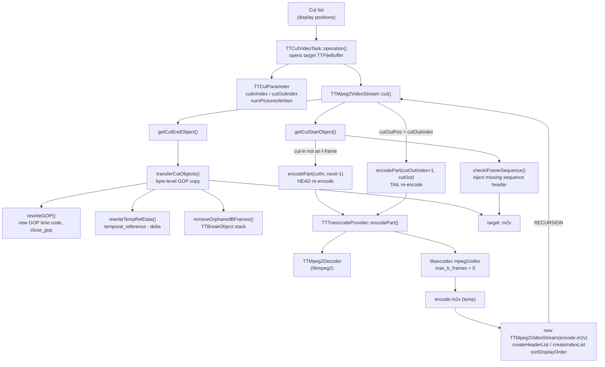

# Code Map: MPEG-2 Cut

**Scope:** The MPEG-2 cutting engine — from a display-order cut list to a written
`.m2v` elementary stream. Covers `TTMpeg2VideoStream::cut()`, the segment
boundary objects it derives, the byte-level stream copy in `transferCutObjects()`,
and the re-encode escape hatch via `TTTranscodeProvider`.

**Terminology note:** This engine predates the term "Smart Cut" (it descends from
the original TTCut, 2003). It performs the same *kind* of work — copy whole GOPs,
re-encode only the boundary frames — but shares no code with `TTESSmartCut`. The
only overlap is the settings flag `TTSettings::logSmartCut()`, which gates the
debug logging of both.

**Not covered here:**
- H.264/H.265 cutting → `smart-cut.md` (`TTESSmartCut`, a completely separate engine).
- Navigation / still-image display order → `frame-order.md`, which is the authority
  for the claim this map depends on: **for MPEG-2, `TTVideoIndexList` is sorted into
  display order** by `sortDisplayOrder()` (called from `data/ttopenvideotask.cpp`),
  so every position in this map is a display position unless stated otherwise.

## Data flow



## Edge semantics

| From → To | What crosses (data / order / invariant) |
|---|---|
| `TTCutVideoTask` → `cut(cutIn, cutOut)` | **Display** positions. `TTVideoIndexList` was display-sorted at open time, so list position = display rank. |
| `TTVideoIndexList::headerListIndex(pos)` → caller | The **bitstream (decode-order)** position of the picture displayed at `pos`. This is the display→decode bridge, the MPEG-2 analogue of `TTDisplayOrderMap`. |
| `cut()` → `getCutStartObject()` | Runs **before** the stream copy. If the cut-in is not an I-frame it calls `encodePart()`, which writes the re-encoded head **directly into the target buffer**. Output byte order is therefore: head re-encode → (optional) injected sequence header → stream copy → tail re-encode. |
| `getCutStartObject()` → `encodePart()` | Encodes `[cutIn .. nextI-1]`, clamped to `cutOut` when the next I-frame lies beyond the segment. Then sets `cutInIndex = iFramePos` — the copy starts at the I-frame, not at the user's cut-in. |
| `checkIFrameSequence()` → target buffer | Copies raw bytes `[sequence_header .. gop_header-1]` when the I-frame's GOP is not preceded by a sequence header. Throws if neither a sequence header nor a GOP header can be found. |
| `getCutEndObject()` → `endObject` | Walks **backwards over display positions** to the last I/P frame (`ipFramePos`), then extends `endObject` forward over the B-frames that follow that I/P **in the header list (bitstream order)**. Two different index domains in one function — see pitfalls. |
| `getCutEndObject()` → `cutParams->cutOutIndex` | Always `ipFramePos` (the last I/P at or before the cut-out in display order). A conditional overwrite with `cutOutPos` was the B-frame cut-out defect — removed in `3b087ae`, see below. |
| `cut()` → `encodePart()` (tail) | Fires only when `cutOutPos > cutParams->getCutOutIndex()`. Re-encodes `[cutOutIndex+1 .. cutOutPos]` to deliver the frames the stream copy could not. |
| `transferCutObjects()` → target buffer | Copies bytes from `startObject->headerOffset()` up to `endObject`, in 256 KiB chunks, patching headers **in the buffer** as they pass. A 12-byte watermark guards against a header straddling the chunk boundary; an end-of-stream guard prevents an infinite `seekBackward` loop when the remainder already fits. |
| `transferCutObjects()` → `rewriteGOP()` | Rewrites the GOP time code from `cr->getNumPicturesWritten()` (the *output* frame counter, not the source position) and forces `closed_gop` when the first picture of that GOP has `temporal_reference != 0`. |
| `transferCutObjects()` → `rewriteTempRefData()` | Subtracts `tempRefDelta` from `temporal_reference` and rewrites the 10-bit field in place, re-packing `picture_coding_type` and 3 bits of `vbv_delay` in the same two bytes. |
| `transferCutObjects()` → `removeOrphanedBFrames()` | Pushes a `TTBreakObject` (stop/restart offsets) so B-frames whose references were cut away are skipped by advancing `bufferStartOffset` past them. `sequence_end_code` is elided the same way. |
| `encodePart()` → `TTTranscodeProvider` | Encoder parameters (size, aspect, bitrate, fps) come from the **sequence header at `current_index`**, interlace/TFF from the picture header — not from the segment being encoded. |
| `encodePart()` → `cut()` (recursion) | The re-encoded `encode.m2v` is reopened as a fresh `TTMpeg2VideoStream`, display-sorted, and **cut again** with `cut(0, end-start)`. Termination relies on the encoder emitting an I-frame at position 0 (`max_b_frames = 0`), so `getCutStartObject` finds `pictureCodingType(0) == 1` and does not recurse further. |
| `TTCutParameter::numPicturesWritten` | Accumulates across **all** cuts of a session (`firstCall()` once, `lastCall()` once, one `TTCutParameter` for the whole cut list). Feeds the rewritten GOP time codes, which is why it must count output frames. |

## Variant matrix — cut-in / cut-out frame type

`isCutInPoint()` / `isCutOutPoint()` gate only the GUI buttons in
`gui/ttcutframenavigation.cpp`; nothing in the cut path enforces them.
**`TTSettings::mEncoderMode` defaults to `true`**, and in that mode both return
`true` for every position — so B-frame cut-outs are the default-reachable case.

| | Cut-in | Cut-out |
|---|---|---|
| **I-frame** | Pure stream copy from the I-frame. No re-encode. | Correct. Copy ends at the I/P plus its bitstream-trailing B-frames. |
| **P-frame** | Head re-encode `[cutIn .. nextI-1]`, then copy from `nextI`. | Correct (measured: `cut(0,3)`, `cut(0,6)`, `cut(0,9)` all write `cutOut-cutIn+1` frames). |
| **B-frame** | Head re-encode, as for P. | Correct since `3b087ae` (was: up to M−1 frames silently dropped — see the fixed defect below). Tail re-encode `[ipFramePos+1 .. cutOut]` supplies the frames after the last copied I/P. |
| **encoderMode = false** | GUI only offers I-frames. | GUI only offers I/P. The broken path is unreachable *through the GUI*, but a `.ttcut` project storing a B-frame cut-out still reaches it. |

Orthogonal to the table: with **field-picture** material every field pair occupies
two display positions (one real frame), so cut positions count fields. Measured,
independent of the cut-out defect — and **harmless** (see the field-picture note
below): the video cut copies the field pictures byte-for-byte and they decode
pixel-identically; the documented ProjectX demux strips field pictures entirely.

## Assumptions, contracts & pitfalls

- **`TTFileBuffer::readByte()` throws `StreamEOF` past the last valid byte**
  (since `add2ac8`, 2026-07-13). Before that it silently returned stale
  ring-buffer cells beyond `writePos`; the header-list parser then fabricated
  a phantom `picture_start_code` 3 bytes before EOF, and `getByteCount()`
  (whose "last header → `stream_buffer->size()`" rule only applies when the
  phantom is absent) truncated the final slice of a re-encoded segment —
  decoders reported `ac-tex damaged` at the last macroblock. The header-list
  parsers rely on the exception as their regular end-of-stream path.
  `nextStartCodeTS()` additionally stops when fewer than 4 valid bytes remain.
  Scanner regression tool: `tools/diag/test_startcode_scan <file>`.

- **`getCutStartObject()` — no I-frame at/after a non-I cut-in.**
  `moveToNextIndexPos(cutInPos, 1)` returns **-1** when the source ends inside
  the GOP that follows the cut-in (recording cut off mid-GOP; the only I-frame
  precedes the cut-in and cannot be used). Since `2dd104c` (2026-07-13) this is
  handled like "next I beyond cutOut": the whole
  `[cutIn..cutOut]` segment is re-encoded and the **last header** is returned
  so `cut()` skips the transfer. Before the fix `encodeEnd` became -2 and
  `encodePart` threw an uncaught exception (SIGABRT). Repro:
  `test_mpeg2_cutout TEST.m2v 73470 73474`.

- **`TTVideoIndexList` (MPEG-2)** — display-sorted after `sortDisplayOrder()`.
  `pictureCodingType(pos)` is the type of the frame *displayed* at `pos`;
  `headerListIndex(pos)` is that frame's *bitstream* position. Mixing the two
  domains in one expression is the root of the defect below.

- **`getCutEndObject()` — DEFECT FIXED in `3b087ae` (2026-07-12).** The guard

  ```
  if (bFrameCount > 0 && cutOutPos <= ipFramePos + bFrameCount)
      cutParams->setCutOutIndex(cutOutPos);
  ```

  added a **display** index (`ipFramePos`) to a count of B-frames collected in
  **bitstream** order (`bFrameCount`). In an IBBP GOP the B-frames following a P
  in the bitstream are the ones displayed *before* it. Setting `cutOutIndex` to
  `cutOutPos` then made `cut()`'s condition `cutOutPos > getCutOutIndex()` false,
  suppressing the tail re-encode that should have supplied the missing frames.
  The "duplicate frames" case its comment claimed to prevent was disproved before
  removal — structurally (the re-encode range `ipFramePos+1..cutOutPos` is
  disjoint from the copied display range) and empirically (A/B over 8 cut-out
  positions on TEST.m2v incl. open-GOP boundaries: no duplicates, no reorder,
  I/P cases bit-identical with and without the block). Post-fix regression:
  TEST.m2v all 8 positions exact; Futurama M=4 all B positions exact (worst case
  had lost 3 = M−1); GUI `--auto-cut` end-to-end byte-identical to the engine.

  Measured with `tools/diag/test_mpeg2_cutout` on two independent real DVB
  recordings with different GOP shapes:

  `TEST.m2v` — 720×576i25, IBBP **M=3**, frame-picture:

  | cut | cut-out type | requested | written | result |
  |---|---|---|---|---|
  | `cut(0,3)` | P | 4 | 4 | OK |
  | `cut(0,4)` | B | 5 | 4 | 1 frame lost |
  | `cut(0,5)` | B | 6 | 4 | 2 frames lost |
  | `cut(0,6)` | P | 7 | 7 | OK |
  | `cut(0,9)` | P | 10 | 10 | OK |

  Futurama 02x01 (Comedy Central, VDR) — **M=4**, contains field pictures:

  | cut | cut-out type | expected | written | result |
  |---|---|---|---|---|
  | `cut(0,4)` | P | 5 | 5 | OK |
  | `cut(0,5)` | B | 6 | 5 | 1 frame lost |
  | `cut(0,6)` | B | 7 | 5 | 2 frames lost |
  | `cut(0,7)` | B | 8 | 5 | 3 frames lost |
  | `cut(0,8)` | P | 9 | 9 | OK |

  Exactly the frames between the last I/P and the requested cut-out were dropped —
  **up to M−1 frames**. Cut-out on I or P was always correct. The defect did not
  fire when the I/P is followed immediately by another I/P in the bitstream
  (`bFrameCount == 0`) — e.g. the `I P B B B` head of an M=4 GOP, or the entire
  field-picture region of Futurama 02x01 (there the B fields follow the P in the
  bitstream, so no trailing Bs after an I/P exist and old == new behavior).

  The line entered with `bb83d60` (2026-03-21), a commit whose message covers only
  i18n standardization and progress scaling — it was never the subject of a test,
  and its "duplicate B-frames" justification turned out to be plain wrong.

- **Measurement pitfall: ffmpeg frame index `n` ≠ TTCut display index.** A
  demuxed VDR ES typically starts with open-GOP leading B-frames whose reference
  GOP predates the recording; ffmpeg (and mpv) **drop them at decode**, TTCut's
  index list counts them. Futurama 02x01: TTCut index 85720 = 85495 decoded
  frames + 222 field-pair double entries + 3 dropped leading Bs → before the
  field region, `ffmpeg-n = TTCut-display − 3`. Any SSIM/`select=n` oracle
  against a demuxed ES must correct for this or it reports phantom offsets
  (same trap class as the HEVC RASL "+7"). TEST.m2v starts with an I in display
  order, so there the two rulers coincide.

- **Field-picture coding — the index list double-counts (measured 2026-07-10).**
  `createIndexList()` calls `index_list->add()` once per `picture_start_code`, so a
  field-picture frame (`picture_structure` 1/2) yields **two** `TTVideoIndex`
  entries carrying the same `temporal_reference`, hence the same `display_order`.
  `mExtraIndices` records the second entry of each pair but does **not** remove it;
  it is consumed only by the audio cut-time correction (`data/ttavdata.cpp`) and the
  still-image display (`gui/ttcurrentframe.cpp`), never by the video cut path.

  **Consumer preference flipped (`b69dfcf`, `fc2a573`, 2026-07-12).** `TTAVData`'s
  `loadExtraFrameIndices()` now prefers this parser list (`extraIndices()`) over the
  `.info` `es_extra_frames` list for audio time correction — previously `.info` was
  tried first and the parser list was only a fallback when `.info` was empty. Because
  `extraIndices()` is populated by the (async) header-list build and is still empty
  when `TTAVData::openAVStreams()` runs synchronously, the preference decision — and
  a new cluster-classification step (`showExtraFrameClusterDialog()`) that confirms a
  `.info` cluster as a real field-pair group when a parser `extraIndices()` position
  lies within ±4 of it, labelling it "Feldpaare:" instead of "Defekt:" in the warning
  dialog — was moved to `onOpenVideoFinished()`, gated by `mpPendingExtraFrameDialog`
  (set only on a fresh open, mirroring `mpPendingVdrMarkers`, so project reload does
  not re-show the dialog). Full detail on the audio-correction consumer itself:
  `audio-cut-timing.md`.

  Consequence: **display positions count fields, not frames.** Measured on Futurama
  02x01: 85 720 index entries for 85 495 real frames (222 field pairs, first at
  picture 11 673, clustered mid-stream); on a 90-frame excerpt, 95 index entries.
  A cut list position therefore drifts against the true frame number by the number
  of field pairs preceding it.

  Note what was **disproved**: an earlier version of this map claimed the field
  pairs make the `getCutEndObject` defect *worse* by inflating `bFrameCount`. The
  measurement does not support that — cut-outs inside the field region
  (`cut(0,21)`, `cut(0,22)`) lose exactly 1 frame, the same as an ordinary B-frame
  cut-out, and `cut(0,24)` / `cut(0,28)` are correct. The two problems are
  independent.

  **Verdict: harmless, closed 2026-07-16.** Reproduced on real material (Futurama
  02x01, both demux paths) with `tools/diag/dump_mpeg2_fields` +
  `tools/diag/test_mpeg2_cutout`:
  - **Unreachable via the documented workflow.** ProjectX (the mandated MPEG-2
    demux) normalizes field pictures to frame pictures: the ffmpeg `-c:v copy` ES
    carries 222 field pairs (85 721/85 499 entries), the ProjectX ES carries **0**.
    Field pairs only reach TTCut if ProjectX is bypassed.
  - **No frame loss, no corruption even then.** A cut spanning the field region
    writes 39 coded pictures that decode to 37 real frames (the two pairs collapse),
    with 0 decoder errors; a cut-out landing on a second field or on the first field
    of a pair (dropping its partner) is likewise clean. The decoded field-region
    frames are **pixel-identical** to the source (md5, 9 frames).
  - The only real-world effect (non-ProjectX path only) is cosmetic: an inflated
    frame counter and two navigation stops per real frame in the field region. No fix.

- **`transferCutObjects()`** — assumes a picture header never spans the 12-byte
  watermark at the end of a 256 KiB chunk; guarantees in-place header rewriting of
  the copied bytes. Pitfall: it patches the *buffer*, so `rewriteGOP` /
  `rewriteTempRefData` must both bounds-check against 262144 — both do, and both
  log an error and return silently on violation rather than corrupting the output.

- **`encodePart()` recursion** — terminates only because the transcode encoder is
  configured with `max_b_frames = 0`, guaranteeing an I-frame at output position 0.
  A future encoder change that emits a leading non-I picture would turn this into
  unbounded recursion. Nothing asserts the invariant.

- **`encodePart()` temp files** — hardcoded basename `encode.*` in
  `TTSettings::tempDirPath()`, deleted by a glob after the recursive cut. Two
  concurrent cuts in the same temp directory would collide; the cut path is
  single-threaded per `TTThreadTaskPool`, so this is latent, not live.

- **`getCutStartObject()`** — sets `cutInIndex` to the *I-frame* position, not the
  user's cut-in. Callers reading `cutParams->getCutInIndex()` after `cut()` get the
  copy start, not the requested start. `TTCutVideoTask` re-sets both indices before
  every cut, so it does not observe this.

## Redundancy / consolidation candidates

- **Two independent display↔decode bridges**: MPEG-2 uses
  `TTVideoIndexList::headerListIndex()` (list sorted by display, entry carries the
  bitstream index); H.26x uses `TTDisplayOrderMap::displayToDecode()`. Same concept,
  two implementations, two vocabularies. Kept separate because MPEG-2's mapping is a
  by-product of the header list it must build anyway — a merge would buy little.

- **Two "re-encode the boundary GOP" engines**: `TTTranscodeProvider::encodePart`
  (MPEG-2, libmpeg2 decode → libavcodec `mpeg2video` encode) and
  `TTESSmartCut::reencodeFrames` (H.26x, libav decode → libx264/x265). Both pin
  `max_b_frames = 0` for clean segment transitions, both recreate the encoder per
  segment. The *policy* is duplicated; the codecs are not. A shared
  "boundary re-encoder" interface would document the shared invariant
  (`no B-frames at a segment seam`) that is currently only a comment in each.

- **[RESOLVED `9e3b0d0`]** Frame-type magic numbers: `== 1 / 2 / 3` was open-coded
  in `isCutInPoint`, `isCutOutPoint`, `getCutStartObject`, `getCutEndObject` and
  `transferCutObjects`. Now `enum Mpeg2PicCoding { MPEG2_PIC_I/P/B = 1/2/3 }` in
  `ttmpeg2videoheader.h` (per ISO/IEC 13818-2 Table 6-12); all sites use the named
  constants. Pure rename, identical values.
