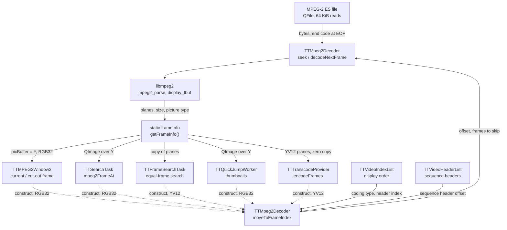

# Code Map: MPEG-2 decoder (`TTMpeg2Decoder`)

**Scope:** the libmpeg2 wrapper every MPEG-2 picture goes through — how
`TTMpeg2Decoder` opens the elementary stream, reaches a display position
(`moveToFrameIndex`: back to an I picture in the index list, back to a
sequence header in the header list, seek, decode forward), what one decoded
frame is (`TFrameInfo`: plane pointers, geometry, picture type), and what its
five users take from it: the two picture windows, the black/scene/logo
search, the equal-frame search, the quick-jump thumbnails and the re-encode
at MPEG-2 cut points.

**Neighbours, not part of this map:** how the header and index lists are
built and sorted (`TTMpeg2VideoStream`, [mpeg2-cut.md](mpeg2-cut.md),
[frame-order.md](frame-order.md)); the searches' task logic
([detection-and-search.md](detection-and-search.md)); the quick-jump dialog
([quick-jump.md](quick-jump.md)); what the cut does with the re-encoded
frames ([mpeg2-cut.md](mpeg2-cut.md)); H.264/H.265 decoding (`TTFFmpegWrapper`).

## Data flow

Legend: solid = data, dashed = trigger (who creates / drives the decoder).

## Edge semantics

| From → To | What crosses (data / order / invariant) |
|---|---|
| users -.-> `MOVE` | `new TTMpeg2Decoder(file, indexList, headerList, pixelFormat)`: opens the file (`QFile`, 64 KiB stream buffer), `mpeg2_init`, then `decodeFirstMPEG2Frame` = full reset + decode from byte 0. Throws `TTMpeg2DecoderException` (`DecoderInit`, `StreamOpen`; `ArgumentNull` only when **both** lists are null). Windows (`openVideoFile`) and quick jump keep the default `formatRGB32`; the transcode, the equal-frame search and the frame search's reference decoder switch to `formatYV12` via `decodeFirstMPEG2Frame(formatYV12)` after construction. One instance per user; the windows construct theirs on the GUI thread, the search tasks, quick jump and transcode theirs while their task runs. |
| `IDX` → `MOVE` | `moveToFrameIndex(pos)`, `pos` = position in the display-ordered index list (`sortDisplayOrder`). Walks back to the nearest position with coding type 1 (I) — in display order — and takes that entry's header-list index. `videoIndexAt(pos)` for a position outside the list is not checked here (the frame search clamps its range because of that). |
| `HDR` → `MOVE` | From the I picture's header-list index back to the nearest `sequence_start_code`; its `headerOffset()` is the seek target (0 when none is found). |
| `MOVE` → `DEC` | `seek(offset)`: `QFile::seek`, `mpeg2_reset(full_reset = offset == 0)`, one `decodeNextFrame`; then `decodeNextFrame` until the displayed picture is an I (`frameInfo.type == 1`); then `skipFrames(pos − Ipos)` output pictures. Position arithmetic is in **output (display) order**, the order libmpeg2 hands pictures out. Returns `pos` whatever happened. |
| `FILE` → `DEC` | `decodeNextFrame`: `mpeg2_parse` loop; on `STATE_BUFFER` the next 64 KiB; at EOF once a `sequence_end_code` (00 00 01 B7) so libmpeg2 flushes its last pictures — unless `isStreamEnd` is already set in this call, which every `STATE_SEQUENCE` also does (it falls through to `STATE_END`). `STATE_SEQUENCE` sets the libmpeg2 colour conversion for RGB24/RGB32; nothing for YV12. |
| `LIB` → `FI` | On `STATE_SLICE`/`STATE_END`/`STATE_INVALID_END`/`STATE_SEQUENCE` with a `display_fbuf`: Y/U/V plane pointers (libmpeg2's buffers, valid until the next decode call of **this** decoder), width/height/chroma geometry of the sequence, `type` = display picture coding type (`flags & 3`: 1 I, 2 P, 3 B), `size` by pixel format. Written into **one file-scope `static TFrameInfo`** shared by every instance; `getFrameInfo()` returns a pointer to it (or null after a failed decode). |
| `FI` → `WIN` | `TTMPEG2Window2::moveToVideoFrame` → `getFrameInfo()`: `picBuffer = Y` (RGB32 data), `videoWidth/Height`; kept for later repaints and `saveCurrentFrame`. The two windows (current frame, cut-out frame) each own a decoder, both on the GUI thread. |
| `FI` → `SRCH` | `TTSearchTask::mpeg2FrameAt(pos)`: `moveToFrameIndex` + `QImage(Y, w, h, RGB32)` over the decoder buffer (valid until the next decode); `frameAt` copies, the gray helpers convert. One decoder per task (`setupWorkers` forces one worker for MPEG-2), opened in `establishStartPosition` when the task starts. |
| `FI` → `FSRCH` | Reference frame: own decoder, `moveToFrameIndex(ref)`, `refInfo = *getFrameInfo()` then `captureRefBuffers` copies the planes, decoder deleted. Search: second decoder, `decodeFirstMPEG2Frame(formatYV12)`, `moveToFrameIndex(start)`, then per step `moveToFrameIndex(start + i)` (range clamped to the stream). |
| `FI` → `QJ` | Per thumbnail `moveToFrameIndex(frameIndex)` **and then** `decodeMPEG2Frame()` — which decodes the *next* output picture — and wraps that in a `QImage`. One worker per page, decoder created in the worker. |
| `FI` → `TRANS` | `encodeFrames(vs, start, end)`: per frame `moveToFrameIndex(start + i)` (a full seek from the sequence header for every frame) and the YV12 planes straight into an `AVFrame` (`linesize` = width / chroma width) for the MPEG-2 encoder. Runs in the cut task's thread. |

## Assumptions, contracts & pitfalls

- **Positions are display positions.** `moveToFrameIndex` walks the sorted
  index list and counts output pictures; field-picture material counts
  fields in the index list (see `mpeg2-cut.md`, "Field pictures").
- **Every move is a seek.** No sequential shortcut: each call resets
  libmpeg2 at the preceding sequence header and decodes forward — the cost
  per frame is the distance from that header.
- **The frame struct is shared, the planes are not.** The planes belong to
  the decoder that decoded them; the `TFrameInfo` holding the pointers is one
  static for all instances (`ttframeinfo.h` documents the per-decoder
  lifetime of the planes, not of the struct).
- **Pixel format after construction.** The constructor always decodes the
  first picture with the format it was given (default RGB32); YV12 users
  switch with `decodeFirstMPEG2Frame(formatYV12)`, which relies on the full
  reset at byte 0 re-entering `STATE_SEQUENCE` without a conversion call.
- **Out-of-range positions are not guarded** in `moveToFrameIndex`.
- `desiredFrameType` / `desiredFramePos` are public members nobody reads;
  `intraFramePosition < 0` in `moveToFrameIndex` is unreachable; a
  commented-out older search loop is left in the method.

### Reading hypotheses for audit run 13

From reading only; each needs a runtime proof or refutation first.

- **H1 — one `frameInfo` for all decoders.** Two decoders in different
  threads (a window on the GUI thread and a search, quick-jump, equal-frame
  search or cut transcode in a pool thread) write the same struct; a caller
  can read another stream's plane pointers and geometry between its decode
  and its `getFrameInfo()`. Measure with two threads decoding two MPEG-2
  files of different size and checking width/height; then whether a GUI
  decode can actually overlap a running MPEG-2 search or cut.
- **H2 — a sequence header not repeated per GOP lands in an earlier GOP.**
  The forward decode stops at the **first** displayed I after the sequence
  header, which is the target's I only if that header opens the target's
  GOP; otherwise `skipFrames` counts from an earlier I and the wrong picture
  is shown, searched or re-encoded. Measure on a stream with one sequence
  header (count sequence headers vs. GOPs on the fixtures first).
- **H3 — the last pictures of a file may never flush.** The end code is
  appended at EOF only while `isStreamEnd` is false; a `STATE_SEQUENCE` in
  the same call sets it (fall-through into `STATE_END`), so the final
  pictures of the stream can stay inside libmpeg2. Measure `moveToFrameIndex`
  on the last positions of the MPEG-2 fixtures.
- **H4 — quick-jump thumbnails show the picture after the target.**
  `decodeMPEG2Frame` after `moveToFrameIndex` decodes one more output
  picture. Compare a thumbnail with the window's picture at the same index.
- **H5 — the argument check needs both lists null.** `ArgumentNull` is
  thrown only when index **and** header list are null; one null list is a
  null dereference later (`videoIndexAt` in `decodeFirstMPEG2Frame`,
  `headerTypeAt` in `moveToFrameIndex`).
- **H6 — per-frame seek in the cut transcode.** `encodeFrames` seeks from the
  sequence header for every frame of a re-encoded range; cost grows with the
  distance to the header. Measure the time for a range against a sequential
  decode.

## Redundancy / consolidation candidates

- **Decoded picture as a QImage**
  - sites: `data/ttsearchtask.cpp:TTSearchTask::mpeg2FrameAt`, `gui/ttquickjumpworker.cpp:TTQuickJumpWorker::operation` (MPEG-2 branch), `mpeg2window/ttmpeg2window2.cpp:TTMPEG2Window2::getFrameInfo`
  - shared purpose: move to a position, wrap the RGB32 plane in an image
  - status: candidate → one decoder method (`frameImageAt(pos)`); the quick-jump copy is also the one that decodes a picture too far (H4)
- **Opening an MPEG-2 decoder for a stream**
  - sites: `data/ttframesearchtask.cpp:TTFrameSearchTask::openMpeg2DecoderFor`, `data/ttsearchtask.cpp` (MPEG-2 branch of the decoder setup), `gui/ttquickjumpworker.cpp`, `extern/tttranscode.cpp:TTTranscodeProvider::encodeFrames`, `mpeg2window/ttmpeg2window2.cpp:TTMPEG2Window2::openVideoFile`
  - shared purpose: construct from file + index list + header list, catch `TTMpeg2DecoderException`, optionally switch to YV12
  - status: kept separate → the error policy differs per caller (log and return, null, rethrow)
