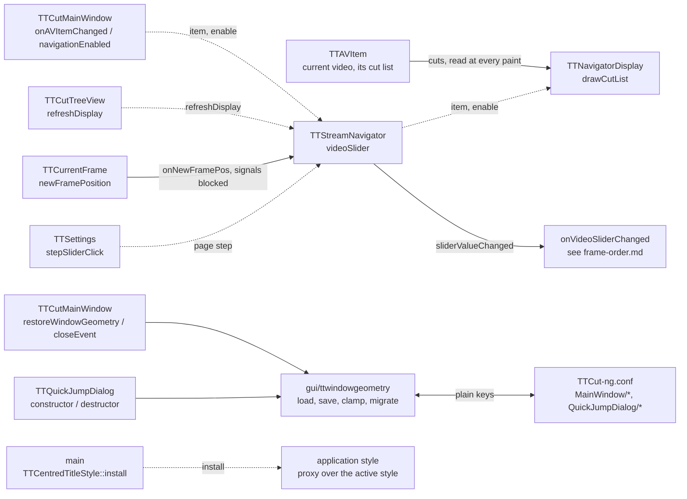

# Code Map: Navigator and window

**Scope:** the stream navigator under the picture — the video slider
(`TTStreamNavigator`) and the cut overview bar above it (`TTNavigatorDisplay`)
— and what the main window keeps about itself: the window and dialog
geometry in plain settings keys (`gui/ttwindowgeometry.*`) and the
application-wide style proxy that centres group-box titles
(`TTCentredTitleStyle`).

**Neighbours, not part of this map:** what a slider position does once it is
handed on (debounce, decode, display vs. decode order —
[frame-order.md](frame-order.md)); the cut list itself and how cuts are edited
([cut-edit-and-start.md](cut-edit-and-start.md)); the quick-jump dialog's
content ([quick-jump.md](quick-jump.md)); the settings state machine
([settings-state.md](settings-state.md)).

## Data flow

Legend: solid = data, dashed = trigger / configuration.

## Edge semantics

| From → To | What crosses (data / order / invariant) |
|---|---|
| `MW` -.-> `SN` | `TTCutMainWindow::onAVItemChanged` calls `TTStreamNavigator::onAVItemChanged(item)` after the frame widgets and `onNewFramePos`, then `navigationEnabled(true)`. Slider range `0 .. frameCount()-1` — the same positions the current-frame widget uses. A null item (via `closeProject`) disables the slider and sets the range to `0 .. 0`. `navigationEnabled(bool)` → `controlEnabled`: slider enabled state plus the display's. |
| `SN` -.-> `ND` | The navigator forwards the item and the enable state. The display keeps its own `mControlEnabled` and sets it to `true` on every non-null item, independently of the slider. `mMaxValue = frameCount()-1` (at least 1), `mMinValue = 0`. |
| `AVI` → `ND` | `paintEvent` draws only with an item and enabled: dark background (= removed), then per cut of `mAVDataItem` (`cutListItemAt`, read at every paint) a green gradient from `cutIn*scale` over `(cutOut-cutIn)*scale` pixels, a green line at the cut-in and a gold one at the cut-out; `scale = width / (mMaxValue - mMinValue)`, computed in `drawCutList`, positions truncated to int. Only the current video's cuts. The item is a raw pointer, replaced only through `onAVItemChanged`. |
| `TV` -.-> `SN` | `refreshDisplay` → `onRefreshDisplay` → `update()` of the display (coalesced: a project load appends its cuts one by one). Emitted by `TTCutTreeView::onAppendItem`, `onUpdateItem` and `onRemoveItem` — every change of the cut list the tree shows, the delete button's included. Other repaints: `controlEnabled` (`repaint`), `onAVItemChanged` (`update`), resizes. |
| `SN` → `DEC` | `valueChanged` → `sliderValueChanged(pos)` → `TTCutMainWindow::onVideoSliderChanged` (debounced decode, [frame-order.md](frame-order.md)). No `sliderMoved` → `processEvents` coupling any more. |
| `CF` → `SN` | `TTCurrentFrame::newFramePosition` → `TTCutMainWindow::onNewFramePos`: `setValue` with the slider's signals blocked, so a position set from outside never decodes a second time. |
| `SET` -.-> `SN` | Page step = `TTSettings::stepSliderClick()` at construction and on `stepSliderClickChanged`. |
| `MWG` → `WG` | Restore, in the main window's constructor: `ttMigrateGeometryBlob` and `ttImportStrayQuickJumpSize` (one-time upgrades), `ttLoadWindowGeometry("MainWindow")`, then the screen whose available area contains the saved rect's centre, `ttClampToArea` into it, `showMaximized` when saved so. No such screen or no valid group: 80 % of the primary screen, centred. Save, in `closeEvent` **before** the unsaved-project question: `normalGeometry()` + `isMaximized()`; `TTSettings::save()` follows there too. |
| `QJ` → `WG` | Size only (`ttLoadDialogSize` / `ttSaveDialogSize`, group `QuickJumpDialog`), default 80 % of the **primary** screen, clamped to it; Qt centres the dialog over the main window. Saved in the destructor. |
| `WG` ↔ `QS` | `QSettings("TTCut-ng", "TTCut-ng")`, keys `x`, `y`, `width`, `height`, `maximized` (dialogs: `width`, `height`). A group missing a key or with a non-positive size is invalid, never half-applied. Legacy `geometry` blob: decoded once (magic, major 1–3, `normalGeometry`, `maximized`) and removed; plain keys win when both exist. The stray `~/.config/Unknown Organization/TTCut-ng.conf` is imported once and deleted only when nothing else is in it. |
| `MAIN` -.-> `STY` | After `QApplication` and `TTSettings::instance()`: the active style is recreated by name (`QStyleFactory::create`) and wrapped in `TTCentredTitleStyle`, which sets `textAlignment = AlignHCenter` for `CC_GroupBox` in `drawComplexControl` and `subControlRect`. A style name that is not a factory key → warning, nothing installed. |

## Assumptions, contracts & pitfalls

- **No stylesheet on the application.** Any application stylesheet wraps the
  style in `QStyleSheetStyle` for every widget and stops the indeterminate
  progress-bar animation under Breeze/Oxygen (measured in the header of
  `gui/ttcentredtitlestyle.h`, harness `tools/diag/test_pulse_stylesheet`).
  Centred titles therefore come from the proxy.
- **The display's item pointer is raw.** `TTAVData::onRemoveAVItem` hands the
  GUI a neighbour before removing an item and a null item right after the last
  one, without an event loop in between, so the display never paints a freed
  item.
- **Geometry lives outside `TTSettings`** — per-window UI state, written
  directly through `QSettings`; the helpers are free functions without widget
  dependency so `tools/diag/test_window_geometry` (gate `window_geometry`)
  drives them headless.
- Under Wayland a client cannot place its top-level window; the saved
  `x`/`y` then only decide which screen's area the size is clamped to (Qt
  behaviour, not measured here).

- **Offscreen measurement:** `QScreen::grabWindow` returns an empty image on
  the offscreen platform; what the bar shows is measured through its Paint
  events instead (`tools/diag/test_navigator_refresh`, gate
  `navigator_refresh`).
- **Open, not measured:** the quick-jump dialog is sized and clamped for the
  primary screen, not for the screen the main window is on (`TODO.md`).

## Redundancy / consolidation candidates

- **Default size “80 % of the primary screen”**
  - sites: `gui/ttcutmainwindow.cpp:TTCutMainWindow::restoreWindowGeometry`, `gui/ttquickjumpdialog.cpp:TTQuickJumpDialog::TTQuickJumpDialog`
  - shared purpose: a first-start size relative to the available area
  - status: candidate → one helper in `gui/ttwindowgeometry` (would also be the place to pick the right screen, N4)
