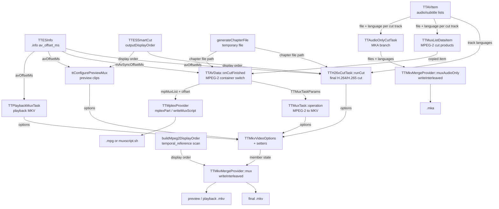

# Code Map: Output mux (MKV, MKA, MPG)

**Scope:** everything between "the cut elementary streams exist" and "the
output file exists": which caller configures `TTMkvMergeProvider` how, what
`mux()` does to timestamps, tracks, languages and chapters, the two places an
A/V offset is applied, the mplex branch as the second sink for MPEG-2, and the
output name and ES cleanup afterwards.

**Neighbours, not part of this map:** progress brackets and the cancel
machinery ([progress-reporting.md](progress-reporting.md)), how the cut job is
built ([cut-edit-and-start.md](cut-edit-and-start.md)), the per-track delay
and audio snapping ([audio-cut-timing.md](audio-cut-timing.md)), where
`outputDisplayOrder` comes from ([smart-cut.md](smart-cut.md)), the playback
MKV cache ([playback.md](playback.md)), the settings classes
([settings-state.md](settings-state.md)), what `av_offset_ms` in the `.info`
means ([ttcut-demux.md](ttcut-demux.md)).

Legend: every arrow carries data (producer → consumer). No trigger edges.

## Edge semantics

| From → To | What crosses (data / order / invariant) |
|---|---|
| `TTESInfo` → `TTH26xCutTask` | `TTESInfo::timingForVideo(sourceFile).avOffsetMs`, read in `TTAVData::doH264Cut` and put into `TTH26xCutParams::mux` through `TTMkvMergeProvider::videoOptionsFor()`. Non-zero only when the `.info` has timing info **and** a non-zero `av_offset_ms`. |
| `TTESInfo` → `TTAVData::onCutFinished` | Same value, read by hand in `TTAVData::onDoCut` (`findInfoFile` + `TTESInfo`, same two conditions) into the member `mAvSyncOffsetMs`; that branch keeps the `TTESInfo` object because `loadExtraFrameIndices` needs it too. |
| `TTESInfo` → `ttConfigurePreviewMux` | `ttResolvePreviewSource` fills `TTPreviewSource::avOffsetMs` from `timingForVideo`. |
| `TTESInfo` → `TTPlaybackMuxTask` | `TTCurrentFrame::buildPlaybackMuxParams` builds `TTPlaybackMuxParams::video` from `timingForVideo`; audio is the first track's **source** ES (uncut), so no per-track delay is in it (see playback.md). |
| `TTAVItem` → `TTH26xCutTask` | Audio languages: `audioListItemAt(i).getLanguage()` for **every** track `0..audioCount()-1`, collected after the track-count check guaranteed all tracks were cut, so index `i` lines up with the file list. Subtitle files and languages come from the `cutSubtitleTracks` callback, appended only for `ok` tracks — the two lists stay aligned with each other. |
| `TTAVItem` → `TTMuxListDataItem` | MPEG-2 synchronous phase in `onDoCut`: `appendAudioFile(path, lang)` / `appendSubtitleFile(path, lang)` per `ok` callback; `lang` is the same `getLanguage()` of the track list. Must complete before the pool starts (see the ordering comment above the `connect` in `onDoCut`). |
| `TTAVItem` → `TTAudioOnlyCutTask` | `trackFiles`/`trackLanguages` from the `cutAudioTracks` callback, `ok` tracks only. A track short of the requested count ends the run **before** the MKA mux, like the video cuts. |
| `TTESSmartCut` → `TTH26xCutTask` / preview | `outputDisplayOrder()` — one source display rank per written AU, empty on any anomaly (see smart-cut.md). Copied into `TTMkvVideoOptions::displayOrder` after the cut, unchanged. |
| `generateChapterFile` → callers | Path of a `QTemporaryFile` `ttcut-chapters-XXXXXX.txt` in `cutDirPath`, written only when `workingMkvCreateChapters && workingMkvChapterInterval > 0` and `mLastCutResultMs > 0`; the caller removes it after the mux and on a cancel. Chapters sit at fixed intervals from 0, named `Chapter NN`; they do **not** follow the cut points. The H.26x path also demands `finalOutput.endsWith(".mkv")`, which `doH264Cut` already guarantees. |
| `TTMuxListDataItem` → `onCutFinished` | `mpMuxList->appendItem(*cutVideoTask->muxListItem())`, then `itemAt(count()-1)`. The list is created once per `TTAVData` and never cleared, so it holds one item per **MPEG-2** cut of the session; nothing else appends to it, and only the mplex branch reads it. |
| `onCutFinished` → `TTMuxTask` | `TTMuxTaskParams`, copied on the GUI thread: `video` = `videoOptionsFor(first video of the run list, its frameRate(), mAvSyncOffsetMs)`, the item's files and languages, chapter file, `totalDurationMs`, and `cleanupOnAbort` = the whole `mCutProducedFiles` (ownership handover; the member is cleared). Output: `<cutDirPath>/<video ES base>.mkv`. |
| `onCutFinished` → `TTMplexProvider` | The whole `mpMuxList` plus `lastIdx`; `setAudioSyncOffset(mAvSyncOffsetMs)`. `workingMuxMode == 1` writes the script (one mplex line per list item), else `mplexPart(lastIdx)` runs mplex synchronously on the GUI thread. mplex gets `-f<n>` (`TTEncoderNames::mpeg2MuxFormat(workingMpeg2Target)`), `-O <offset>ms`, `-o`, video and audio paths; subtitles, languages and chapters of the item have no place in an MPG. |
| callers → option setters | `TTMkvVideoOptions` (frame rate, PAFF + `log2_max_frame_num`, codec id, A/V offset, display order) through `setVideoOptions()`; languages, chapters, total duration and `setRequireAllInputs()` separately. See the configuration matrix below. The provider is created fresh per operation. |
| option setters → `mux()` | `setVideoOptions()` turns the frame rate into `mTrackOptions[0].defaultDuration` (`"<n>ns"`, only when `frameRate > 0`), `mIsPAFF`/`mH264Log2MaxFrameNum`, `mVideoCodecId`, `mVideoDisplayOrder`, `mAudioSyncOffsetMs`; plus `mAudioLanguages`/`mSubtitleLanguages`, `mChapterFile`, `mTotalDurationMs`, `mRequireAllInputs`. |
| `buildMpeg2DisplayOrder` → `mux()` | Only when no display order was set and the codec is MPEG-2: display rank = GOP base + `temporal_reference`, per-GOP permutation check; empty on any gap → linear PTS. Tested by `tools/diag/test_mpeg2order`. |
| `mux()` → `.mkv` | Video track 0, then one track per audio file, then one per subtitle file; title from the output file name (`_cut` stripped, VDR `#XX` decoded, `_` → space); chapters from the file. With `mRequireAllInputs` (default) any unusable audio/subtitle file fails the mux before the output file exists. |
| `mux()` → preview / playback `.mkv` | Preview clips: `TTCutPreviewTask::createPreviewFileName(index, "mkv")` in the temp directory; playback: `TTPlaybackMuxParams::outputFile` (one name per mux, cached by fingerprint — playback.md). Same track layout as the final MKV, but only the first audio track, no languages, no subtitles, no chapters, and `setRequireAllInputs(false)`: a track the muxer cannot use is skipped and logged. |
| `TTAudioOnlyCutTask` → `muxAudioOnly` | `<cutDirPath>/<target base>.mka`, removed first if it exists; sync offset fixed at 0 (no video to be in sync with); all inputs required. Progress is forwarded (`forwardProgressOf`). |
| `muxAudioOnly` → `.mka` | Tracks interleaved by PTS (`writeInterleaved`), languages per track. Afterwards the task removes the track files only when `TTAudioOnlyCutParams::deleteTrackFiles` (= `workingMuxDeleteES` at dispatch) is set. |
| `TTMplexProvider` → `.mpg` | `<muxOutputPath or video dir>/<video ES base>.mpg`. The MKV and MKA outputs ignore `muxOutputPath` and always go to `cutDirPath`. |

### Configuration matrix

What each caller sets before `mux()` (`–` = not called). "Options" is `TTMkvVideoOptions` via `videoOptionsFor()` + `setVideoOptions()`.

| Caller | options from | display order | audio langs | subtitles | chapters | missing input | abort reaches provider | `mux()` result |
|---|---|---|---|---|---|---|---|---|
| `TTH26xCutTask::runCut` | `TTH26xCutParams::mux` (built in `doH264Cut`) | Smart Cut | track list | cut `.srt` + langs | if enabled | fails | yes | fails the cut |
| `TTMuxTask` (MPEG-2) | `TTMuxTaskParams::video` (built in `onCutFinished`) | – (derived in `mux()`) | mux item | cut `.srt` + langs | if enabled | fails | yes | fails the cut |
| `TTCutPreviewTask`, MPEG-2 clip | `ttConfigurePreviewMux` | – (derived) | – (file-name fallback) | – (SRT goes to mpv) | – | skipped + logged | no | throws into the clip's failure path |
| `TTCutPreviewTask`, H.26x clip | `ttConfigurePreviewMux` | Smart Cut | – | – | – | skipped + logged | no (deliberate, see comment above the mux) | throws, `mErrorMessage` set |
| `ttRebuildMpeg2PreviewClip` / `ttRebuildSmartCutPreviewClip` | `ttConfigurePreviewMux` | – / Smart Cut | – | – | – | skipped + logged | no | returns false; `TTCutPreview` warns and keeps the old clip |
| `TTPlaybackMuxTask` | `TTPlaybackMuxParams::video` (built in `buildPlaybackMuxParams`) | source map, dropped (RASL) slots parked behind the last real one | – | – | – | skipped + logged | yes | playback unavailable |
| `TTAudioOnlyCutTask` (`muxAudioOnly`) | n/a | n/a | cut callback | n/a | – | fails | yes | fails the cut |

## Assumptions, contracts & pitfalls

- **Two offsets, two stages, never both on one track.** The per-track user
  delay is baked into the cut audio file through the keep list
  (audio-cut-timing.md); the `.info` `av_offset_ms` is added at the mux, to
  **audio packets only** (`addMediaInputs` sets `syncMs` for audio, 0 for
  subtitles and video). Both `TTH26xCutTask` and `onCutFinished` carry a
  comment against applying the delay a second time. Positive offset = audio
  later in both sinks: MKV adds it to audio PTS/DTS, mplex gets
  `-O <offset>ms` (direction per the comment in `createMplexArguments`, not
  checked against mplex's documentation). Subtitles are left on the video
  timeline.
- **Video timestamps are synthesized, not read.** With a frame rate set,
  `mux()` ignores the ES packet timestamps: `assignEsTimestamps` writes
  `pts = display × duration`, `dts = (i − reorderOffset) × duration`
  (`reorderOffset = max(i − display[i])` lowers DTS instead of lifting PTS, so
  video does not move against audio). Linear PTS when no display order exists.
  A list/packet count mismatch raises a warning that the gates treat as FAIL.
- **Every timestamp is computed in nanoseconds and rounded on its own.** The
  matroska muxer sets every stream to time base 1/1000 in `mkv_init`
  (`avpriv_set_pts_info(st, 64, 1, 1000)`, ffmpeg 8.1.2 source; linked
  libavformat 63.1.102); `mux()` reads the output time base after
  `avformat_write_header` into `MuxInput::tbNum/tbDen`. Multiplying a
  duration rounded once to whole ms drifted 1.1 % at 29.97 fps — the
  interleave order (`getNormalizedPts`) uses the same ns source. Gate
  `mkv_framerate`.
- **Non-VCL video packets are dropped.** A video packet without a slice NAL
  (SPS/PPS-only, a trailing EOS) is skipped so it does not advance
  `frameCount` (`prepareEsVideoPacket`). The Smart Cut seam EOS survives
  anyway, per the libav parsers' packetization (read in the ffmpeg 8.1.2
  source, not measured on an output file): the H.264 parser does not end a
  frame at NAL 10, so EOS stays in the preceding AU's packet; the HEVC parser
  starts a new packet at EOS_NUT, which then also holds the next AU's
  parameter sets and slice.
- **PAFF:** two field packets are merged into one matroska block
  (`processPAFFFieldPair`), because the muxer would drop the second field as a
  duplicate. `field_pic_flag` is parsed with the `log2_max_frame_num` of the
  most recent inline SPS — Smart Cut output carries the encoder SPS and the
  source SPS with different widths. The slice search is
  `TTNaluParser::findH264SlicePayload`, shared with `TTFrameIndexer`.
- **One interleave loop.** `writeInterleaved()` always writes the input whose
  next packet has the smallest normalized PTS; `mux()` and `muxAudioOnly()`
  both use it, with different progress sources (video bytes read vs bytes
  read over all tracks). Left to `av_interleaved_write_frame` alone, a track
  fed ahead of the others is flushed after its 10 s `max_interleave_delta`
  and ends up as a block of its own. Gate `mka_interleave`.
- **Unusable inputs:** `addMediaInputs` records every skipped file as
  `"<file>: <reason>"` (`droppedInputs()`); `acceptDroppedInputs()` fails the
  mux when any was dropped and `mRequireAllInputs` is set (the default), before
  the output file is opened. Gate `mkvmux_inputs`.
- **Languages:** explicit list by index first; for audio only, a `_xxx` suffix
  of the file name is the fallback (that is what the preview and playback MKVs
  get). Every audio track is flagged default (`AV_DISPOSITION_DEFAULT`).
- **Abort:** `checkAbort()` polls per packet in `writeInterleaved()`, i.e. only
  after the output file is open and the header written; the tasks therefore
  poll once more right before calling `mux()`. An abort sets `mLastError`
  without the warning-level log line.
- **Chapter end:** the last chapter ends at `mTotalDurationMs`
  (= `mLastCutResultMs`, the planned cut length), else start + 5 min.
- **ES cleanup after a successful mux** follows `workingMuxDeleteES`
  everywhere: `ttRemoveElementaryStreams(video, audio, subs)` in the H.26x
  cut and the MPEG-2 MKV mux, `ttRemoveElementaryStreams(video, audio)` in
  mplex (the cut `.srt` stays — an MPG cannot carry it), `ttRemoveFiles` of
  the track files after the MKA. A failed or abandoned mux keeps every input
  (standing rule: a genuine error never cleans up).
- **Mux script:** `#!/bin/sh` on line 1, one `mplex -f<n>` line per item of
  the session's MPEG-2 mux list. Gate `mux_script`.
- **Gates:** `mkvmux_abort`, `h26xcut_mux`, `mpeg2cut_mux`,
  `audioonlycut_mux` (cancel paths), `mpeg2order`, `partial_track`,
  `mkv_framerate`, `mkvmux_inputs`, `mka_interleave`, `mplex_target`,
  `chapter_file`, `mux_script`, `previewcut_muxfail(_mpeg2)`,
  `preview_clip_*`. What a finished container holds is checked for track
  count, interleaving, chapters and timestamps; languages and the A/V offset
  are not gated.

## Redundancy / consolidation candidates

- **Reading `av_offset_ms` from the `.info`**
  - sites: `avstream/ttesinfo.cpp:TTESInfo::timingForVideo` (H.26x cut, preview, playback), `data/ttavdata.cpp:TTAVData::onDoCut` (MPEG-2)
  - shared purpose: the A/V offset for the mux
  - status: kept separate → the MPEG-2 branch needs the same `TTESInfo` object for `loadExtraFrameIndices`; the conditions are identical
- **Output file open and finish in `mux()` and `muxAudioOnly()`**
  - sites: `extern/ttmkvmergeprovider.cpp:TTMkvMergeProvider::mux`, `extern/ttmkvmergeprovider.cpp:TTMkvMergeProvider::muxAudioOnly`
  - shared purpose: `avio_open` of the output, `av_write_trailer` and the finish log
  - status: consolidate → small helpers next to `allocMatroskaOutput`/`freeMatroskaOutput`; open since audit run 7 (low priority)
- **Preview audio-cut and Smart Cut failure skeleton**
  - sites: `data/ttcutpreviewtask.cpp:TTCutPreviewTask::createH264PreviewClip`, `data/ttpreviewclip.cpp:ttRebuildSmartCutPreviewClip`, `data/ttpreviewclip.cpp:ttRebuildMpeg2PreviewClip`
  - shared purpose: cut the first audio track into the temp directory, log a failed Smart Cut
  - status: consolidate → a helper in `data/ttpreviewclip.cpp`; open since audit run 7 (preview pipeline, outside run 7's batches)
