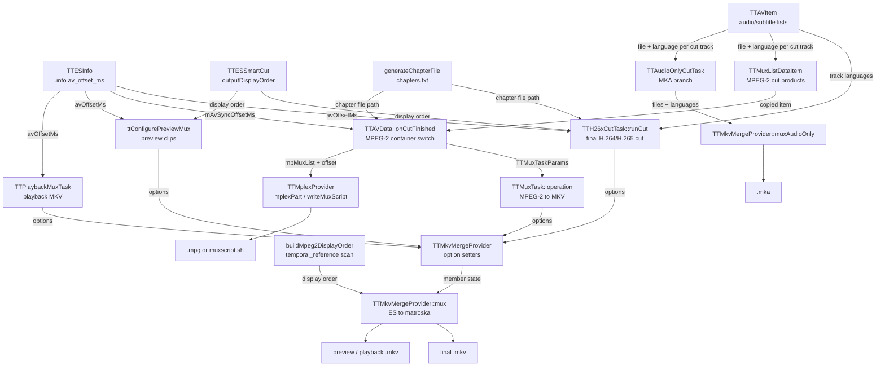

# Code Map: Output mux (MKV, MKA, MPG)

**Scope:** everything between "the cut elementary streams exist" and "the
output file exists": which caller configures `TTMkvMergeProvider` how, what
`mux()` does to timestamps, tracks, languages and chapters, the two places an
A/V offset is applied, the mplex branch as the second sink for MPEG-2, and the
output name and ES cleanup afterwards.

**Neighbours, not part of this map:** progress brackets and the cancel
machinery ([progress-reporting.md](progress-reporting.md)), how the cut job is
built ([cut-edit-and-start.md](cut-edit-and-start.md)), the per-track delay
and audio snapping ([audio-cut-timing.md](audio-cut-timing.md)), where
`outputDisplayOrder` comes from ([smart-cut.md](smart-cut.md)), the playback
MKV cache ([playback.md](playback.md)), the settings classes
([settings-state.md](settings-state.md)), what `av_offset_ms` in the `.info`
means ([ttcut-demux.md](ttcut-demux.md)).

Legend: every arrow carries data (producer → consumer). No trigger edges.

## Edge semantics

| From → To | What crosses (data / order / invariant) |
|---|---|
| `TTESInfo` → `TTH26xCutTask` | `TTESInfo::timingForVideo(sourceFile).avOffsetMs`, read in `TTAVData::doH264Cut` into `TTH26xCutParams::avOffsetMs`. Non-zero only when the `.info` has timing info **and** a non-zero `av_offset_ms`. |
| `TTESInfo` → `TTAVData::onCutFinished` | Same value, read by hand in `TTAVData::onDoCut` (`findInfoFile` + `TTESInfo`, same two conditions) into the member `mAvSyncOffsetMs`; that branch keeps the `TTESInfo` object because `loadExtraFrameIndices` needs it too. |
| `TTESInfo` → `ttConfigurePreviewMux` | `ttResolvePreviewSource` fills `TTPreviewSource::avOffsetMs` from `timingForVideo`. |
| `TTESInfo` → `TTPlaybackMuxTask` | `TTCurrentFrame::buildPlaybackMuxParams` fills the params from `timingForVideo`; audio is the first track's **source** ES (uncut), so no per-track delay is in it (see playback.md). |
| `TTAVItem` → `TTH26xCutTask` | Audio languages: `audioListItemAt(i).getLanguage()` for **every** track `0..audioCount()-1`, collected after the track-count check guaranteed all tracks were cut, so index `i` lines up with the file list. Subtitle files and languages come from the `cutSubtitleTracks` callback, appended only for `ok` tracks — the two lists stay aligned with each other. |
| `TTAVItem` → `TTMuxListDataItem` | MPEG-2 synchronous phase in `onDoCut`: `appendAudioFile(path, lang)` / `appendSubtitleFile(path, lang)` per `ok` callback; `lang` is the same `getLanguage()` of the track list. Must complete before the pool starts (see the ordering comment above the `connect` in `onDoCut`). |
| `TTAVItem` → `TTAudioOnlyCutTask` | `trackFiles`/`trackLanguages` from the `cutAudioTracks` callback, `ok` tracks only. |
| `TTESSmartCut` → `TTH26xCutTask` / preview | `outputDisplayOrder()` — one source display rank per written AU, empty on any anomaly (see smart-cut.md). Passed through unchanged via `setVideoDisplayOrder`. |
| `generateChapterFile` → callers | Path of `<cutDirPath>/chapters.txt`, written only when `workingMkvCreateChapters && workingMkvChapterInterval > 0` and `mLastCutResultMs > 0`. Chapters sit at fixed intervals from 0, named `Chapter NN`; they do **not** follow the cut points. The H.26x path also demands `finalOutput.endsWith(".mkv")`, which `doH264Cut` already guarantees. |
| `TTMuxListDataItem` → `onCutFinished` | `mpMuxList->appendItem(*cutVideoTask->muxListItem())`, then `itemAt(count()-1)`. The list is created once per `TTAVData` and never cleared, so it holds one item per cut of the session (the H.26x path appends a video-only item too, in `onH26xCutFinished`). |
| `onCutFinished` → `TTMuxTask` | `TTMuxTaskParams`, copied on the GUI thread: default duration from `frameRate()` of the run list's first video, PAFF flags, `videoCodecIdFor(streamType)`, offset, the item's files and languages, chapter file, `totalDurationMs`, and `cleanupOnAbort` = the whole `mCutProducedFiles` (ownership handover; the member is cleared). Output: `<cutDirPath>/<video ES base>.mkv`. |
| `onCutFinished` → `TTMplexProvider` | The whole `mpMuxList` plus `lastIdx`; `setAudioSyncOffset(mAvSyncOffsetMs)`. `workingMuxMode == 1` writes the script, else `mplexPart(lastIdx)` runs mplex synchronously on the GUI thread. Subtitles, languages and chapters of the item are not used — mplex gets `-f8`, `-O <offset>ms`, `-o`, video and audio paths only. |
| callers → option setters | See the configuration matrix below. The provider is created fresh per operation; the setters only store members, nothing is validated until `mux()`. |
| option setters → `mux()` | `mTrackOptions[0].defaultDuration` (`"<n>ns"` string, parsed back in `setupVideoInput`), `mIsPAFF`/`mH264Log2MaxFrameNum`, `mVideoCodecId`, `mVideoDisplayOrder`, `mAudioSyncOffsetMs`, `mAudioLanguages`/`mSubtitleLanguages`, `mChapterFile`, `mTotalDurationMs`. |
| `buildMpeg2DisplayOrder` → `mux()` | Only when no display order was set and the codec is MPEG-2: display rank = GOP base + `temporal_reference`, per-GOP permutation check; empty on any gap → linear PTS. Tested by `tools/diag/test_mpeg2order`. |
| `mux()` → `.mkv` | Video track 0, then one track per usable audio file, then one per usable subtitle file; title from the output file name (`_cut` stripped, VDR `#XX` decoded, `_` → space); chapters from the file. |
| `mux()` → preview / playback `.mkv` | Preview clips: `TTCutPreviewTask::createPreviewFileName(index, "mkv")` in the temp directory; playback: `TTPlaybackMuxParams::outputFile` (one name per mux, cached by fingerprint — playback.md). Same track layout as the final MKV, but only the first audio track, no languages, no subtitles, no chapters. |
| `TTAudioOnlyCutTask` → `muxAudioOnly` | `<cutDirPath>/<target base>.mka`, removed first if it exists; sync offset fixed at 0 (no video to be in sync with). |
| `TTMplexProvider` → `.mpg` | `<muxOutputPath or video dir>/<video ES base>.mpg`. The MKV and MKA outputs ignore `muxOutputPath` and always go to `cutDirPath`. |

### Configuration matrix

What each caller sets before `mux()` (`–` = not called):

| Caller | default duration | PAFF | codec id | display order | A/V offset | audio langs | subtitles | chapters | abort reaches provider | `mux()` result used |
|---|---|---|---|---|---|---|---|---|---|---|
| `TTH26xCutTask::runCut` | from `frameRate` | yes | own `isH265 ? HEVC : H264` | Smart Cut | if ≠ 0 | track list | cut `.srt` + langs | if enabled | yes | yes |
| `TTMuxTask` (MPEG-2) | from `frameRate` | yes | `videoCodecIdFor` | – (derived in `mux()`) | if ≠ 0 | mux item | cut `.srt` + langs | if enabled | yes | yes |
| `TTCutPreviewTask`, MPEG-2 clip | if `frameRate > 0` | yes | `videoCodecIdFor` | – (derived) | if ≠ 0 | – (file-name fallback) | – (SRT goes to mpv) | – | no | **no** |
| `TTCutPreviewTask`, H.26x clip | if `frameRate > 0` | yes | `videoCodecIdFor` | Smart Cut | if ≠ 0 | – | – | – | no (deliberate, see comment above the mux) | logged only |
| `ttRebuildMpeg2PreviewClip` / `ttRebuildSmartCutPreviewClip` | if `frameRate > 0` | yes | `videoCodecIdFor` | – / Smart Cut | if ≠ 0 | – | – | – | no | **no** |
| `TTPlaybackMuxTask` | from `frameRate` | yes | `videoCodecIdFor` | source map unless it has a negative entry | if ≠ 0 | – | – | – | yes | yes |
| `TTAudioOnlyCutTask` (`muxAudioOnly`) | n/a | n/a | n/a | n/a | always 0 | cut callback | n/a | – | yes | yes |

## Assumptions, contracts & pitfalls

- **Two offsets, two stages, never both on one track.** The per-track user
  delay is baked into the cut audio file through the keep list
  (audio-cut-timing.md); the `.info` `av_offset_ms` is added at the mux, to
  **audio packets only** (`addMediaInputs` sets `syncMs` for audio, 0 for
  subtitles; video's `mVideoSyncOffsetMs` is never set and stays 0). Both
  `TTH26xCutTask` and `onCutFinished` carry a comment against applying the
  delay a second time. Positive offset = audio later in both sinks: MKV adds
  it to audio PTS/DTS, mplex gets `-O <offset>ms` (direction per the comment
  in `createMplexArguments`, not checked against mplex's documentation).
  Subtitles are left on the video timeline.
- **Video timestamps are synthesized, not read.** With a default duration set,
  `mux()` ignores the ES packet timestamps: `assignEsTimestamps` writes
  `pts = display * frameDur`, `dts = (i - reorderOffset) * frameDur`
  (`reorderOffset = max(i - display[i])` lowers DTS instead of lifting PTS, so
  video does not move against audio). Linear PTS when no display order exists.
  A list/packet count mismatch raises a warning that the gates treat as FAIL.
- **`frameDur` lives in milliseconds.** The matroska muxer sets every stream to
  time base 1/1000 in `mkv_init` (`avpriv_set_pts_info(st, 64, 1, 1000)`,
  ffmpeg 8.1.2 source; linked libavformat 63.1.102), which is why `mux()`
  recomputes `frameDur` after `avformat_write_header`. Exact for 25 and 50 fps
  (40/20 ms). See hypothesis H1 for the other rates.
- **Non-VCL video packets are dropped.** A video packet without a slice NAL
  (SPS/PPS-only, a trailing EOS) is skipped so it does not advance
  `frameCount`. The Smart Cut seam EOS survives anyway, per the libav parsers'
  packetization (read in the ffmpeg 8.1.2 source, not measured on an output
  file): the H.264 parser does not end a frame at NAL 10, so EOS stays in the
  preceding AU's packet; the HEVC parser starts a new packet at EOS_NUT, which
  then also holds the next AU's parameter sets and slice.
- **PAFF:** two field packets are merged into one matroska block
  (`processPAFFFieldPair`), because the muxer would drop the second field as a
  duplicate. `field_pic_flag` is parsed with the `log2_max_frame_num` of the
  most recent inline SPS — Smart Cut output carries the encoder SPS and the
  source SPS with different widths.
- **A missing or unopenable input track does not fail the mux.**
  `addMediaInputs` skips it with a `qWarning` and `mux()` still returns true.
  The final-cut callers check the audio track count on the *cut* results before
  the mux; nothing checks what arrived in the container. See H3.
- **Languages:** explicit list by index first; for audio only, a `_xxx` suffix
  of the file name is the fallback (that is what the preview and playback MKVs
  get). Every audio track is flagged default (`AV_DISPOSITION_DEFAULT`).
- **Abort:** `checkAbort()` polls per packet in `mux()` and `muxAudioOnly()`,
  i.e. only after the output file is open and the header written; the tasks
  therefore poll once more right before calling `mux()`. An abort sets
  `mLastError` without the warning-level log line.
- **Chapter end:** the last chapter ends at `mTotalDurationMs`
  (= `mLastCutResultMs`, the planned cut length), else start + 5 min.
- **ES cleanup after a successful mux** follows `workingMuxDeleteES` in three
  variants (H.26x: inline `QFile::remove` loop over video/audio/subtitles;
  MPEG-2 MKV: `ttRemoveElementaryStreams(video, audio, subs)`; mplex:
  `ttRemoveElementaryStreams(video, audio)`, subtitles stay). The MKA branch
  deletes its track files unconditionally. A failed or abandoned mux keeps
  every input (standing rule: a genuine error never cleans up).
- **Gates:** `mkvmux_abort`, `h26xcut_mux`, `mpeg2cut_mux`,
  `audioonlycut_mux` (all cancel paths), `mpeg2order`,
  `partial_track`. No gate checks what a finished container holds (track
  count, languages, offset, chapters).

### Reading hypotheses for code-audit run 7

Read from the code, **not measured**. Status says how far each one is backed.

- **H1 — accumulated millisecond rounding at non-integer frame durations.**
  `frameDur = av_rescale_q(1e9/fps ns → 1/1000)` rounds once and is then
  multiplied by the frame counter. 29.97 fps: 33 ms instead of 33.37 ms, video
  ≈ 1.1 % shorter than the audio; 23.976 fps: 42 instead of 41.71 ms, ≈ 0.7 %
  longer. Status: time base verified in the ffmpeg source, the drift is
  arithmetic; no NTSC or film-rate fixture exists to measure it. DVB PAL
  (25/50 fps) is not affected. For MPEG-2 the TODO "Bildraten ausser 24, 25
  und 30 fps werden als 25 fps gelesen" feeds a wrong rate into the same
  formula.
- **H2 — the MPG target choice never reaches mplex.** `workingMpeg2Target` is
  set by the cut dialog and stored in the project file, but
  `createMplexArguments` hard-codes `-f8`; `common/ttencodernames.h` states
  "the format number in brackets is what mplex gets". Status: grep finds no
  other reader. The default (index 7 = f8) hides it.
- **H3 — a track the muxer cannot open disappears silently.** See the pitfall
  above; subtitles have no count check even on the cut side (known, see
  progress-reporting.md). Status: read only.
- **H4 — fixed chapter file name.** `<cutDirPath>/chapters.txt` is overwritten
  and then deleted; a user file of that name in the output directory is lost,
  and two concurrent cuts into one directory share it. Status: read only.
- **H5 — the mux script covers the whole session, all codecs.** `mpMuxList`
  is never cleared and H.26x/MKV cuts append to it too, so `writeMuxScript`
  also writes `mplex` lines for `.mkv` "video" items. `#!/bin/sh` is the
  second line of the script, so it is no shebang. Status: read only.
- **H6 — preview muxes whose failure is not noticed.** Three of four preview
  `mux()` calls ignore the result; `ttRebuild*PreviewClip` returns true after a
  failed mux. Status: read only.
- **H7 — audio-only diverges from the final cuts.** A partial track failure
  still muxes a short MKA (then reports failure), where the video paths stop
  before the mux; a successful MKA deletes its inputs regardless of
  `workingMuxDeleteES`. Deliberate or not is not recorded. Status: read only.
- **H8 — `muxAudioOnly` writes track after track**, relying on
  `av_interleaved_write_frame` to interleave; it emits no `progressChanged`
  either. With two or more tracks, interleaving and memory use are unmeasured —
  the audio-only gates use one track.
- **H9 — dead or stale pieces.** `mVideoSyncOffsetMs` is never set;
  `IMuxProvider` has one implementer and no caller through the interface; the
  comment above `mux()` still describes a "container remux" mode; the PAFF
  warning in `mux()` names `setH264Log2MaxFrameNum`, which does not exist
  (`setIsPAFF` takes the value); the `setVideoCodecId` header comment names
  `ttavdata.cpp` as its caller. `TTCutSettingsMuxer::populateMpgMode` inserts
  German literals ("Direkt muxen", "Mux-Skript erstellen") without `tr()`.

## Redundancy / consolidation candidates

- **Provider configuration sequence**
  - sites: `data/tth26xcuttask.cpp:TTH26xCutTask::runCut`, `data/ttmuxtask.cpp:TTMuxTask::operation`, `data/ttpreviewclip.cpp:ttConfigurePreviewMux`, `data/ttplaybackmuxtask.cpp:TTPlaybackMuxTask::operation`
  - shared purpose: set default duration, PAFF, codec id, display order and A/V offset on a fresh provider
  - status: consolidate → one options struct applied by the provider (the struct fields already exist three times: `TTMuxTaskParams`, `TTPlaybackMuxTask` params, `TTPreviewSource`)
- **Frame duration string `"%1ns"` from a frame rate**
  - sites: `data/tth26xcuttask.cpp:TTH26xCutTask::runCut`, `data/ttavdata.cpp:TTAVData::onCutFinished`, `data/ttpreviewclip.cpp:ttConfigurePreviewMux`, `gui/ttcurrentframe.cpp:TTCurrentFrame::buildPlaybackMuxParams`
  - shared purpose: `(int)(1e9 / frameRate)` formatted as a string that `setupVideoInput` parses back
  - status: consolidate → a setter taking the frame rate; only `ttConfigurePreviewMux` and `buildPlaybackMuxParams` guard `frameRate > 0`, `onCutFinished` and `runCut` do not
- **Codec id from the stream type**
  - sites: `data/tth26xcuttask.cpp:TTH26xCutTask::runCut` (`isH265 ? HEVC : H264`), `extern/ttmkvmergeprovider.cpp:TTMkvMergeProvider::videoCodecIdFor`
  - shared purpose: map the video stream type to an `AVCodecID`
  - status: consolidate → `videoCodecIdFor` (the other callers use it already)
- **ES deletion after a successful mux**
  - sites: `data/tth26xcuttask.cpp:TTH26xCutTask::runCut`, `data/ttavdata.cpp:TTAVData::onMpeg2MuxFinished`, `extern/ttmplexprovider.cpp:TTMplexProvider::onProcFinished`, `data/ttaudioonlycuttask.cpp` (MKA branch)
  - shared purpose: remove the cut elementary streams once the container exists
  - status: consolidate → `ttRemoveElementaryStreams` for the H.26x loop; the mplex subtitle omission and the MKA "always" rule are separate decisions (H7)
- **Reading `av_offset_ms` from the `.info`**
  - sites: `avstream/ttesinfo.cpp:TTESInfo::timingForVideo` (H.26x cut, preview, playback), `data/ttavdata.cpp:TTAVData::onDoCut` (MPEG-2)
  - shared purpose: the A/V offset for the mux
  - status: kept separate → the MPEG-2 branch needs the same `TTESInfo` object for `loadExtraFrameIndices`; the conditions are identical
