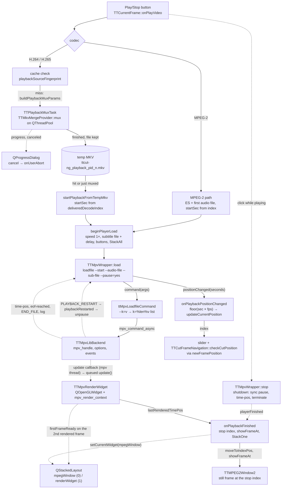

# Code Map: Playback

**Scope:** from the Play/Stop button of the "Current Frame" widget to the still
frame shown after Stop: the codec switch (MPEG-2 plays the elementary stream
directly with a separate audio file, H.264/H.265 need the playback MKV), the
mux task with its cache, the four layers `TTMpvWrapper` → `ITTMpvBackend` →
`TTMpvLibBackend` → `TTMpvRenderWidget`, the time↔index conversions in both
directions, the frame stack, and the stop position. Not covered: still-frame
decoding itself (`frame-order.md`), the muxer's timestamp rules
(`frame-order.md`, `TTMkvMergeProvider::assignEsTimestamps`), the preview
dialog's own logic — `TTCutPreview` and `TTAudioRepairDialog` appear only as
the wrapper's other two clients.

## Three time domains

| Domain | Unit | Held by | Converted where |
|---|---|---|---|
| **Stream index** | position in `TTVideoStream` (display-sorted list; MPEG-2 counts every field picture, H.26x one entry per displayed AU) | `videoStream->currentIndex()`, slider, cut list | → seconds in `onPlayVideo` (MPEG-2: index minus field-picture extras before it, from `TTMpeg2VideoStream::extraIndices`) and `playbackSecondsForCurrentStill` (H.26x: `frameAt(idx).deliveredDecodeIndex`, mapped through `displayOrderMap().decodeToDisplay` when the MKV carries display PTS, else the decode index) |
| **mpv seconds** | `time-pos` of the loaded file; in the temp MKV `pts = displayIndex × frameDuration` when `displayOrder` was passed (dropped RASL slots parked behind the last real one), else write order | `TTMpvWrapper::mPlaybackPosition` (observer at ~10 Hz, refreshed synchronously in `shutdown()`) | → index in `onPlaybackPositionChanged`: `floor(seconds × fps)`, clamped, **no** field-picture correction; in `onPlaybackFinished`: `round(pos × fps)` plus a fixed-point loop that adds the extras before the result (MPEG-2 only) |
| **Rendered time** | `time-pos` read inside `paintGL` right after `mpv_render_context_render` | `TTMpvRenderWidget::lastRenderedTimePos()` | replaces `time-pos` as the stop position: with `vo=libmpv` the clock runs ~16 frames ahead of the frame in the FBO; measured residual after this fix ~5 frames (TODO.md, "Stop still-frame offset") |

## Data flow

Solid edges carry data; dashed edges are signals or triggers without a
payload the receiver keeps.

## Edge semantics

| From → To | What crosses (data / order / invariant) |
|---|---|
| `BTN` → `SW` | `onPlayVideo` is the combined Play/Stop: while `mPlayer->isPlaying()` a click stops; a mux in flight (`mMuxTask`) makes it a no-op even though `controlEnabled()` may have re-enabled the button. Player and render widget exist since the constructor (creating the first `QOpenGLWidget` in a shown window rebuilds the native window, ~50 ms visible reload); the GL/mpv render context is built at stream open in `onAVDataChanged` (`realizeRenderContext`: momentarily raises the widget, `prepareRenderContext`, lowers it again) and once more here as a net. |
| `SW` → `MP2` | Start seconds from `playbackSecondsForCurrentStill()`: `(index − extrasBefore(index)) / fps` (`TTMpeg2VideoStream::extrasBefore`, the bitstream parser's list, NOT the `.info` count). Until `3504eb3e` this was `currentFrameTime()` rounded to ms unless the stream had field pictures. Audio: `audioStreamAt(0)` as `--audio-file`; mpv seeks in the raw ES itself. |
| `SW` → `FP` → `MUX` | Fingerprint `dpts1|<video path>|<audio0 path>`; the cache is valid when the file exists and the fingerprint matches. Neither audio delay, subtitle, `.info` A/V offset nor the display map are part of it. On a miss the old file is removed first, `mPendingPlaybackFingerprint` is set, and `buildPlaybackMuxParams` collects everything on the GUI thread: temp path from `TTSettings::tempDirPath` + pid + counter, frame rate (stream, else `.info`; none → warning and no playback), PAFF flag and `log2_max_frame_num`, codec id, `.info` `avOffsetMs`, first audio file, and for H.26x the display map with dropped slots re-numbered behind `maxReal`. |
| `MUX` ↔ `PD` | The task runs on `QThreadPool::globalInstance()`, deliberately not on `TTAVData`'s pool (whose exit reloads the tree views and reports into the cut progress window). `progress` is re-emitted from the worker; the dialog's `canceled` calls `onUserAbort`, which only stores flags (`requestAbort` + `mIsAborted`) — never `TTThreadTask::abort()`, because that would emit `aborted` on the GUI thread for a task that has not entered `run()` yet and race the owner's `deleteLater`. Harness trap recorded in `docs/completed-work.md`: `QProgressDialog::cancel()` hides without emitting `canceled`; a test must click the button. |
| `MUX` → `MKV` | `cleanUp()` keeps the file only if `mSucceeded && !mDiscard`; `discard()` (stream switch, widget destruction) sets the flag and aborts, so a mux that completes before noticing still removes its output. The two completion slots null `mMuxTask`, close the dialog (disconnecting `canceled` first — `close()` would otherwise abort the finished task), re-enable Play from `isControlEnabled`; success copies `outputFile`, the pending fingerprint and `mTempPlaybackHasDisplayPts = !displayOrder.isEmpty()`. The task deletes itself on `finished`/`aborted`. |
| `MKV` → `TMK` → `LOAD` | `playbackSecondsForCurrentStill` (H.26x branch): needs `deliveredDecodeIndex` of the still (lazily filled by the still decoder; −1 before the first decode → warning and `index / fps`); with display PTS the decode index is mapped to its display slot, else used as is — the `mTempPlaybackHasDisplayPts` flag keys every conversion so no mixed-scale state exists. Audio is inside the MKV, so `load()` gets no audio file. |
| `LOAD` → `WR` | `beginPlayerLoad`: one-shot connection `firstFrameReady → setCurrentWidget(renderWidget)`, speed reset to 1×, subtitle path and delay taken fresh from the subtitle list on every Play (mpv `--sub-file`/`--sub-delay`, not muxed), buttons to "playing", stack to `StackAll` for the session. `TTMpvWrapper::load` sets `mPlaying = autoPlay`, `mPendingAutoPlay`, `mPlaybackPosition = startSec` (so no stale position from the previous file survives), starts the backend (idempotent), and always appends `--pause=yes`. |
| `WR` → `CONV` → `BE` | `ttMpvLoadfileCommand` turns every `--key=value` into `key=%<utf8 bytes>%value`, joined by commas as loadfile's fourth positional argument, inserting `replace` and `0` when flag/index are missing. The length prefix is what survives a comma, quote or bracket in a path (`reference_mpv_loadfile_comma`, gate `test_mpv_loadfile_args`). `command()` is `mpv_command_async`; replies with errors come back as `mpvError`. |
| `BE` → `WR` (events) | `wakeupCallback` runs on an mpv thread and only queues `drainEvents` to the Qt thread. Mapping: `PROPERTY_CHANGE` → `propertyChanged` (node formats double/int64/flag/string, else invalid); `FILE_LOADED` → `fileLoaded`; `PLAYBACK_RESTART` → `playbackRestarted` (every completed seek, not only the first); `END_FILE`: `ERROR` → `mpvError`, `QUIT` (our own terminate) and `STOP` (a `loadfile … replace` unloading the old file, arrives ~1 ms after the command) are swallowed, anything else → `playbackFinished` once per file (`mPlaybackEndedEmitted`, reset at `START_FILE`); `LOG_MESSAGE` at level error → `mpvError`. The wrapper turns `playerError` into a log line only — mpv rates benign decoder warnings (mmco unref, ref-frame-exceeds-max after a mid-stream seek) as errors. |
| `WR` internal contract | `onBackendConnected` (queued from `start()`) observes `time-pos` and `eof-reached`. Two sources of the end: `END_FILE` (keep-open=no, the widget's player) and `eof-reached=true` (keep-open=yes, the preview); each sets `mAtEnd` and the other is then ignored, so one ending yields exactly one `playerFinished`. `onPlaybackRestarted` re-emits first, THEN clears the pause if `mPendingAutoPlay` — the stack switch must precede the unpause or playback runs behind the still for a moment. `pause()` cancels a pending auto-play. |
| `BE` → `RW` | `start()` creates the widget once and re-attaches a new `mpv_handle` on later starts (`setMpv`: destroys the old render context, zeroes the frame counter and `lastRenderedTimePos`, builds the new context synchronously if a GL context exists — otherwise the first `loadfile` reaches mpv before `paintGL`, mpv marks `vo/libmpv` broken and the cycle stays black). The update callback (mpv thread) checks a mutex-guarded live set before queuing `update()`, because `set_update_callback(nullptr)` does not wait for callbacks in flight. |
| `RW` → `STACK` | `paintGL` renders only when `mpv_render_context_update` reports `MPV_RENDER_UPDATE_FRAME` (Qt repaints on show/resize would otherwise print a stale frame: the GOP keyframe before the target, i.e. the ad before a cut-in). The counter fires `firstFrameReady` on the SECOND real render: the first frame after a load-seek is stale (logged evidence in the comment). Until then the opaque `mpegWindow` covers the widget, which is why the stack must be `StackAll` during a session: a hidden `QOpenGLWidget` gets no `paintGL`, and the raise waits for a frame that needs visibility — a deadlock the mode switch avoids. Outside a session `StackOne` hides the GL widget, which otherwise triggers the KWin stale-area bug under fractional scaling (bisected 2026-08-06, `reference_kwin_fractional_scale_bug`). |
| `WR` → `POS` → `SLIDER` | `positionChanged` at observer rate (~10 Hz) → `displayToStreamIndex(floor(seconds × fps))` (since `3504eb3e` the same MPEG-2 field-picture correction as the stop position, `TTMpeg2VideoStream::streamIndexForDisplayIndex`, then clamped to `[0, frameCount)`) → `updateCurrentPosition(pos)`: label, then `newFramePosition` → `TTCutMainWindow::onNewFramePos` (slider with blocked signals, **and** `TTCutFrameNavigation::checkCutPosition`, which stores the value as the position a Set Cut-In/Out would take) and `TTAVData::onCurrentFramePositionChanged`. The comment in `onPlaybackPositionChanged` used to say "no cut-position write"; ruled 2026-09-12 (finding 6): the behaviour is right, the comment was wrong and says so since `3504eb3e`. |
| `BTN` → `STOP` → `FIN` | `stop()` = `shutdown()`: wakeup callback off, synchronous `pause=1`, synchronous `time-pos` read re-emitted as `propertyChanged` (direct → `mPlaybackPosition` is current before the handle dies), `detachFromMpv` (render context freed on the GL thread, FBO cleared to black so the next Play cannot show last session's frame), `mpv_terminate_destroy`, re-install of the libav log callback (libmpv restores ffmpeg's default one), `removePostedEvents` for backend and widget (a queued `drainEvents`/`onMpvUpdate` would fire on a dangling receiver — verified by core dump). Then `playerFinished` is emitted by `stop()` itself if `mPlaying`. |
| `RW`/`WR` → `FIN` → `STILL` | Stop index: `lastRenderedTimePos` if any frame was rendered, else `playbackPosition()`; `round(pos × fps)`; MPEG-2 fixed-point loop (≤ 5 iterations) adds the field-picture extras before the result; clamp; `moveToIndexPos`, `showFrameAt`, `invalidateDisplay`, `updateCurrentPosition`; speed label and buttons reset; stack back to `mpegWindow` and `StackOne`. The temp MKV is kept for the next Play. |
| lifecycle | `onAVDataChanged` (stream switch or close): stop if playing, `detachPlaybackMux`, `cleanupTempPlaybackFile`, then open the still window on the new stream and build the render context. Destructor: `detachPlaybackMux` + `cleanupTempPlaybackFile`, so neither a mux in flight nor a cached MKV outlives the widget. |

## Assumptions, contracts & pitfalls

- **`TTCurrentFrame::onPlaybackPositionChanged`** — until `3504eb3e` assumed one displayed frame per `1/fps` of mpv time, so on MPEG-2 field-picture material the live index drifted by the number of extras before the position while `onPlaybackFinished` corrected it (finding 5, ruled and fixed: both go through `displayToStreamIndex`). Gate `tools/diag/test_extra_index_rank` section (4) checks the display → stream → display round trip on the field-picture fixture; the visual playback check on real material is still owed.
- **`playbackSourceFingerprint`** — a change of the audio delay, the subtitle delay (harmless: passed at load time), or the `.info` A/V offset does not invalidate the cached MKV; only the video and first-audio paths do. The subtitle file itself is never muxed, so subtitle edits always take effect.
- **`TTMpvWrapper::load`** — contract "load paused, unpause at PLAYBACK_RESTART" is what keeps the landing keyframe invisible; a client that loads with `autoPlay=false` (preview) drives `play()`/`pause()`/`seek()` itself and must not expect `playerPlaying` at load.
- **`TTMpvLibBackend::start`** — options are frozen at `mpv_initialize`: `setKeepOpen` after the first `renderWidget()`/`load()` has no effect (the preview sets it before). `hwdec=no` by default (`MPV_HWDEC` overrides); `gpu-hwdec-interop=no` in that case to keep ffnvcodec's `libcuda` complaint off stderr. **`audio-channels` is set per load, not at init** (`TTMpvWrapper::setOutputChannels`, a runtime property — unlike `keep-open`, which really is frozen at `mpv_initialize`). Left unset, mpv follows the stream: at an AC3 channel-layout change mid-stream it tears the audio output down and rebuilds it (measured 2026-09-22: three `Trying audio driver` for two changes, on PipeWire and on `ao=null` alike; two `drain timeout` with the pcm writer). That matters here because playback is fed the SOURCE audio (`TTCurrentFrame::buildPlaybackMuxParams` passes `audioStream->filePath()`; MPEG-2 plays the ES directly), which carries such a change unmodified — unlike a cut clip, where acmod normalization removes it. The setting `TTSettings::playbackAudioChannels` decides: `Original` (default) changes nothing, `5.1` pins the layout. `TTMpvWrapper::channelsOptionFor` is the single place that maps setting × codec to the value, and it pins only AC3 — a stereo-only codec never makes mpv switch. Both players apply it: `TTCurrentFrame::beginPlayerLoad` and `TTCutPreview::applyOutputChannels`. Gate `mpv_channels`.
- **`TTMpvRenderWidget`** — the widget belongs to the layout owner, not to the backend (`QPointer` in the backend); in a dialog's cascade delete the widget dies before the backend, and its destructor frees the render context itself while the GL context is still valid — otherwise `mpv_terminate_destroy` aborts on the inconsistency (AddressSanitizer finding, `d13cfb8`).
- **Stop position** — the ~5-frame residual after `lastRenderedTimePos` is mpv's internal frame queue; `report_swap` and `ADVANCED_CONTROL` were measured and rejected (TODO.md). The cut position is unaffected: only the frozen still is.
- **Three clients, three end contracts** — `TTCurrentFrame`: keep-open=no, `playerFinished` from `END_FILE` or `stop()`; `TTCutPreview`: keep-open=yes, the end arrives as `eof-reached`, `onPlayerFinished` only flips the button and the picture stays; `TTAudioRepairDialog`: waits for `playbackRestarted` per load to confirm playback started. The wrapper hides the first two differences; the third is per-client.
- **Locale** — libmpv needs `LC_NUMERIC=C` (`gui/ttcutmain.cpp` sets it; harnesses must too, `mpv_create()` returns null otherwise).

## Redundancy / consolidation candidates

- ~~**field-picture extras before an index** (two sites + harness copy)~~ — consolidated `3504eb3e`: `ttCountBelow` (avstream/ttcommon.h) behind `TTMpeg2VideoStream::extrasBefore` and `TTAVData::countExtraFramesBefore`; the inverse is `streamIndexForDisplayIndex`, used by `displayToStreamIndex` for the live AND the stop position.
- ~~**start-seconds derivation**~~ — consolidated `3504eb3e`: `playbackSecondsForCurrentStill` handles both codecs, `onPlayVideo` passes it to `load()`.
- ~~**end-of-playback detection** (three sources)~~ — consolidated `3504eb3e`: `TTMpvWrapper::finishPlayback()` holds the `mAtEnd` guard; `stop()` keeps its own "only while playing" condition.
- **time-pos re-read at shutdown**
  - sites: `gui/ttmpvlibbackend.cpp:TTMpvLibBackend::shutdown` (sync `time-pos`), `gui/ttmpvrenderwidget.cpp:TTMpvRenderWidget::paintGL` (`lastRenderedTimePos`)
  - shared purpose: a stop position closer to what the user saw than the observer's last value
  - status: kept separate → they answer different questions (last decoded vs last rendered); `onPlaybackFinished` prefers the rendered one and falls back to the other
- **player lifetime per client**
  - sites: `gui/ttcurrentframe.cpp:TTCurrentFrame::ensurePlayerCreated`, `gui/ttcutpreview.cpp` constructor, `gui/ttaudiorepairdialog.cpp` (lazy create)
  - shared purpose: create the wrapper, put its render widget into a layout, wire `playerError` to a log line
  - status: kept separate → the layouts differ (stack vs plain frame) and the preview needs keep-open before the first start; the error-to-log connection is the only duplicated line
