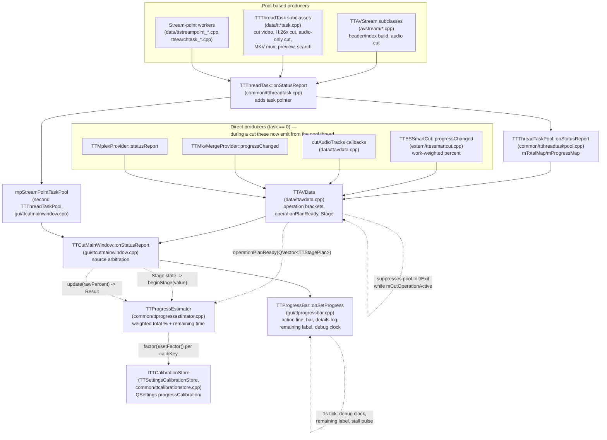

# Code Map: Progress Reporting

**Scope:** Every path a progress/status message takes from its producer
(stream parsers, cut tasks, Smart Cut, muxers) to the progress dialog
(`TTProgressBar`), including both thread-task pools, the direct
(`task == 0`) path, the MPEG-2 operation bracket, and the remaining-time
estimator (`TTProgressEstimator`) that turns per-stage percent into a
weighted total percent and an ETA. State as of the `feature/progress-details`
remaining-time-estimate overhaul (spec `2026-08-09-progress-eta-weighted`)
**plus its post-implementation user-acceptance rounds** (11 follow-up commits,
`4aee39f2`..`65d19290`: pool/estimator stall and monotonicity fixes, byte-based
file-open progress, clock-format ETA, a recent-rate window, per-codec video
calibration, a short-operation ETA fallback, the dialog re-show guard, and
the MPEG-2 mid-cut abort fix), **plus the `feature/cut-abort` work**
(`f5a22762`..`f9352969`), which made the remaining cut phases cancellable and
in doing so moved `doH264Cut` and `doAudioOnlyCut` off the GUI thread into
pool tasks, **plus the mplex-abort follow-up** (`78d67dfb`, `544b0e52`).
`base_commit` is `544b0e52`, the last of those commits (HEAD *before* this
map's own documentation commit).

**Scope of the 2026-08-10 re-verification:** the cut-abort pass re-read and
re-checked, against the code, everything touching abort delivery, the
operation brackets (`mCutOperationActive`/`mMuxPoolRunActive`), the
`doH264Cut`/`doAudioOnlyCut` structure, the `cutAudioTracks` callback sites
and the mplex/`TTProgressBar` consequences of those. The estimator,
calibration-store and ETA sections were **not** re-derived in this pass —
they are carried forward from the 2026-08-09 verification and were untouched
by the cut-abort commits.

**Correction of 2026-08-11:** this map used to state that mplex "cannot be
reached by Cancel" and recorded that as a design property. That was wrong —
the wait loop was simply missing a flag, and the GUI acceptance run exposed
it. The `TTMplexProvider` row and the abort-delivery row below now describe
the abortable implementation; the dialog re-show guard was extended to
`AddProcessLine` in the same pass, because mplex emits no `Step` and the
guard therefore never fired for it.

## Data flow

Legend: solid = status/data message, dashed = control (connect/suppress/query).

## Edge semantics

| From → To | What crosses (data / order / invariant) |
|---|---|
| `TTAVStream`/tasks → `TTThreadTask::onStatusReport` | `(state, msg, value)`; the 2-arg overload prepends `this`. `Start` carries **total steps** (units vary per task: bytes, frames, items); `Step` carries **absolute progress in those units**, NOT percent. `TTH26xVideoStream::createHeaderList()` now registers bytes (`QFileInfo(filePath()).size()`, falling back to `100` for an unreadable size) instead of a `0–100` percent scale, matching what MPEG-2's `createHeaderList()` already registered (`stream_buffer->size()`) — the pool sums `Start` totals across all tracked tasks (H.26x video-open plus up to 4 `OpenAudioTask` byte totals) into one overall percentage, so a task registering percent instead of bytes there is swamped by the audio tasks' byte totals and effectively carries zero weight even though building the video frame/GOP index is the dominant wall-time cost. Every `Step`/`Finished` value the method emits (the `10`/`82`/`90` milestones and the forwarded `TTFFmpegWrapper::progressChanged` percent) is scaled onto that byte domain (`milestone * total / 100`); `Finished` reports `total` itself, not a literal `100` — `TTThreadTask::onStatusReport()` divides the emitted value by `mTotalSteps` (== `total`) to derive the task's own percentage, so a literal `100` there would collapse to ~0% once `total` is in the hundreds-of-MB range. |
| `TTFFmpegWrapper::scanPacketsIntoRawIndex` → `TTFFmpegWrapper::progressChanged` | Raw H.264/H.265 ES files report no frame count to the demuxer, so `estimatedFrames` falls back to a fixed `10000`; on a real recording (~360000 frames for 2h) frame-count-based progress hit 100% at ~3% of the file and the `progress <= 100` gate then silenced every further emission for the rest of the scan. Progress is now computed from the packet's byte position (`packet->pos` against `avio_size(mFormatCtx->pb)`, `useByteProgress = totalBytes > 0`) instead, which stays accurate (and monotonic) for the whole scan; `lastValidPos` carries the last known position forward across packets that report `pos < 0`. The frame-count estimate is kept as the fallback path only for non-seekable input (`useByteProgress == false`), unchanged and still subject to the same `<= 100` silencing there. |
| `TTThreadTask` → `TTThreadTaskPool::onStatusReport` | `(task, state, msg, value)`. Pool records `Start`→`mTotalMap[taskID]`, `Step`→`mProgressMap[taskID]` **clamped monotonically non-decreasing** (`qMax(mProgressMap.value(taskID, 0), value)` — a stale `Step` signal delivered late through the queued connection, e.g. from a task whose `Finished` already arrived, can otherwise lower its recorded progress again and flicker `overallPercentage()`, observed as e.g. `55→56→55`), `Finished`→progress:=total, then **forwards unchanged**. `overallPercentage()` = Σprogress/Σtotal over all tracked tasks — cross-task percent exists only here. |
| `TTThreadTaskPool` → `TTAVData` (signal chain) | Pool `statusReport` is forwarded verbatim through `TTAVData::statusReport`. Pool `init`/`exit` produce the operation brackets `Init("starting thread pool")`/`Exit("exiting thread pool")` in `onThreadPoolInit`/`onThreadPoolExit` — **suppressed while `mCutOperationActive`** — every *final cut* (MPEG-2, H.26x, audio-only) owns its own brackets. |
| pool `aborted`+`exit` ordering | `onThreadTaskAborted` emits `aborted()` **then** `exit()` back-to-back. Therefore `onCutAborted` emits the `Canceled` bracket but must NOT reset `mCutOperationActive`; `onThreadPoolExit` **consumes** the flag. Resetting earlier double-brackets the operation. |
| `TTESSmartCut::progressChanged` → `TTH26xCutTask` lambda (was in `doH264Cut`) | `(percent 0–99, msg)`; forwarded as `Step` with `task == 0`. Percent comes from `weightedProgressPercent()`: `done = copied + k*(reencoded + encodeInFlight)`, `total = plannedCopyFrames + k*plannedEncodeFrames`, where `k = measured ms/reencoded-frame ÷ measured ms/copied-frame` once both rates have at least one measured sample THIS run (`mCopyFramesAcc`/`mEncodeFramesAcc`/`mCopyMsAcc`/`mEncodeMsAcc`, accumulated in `streamCopyFrames`/`reencodeFrames` via `qScopeGuard`). Before that, `k` falls back to `mSeedK` — the previous run's measured `k` for this codec, loaded from `ITTCalibrationStore` key `videok/h264`/`videok/h265` in `initialize()` — or `1.0` (frame-count-proportional) if no seed exists yet either. Smart Cut always stream-copies before it re-encodes, so without the seed this fallback was live for the entire initial burst and made re-encoding look as cheap as copying, producing an over-optimistic ETA for the first ~minute (`eb6dfc3e`, round 6 UAT). `smartCutFrames()` persists the newly measured `k` back under the same `videok/<codec>` key on a successful run (both rate accumulators > 0) — a machine-relative RATIO between two in-run-measured rates, not an absolute-time calibration, so it is written unconditionally (no `>= 99%`/plausibility gate; that gate belongs to `TTProgressEstimator`'s own `closeCurrentStage()`, a separate mechanism keyed under `video/<codec>`, see the `ITTCalibrationStore` row above). Monotone via `qBound(mLastEmittedPercent, pct, 99)`. Emitted every 50 copied frames (`streamCopyFrames`, msg `"Processing segment N/M"`), every 10 frames **sent to the encoder inside `runEncodePass()`** (msg `"Encoding segment N/M..."` — this is the fix for the previously-silent whole-GOP encode gap), and once more after each `reencodeFrames` pass completes (`"Processing segment N/M"`). `smartCutFrames` end emits 100 `"Cut complete"`. |
| `cutAudioTracks` callbacks → `TTAVData::statusReport` | Per-track percent folded into all-tracks percent: `(i*100+percent)/audioCount`, `task == 0`. Still 3 copies of the lambda pair, but only one of them is on the GUI thread now: the MPEG-2 branch inside `onDoCut` (`ttavdata.cpp:1508`), plus `TTH26xCutTask::doCut` (`tth26xcuttask.cpp:302`) and `TTAudioOnlyCutTask::operation` (`ttaudioonlycuttask.cpp:151`), which run on the pool and reach `TTAVData::statusReport` through the task. Each call now also passes a `shouldAbort` predicate — `mSyncPhaseAbort` for the MPEG-2 copy, `isAborted()` for the two tasks. |
| `TTMkvMergeProvider::progressChanged` → `TTAVData::onMuxProgress` | `(percent, msg)` → `Step`, `task == 0`. Mux restarts percent at 0 after video/audio already ran 0–100 at the raw-percent level; the estimator (see below) is what turns this into a monotone whole-operation percent. |
| `TTMplexProvider::statusReport` → `TTAVData::onStatusReport(int,msg,value)` | 3-arg form → forwarded with `task == 0`. Includes legacy `ShowProcessForm`/`AddProcessLine`/`HideProcessForm` states (dialog logs them as detail lines). Runs inside `onCutFinished`, i.e. **after** pool exit, still inside the operation bracket. |
| Schnittpfade → `TTAVData::finishCutOperation()` (seit `c7436a07`) | Alle sechs Abschlussstellen einer Schnittoperation gehen über **eine** Methode: sie setzt `mLastCutError` (bei `Failed`) bzw. leert es (bei `Success`) **vor** der Meldung, sendet dann `Exit` bzw. bei `Cancelled` ein `Canceled`, und sendet `cutFinished()` für alles außer `Cancelled`. Die Reihenfolge ist der Zweck: `TTCutMainWindow::onStatusReport` liest `lastCutError()` beim Behandeln von `Exit`, um `regular` zu bestimmen, und nur ein regulärer Lauf schreibt einen Kalibrierfaktor. Vorher setzte der H.26x-Pfad das Feld drei Zeilen NACH dem `emit`, weshalb jeder fehlgeschlagene Schnitt als regulärer galt und die Restzeitschätzung aus einem kaputten Lauf lernte. Der dritte Parameter `errorText` trennt die zwei Texte, die `TTH26xCutTask` bewusst getrennt zurückreicht (`lastError()` = ausführlicher Grund fürs Fehlerfeld, `exitMessage()` = kurze Fassung für die Fortschrittsanzeige, siehe `data/tth26xcuttask.h:64-68`); bleibt er leer, wird die Meldung genommen. **`mCutOperationActive` fasst die Methode NICHT an** — welcher Pfad das Flag setzt und welcher es verbraucht, steht in der Zeile darunter und bleibt beim Aufrufer. Ein `Cancelled` lässt das Fehlerfeld unberührt: ein Abbruch ist kein Fehler. |
| `TTAVData::statusReport` → `TTCutMainWindow::onStatusReport` | `(task, state, msg, value)`. **Meaning of `value` depends on `task`:** `task == 0` → `value` IS percent (0–100) or, for `Stage`, the `ProgressStage` id; `task != 0` → `value` ignored, percent from `mpAVData->totalProcess()` (= pool `overallPercentage()`). |
| `mpStreamPointTaskPool` → `TTCutMainWindow::onStatusReport` | Second pool, same signal shape. Selected by `mStreamPointWorkersRunning > 0` (checked BEFORE the AVData pool). Stream-point scans emit `Start` without `Init`; bar creation therefore also happens in the `Start` branch. Scan end is reported synthetically: `onAnalysisWorkerFinished` calls `onStatusReport(nullptr, Exit/Canceled, …)` directly when the worker count reaches 0. |
| Landing-zone workers → `TTAnalysisLog` → `AddProcessLine` | The three stream-point workers (`TTAspectScanTask`, `TTStreamPointVideoWorker`, `TTStreamPointAudioWorker`) each own a `TTAnalysisLog` (`data/ttanalysislog.{h,cpp}`) bound to a lambda that calls `onStatusReport(StatusReportArgs::AddProcessLine, s, 0)`. This is the ONE status kind with no progress meaning, which is why it was chosen: `TTThreadTask::onStatusReport` touches `mStepCount`/`mTotalSteps` only for `Start`/`Step`/`Finished`; `TTThreadTaskPool::onStatusReport` fills `mTotalMap`/`mProgressMap` only for those same three and otherwise forwards unchanged; `TTCutMainWindow::onStatusReport` calls the estimator only on `Step`, so `AddProcessLine` lands in the else-branch with the raw percent; `TTProgressBar::onSetProgress` turns it into `appendDetailLine(msg)` plus the re-show guard, nothing else. Consequence: detail lines can be added anywhere in these workers without touching bar, percentage or ETA — verified by a byte-identical `Start`/`Step`/`Finished` comparison against a pre-change recording (`tools/diag/test_aspectscan`, 45 lines, see `docs/completed-work.md`). `TTAnalysisLog` is not a QObject and caps `event()` at 20 lines per section (`resetCap()` between sections; the audio worker has two), while `line()` — headers and summaries — is never capped; `suppressed()` is appended to the summary. The MPEG-2 aspect worker had to gain a frame-rate constructor parameter (`gui/ttcutmainwindow.cpp`, `tools/diag/test_streampoint_order.cpp`) because positions are logged in the list's `hh:mm:ss (frame N)` form. |
| `TTAVData::operationPlanReady` → `TTProgressEstimator::setPlan` | `(QVector<TTStagePlan>)`, one `TTStagePlan{stage, calibKey, workUnits}` per planned `ProgressStage`. Connected via a lambda in `TTCutMainWindow`'s constructor, bypassing `onStatusReport` entirely. Emitted once per cut, before the first `Init`, from `onDoCut` (MPEG-2 branch — audio/video/mux), `doH264Cut` (video/audio/mux), and `doAudioOnlyCut` (audio, plus mux only for `AOF_OriginalMKA`). `workUnits` are media seconds for **every** stage now, including video (`65d19290`, user-decided spec change — previously kept-frame count with an empty `calibKey`): `keepListSeconds()` × track count for audio, `keptSecs` alone for video/mux. Video's `calibKey` is codec-keyed (`video/mpeg2cut`, `video/h264`, `video/h265` — chosen from `vStream->streamType()` in `doH264Cut`), so it is calibrated exactly like audio/mux (see `ITTCalibrationStore` pitfall below). No plan is ever emitted for pool-only operations (open, preview, stream-point scans). |
| `TTCutMainWindow::onStatusReport` → `TTProgressEstimator::beginStage` | `state == Stage`: reads the `ProgressStage` id out of `value`, calls `beginStage()`, and **returns immediately** — a `Stage` message never reaches the percent/bar path below. `beginStage()` looks for the id ahead of the current index in the planned stages; if planned and found, it closes the current stage (recording measured duration and, if the stage completed at ≥99% with a calibration key, writing a new calibration factor) and switches to it. If the id is unplanned/not found (pool-only operations, or `StagePool` itself), it resets to a single ad-hoc stage via `resetToAdHoc()` — "never mix" plans across operation kinds. |
| `TTCutMainWindow::onStatusReport` → `TTProgressEstimator::update`/`finishOperation` | For every non-`Stage` status: `rawPercent` is computed as before (task==0 value, pool `overallPercentage()`, or stream-point pool percentage); if no stage is active/planned yet, an ad-hoc `StagePool` stage is opened first (`mStreamPointWorkersRunning > 0` path checks only `active()`; the AVData-pool path checks `active()` **and** `!planned()`, so a planned cut's video stage — which also arrives via the pool path — is not overridden). On `Exit`/`Canceled`, `finishOperation(regular)` runs instead, where `regular = (state == Exit && mpAVData->lastCutError().isEmpty())`, closing the last stage (only a successful `Exit` writes calibration factors) and recording `operationDurationMs()`; the bar then receives the **raw** percent (not the weighted one) via `onSetProgress`, but `TTProgressBar::onSetProgress`'s own `Exit` handling forces the bar to 100 regardless. On any other state, `update(rawPercent)` returns a `Result{totalPercent, kind, stage, remainingMs}` that both feeds `onSetProgress(..., r.totalPercent)` and is formatted by `formatRemaining()` into `progressBar->setRemaining()`. Internally `update()` splits the "how far along" and "how fast right now" concerns: `totalPercent`/the future-stage weights keep using the whole-stage-average projection (`currentProjectionMs`, gated on `stagePercent >= 2 && elapsed >= 3000ms`) plus the stage-close correction EMA and an in-flight blend of it with the live in-stage ratio; the **remaining-time output alone** additionally prefers `windowedRemainingMs()` — a trailing ~15 s `(elapsed, percent)` sample window (`mRateSamples`, reset every `beginStage()`) — whenever that window is non-degenerate (≥2 samples, ≥2 s span, positive delta), so a stage whose pace changes mid-run (e.g. Smart Cut's fast stream-copy burst before a slow re-encode) shows an ETA reacting to the *current* pace instead of being dragged by the whole-stage average for minutes; the bar/weights themselves do not jump when the window takes over, only the ETA number does. When no ETA is derivable yet from either projection (`remStage < 0`) AND the operation is planned (non-ad-hoc), `plannedEstimateMs()` — the sum of every stage's calibrated `estimatedMs`, only if **all** are calibrated — is offered as a last-resort `RemainingTotal` fallback, capped to plans estimated at ≤20s total (`kShortOpCeilingMs`): short, fully-calibrated operations finish before the per-stage rate gates ever open, so without this fallback they show "calculating..." for their entire run. |
| `TTProgressEstimator` ↔ `ITTCalibrationStore` | `setPlan()` reads `factor(calibKey)` per stage (a negative value means "not yet calibrated", used as the cold-start signal). `closeCurrentStage()` writes `setFactor(calibKey, measuredMs/workUnits)` only when the stage is regular (not on abort), has a non-empty `calibKey`, `workUnits > 0`, ended at `stagePercent >= 99`, and the new factor is within `100×`/`÷100` of the previous one (implausible-jump guard). `TTSettingsCalibrationStore` persists under `QSettings("TTCut-ng","TTCut-ng")`, group `progressCalibration/` — survives app restarts (no separate persistence path exists for remaining-time itself, only for these per-machine cost factors). **Two independent clients share this one persisted key space** (separate `TTSettingsCalibrationStore` instances, but same stateless QSettings-group access, so they interoperate without coordination): `TTProgressEstimator` itself (through this edge, ms-per-media-second factors `audio/<suffix>`, `mux/<sink>`, `video/<codec>` — see below) and `TTESSmartCut` directly, bypassing the estimator entirely, for the machine-relative encode:copy cost ratio `k` under `videok/h264`/`videok/h265` (see the `TTESSmartCut::weightedProgressPercent` row below). |
| `TTCutMainWindow::onStatusReport` → `TTProgressBar` (`onSetProgress` + `setRemaining`) | `onSetProgress(task, state, msg, totalProgress)` — no `QTime`/elapsed-time parameter (removed; the dialog owns its own wall clock, see the tick row below). Window disable on `Init`, enable on `Exit`/`Canceled` (`Error` deliberately non-terminal). Dialog: `Init`/first `Start` reset log+bar+remaining label+debug clock; `Step` updates action/bar/time and appends de-duplicated log line — and, if the dialog is currently hidden while the operation is still running (`!mFinished && !isVisible()`), re-shows it first (`showBar()`) before applying the update; `Exit` forces bar to 100 (`enterFinishedState`); `Canceled` leaves bar at its last value (`enterFinishedState` without `setTotalProgress()`); `Error` = log line only. Alongside every non-`Exit`/`Canceled` call, `setRemaining(formatRemaining(r))` buffers a coarse, spec-mandated rounding of `r.remainingMs` into a **clock-format** string (`hh:mm:ss`/`mm:ss`, e.g. `"about 01:30"` — prose forms like `"about 1.5 minutes"` were replaced `29a6adbf`; the anti-flicker rounding granularity is unchanged: < 10 s "almost done", < 60 s nearest 10 s, < 10 min nearest 30 s, else nearest minute, never implying more precision than the estimate has): `RemainingUnknown` → `"calculating..."`; `RemainingStageOnly` prefixes the current stage's translated name (`progressStageName()`: Video/Audio/Muxing, empty for `StagePool`); `RemainingTotal` has no prefix. On `Exit` with `operationDurationMs() > 0`, `setRemaining(tr("Finished after %1"))` is called with the wall-clock operation duration BEFORE `onSetProgress(Exit)`, so `enterFinishedState()` picks up that text as the final value instead of leaving the last countdown visible. `setRemaining()` itself only buffers the text (`mPendingRemaining`) — applied by the bar's own 1 s tick, not immediately, so per-frame `Step` messages cannot flicker it. |
| `TTProgressBar` internal 1 s tick (`mTickTimer` → `onTick`, self-loop) | Started by `resetForNewOperation()`, stopped by `enterFinishedState()`. Each tick: (1) unconditionally refreshes `debugClockString`'s TEXT from `mWallClock` (a `QElapsedTimer` running for the whole dialog lifetime, ticking even while the bar pulses — that is its debug value: frozen bar + ticking clock = a stalled stage, not a hung app) — only the widget's VISIBILITY is gated by `cbDetails`, via `onDetailsStateChanged()`, not this tick; (2) applies `mPendingRemaining` to `remainingString` if non-empty; (3) if `mSinceLastStep` (reset on every `setTotalProgress()`, i.e. every `Step`) exceeds 5000 ms and the bar is not already indeterminate, switches `progressBar` to `setRange(0,0)` (pulse mode) — cleared back to `setRange(0,100)` on the next `Step` or in `enterFinishedState()`. |
| `TTProgressBar` close paths | Cancel button, window X (`closeEvent`) and Esc (`reject()` → `close()`) all converge on cancel-while-running / plain-close-when-finished (`mFinished`). `cancel` signal → `TTAVData::onUserAbortRequest` + `onAbortStreamPoints`. |
| `TTThreadTaskPool::onUserAbortRequest` → `TTThreadTask::onUserAbort` → `TTVideoStream::setAbort` | Both video-cut task classes forward the abort flag into the stream they drive, so an abort request takes effect mid-transfer, not just between cut-list entries: `TTCutTask::onUserAbort()` (single-segment cut, per-entry) always did; `TTCutVideoTask::onUserAbort()` (the MPEG-2 **final-cut** task that loops the whole cut list, `data/ttcutvideotask.cpp`) previously called only `abort()` (its own `TTThreadTask::isAborted()` poll flag, checked once per cut-list entry) and never `mpCutStream->setAbort(true)` — a cut list with one long entry was effectively unabortable until `1f372cca`. Both now call `setAbort(true)` on `mpCutStream`, which `TTAVStream`'s transfer loop polls (`mAbort`) and turns into a `TTAbortException`. |
| `TTAVData::onUserAbortRequest` → engines (cooperative abort) | `f5a22762..f9352969` ("cut-abort") made the remaining phases abortable; the Cancel button's route is unchanged (`TTProgressBar::cancel` → this slot), only what it reaches is new. Three delivery mechanisms, deliberately separate: **(a) pool tasks** — `mpThreadTaskPool->onUserAbortRequest()` reaches `TTH26xCutTask`, `TTAudioOnlyCutTask`, `TTMuxTask`, `TTCutVideoTask`, `TTCutPreviewTask`; each `onUserAbort()` sets its own flag AND pushes it into the engine it currently drives (`TTESSmartCut::requestAbort()`, `TTMkvMergeProvider::requestAbort()`; the preview holds its active engine behind `mSmartCutMutex` and clears the pointer under the mutex strictly *before* deleting the engine). **(b) `mSyncPhaseAbort`** (`std::atomic<bool>`, set unconditionally in this slot) — the MPEG-2 branch of `onDoCut()` cuts audio and subtitles synchronously *before* the pool starts, so at that moment there is no task to cancel; that phase polls this flag through `cutAudioTracks`'s `shouldAbort` predicate. Engine-side poll points: `TTESSmartCut::checkAbort()` at 8 sites (`smartCutFrames` entry + segment loop, `streamCopyFrames` per-frame path *and* its 8 MB chunked bulk-write path, `decodeFramesIntoList`, `runEncodePass`, `flushEncoder`) plus `TTNaluParser::parseFile()` per NAL unit (wired via `setAbortCallback()` in `initialize()`, so a cancel during the initial ES parse — seconds on a real recording — lands too); `TTFFmpegWrapper::cutAudioStream` per copied packet; `TTMkvMergeProvider::checkAbort()` in `mux()` and `muxAudioOnly()`. **A cancel must never read as an error**: `checkAbort()` sets `mLastError = "aborted by user"` *directly* instead of via `setError()`, which would log at ERROR level; the tasks throw the message-only `TTAbortException(msg)` because the `(file, line, msg)` overload logs at FATAL level on construction (`common/ttexception.cpp:31`). **(c) `mpMplexProvider`** — the mplex step of an MPG-output cut is neither a pool task nor part of the sync phase: it runs inside `onCutFinished()`, *after* the pool run, driving an external process. `TTAVData` publishes the live `TTMplexProvider` for exactly that call and this slot forwards `requestAbort()` to it; the provider polls in its own wait loop and stops the child (`extern/ttmplexprovider.cpp`, added 2026-08-11 — see `TTMplexProvider` below for why the earlier "cannot be aborted" claim was wrong). **Plus a seed**, because publishing the provider is not early enough on its own: `TTCutVideoTask` polls `isAborted()` only at the top of each cut-list iteration and `TTThreadTask::run()` emits `finished()` even with `mIsAborted` set, so a cancel arriving during the last iteration is neither polled nor turned into an `aborted()` — the pool reports a normal finish and `onCutFinished()` runs with the request held only in `mSyncPhaseAbort`. That branch therefore calls `requestAbort()` itself when the flag is set before invoking `mplexPart()`. Reaching the slot with the flag set *means* the pool did not honour the abort (otherwise `onCutAborted()` would have disconnected it). Regression test: the `mplexlate` phase. Not reached: `cutSubtitleTracks()` has no predicate (a cancel there is acted on when the phase returns), and there is deliberately no poll behind a *successful* mux. |
| task `aborted()` → `TTAVData::onCutAborted` (cleanup + `Canceled`) | Every abortable path deletes what the run created: `mCutProducedFiles` (`TTAVData`, for the MPEG-2 synchronous phase and pre-pool exits), `TTH26xCutTask`/`TTAudioOnlyCutTask`'s own `mCreatedFiles` (registered **unconditionally**, not gated on success — an aborted track still leaves a partial file), and `TTMuxTask`'s own `mCreatedFiles`, seeded from `TTMuxTaskParams::cleanupOnAbort` (`ttmuxtask.cpp:52`) — the MPEG-2 mux run takes *ownership of* that list from `mCutProducedFiles`, which is cleared at the handover (`ttavdata.cpp:1908`), so nothing is deleted twice. A genuine error keeps its partial files: the discriminator is `mSyncPhaseAbort` in `onCutAborted()`, and inside the tasks the fact that cleanup is reachable only through the cancel-gated `abortIfRequested()`. **The closing bracket depends on which of the two arrived** (2026-08-13): this slot is reached by a cancel *and* by a genuine failure, because `TTThreadTask::run()` ends in `aborted()` either way. `TTThreadTaskPool::lastFailureMessage()` carries the reason — each task records it in `mFailureMessage` when `run()` catches a `TTException`, the pool keeps the last non-empty one and clears it in `init()`, i.e. once per operation. Empty → `finishCutOperation(Cancelled, "Cut cancelled")` as before; non-empty → `finishCutOperation(Failed, "Cut failed", <reason>)`, so the failure reaches `lastCutError()` and the error dialog. Before that, every failure on this path reported itself as a user cancel: no error dialog, empty `lastCutError()`, and `TTProgressBar` freezing the bar as if the user had pressed Cancel. |

## Assumptions, contracts & pitfalls

- **The pulse depends on there being NO application-wide stylesheet.** Any
  `QApplication::setStyleSheet()` — however small, and whichever widget class
  it names — wraps the platform style in `QStyleSheetStyle` for **every**
  widget, and under the KDE styles that stops the animation of an
  indeterminate `QProgressBar`: the pulse then shows static stripes while the
  1 s tick keeps running. Measured with `tools/diag/test_pulse_stylesheet`
  (paints/s on the bar): Breeze 63.5 → 1.0, Oxygen 63.8 → 1.0, while Fusion
  (60.4 → 60.7) and Windows (31.2 → 31.2) are unaffected, so the defect is
  invisible outside KDE. This is why group box titles are centred by
  `TTCentredTitleStyle` (a `QProxyStyle`) instead of a stylesheet
  (`gui/ttcutmain.cpp`). Widget-level stylesheets are fine as long as neither
  the bar nor an ancestor of it carries one — today none of `TTProgressBar`,
  `ttprogressform.ui`, `TTCutMainWindow` or its `.ui` does.
- **`TTThreadTask::onStatusReport`** — assumes each task emits `Start` with
  its total BEFORE any `Step`; `Step` values are absolute units, monotone
  per task. Guarantees the task pointer identifies the sender.
- **`TTThreadTaskPool`** — owns cross-task aggregation
  (`overallPercentage`). Pool clears its maps whenever the queue drains; a
  queue that empties mid-operation (MPEG-2: pool holds only the video task)
  ends pool-side aggregation even though the operation continues. (The
  former `overallTime()`/`mOverallTotalTime` — a Σ-task-time pseudo-clock —
  was removed; see Redundancy below.)
- **`TTAVData` operation brackets (`mCutOperationActive`)** — the MPEG-2
  cut emits `Init`/`Start` synchronously before pool start and its final
  `Exit` in `onCutFinished` (after mplex) or `onMpeg2MuxFinished` (after
  the MKV mux). The flag suppresses the pool's own brackets meanwhile.
  Pitfall: `aborted()` fires before `exit()`, so the flag is consumed in
  `onThreadPoolExit`, not in `onCutAborted`. **The flag is a one-shot**:
  `onThreadPoolExit`'s else-branch consumes it, and it is connected in the
  constructor, so it always runs first. An MPEG-2 cut with MKV output has
  **two** pool runs (video task, then `TTMuxTask`), so `onCutFinished`
  re-arms the flag (`ttavdata.cpp:1928`) before starting run B — without
  that re-arm the pool would bracket the mux with its own `Init`/`Exit`
  and that stray `Exit` would close the progress dialog early, *and*
  `onCutAborted`'s `if (mCutOperationActive)` guard would go dead, so a
  cancelled mux would report a successful `Exit` and no `Canceled`. The
  false-window between consume and re-arm is inside one synchronous
  `emit exit()` and cannot receive a pool signal. A sibling one-shot,
  `mMuxPoolRunActive`, is set immediately after (`:1931`) and consumed in
  the same slot (`:1057`) so the mux run does not fire a second
  `avDataReloaded()` (measured: 2 tree-view rebuilds per cut without it).
  Pitfall: `mLastCutError` is set by the MKV branch but never by the mplex
  branch — a failed mplex still reports "Cut complete" (known, TODO.md).
  A **cancelled** mplex, by contrast, never reaches `finishMpeg2Cut()` at
  all: `onCutFinished`'s mplex branch checks `TTMplexProvider::wasAborted()`
  and, when set, closes the operation itself (delete the run's elementary
  streams, reset `mCutOperationActive`, emit the single `Canceled`) and
  returns. It has to: the mplex step runs *after* the pool run, so
  `onCutAborted`/`onThreadPoolExit` are no longer in play for it — the same
  situation as `onDoCut`'s synchronous audio phase, whose abort block has
  the same three parts.
  The **cut preview** is the one operation that owns only its *closing*
  bracket, and only on the cancel path: `doCutPreview` leaves the pool's
  `Init` in place (`TTCutPreviewTask::finished()` is a queued signal whose
  order against the pool's `exit()` is not guaranteed, so the success path
  must keep the pool's `Exit` too), while `onCutPreviewAborted` arms
  `mCutOperationActive` and emits `Canceled("Preview cancelled")` — the same
  one-shot mechanism as `onCutAborted`, consumed by `onThreadPoolExit`
  immediately afterwards. Before that, a cancelled preview closed with the
  pool's `Exit`, which forced the bar to 100 % and made the dialog report
  "Finished after …". A **genuine** preview failure (non-empty
  `TTCutPreviewTask::errorMessage()`) still closes with the pool's `Exit`
  and raises an error dialog. Since 2026-08-13 that holds for the MPEG-2
  branch too, which until then filled `errorMessage()` on no path at all and
  reported a failed preview as a completed one; its wording differs from the
  H.264/H.265 branch's "recording too damaged" on purpose, because anything
  can fail there and a missing directory is not a damaged recording. Both `doCutPreview`'s
  `aborted → onCutPreviewAborted` and `onDoCut`'s `aborted → onCutAborted`
  are dropped on their success paths (`onCutPreviewFinished`,
  `finishMpeg2Cut`); leaving either connected lets a later cancel emit a
  second closing bracket resp. reach a file-deleting slot.
- **`doH264Cut`/`doAudioOnlyCut`** — **no longer synchronous** (`3f56d6e3`,
  `af60cf87`): each builds a parameter struct by value on the GUI thread
  (`TTH26xCutParams` / `TTAudioOnlyCutParams` — the worker must never read
  the caller-owned `TTCutList` again) and hands it to a single pool task
  (`TTH26xCutTask` / `TTAudioOnlyCutTask`) that runs video, audio,
  subtitles and mux in the same order the synchronous version used. Both
  still emit `Init`/`Start` inline before starting the pool and set
  `mCutOperationActive`, so the operation bracket is still theirs; the
  closing `Exit` moved to `onH26xCutFinished`/`onAudioOnlyCutFinished`
  (pool `exit`). The `qApp->processEvents()` calls that used to keep the
  GUI alive *between phases* are gone; the two that remain
  (`ttavdata.cpp:1686`/`:1688`, `:2195`/`:2201`) only flush the `Init` and
  `Start` emits before the pool starts. From then on the GUI thread is
  free while the task runs — which is what makes Cancel reach these paths
  at all. Two `tr()` traps when moving text into the tasks: every moved
  string calls `TTAVData::tr()` explicitly so the existing German
  translations survive the context change, and the task exposes
  `exitMessage()` separately from `lastError()` because today's three
  failure paths use visibly different texts for the two. Error paths still
  emit `Exit` with an error text (operation-terminal), unlike
  `StatusReportArgs::Error` which is mid-task and non-terminal — and note
  the known ordering defect recorded in `TODO.md`: `Exit` is emitted
  *before* `mLastCutError` is assigned, so `onStatusReport`'s
  `regular = (state == Exit && lastCutError().isEmpty())` test reads a
  failed cut as a regular finish.
- **`TTCutMainWindow::onStatusReport`** — the ONLY place that decides
  what percent means (task==0 vs stream-point pool vs AVData pool) AND the
  only place that talks to `TTProgressEstimator`. `Stage` messages are
  intercepted and never reach the bar. Pitfall carried over from the old
  design and still true: a pool queue that empties mid-operation stops
  contributing to `overallPercentage()`, but now that only affects the
  *raw* percent fed into `update()` — the estimator's own stage-elapsed
  projection keeps the displayed percent/ETA moving as long as `Step`
  messages keep arriving for that stage.
- **`TTProgressEstimator`** — GUI-free, time source injected
  (`std::function<qint64()>`) so `test_progressestimator` can run on a
  simulated clock. `beginStage()` "never mixes" plans: any stage id not
  found ahead of the current index resets to a fresh ad-hoc single stage —
  this is both the deliberate guard against stale plans from a *different*
  operation kind and the normal entry path for plan-less pool operations
  (open, preview, stream-point scans all reach `StagePool` this way).
  ETA is withheld (`RemainingUnknown`) until the current stage has both
  ≥2% progress AND ≥3000 ms elapsed (`kMinPercentForRate`/
  `kMinElapsedForRate`) — avoids a wildly wrong extrapolation from the
  first couple of `Step` messages — **unless** the operation is planned and
  every stage is calibrated and the whole plan estimates at ≤20s total, in
  which case `plannedEstimateMs()` gives a coarse `RemainingTotal` before
  the gate opens at all (`597c3772`, see the `update`/`finishOperation` edge
  row). Total percent is monotone by explicit clamp
  (`ipct = max(ipct, mLastTotalPercent)`) **only for planned (`setPlan`)
  operations** — `mAdHoc` (true for `resetToAdHoc`: pool open/scan/search)
  bypasses the clamp entirely (`4aee39f2`): those operations register their
  overall total INCREMENTALLY as sub-tasks announce their own `Start`
  totals, so `overallPercentage()` legitimately reads high early (small
  tasks finish first) and then genuinely DROPS once a big task (e.g. the
  video frame index) registers its own total — clamping that away froze the
  GUI bar at a false ~99% peak for seconds (UAT screenshot 2026-08-09).
  `int(pct)` (truncating) was replaced with `qRound(pct)` (`eb6dfc3e`): the
  done/all ratio round-trips through `proj` (`elapsed*100/percent`, then
  back), which can land a mathematically-exact `N.0` a few ULPs below `N` —
  truncation then read as a one-point "regression" with no real cause.
  Remaining-time uses a **separate, narrower** rate source than the stage
  weight: `windowedRemainingMs()` (trailing ~15s of `(elapsed, percent)`
  samples, reset every `beginStage()`) feeds ONLY `remStage` in `update()`;
  the whole-stage-average projection (`currentProjectionMs`) still drives
  `w[]`/`effectiveCorrection`/`totalPercent` — the ETA can react to a recent
  pace change while the bar itself stays stable and does not jump when the
  window takes over. Cold start (no stage has either a measured or
  calibrated duration yet) falls back to **equal-width bands** — one honest
  but coarse 0–100 sweep across N stages — rather than guessing weights.
- **`ITTCalibrationStore`** — `TTMemoryCalibrationStore` is test-only (used
  by `test_progressestimator`); production uses
  `TTSettingsCalibrationStore`, one `TTCutMainWindow`-owned instance
  (`mCalibStore`) for the estimator path, persisted under `QSettings` group
  `progressCalibration/`. Keys observed: `audio/<suffix>` (from the first
  track's file extension — a mixed-codec audio set calibrates only on
  track 1), `mux/mpeg2cut`, `mux/h26xcut`, `mux/audiomka`, and — **since
  `65d19290`, a user-decided spec change** — `video/mpeg2cut`, `video/h264`,
  `video/h265`. The video stage was deliberately never calibrated before
  that commit (empty `calibKey` in every plan; see `frame-order.md`-style
  history if that claim resurfaces elsewhere) on the reasoning that its
  within-stage percent already comes from an accurate source; the spec
  change accepted the redundancy anyway because an empty `calibKey` meant
  `plannedEstimateMs()` (above) could never be non-negative, so short/repeat
  cuts kept showing "calculating..." instead of a total ETA from the start.
  The stored `video/<codec>` factor is a **blended ms-per-media-second**
  value over `keptSecs` — deliberately rough for H.26x, where the
  re-encode share (Smart Cut boundary GOPs vs. interior stream-copy) varies
  per cut — acceptable because it only has to bridge the stage start and
  the pre-stage totals; the in-run projection + correction take over within
  seconds. **Separately**, `TTESSmartCut` (`extern/ttessmartcut.cpp`) talks
  to its own `TTSettingsCalibrationStore` instance directly, bypassing the
  estimator entirely, under keys `videok/h264`/`videok/h265` — a
  machine-relative RATIO between measured encode and copy costs (see the
  `TTESSmartCut::progressChanged` edge row), not an ms-per-work-unit
  factor, and not subject to the `>=99%`/plausibility gate that
  `closeCurrentStage()` applies to the estimator's own keys. Both clients
  share the same `progressCalibration/` QSettings group without
  coordination since `TTSettingsCalibrationStore` is stateless (opens
  `QSettings` fresh on every `factor()`/`setFactor()` call).
- **`TTProgressBar`** — display only; no business logic, but now owns its
  own 1 s heartbeat (`mTickTimer`) for the debug wall clock, the buffered
  remaining-time label, and stall detection (bar pulses via
  `setRange(0,0)` after 5 s without a `Step`). `Error` is never
  operation-terminal (next task `Start` would wipe the log if it were).
  `Start` on a finished dialog resets (stream-point scans have no `Init`);
  `Start` during a running operation must NOT reset. The debug clock and
  its label (`laDebugClock`/`debugClockString`) are hidden by default and
  only shown while `cbDetails` is checked (`onDetailsStateChanged`) — the
  wall clock itself (`mWallClock`) still runs unconditionally so the
  display is correct as soon as details are opened mid-operation. **Dialog
  re-show guard** (`501a040f`, extended to `AddProcessLine` 2026-08-11): a
  `Step` **or `AddProcessLine`** arriving while `!mFinished && !isVisible()`
  calls `showBar()` before applying the update. It was
  introduced because the then-unabortable H.26x Smart Cut and audio phases
  kept emitting `Step` after the user closed the dialog (X/Cancel), leaving
  the main window disabled (`Init` disables it; only `Exit`/`Canceled`
  re-enable it) with no visible dialog — the app looked dead until the
  operation finished on its own. Those phases **are** abortable since
  `f9352969` (see the cooperative-abort edge rows above), so the guard's
  original trigger is gone; it still earns its place for the windows a
  cancel does not reach immediately: a cancel during subtitle cutting, an
  MPEG-2 preview (where a cancel is not forwarded at all), and the up-to-3 s
  the mplex step may take to stop its child process. `AddProcessLine` had to
  be added because it sat only in the `Step` branch while `TTMplexProvider`
  emits **no `Step` at all** — so a cancel during an MPG mux hid the dialog
  for the whole remaining run, and a GUI acceptance session read a completed
  cut as an aborted one because of it. Safe against re-showing a
  legitimately-finished, user-closed
  dialog because `enterFinishedState()` sets `mFinished = true` **before**
  `hideBar()`; asserted by `tools/diag/test_progressbar_reshow` (case 3).
- **`TTMplexProvider`** — emits only `ShowProcessForm`/`AddProcessLine`/
  `HideProcessForm`, never `Step` (`extern/ttmplexprovider.cpp`). The
  MPEG-2 `mux/mpeg2cut` stage therefore never advances past the 0% it starts
  at, never reaches the ≥99% gate, and consequently never writes a
  calibration factor for that key. `TTProgressBar`'s stall detection kicks
  in after 5 s of silence and the bar pulses for the whole mplex run. This
  is honest (no fabricated percent) and by design, not a bug to fix.
  It **is** abortable, contrary to what this map and `TODO.md` claimed until
  2026-08-11. The old reasoning — "it drives an external process and has no
  loop of its own to poll" — was wrong on both halves: `mplexPart()` *does*
  have a loop (`while (proc->state() == Starting || Running)`, which is also
  what pumps `qApp->processEvents()`, so the Cancel click was being delivered
  and `TTAVData::onUserAbortRequest()` was running the whole time), and a
  child process is an *easier* abort target than an in-process codec loop,
  not a harder one. What was missing was a flag: `requestAbort()` /
  `wasAborted()` / `checkAbort()` in the same shape as
  `TTMkvMergeProvider`, polled in that loop, plus `stopProcess()`
  (SIGTERM, 2 s grace, then SIGKILL + 1 s). Delivery cannot go through the
  pool — mplex is not a task and runs after the pool run — so `TTAVData`
  publishes the live provider in `mpMplexProvider` for the duration of the
  `mplexPart()` call and `onUserAbortRequest()` forwards to it. On abort the
  provider removes its own partial `.mpg`; the cut elementary streams are
  removed by `onCutFinished`'s abort block (see the operation-bracket row
  above). Three entry paths, all covered by
  `tools/diag/test_mpeg2cut_abort`: `mplexabort` (cancel while the process
  runs — armed on mplex's own output once the `.mpg` has real bytes, so the
  "everything removed" assertion is about a partial file that demonstrably
  existed), `mplexearly` (cancel between `ShowProcessForm` and
  `proc->start()`, where no process is launched at all) and `mplexlate` (the
  seed above: request recorded, pool already drained, provider not yet
  published — armed deterministically on `Stage(StageMux)`).
  `stopProcess()` escalates to SIGKILL only when the child is still running:
  `waitForFinished()` returns false for an already finished process too, and
  mplex finishing on its own between the poll and the `terminate()` is an
  ordinary race, not a failed terminate.
- **Subtitle cutting inflates the audio calibration factor** —
  `cutSubtitleTracks()` runs synchronously right after `cutAudioTracks()`,
  still inside the `StageAudio` window (both `onDoCut` for MPEG-2 and
  `TTH26xCutTask::doCut`, before the next `Stage`/`StageMux` announcement),
  and emits
  no status of its own. Its wall time is folded into the audio stage's
  `measuredMs`, so `audio/<suffix>` calibration factors run slightly high
  on projects with subtitle tracks - acceptable for a cost factor, called
  out here so it isn't mistaken for measurement noise.
- **`TTESSmartCut` progress** — percent is now work-weighted (ms/frame,
  self-measured, no hardcoded codec factor) rather than frame-count-
  proportional, and `runEncodePass()` is no longer silent: it emits every
  10 frames sent to the encoder. The weight `k` becomes ms-based (measured
  THIS run) once both a stream-copy and a re-encode chunk have completed at
  least once in the current run; until then it falls back to `mSeedK` (the
  previous run's measured `k` for this codec, `videok/h264`/`videok/h265`,
  loaded in `initialize()`) if one exists, or `1.0` (frame-count-
  proportional) only on the very first Smart Cut ever run for that codec on
  this machine (`eb6dfc3e`, round 6 UAT — the seed exists specifically
  because Smart Cut always stream-copies before it re-encodes, so the k=1
  fallback used to be live for the entire initial burst and made the ETA
  look ~1:30 too optimistic for over a minute). A cut whose FIRST segment
  is a long re-encode still shows frame-count-proportional percent for that
  first segment only when no seed is available at all.

## Redundancy / consolidation candidates

- **Audio progress lambda pair** (`onProgress`/track-start callbacks for
  `cutAudioTracks`): three near-identical copies — same
  `(i*100+percent)/audioCount` folding — now spread across three files:
  the MPEG-2 branch of `onDoCut` (`data/ttavdata.cpp`),
  `TTH26xCutTask::doCut` and `TTAudioOnlyCutTask::operation`. Candidate:
  one helper on `TTAVData` (which all three already hold a pointer to).
  **Still open** — the cut-abort work moved two of the copies but did not
  merge them.
- **Abort-cleanup file lists**: three parallel implementations of
  "delete what this run created" — `TTAVData::mCutProducedFiles`,
  `TTH26xCutTask`/`TTAudioOnlyCutTask::mCreatedFiles` (identical
  register-unconditionally/`abortCleanup()` pair in both) and
  `TTMuxTask`'s seeded copy. They differ in *who* discriminates cancel
  from error (`mSyncPhaseAbort` in the slot vs. reachability through
  `abortIfRequested()` in the tasks), which is the part worth keeping;
  the list handling itself is a candidate for one small helper.
  **Open** — noted at the end of the cut-abort work, not attempted.
- **Progress-bar creation + cancel wiring**: duplicated verbatim in the
  `Init` and `Start` branches of `TTCutMainWindow::onStatusReport`
  (stream-point scans skip `Init`). Candidate: `ensureProgressBar()`.
  **Still open** — untouched by the remaining-time overhaul.
- ~~**Elapsed-time sources**: `mDirectProgressTimer` (wall time per stage),
  `TTThreadTaskPool::overallTime()` (Σ task time), and
  `TTThreadTask::elapsedTime()` all answered "how long" with different
  semantics.~~ **Resolved** (spec `2026-08-09-progress-eta-weighted`,
  commits `1fd8de26`..`fb7cbb76`): all three were removed. Grepped clean —
  `mDirectProgressTimer`, `TTThreadTaskPool::overallTime`,
  `mOverallTotalTime`, `TTAVData::totalTime`, `TTThreadTask::elapsedTime`
  and `mTaskTime` no longer exist anywhere in the tree. The dialog's own
  wall clock (`TTProgressBar::mWallClock`, debug-only) and the estimator's
  per-stage `mStageStartMs`/`mOpStartMs` (via the injected `mClock`) are
  the only remaining time sources, with clearly separated purposes
  (display debug info vs. drive the ETA math).
