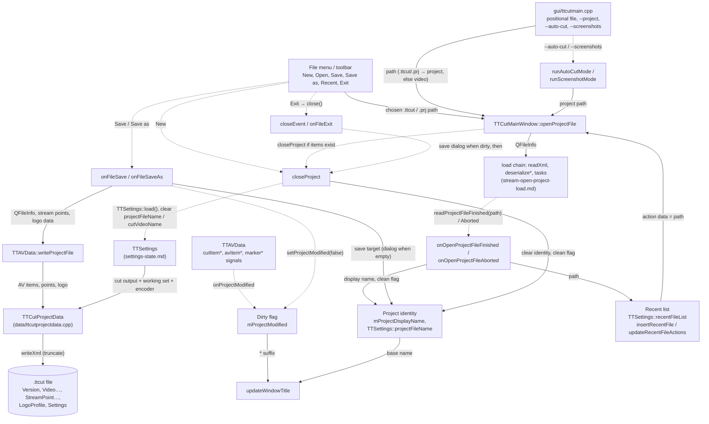

# Code Map: Project lifecycle

**Scope:** What a "project" is while TTCut-ng runs and how it is born, named,
marked dirty, saved, closed and remembered: the two identities
(`mProjectDisplayName` for the title, `TTSettings::projectFileName` as the
save target), the dirty flag and its sources, New / Open / Save / Save as /
Recent / Exit / window close, the `.ttcut` file (what `TTCutProjectData`
writes and reads back, what does not round-trip), the command line and the
two headless modes. The **load chain** itself (tasks, pool exit, pending
maps, `onReadProjectFileFinished` order) is `stream-open-project-load.md`;
what the `<Settings>` section does to `TTSettings` is `settings-state.md`;
the stream points and the logo profile that ride along are
`stream-points.md`. This map starts at the menu and ends at the file.

## Data flow

Solid edges carry data (producer → consumer); dashed edges are triggers.

## Edge semantics

| From → To | What crosses (data / order / invariant) |
|---|---|
| Menu / Recent / CLI → `openProjectFile` | A file path. The menu dialog filters `*.ttcut` and "Legacy Project (*.prj)"; `.prj` is **the same XML format** under the old extension (renamed in v0.63.0, no converter exists). The command line treats a positional file by extension (`.prj`/`.ttcut` → project, anything else → `onReadVideoStream`), takes `--project` only when no positional file exists, and defers the open by a 100 ms timer so the window is up. Recent entries carry the path in `QAction::data`. |
| `openProjectFile` → `closeProject` → load chain | `closeProject` runs first **only when `avCount() > 0`**; `lastDirPath` is set to the project's directory; `mProjectLoadInProgress = true`; the finished/aborted connections to `TTAVData` are made per open and dropped again in the handlers. Then `TTAVData::readProjectFile` (`stream-open-project-load.md`). |
| Load chain → `onOpenProjectFileFinished` | `readProjectFileFinished(path)` after `TTAVData` has restored items, stream points, logo data and the `<Settings>` section. The handler releases the flag, queues the auto anomaly scan, and — only when a current item exists — inserts the path into the recent list, sets `mProjectDisplayName` to the base name and **clears the dirty flag** (the `avItemAppended` signals of the load had set it). It does **not** set `TTSettings::projectFileName` (see pitfalls). `onOpenProjectFileAborted` releases the flag and the connections, nothing else: no recent entry, title unchanged. |
| `TTAVData` signals → `onProjectModified` | Exactly eight signals mark the project dirty: `cutItemAppended/Removed/Updated`, `cutOrderUpdated`, `avItemAppended/Removed`, `markerAppended/Removed`. Cuts and the video list, that is. **Not** dirty-tracked: stream points (manual marker, analysis, delete), audio repairs, audio/subtitle language and delay, track reorder, the logo profile, and every `<Settings>` value (output name, mux working set, encoder) — all of which the file stores. `onProjectModified` only flips false → true and refreshes the title. |
| Dirty flag / identity → `updateWindowTitle` | `"<display name> - <version>"` or just the version string, plus `" *"` when dirty. The display name is the base name of the last opened **or saved** project; empty for a plain video. A plain video open therefore shows `"TTCut-ng x.y *"` — dirty through `avItemAppended`, no name. |
| `onFileSave` → identity → `writeProjectFile` | Refuses without items. When `projectFileName` is empty: pre-set to `<video base>.ttcut`, ask with `getSaveFileName` (start dir `lastDirPath`), return silently on cancel (the pre-set name is overwritten with the empty dialog result). Suffix `.ttcut` appended when the chosen name has none. Then `TTLogoProjectData` is built from `mLogoDetector` (markad path **or** ROI) and `writeProjectFile(fInfo, mpStreamPointModel->points(), logoData)` runs inside `try`: a `TTException` is logged (`errorMsg`) and the method returns — no dialog, flag stays dirty, display name unchanged. On success: display name = chosen base name, flag clean. `insertRecentFile` is **not** called on save. |
| `onFileSaveAs` → `onFileSave` | Always pre-sets `projectFileName` to `<video base>.ttcut` (not the current project's name), asks, and on a non-empty answer sets `lastDirPath` and calls `onFileSave`, which finds the name set and writes without asking again. On cancel `projectFileName` is left **empty** — a project that had a save target loses it. |
| `writeProjectFile` → `TTCutProjectData` → file | A fresh `TTCutProjectData` per save: `serializeAVDataItem` per `TTAVList` entry, `serializeStreamPoints` only when the list is non-empty, `serializeLogoData` only when `valid`, then `writeXml` = `serializeSettings` + open with `Truncate` + `write(toByteArray())`. No temp file, no rename, no backup: a failure after `open` leaves a truncated file. Open failure throws `TTIOException` with `errorString`. |
| `serializeAVDataItem` → `<Video>` | Per item: `<Order>` (always 0), `<Name>` = the video stream's **absolute** `filePath()`; per audio track a `<Audio>` with `<Order>` = the **visible list position** (`sortByProjectOrder` restores exactly that), `<Name>` absolute, `<Language>` and `<Delay>` only when non-empty / non-zero, nested `<Repair>` elements for repairs whose `trackIndex()` equals that position; `<Cut>` with order, in, out (display-order positions, see `parseCutSection` note); `<Marker>` with order, pos and a `<MarkerType>` that is always `1`; `<Subtitle>` like audio with `sItem.order()`. Written paths are absolute; the reader also accepts relative ones. |
| `<Settings>` ↔ `TTSettings` | Written from the **working set** and the transient encoder values, never from the App-Defaults; read back into the same (`settings-state.md`). `CutDirPath` goes through `resolveProjectPath` (absolute or project-relative, no `..`), `CutVideoName` must be a bare file name. |
| `readXml` → version | Parses with `QDomDocument::setContent`; unreadable or unparsable file → `TTDataFormatException` → `TTAVData::onReadProjectFileAborted`. The version check (`<Version>` rounded to int must be 1) only prints a `qDebug` and **returns normally** — `readProjectFile` then deserialises the document anyway. A `TTCut-Projectfile` root is not checked either; any XML whose first element is not `Version` passes with the same debug line. |
| `deserializeAVDataItem` → `parseVideoSection` | Every top-level `<Video>` (children from index 1 on, `Version` skipped); each needs at least `<Order>` and `<Name>`; a path `resolveProjectPath` rejects skips the whole section with a warning. A video that passes gets `doOpenVideoStream(name, order)` — which creates the `TTAVItem` and enqueues the open task; the item joins `TTAVList` only in `onOpenVideoFinished` (`avItemAppended` → dirty), so right after `deserializeAVDataItem` the list is still empty even for a good project. Cuts and markers are appended synchronously, audio/subtitle tracks become tasks; `sortCutItemsByOrder`/`sortMarkerByOrder` run per video section on the global lists. |
| `<Marker>` ↔ `TTMarkerList` | Legacy list, separate from the stream points: its only writers today are the project parser and the VDR import (`openAVStreams` appends cut-in and cut-out of every VDR pair "for the Marker tab"). **No GUI widget reads `TTMarkerList`** (grep over `gui/` and `ui/`), the "Set marker" button feeds the stream-point model since the Landezonen feature. Markers therefore round-trip invisibly and are the only thing besides cuts that `markerAppended` marks dirty for. |
| `onOpenProjectFileFinished` → recent list | `insertRecentFile(path)`: read-modify-write on `TTSettings::recentFileList` (dedupe, prepend, cap 5), then a walk over `QApplication::topLevelWidgets()` calling `updateRecentFileActions` on every main window. `TTSettings::setRecentFileList` emits `recentFilesChanged`, but **nobody is connected to it** — the walk does the refresh. Persisted in QSettings group `RecentFiles`; the menu is rebuilt from it in the constructor. |
| `closeEvent` → `closeProject` | Order: save window geometry to QSettings, `TTSettings::save()`, then — if dirty — Save / Discard / Cancel (Cancel = `event->ignore()`, return; Save = `onFileSave`, which may itself be cancelled in its file dialog and then silently saves nothing), then `closeProject`, `accept`. `mpAVData` is deleted in the destructor, not here. |
| `onFileExit` → `close()` → `qApp->quit()` | Calls `close()` and then **unconditionally** `qApp->quit()`. `close()` runs `closeEvent`; when the user answers Cancel there, the event is ignored and the window stays — but `quit()` still ends the application, and `main()` also quits on `lastWindowClosed`. Read-derived, not measured. |
| `onFileNew` → `closeProject` | Refuses without items; asks only when dirty ("Close current project and start a new one?"); then `closeProject` — "new" is nothing but "close". |
| `closeProject` → everything | Releases the load flag; aborts a running directed search and the stream-point pool and waits for the global `QThreadPool` (tasks hold pointers into the lists `mpAVData->clear()` frees); disconnects the two AV signals while the widgets are nulled; clears the stream-point model and the extras; `mpAVData->clear()` (AV, cut and marker lists); `TTSettings::load()` **then** `setProjectFileName("")` (order matters: a stale name must not come back from QSettings — it is not persisted since `8008128`, the order is the second guard), `setCutVideoName("")`; display name cleared, flag clean; signals reconnected. |
| Headless → `openProjectFile` | `runAutoCutMode`: `setNonInteractive(true)`, open, `waitForProjectLoad(60 s)` (pumps until the flag falls), needs a non-empty cut list, sets `cutDirPath`, `cutVideoName` and the encoder codec from the stream type, connects `cutFinished → quit`, `onDoCut`. `runScreenshotMode`: open, `waitForProjectLoad(30 s)`, a warning on timeout but it carries on. Neither saves; neither touches the recent list beyond what `onOpenProjectFileFinished` does. |

## Assumptions, contracts & pitfalls

- **Two identities by design** — `mProjectDisplayName` is for the title and set by open and save; `TTSettings::projectFileName` is the save target and set **only by saving** (header comment). Consequence: after Open, the first Save behaves like Save as, pre-filled with `<video base>.ttcut` in `lastDirPath`, not with the opened file. Saving under the opened name is the user's job. Read-derived.
- **Save as cancel loses the save target** — `onFileSaveAs` overwrites `projectFileName` with the dialog result before checking it. Read-derived.
- **Exit ignores Cancel** — `onFileExit` quits after `close()` regardless of the close event's outcome; the window's own close button (no `quit()` call) honours Cancel. Read-derived.
- **Dirty flag covers cuts and the video list only** — stream points, repairs, delays, languages, logo and the `<Settings>` values are saved but never mark the project dirty; New / Exit do not warn about them. A plain video open is "dirty" through `avItemAppended`.
- **Version check is advisory** — wrong `<Version>` or a foreign root element is logged and then parsed as if fine.
- **A project without an openable video never finishes** — when every `<Video>` is missing or rejected by `resolveProjectPath`, no task is queued, the pool never exits, `readProjectFileFinished`/`Aborted` never fire: `mProjectLoadInProgress` stays true (auto anomaly scan blocked, `waitForProjectLoad` times out) until `closeProject`, and the `TTCutProjectData` object is leaked: `readProjectFile` assigns a new `mpProjectData` without deleting the old one (the deletes sit in the two handlers that never ran). A video that exists but fails to open goes through the task's abort route and is reported. Read-derived.
- **No atomic write** — `writeXml` truncates in place; a write error after opening leaves a broken file; the only sign of a failed save is the log line.
- **Recent list = opened projects** — a project saved for the first time appears in the recent menu only after it has been opened once.
- **`<Marker>` is a legacy carrier** — VDR import and old projects fill `TTMarkerList`; nothing displays it; `markerAppended` still marks dirty.
- **Order of `closeProject`** — `TTSettings::load()` before `setProjectFileName("")` is the second guard against the v0.74 "New project overwrote the old .ttcut" defect (`8008128`, memory `project_new_project_overwrite_fix`); the first is that the key is not persisted.
- **Headless modes rely on the flag** — `waitForProjectLoad` is the only wait; it returns false on the never-finishing case above and both modes then quit or carry on without a project.

## Redundancy / consolidation candidates

- **default project name**
  - sites: `gui/ttcutmainwindow.cpp:TTCutMainWindow::onFileSave`, `gui/ttcutmainwindow.cpp:TTCutMainWindow::onFileSaveAs`
  - shared purpose: `ttChangeFileExt(videoStream()->fileName(), "ttcut")` + `QFileInfo(QDir(lastDirPath), name)` + `getSaveFileName`
  - status: consolidate → one `askProjectFileName()` used by both; Save as would then also stop clobbering the current target on cancel
- **recent-list refresh**
  - sites: `gui/ttcutmainwindow.cpp:TTCutMainWindow::insertRecentFile` (walk over top-level widgets), `common/ttsettings.cpp:TTSettings::setRecentFileList` (`recentFilesChanged`, no receiver)
  - shared purpose: refresh the menu after the list changed
  - status: consolidate → connect `recentFilesChanged` to `updateRecentFileActions` in the constructor and drop the widget walk (the signal was added for exactly this, comment "Task 7")
- **project close-and-reset**
  - sites: `gui/ttcutmainwindow.cpp:TTCutMainWindow::closeProject`, `gui/ttcutmainwindow.cpp:TTCutMainWindow::onAVItemChanged` (`avItem == 0` → `closeProject`), `gui/ttcutmainwindow.cpp:TTCutMainWindow::closeEvent`, `gui/ttcutmainwindow.cpp:TTCutMainWindow::onFileNew`
  - shared purpose: one implementation, four callers
  - status: kept → already consolidated; listed so the callers are known
- **"has a project" guard**
  - sites: `onFileNew`, `onFileSave`, `onFileSaveAs`, `onOpenAudioFile`, `onOpenSubtitleFile` (`mpAVData->avCount() == 0` → return)
  - shared purpose: menu actions that need an item
  - status: deliberate → five one-liners; the menu actions are not disabled instead, which is the actual gap (a `navigationEnabled`-style enable/disable would replace the guards)
