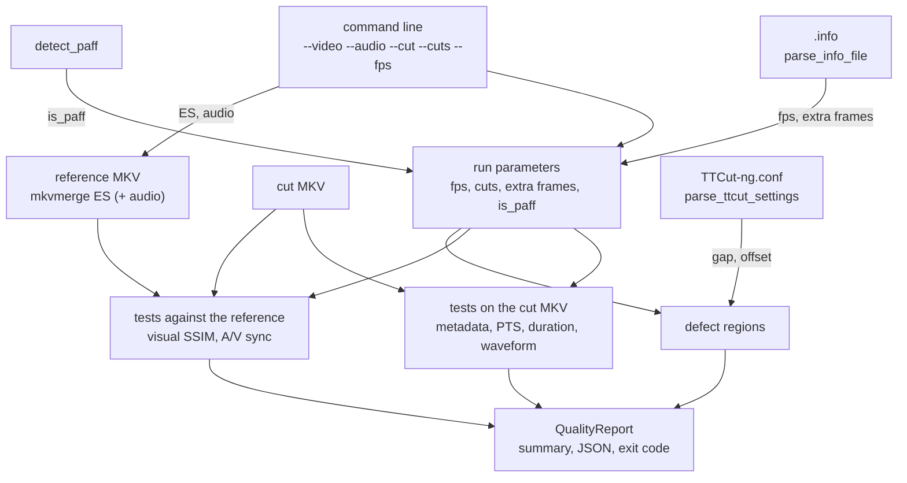

# Code Map: Quality check (ttcut-quality-check)

**Scope:** `tools/ttcut-quality-check/ttcut-quality-check.py`, installed as
`/usr/bin/ttcut-quality-check`: it takes the original elementary stream and
audio, a cut MKV and the kept frame ranges, runs up to seven tests and
reports PASS/WARN/FAIL per test, as text, optional JSON and exit code. It
measures a finished cut from outside; nothing in TTCut-ng calls it, and no
gate runs it.

**Neighbours, not part of this map:** how TTCut-ng cuts
([smart-cut.md](smart-cut.md), [mpeg2-cut.md](mpeg2-cut.md),
[audio-cut-timing.md](audio-cut-timing.md)); what the `.info` keys mean and
who writes them ([ttcut-demux.md](ttcut-demux.md)); the author's
`verify-smartcut` skill, which drives this tool, lives outside the
repository.

## Data flow

Legend: solid = data, dashed = trigger / configuration.

## Edge semantics

| From → To | What crosses (data / order / invariant) |
|---|---|
| `ARGS` → `CFG` | `--cuts "a-b,c-d"`: 0-based, inclusive frame ranges as in TTCut-ng's cut list (`parse_cuts`). `--fps` unless `--info` has a `frame_rate`. `--tests` picks a subset of `metadata,timing,duration,visual,avsync,waveform,defects`; `mkvmerge` is required only for `visual`/`avsync`. |
| `INFO` → `CFG` | `[video] frame_rate` (fraction or number) overrides `--fps`. Extra frames from `[warnings] es_doubled_pts_aus` (raw access units, with `es_total_aus`), else the legacy `es_extra_frames`. `[timing] av_offset_ms` is parsed but not used. |
| `PAFF` → `CFG` | Only when ffprobe reports a non-progressive field order: the first second as Annex-B, access-unit delimiters per expected frame > 1.5 → PAFF. On PAFF the raw-AU extra-frame list is dropped with a warning (it does not match frame indices). |
| `CFG` → `OWN`, `CUT` → `OWN` | **metadata:** codec equal to the ES, fps within 0.5, video packet count within ±5 of Σ(segment length) minus extra frames inside the cuts. **timing:** per stream the sorted packet PTS; any interval more than 0.5 ms off the median counts as an anomaly, FAIL on any. **duration:** stream durations (or last PTS + duration), |video − audio| ≤ 50 ms PASS, ≤ 100 ms WARN. **waveform:** 100 ms of 48 kHz mono around each internal boundary (cumulative segment durations from `frames_to_seconds`), a 1 ms chunk more than 30 dB above both neighbours (and above −80 dBFS) is a click; needs numpy, else WARN. |
| `ARGS` → `REF` → `CMP`, `CFG`/`CUT` → `CMP` | `mkvmerge --default-duration 0:<1e9/fps>ns` on the ES — once without audio for `visual`, once with it for `avsync` (two full-size muxes into the temp directory). **visual:** skipped (WARN) when the `.info` lists extra frames. Per segment a display-order offset (0–10 frames, best SSIM of the first cut frame against the reference); then SSIM at start+1 frame (re-encoded zone, ≥ 0.50), start+20, middle, end−20 (stream copy, ≥ 0.99); each reference position probed ±3 frames (PAFF: ±12 fields). Frames come from `-ss (t−15 s) -copyts -vf select=gte(t,T)`. **avsync:** the first ≤ 30 s of the **first segment** only, 16 kHz mono PCM, syncstart if installed else numpy FFT cross-correlation within ±1 s; ≤ 50 ms PASS, ≤ 150 ms WARN. |
| `CONF` → `DEF`, `CFG` → `DEF` | Extra frames inside the cuts grouped into regions (gap = `--defect-gap` or the setting, default 5 s), each with its time in the cut. `parse_ttcut_settings` reads `~/.config/TTCut-ng/TTCut-ng.conf`, section `[Common]`, keys `ExtraFrameClusterGap`/`ExtraFrameClusterOffset`; the report names the file as the source whenever it exists. The offset is not used in the grouping. Always PASS (a report, not a test). |
| `OWN`, `CMP`, `DEF` → `REP` | One `TestResult` per test (visual yields two: re-encoded and stream copy). Exit code 2 when any FAIL, 1 when any WARN, else 0; `--json` writes the same list. The temp directory (`mkdtemp`, i.e. `$TMPDIR` or `/tmp`) is removed unless `--keep-tmpdir` or `--tmpdir`. |

## Assumptions, contracts & pitfalls

- **Frame numbers are TTCut-ng's**, not the reference MKV's: the visual test
  searches offsets and neighbours because mkvmerge and TTCut-ng may disagree
  on display order at a boundary; a defective stream (extra frames) makes
  that comparison meaningless, so it is skipped.
- **Temp space:** the reference MKV is about as large as the ES and is
  written twice when both reference tests run; `--tmpdir` moves it. Here
  `/tmp` is a RAM-backed tmpfs (46 GB).
- **Packaging:** installed by `debian/rules`; `debian/control` recommends
  `python3-numpy` (A/V sync fallback, waveform) but not `mkvtoolnix`.

### Reading hypotheses for audit run 18

From reading only; each needs proof first.

- **Q1 — the TTCut-ng settings are never read.** `parse_ttcut_settings`
  looks for a `[Common]` section; TTCut-ng writes `[Settings]` with keys
  `Common\ExtraFrameClusterGap` (seen in a real `TTCut-ng.conf`), so the
  defaults 5/2 always win while the report says “from TTCut-ng.conf”.
- **Q2 — A/V sync looks at the start only.** At most 30 s of the first
  segment; an offset that builds up in later segments is not seen.
- **Q3 — PTS tolerance below the container's resolution.** Matroska stores
  1 ms timestamps; at frame intervals that are not whole milliseconds
  (23.976/29.97/59.94 fps) every interval deviates by up to 0.5 ms or more,
  so the test may FAIL a correct cut.
- **Q4 — `mkvmerge` is required but not recommended by the package.** A
  package user without mkvtoolnix gets an error for the default test set.
- **Q5 — the reference MKV is written twice into `/tmp`.** Two full-size
  muxes of the ES for `visual` and `avsync`, into RAM-backed `/tmp` unless
  `--tmpdir` is given.
- **Q6 — the help text is out of date:** it announces seven tests but
  describes six (defect regions missing) and names ffmpeg 8.0+ in a 9.x
  environment.

## Redundancy / consolidation candidates

- **Reference MKV built twice**
  - sites: `test_visual_comparison` (ES only), `test_av_sync` (ES + audio), both via `mkvmerge` into the same temp directory
  - shared purpose: a timestamped reference of the uncut ES
  - status: candidate → one reference with audio, built once and handed to both (Q5)
- **Frame-rate fraction parsing**
  - sites: `detect_paff` (`parse_frac`), `test_metadata` (`r_frame_rate`), `parse_info_file` (`frame_rate`)
  - shared purpose: “n/d” or plain number → float
  - status: candidate → one helper
