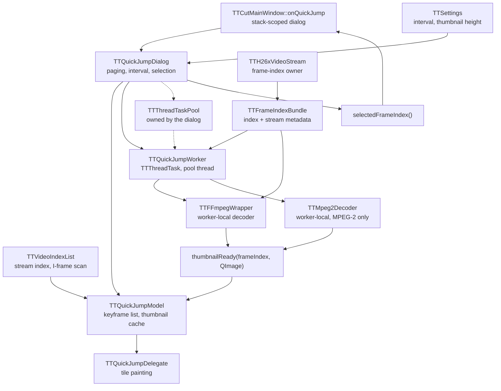

# Quick Jump dialog (Zeitsprung)

Thumbnail grid for jumping to a position. The user picks a picture, the dialog
closes, and the main window navigates there.

Two properties of this subsystem cause almost every question asked about it:
the dialog is a **stack object** whose destructor runs on the GUI thread, and
the frame positions it hands around change index domain twice on the way to the
decoder.

Legend: solid = data flow, dashed = triggers.

## Edge semantics

| from → to | data / order / invariant carried |
|---|---|
| `TTCutMainWindow::onQuickJump` → `TTQuickJumpDialog` | The dialog is a **stack object**. `exec()` returns, the frame is fetched, then the function's closing brace destroys the dialog — on the GUI thread, inside the button click that opened it. |
| `TTVideoIndexList` → `TTQuickJumpModel` | `buildKeyframeIndex()` walks `moveToNextIndexPos(pos, 1)` collecting **I-frame positions only** — never arbitrary frames. Positions are stream-index positions, which the decode path later treats as DISPLAY positions. |
| `TTQuickJumpModel` interval filter | `setIntervalSeconds(n)`: `n <= 0` keeps every I-frame; `n > 0` thins them to roughly one per `n` seconds, anchored on the last I-frame at or before `mAnchorFrame`. A **small** interval therefore means *more* tiles, not different kinds of frames. |
| `TTSettings` → `TTQuickJumpDialog` | Two values, both read **once at construction**: `quickJumpIntervalSec()` and `quickJumpThumbHeight()`. Changing either in the settings takes effect the next time the dialog opens, not in an open one. The height is clamped to `kQuickJumpThumbHeightMin/Max`, so a hand-edited config cannot collapse the tiles. |
| `TTQuickJumpDialog` → `TTQuickJumpDelegate` | Tile geometry: the configured **height**, and a width computed from it by `computeThumbWidth()` via the stream's aspect ratio. Only the height is stored anywhere — the width is always derived, which is what keeps tiles undistorted. `calculateItemsPerPage()` then derives the tiles per page from the delegate's `sizeHint()`, so a larger height automatically means fewer tiles and more paging. |
| `TTQuickJumpModel` → `TTQuickJumpDelegate` | Per tile: a `QPixmap` if decoded, else a placeholder. `isFailedFrame()` decides the colour — **dark red** for a decode that returned null, **grey** for one still pending. A tile that stays grey means the worker has not answered yet; red means it answered with nothing. |
| `TTH26xVideoStream` → `TTQuickJumpWorker` | `ffmpegFrameIndexBundle()` — index **and** the H.264 stream metadata (`isPAFF`, `frameMbsOnlyFlag`, `log2MaxFrameNum`) in one `TTFrameIndexBundle`. The bundle exists so the two cannot be separated; see pitfalls. |
| `TTQuickJumpDialog` → `TTQuickJumpWorker` | Page frame list, thumbnail size, index/header lists, the bundle. One worker per page; `abortCurrentWorker()` disconnects the model first, so a late thumbnail from a superseded worker cannot repaint the new page. |
| `TTThreadTaskPool` ⇢ `TTQuickJumpWorker` | Pool ownership is the dialog's. Destroying the dialog destroys the pool, whose `cleanUpQueue()` calls `waitForDone()` — a **blocking** wait on the GUI thread. |
| `TTQuickJumpWorker` → `TTFFmpegWrapper` | One wrapper per worker, created inside the worker thread (it is a `QObject`). The worker's `mIsAborted` is handed over as a cancel token, so an abort reaches into a running decode instead of only being seen between frames. |
| `TTQuickJumpWorker` → `TTMpeg2Decoder` | MPEG-2 takes a completely separate decoder; no bundle, no cancel token, no wrapper involvement. |
| `TTFFmpegWrapper::decodeFrame(n)` | `n` is a **display** position. Internally mapped to a decode-order AU via `displayOrderMap()`; the delivered frame is that AU, not the n-th decoder output. |
| worker → `thumbnailReady(frameIndex, QImage)` | A `QImage`, never a `QPixmap` (`QPixmap` is not thread-safe). Conversion happens in the model, on the GUI thread. A **null** image is the documented "decode failed" signal, not an error condition to be logged twice. |
| `TTQuickJumpDialog::selectedFrameIndex()` → main window | The chosen keyframe position, in the same domain the model collected it — passed to `currentFrame->onGotoFrame()`. |

## Assumptions and contracts

- **The thumbnail height's default and range live in exactly one place**
  (`TTSettings::kQuickJumpThumbHeight{Default,Min,Max}`). The settings page
  ranges its spin box from them, the dialog clamps against them, and the
  `.ui` carries no `minimum`/`maximum` of its own — deliberately, with a
  comment saying so.
- **The dialog owns its pool.** Nothing outside it may keep a pointer to a
  worker past `abortCurrentWorker()`; the worker deletes itself through the
  pool's autodelete.
- **`TTFFmpegWrapper` knows nothing about tasks.** It sees a
  `const std::atomic<bool>*` it does not own. Whoever sets the token must
  outlive every `decodeFrame()` call made after setting it — today the token is
  a member of the very worker that owns the wrapper, so this holds by
  construction, and nothing in the API enforces it.
- **`TTThreadTask::mIsAborted` is `std::atomic<bool>`.** It is written by the
  GUI thread and read by the worker inside a decode loop.
- **A cancel is not a failure.** A decode abandoned through the token returns a
  null image without logging an error and without a neighbour-frame retry.
- **The wait in `cleanUpQueue()` must not get a deadline.** An expired deadline
  would destroy the pool while a task can still signal into it — a visible
  freeze traded for an occasional crash. What keeps the wait short is the abort
  being set first *and* reaching into the running decode — for the dialog's
  own worker only. The wait is `QThreadPool::globalInstance()->waitForDone()`,
  which every `TTThreadTaskPool` in the app shares, so an unrelated task
  already running on the global pool (e.g. `TTAudioAnomalyScanTask`, which
  auto-starts, has no cancel token, and is not touched by
  `abortCurrentWorker()`) still bounds this wait by its own remaining runtime.

## Known pitfalls

- **An index without its metadata drains the file to EOF.** The three stream
  values are produced only by `buildFrameIndex()` (SPS parse plus packet scan).
  An adopter that receives the bare list keeps the constructor defaults, its
  decode-order tagging then counts PAFF field packets as frames, and a
  field-pair target AU never appears. Measured on `06x03` display 3566:
  **72 675 ms** against 13 ms with metadata. This defect was fixed once in July
  2026 for `provideFrameIndexTo()`'s adopters and returned through the
  quick-jump path, which pulled the index directly. `TTFrameIndexBundle` and the
  private `setFrameIndexEntries` exist so it cannot return a third time.
- **Two index domains.** The model collects I-frame positions from
  `TTVideoIndexList`; the decoder treats the same numbers as display positions
  and maps them to decode-order AUs itself. The two agree today, and a change to
  either side has to keep them agreeing. A tile's frame number is not the AU
  that gets decoded for it.
- **Interval 1 does not mean "every frame".** It means every I-frame, i.e. the
  unthinned list. More tiles, same kind of frame.
- **A grey tile is not a failed tile.** Grey is pending, dark red is failed.
  While a decode was taking a minute, the whole page stayed grey, which reads
  like "no thumbnails" rather than "still working".
- **Closing the dialog is the expensive moment, not opening it.** Selection runs
  the destructor chain `~TTQuickJumpDialog → delete mTaskPool →
  ~TTThreadTaskPool → cleanUpQueue → waitForDone` on the GUI thread. Anything
  that makes a worker slow to stop shows up here as a frozen interface.
- **The skip-loop bound depends on the seek distance**, not on GOP size:
  `guardMax = (targetAU - seekStart) + headroom`, where `seekStart` comes from
  `seekToFrame()`'s backward walk. With damaged keyframe flags that walk can
  land far back and the bound grows accordingly — never beyond the old
  whole-index bound, but the fix's benefit shrinks in that shape.

## Redundancy / consolidation candidates

- **Index adoption is now single-path.** `provideFrameIndexTo()` and the direct
  `ffmpegFrameIndexBundle()` pull both end in
  `setFrameIndex(const TTFrameIndexBundle&)`. No consolidation left here; the
  earlier duplication was the defect.
- **Two thumbnail-producing decoders** (`TTFFmpegWrapper`, `TTMpeg2Decoder`)
  split by codec inside `TTQuickJumpWorker::operation()`. This mirrors the split
  everywhere else in the project (see `detection-and-search.md`) and is not a
  consolidation candidate — the two decoders share no interface worth unifying.
- **Page-restart logic appears twice** in `TTQuickJumpDialog` — `onPageBack()`
  and `onPageForward()` both do `abortCurrentWorker(); …; startThumbnailWorker();`
  around a different offset computation. Small, but the pair must stay in step:
  a future third navigation entry point that forgets the abort would leave two
  workers writing into one model.
