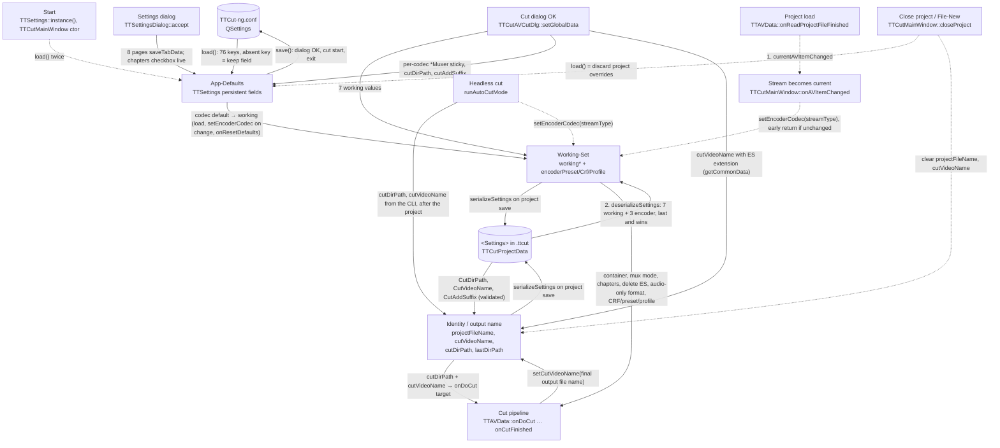

# Code Map: Settings as a state machine

**Scope:** every value `TTSettings` holds, sorted by which copy is the truth at
which moment: the persistent App-Defaults in `TTCut-ng.conf`, the transient
Working-Set the cut pipeline reads, and the per-project identity fields — plus
every transition that moves a value between them (start, settings dialog,
stream open, project load/save, cut dialog, cut pipeline, close project,
headless cut). Starts at `QSettings`, ends where the pipeline reads a value.
Not covered: what each value *does* in its consumer (see the subsystem maps),
window geometry (own `QSettings` block in `TTCutMainWindow::closeEvent`),
`progressCalibration/` (see `progress-reporting.md`), the recent-files list.

## The three value classes

| Class | Fields | Stored in | Written by | Read by |
|---|---|---|---|---|
| **App-Defaults** | 76 keys in `/Settings/{Navigation,StreamPoints,Common,Screenshot,Preview,Search,IndexFiles,LogFile,RecentFiles,Encoder,Muxer,CutOptions}`, among them the per-codec `mpeg2Crf`, `h264Preset/Crf/Profile`, `h265Preset/Crf/Profile`, `mpeg2Muxer/h264Muxer/h265Muxer` and the mux defaults `mkvCreateChapters`, `mkvChapterInterval`, `muxDeleteES`, `mpeg2Target`, `muxMode`, `audioOnlyFormat` | `TTCut-ng.conf` via `TTSettings::load()`/`save()` | settings dialog pages (`saveTabData`), cut dialog for the per-codec container sticky and `cutDirPath`/`cutAddSuffix`, main window for `lastDirPath`, `screenshot*` from the CLI | dialogs (to show defaults), `load()` and `setEncoderCodec()` (to derive the Working-Set), preview (`previewPreset`), everything navigation/logging/detection |
| **Working-Set** | `workingOutputContainer`, `workingMkvCreateChapters`, `workingMkvChapterInterval`, `workingMuxDeleteES`, `workingMpeg2Target`, `workingMuxMode`, `workingAudioOnlyFormat` + the encoder transients `encoderPreset`, `encoderCrf`, `encoderProfile` | memory only; **`.ttcut` `<Settings>`** on project save | `load()` (via `syncWorkingSetToCodec` + `resetWorkingMuxSet`), `setEncoderCodec()` (only on a codec CHANGE, `syncWorkingSetToCodec`), `deserializeSettings()` (project, last and wins), `TTCutAVCutDlg::setGlobalData()` (OK), `TTCutAVCutDlg::onResetDefaults()` | cut pipeline: `TTAVData::onCutFinished` (container, mux mode, chapters, delete ES), `TTAVData::doAudioOnlyCut` (`workingAudioOnlyFormat`), `TTESSmartCut::setupEncoder` and `TTTranscodeProvider` (encoder transients), the cut dialog UI |
| **Identity / output name** | `projectFileName` (never persisted), `cutVideoName` (never in QSettings, in `.ttcut`), `cutDirPath` and `cutAddSuffix` (persistent AND in `.ttcut`), `lastDirPath` | memory, partly `.ttcut`, partly `TTCut-ng.conf` | main window (save/save-as, open, new), `deserializeSettings()`, cut dialog, **cut pipeline** (`setCutVideoName` with the final output name), headless CLI | project save, `onAudioVideoCut` (default name), `onDoCut` target path, the cut dialog fields |

The legacy key `Muxer\OutputContainer` is gone since `7bfd4a3b` (field,
getter, dead signal, load and save); a stale key in an existing
`TTCut-ng.conf` is simply never read. The per-codec `*Muxer` keys replaced
it in v0.70.0; an unknown codec index reads as H.265 (`encoderDefaultsFor`).

## Data flow

Solid edges carry values (producer → consumer); dashed edges are triggers
(who causes a transition) and carry no value themselves.

## Edge semantics

| From → To | What crosses (data / order / invariant) |
|---|---|
| `START` → `DEF` | `TTSettings::instance()` lazily constructs and runs the first `load()` (`gui/ttcutmain.cpp` forces it before any UI); `TTCutMainWindow`'s constructor clears the recent list and calls `load()` a second time. Both read the same file; the second call is a no-op except for keys the constructor changed in between. |
| `QS` → `DEF` | `load()` reads every key with the CURRENT field value as fallback (`settings.value(key, mField)`). Invariant that follows: **a key absent on disk can never reset a field** — a second `load()` in the same process inherits whatever the field holds (why `test_container_sync` spawns one process per case). Legacy migrations happen here: MP4 container value 2 → 1 for the three `*Muxer` keys; `Mpeg2Preset/Profile` and 28 orphan keys are removed; thresholds are rounded to three decimals; `cutDirPath` falls back to `QDir::currentPath()` when the directory is gone; `WorkerCount` is bounded to 0..16. Side effect: `TTMessageLogger::setLogFilePath(mLogFilePath)`. |
| `DEF` → `QS` | `save()` writes all 76 keys, never `projectFileName`/`cutVideoName`/the Working-Set. Call sites: `TTCutMainWindow::closeEvent`, `openSettingsDialog` (only when `exec()` returned `Accepted` — until `7bfd4a3b` it saved after Cancel as well), `onAudioVideoCut` (only after the cut dialog was accepted — moved there on 2026-08-18 because `closeProject`'s `load()` used to revert unsaved dialog edits). |
| `DEF` → `WORK` | The codec → (preset, CRF, profile, container) sync is `TTSettings::syncWorkingSetToCodec(codec)`, fed by `encoderDefaultsFor(codec)` (the record of the four per-codec defaults; index outside 0..2 = H.265). In `load()` it runs unconditionally from the persisted `encoderCodec`; in `setEncoderCodec(v)` only when `v != mEncoderCodec`; in `TTCutAVCutDlg::onResetDefaults` on the button. MPEG-2 syncs only CRF and container (no preset/profile knob). The other six working mux fields are copied by `resetWorkingMuxSet()` in `load()` and `onResetDefaults` only — `setEncoderCodec` leaves them alone. `workingOutputContainer` comes from the per-codec `*Muxer` key (the 2026-08-16 defect: a fresh config cut MPEG-2 to MKV because the legacy global key was used). The encoder settings page shows the same record (`loadCodecSettings`) instead of switching itself. |
| `SDLG` → `DEF` | `TTSettingsDialog::accept` calls the eight pages' `saveTabData` in a fixed order (encoder before muxer, "codec-dependent container logic"), then `QDialog::accept`; the caller saves to disk afterwards. Pages write persistent fields only — never the Working-Set, so a running project's overrides survive a settings edit — and only inside `saveTabData` (`TTCutSettingsMuxer::onMkvChaptersChanged` wrote `setMkvCreateChapters` on every toggle until `7bfd4a3b`; now it only enables the interval spin box). Gate: `tools/diag/test_settings_cancel` (toggle, reject → unchanged; accept → written). |
| `OPEN` → `WORK` | `onAVItemChanged` maps the stream type to the codec index via `TTAVTypes::encoderCodecFor` (h264 → 1, h265 → 2, else 0) and calls `setEncoderCodec`; `onAudioVideoCut` and `runAutoCutMode` use the same helper. Skipped entirely when `avItem == mpCurrentAVDataItem` or the item has no video stream. Because of the early return in `setEncoderCodec`, a stream of the SAME codec as the current one re-syncs nothing. |
| `PLOAD` → `OPEN` → `PRJ` → `WORK` | Order inside `TTAVData::onReadProjectFileFinished`: `avDataReloaded` → `currentAVItemChanged(avItemAt(0))` (both objects live on the GUI thread, so the auto connection delivers `onAVItemChanged` synchronously and it resets the Working-Set to the codec defaults) → stream points → logo data → `deserializeSettings()` (project values overwrite the Working-Set) → `readProjectFileFinished`. The contract "project values land last and win" holds only because the signal is delivered synchronously; a queued connection would invert it. `deserializeSettings` is silent when the file has no `<Settings>` element. |
| `PRJ` → `ID` | `CutDirPath` goes through `resolveProjectPath` (absolute, no traversal, no NUL) and is dropped with a warning otherwise; `CutVideoName` is rejected if it contains a slash, backslash or control character; `CutAddSuffix` lands in the persistent default directly. |
| `WORK`/`ID` → `PRJ` | `serializeSettings` writes 13 elements: the three cut fields, the seven working mux values, the three encoder transients — deliberately not the App-Defaults ("the user's dialog defaults stay sacrosanct"). Written on every `TTAVData::writeProjectFile`, i.e. every project save. |
| `CDLG` → `WORK`/`DEF`/`ID` | `onDlgStart` (OK) → `setGlobalData`: `getCommonData` (cutDirPath, cutAddSuffix, cutVideoName = UI base name + ES extension from `expectedEsExtension(container, codec)`), `encodingPage->getTabData` (encoder mode, `setEncoderCodec` with the disabled combo's value = no-op, the three transients from the UI), then the seven working mux values, and the container ALSO into the per-codec `*Muxer` default ("sticky preference"). Cancel/Esc/X writes nothing; `onDirectoryOpen` however writes `cutDirPath` and `muxOutputPath` immediately when a directory is picked. |
| `WORK` → `PIPE` | `onCutFinished` switches on `workingOutputContainer` (1 = MKV via a second pool task, 0 = mplex, else no mux); MKV chapters need `workingMkvCreateChapters && workingMkvChapterInterval > 0`; mplex script vs run from `workingMuxMode`; ES deletion from `workingMuxDeleteES` after a successful MKV mux. Audio-only: `workingAudioOnlyFormat` picks MKA vs per-track files. Encoder: `TTESSmartCut` reads preset/CRF/profile (profile clamped per codec), `TTTranscodeProvider` reads `encoderCrf` as qscale; the preview reads the App-Default `previewPreset`, not the Working-Set. |
| `ID` → `PIPE` | `onAudioVideoCut` derives `cutVideoName` from the video base name (`_cut` suffix if `cutAddSuffix`) only when it is empty, then builds the `onDoCut` target from `cutDirPath` + `cutVideoName`. The pipeline treats that name as the INTERMEDIATE elementary-stream file (`.m2v/.h264/.h265`); the container file is derived from its base name. |
| `PIPE` → `ID` | `onH26xCutFinished` and `onMpeg2MuxFinished` call `setCutVideoName(<final output file name>)` for the completion notification. After a cut the field therefore holds a CONTAINER name (`foo_cut.mkv`), no longer the ES name — except when the user discards an H.264 result (`confirmUnrewrittenFrames`), which returns before the call. |
| `CLOSE` → `DEF`/`ID` | `closeProject` calls `load()` ("discard project overrides"), then clears `projectFileName` (after `load()` on purpose: load must never resurrect a project name) and `cutVideoName`. Given the fallback rule above, `load()` restores only fields that HAVE a key on disk; the Working-Set is rebuilt from the defaults, so it is the one place where project overrides are really dropped. `onReadVideoStream` clears `cutVideoName` too, but only when no AV item exists yet. |
| `HEAD` → `ID`/`WORK` | `runAutoCutMode` opens the project (all of the above runs), waits, calls `setEncoderCodec(streamType)` — a no-op after the project load already set that codec, so the project's Working-Set survives — and then translates the CLI path the way the cut dialog's `getCommonData()` translates its output field: the extension picks `workingOutputContainer` (`.mkv` → 1, `.mpg` → 0 and MPEG-2 only, anything else aborts with exit code 1), `cutDirPath` **and** `muxOutputPath` become the path's directory, `cutVideoName` = `TTCutAVCutDlg::stripKnownExtension(name)` + `expectedEsExtension(container, codec)`; `onDoCut` gets `cutDirPath/cutVideoName` like the GUI path. Until 2026-09-19 it set only `cutDirPath` and the bare base name: the codec-default muxer ran (mplex for MPEG-2), the ES had no extension and the `.mpg` went to `muxOutputPath` = home. The container is set **after** `setEncoderCodec`, which would reset it. No cut dialog; `runAutoCutMode` itself never calls `save()`, but its `quit()` does reach `closeEvent` under Qt 6.10 and that saves — the CLI values end up in the configuration (gates run with their own `XDG_CONFIG_HOME`). |

## Assumptions, contracts & pitfalls

- **`TTSettings::load()`** — assumes it may run any number of times; guarantees the disk keys win over memory for every key present; pitfall: absent keys keep the in-memory value, so a "reset" through `load()` is only as complete as the file, and a test that loads twice in one process measures the previous case.
- **`TTSettings::setEncoderCodec()`** — contract: derive the Working-Set for a NEW codec; pitfall: the early return means "same codec" never re-syncs. Consequence in the GUI: a cut-dialog CRF override made for video A stays in force for a later video B of the same codec opened in the same session (no `closeProject` in between, e.g. a multi-video project or a second `onReadVideoStream`). Read-derived, not measured. **Ruled deliberate 2026-09-12** (code-audit run 3, contract finding 2): re-syncing on every `onAVItemChanged` would wipe a project's overrides on each item switch, so the override surviving video B is the intended behaviour; no gate.
- **`TTAVData::onReadProjectFileFinished`** — the "project values win" contract depends on `currentAVItemChanged` being delivered synchronously (same thread, auto connection) before `deserializeSettings`; the comment in `setEncoderCodec` documents it, nothing enforces it.
- **`TTSettingsDialog`** — contract "nothing is written before OK" is broken by the muxer page's live `setMkvCreateChapters`; combined with `openSettingsDialog` saving unconditionally after `exec()`, a toggled-then-cancelled checkbox reaches disk. Read-derived.
- **`TTCutAVCutDlg`** — assumes `cutVideoName` is either empty or a UI name whose known extension can be stripped (`stripKnownExtension`); guarantees the pipeline gets the ES extension. Pitfall: `onDirectoryOpen` persists the directory before OK.
- **`TTCutProjectData::serializeSettings`** — writes `cutVideoName` as it is at save time; after a finished cut that is the container name, so a project saved then carries `foo_cut.mkv` in a field the pipeline reads as an ES path. The cut dialog's `stripKnownExtension` repairs it on the next GUI cut; the headless path does not go through the dialog but overwrites the name from the CLI anyway.
- **`TTSettings` field without setter** — `stepPlusShift` is loaded and saved but has no `setStepPlusShift`; the navigation page cannot change it.
- **Ordering of `save()`** — the only saves are dialog close, cut start and exit; a crash between a settings edit and exit loses nothing (dialog saves), but `lastDirPath`, the per-codec sticky from `onDirectoryOpen`, and `cutAddSuffix` from a cancelled cut dialog are written to disk only at exit.

## Redundancy / consolidation candidates

- ~~**codec → (preset, CRF, profile, container) sync** (four sites)~~ — consolidated `7bfd4a3b`: `TTSettings::encoderDefaultsFor` + `syncWorkingSetToCodec`, called by `load()`, `setEncoderCodec()` and the reset button; `loadCodecSettings` reads the record.
- ~~**stream type → encoder codec index** (three sites)~~ — consolidated `7bfd4a3b`: `TTAVTypes::encoderCodecFor`.
- **default cut name from the video file**
  - sites: `gui/ttcutmainwindow.cpp:TTCutMainWindow::onAudioVideoCut` (`<base>_cut` when empty), `gui/ttcutmainwindow_headless.cpp:TTCutMainWindow::runAutoCutMode` (from the CLI path)
  - shared purpose: give the pipeline a base name
  - status: kept separate → the headless name is a CLI argument, not a derivation. The *extension* handling is shared since 2026-09-19: `runAutoCutMode` calls the dialog's `stripKnownExtension`/`expectedEsExtension` (now public static) instead of passing the bare base name.
- ~~**per-codec container preference vs legacy global container**~~ — resolved `7bfd4a3b`: `OutputContainer` field, getter, dead signal, load and save removed (ruled: no migration read either); the cut dialog's `default:` branches fall back to the codec table (= H.265 = MKV).
- ~~**Working-Set mirror of the mux defaults** (two sites)~~ — consolidated `7bfd4a3b`: `TTSettings::resetWorkingMuxSet()`.
