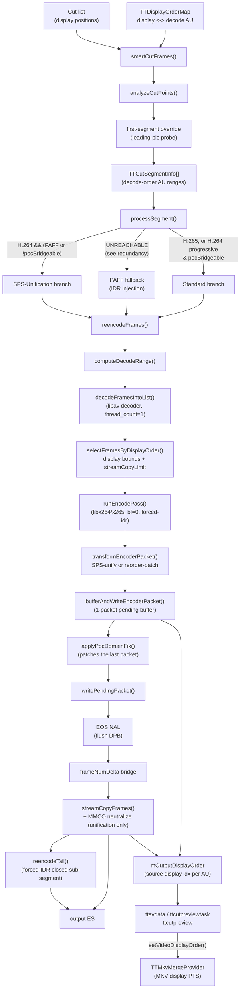

# Code Map: Smart Cut (H.264 / H.265)

**Scope:** The `TTESSmartCut` engine — from a display-order cut list to a written
elementary stream. Covers segment planning (`analyzeCutPoints`), the three
execution branches in `processSegment`, and the bitstream surgery that bridges
the re-encode → stream-copy seam (EOS, `frame_num`, POC, MMCO, SPS).

**Not covered here:**
- MPEG-2 cutting — a separate engine (`TTMpeg2VideoStream::cut` →
  `TTTranscodeProvider`), no `TTESSmartCut` involvement. See `mpeg2-cut.md`.
- Decode-order vs display-order semantics of the *display/navigation* path —
  see `frame-order.md`, which is the authority for `TTDisplayOrderMap` and for
  the RASL / open-GOP cold-start findings this map relies on.

**Codec scope:** `NALU_CODEC_H264` and `NALU_CODEC_H265` only. There is one
class for both; codec and stream-type differences are runtime branches, not
subclasses. That is why this is one map with a variant matrix rather than one
map per codec.

## Data flow

## Edge semantics

| From → To | What crosses (data / order / invariant) |
|---|---|
| UI cut list → `smartCutFrames` | **Display** positions (Direction A). Every index below this line is a **decode-order AU** index. Conversion is `TTDisplayOrderMap` and nothing else. |
| `smartCutFrames` → `analyzeCutPoints` | Display pairs; `analyzeCutPoints` converts via `displayToDecode`. `endFrame` is the **max AU over a 32-frame trailing display window** — a frame displaying ≤ `endDisplay` can sit at a later AU under B-frame reorder. |
| `analyzeCutPoints` → `TTCutSegmentInfo` | Four mutually exclusive shapes, encoded in the sentinel fields: pure stream-copy (`reencodeStartFrame < 0`), pure re-encode (`streamCopyStartFrame < 0`), mixed (both ≥ 0), mixed + tail (`needsReencodeAtEnd`). |
| `smartCutFrames` → first-segment override | Only for segment 0, only when `streamCopyStartFrame ≥ 0`. Downgrades a Non-IDR re-encode to pure stream-copy **iff** the cut-in keyframe has no leading pictures (probe: any AU in `(startFrame, startFrame+16]` with `decodeToDisplay(au) < cutInDisplay`; `-1` counts as "before"). Decoder starts with an empty `delayed_pic[]`, so no IDR barrier is needed. |
| `processSegment` → `reencodeFrames` | Head mode carries `startDisplay` (display lower bound) and `streamCopyStartFrame` (AU upper bound). Returns `adjustedStreamCopyStart` when the re-encode had to swallow the whole copy GOP. |
| `selectFramesByDisplayOrder` → `ctx.framesToEncode` | Keep-predicate is **mode-dependent**: tail → `au ≥ startFrame && disp ≤ endDisplay`; pure re-encode → `startDisplay ≤ disp ≤ endDisplay`; head/mixed → `disp ≥ startDisplay && au < streamCopyLimit`. `AVFrame::pts` carries the **source AU index**, not a timestamp. |
| `selectFramesByDisplayOrder` → `*adjustedStreamCopyStart` | Boundary crossing: if any AU in `[streamCopyLimit, nextKF)` displays before `startDisplay`, the re-encode extends to `nextKF` and the stream-copy start moves with it. This is the old "Case A/B" distinction, now exact via the map. |
| `runEncodePass` → `bufferAndWriteEncoderPacket` | With `bf=0` the encoder emits packets 1:1 in submission order, so packet *k* belongs to `framesToEncode[k]`. The pending-packet buffer delays the *write* by one packet but preserves FIFO order — this is what lets `applyPocDomainFix` patch the **last** encoder packet after the fact. |
| `reencode → stream-copy` seam | The load-bearing boundary. Carries, in order: EOS NAL (flush DPB) → *(standard/fallback only)* source SPS/PPS → `frame_num` continuity via `frameNumDelta` → *(unification only)* MMCO neutralization for 32 AUs. Getting any of these wrong drops the first copied GOP. |
| `processSegment` → `streamCopyFrames` (`frameNumDelta`) | Bridges the encoder's own `frame_num` sequence (0..N-1) to the source's. **EOS flushes the DPB but does not reset `PrevRefFrameNum`** — only an IDR does. Delta = `lastEncFrameNum - firstScFrameNum`, where `lastEncFrameNum = ((N-1) mod EncMaxFrameNum) + 1`. The modulo matters once `N > EncMaxFrameNum`; without it the decoder floods the DPB with dummy refs and temporal-direct B-frames lose their co-located picture. |
| `frameNumDelta`: which `log2` width? | Unification branch uses **source** `mLog2MaxFrameNum` (slices were rewritten into the source domain); standard branch uses **encoder** `mEncoderLog2MaxFrameNum`. Swapping these silently corrupts the seam. |
| `applyPocDomainFix` → `ctx.pendingPacket` | Patches the last encoder `poc_lsb` so `PicOrderCntMsb` does not wrap into the first copied GOP. Only H.264, only `poc_type == 0`, only when a stream-copy follows. Reads source POC at the *actual* copy start (post-adjustment). |
| `processSegment` → `streamCopyFrames` (segment i → i+1) | Between segments: EOS + `writeParameterSets` + a **cumulative** `frame_num` delta computed from the last non-B AU of segment *i* to the first copied AU of segment *i+1*, modulo `MaxFrameNum`. |
| `streamCopyFrames` → output | Bulk-write (single `mmap` → `write`) **only** when no patching is needed. Any of `patchReorderFrames`, `frameNumDelta ≠ 0`, `neutralizeMmcoFrames > 0` forces the per-AU path. |
| `stream-copy → tail` seam | Clean by construction: the tail's first frame is a **forced IDR**, which resets `PrevRefFrameNum`. No `frameNumDelta`, no MMCO, no SPS unification needed across this boundary — unlike the head seam. |
| `streamCopyFrames` / `runEncodePass` → `mOutputDisplayOrder` | One entry per written AU, in write order, holding the **source display index**. Any anomaly (encoder emits more packets than frames submitted) invalidates the whole vector; the muxer then falls back to legacy linear PTS. |
| `mOutputDisplayOrder` → `TTMkvMergeProvider` | Output-local display rank, used to assign MKV display PTS. Empty vector = "trust the muxer's linear timeline instead". |

## Variant matrix — which branch fires, and what it must guarantee

`processSegment` picks a branch by `codecType()` and `isPAFF()`; `analyzeCutPoints`
picks a segment shape by keyframe/IDR status at the cut-in.

| Stream property | H.264 | H.265 |
|---|---|---|
| **PAFF** (field pairs) | SPS-Unification branch, always (`isPAFF ⇒ useSpsUnification`). Encoder emits MBAFF; source SPS params (`log2_max_frame_num`, `log2_max_pic_order_cnt_lsb`, `frame_mbs_only_flag`) are stamped back onto the encoder slices. EOS before copy; MMCO neutralized for 32 AUs; `patchH264SpsReorderFrames(isPAFF=true)` raises `num_ref_frames`/`max_dec_frame_buffering` for the MBAFF→PAFF DPB transition. POC anchor stays `-1` (legacy linear numbering, byte-identical output). | **n/a** — `isPAFF()` is an H.264 concept; HEVC never enters this cell. |
| **Progressive / MBAFF**, POC seam bridgeable | Standard branch. EOS → source SPS/PPS → `frameNumDelta` recalculated from the **encoder's** `log2_max_frame_num` → stream-copy. `applyPocDomainFix` bridges the POC seam. No MMCO neutralization. | Standard branch. EOS NAL type 37 → VPS+SPS+PPS → stream-copy. **No** `frame_num`, POC, MMCO or SPS patching at all — every one of those is gated on `NALU_CODEC_H264`. |
| **Progressive**, POC seam **not** bridgeable | SPS-Unification branch (`!pocBridgeable`). Slices rewritten into the **source** POC domain; `mSpsUnificationPocAnchor` = source `poc_lsb` of the first *displayed* copy frame (min-display AU in the copy GOP, not the copy-start AU — its leading B pictures carry smaller POCs). | Cannot occur: `pocBridgeable` is only computed for H.264. |
| **Non-IDR I-frame cut-in** (open GOP, DVB) | `needsReencodeAtStart = !isAtKeyframe \|\| !isAtIDR` → re-encode with `forced-idr=1` produces an IDR barrier. Exception: segment 0 without leading pics → override to pure stream-copy. | Same rule, same override. `findKeyframeBefore/After` accept IDR/CRA/I-slice alike. |
| **Open-GOP leading pictures** at cut-in | Excluded by the display lower bound `disp ≥ startDisplay` in `selectFramesByDisplayOrder`. | Same. HEVC RASL pictures map to `decodeToDisplay == -1` and are therefore treated as "displays before the cut-in". See `frame-order.md`. |
| **Cut-out mid-GOP** | Tail re-encode: stream-copy ends at `tailStartFrame-1` (whole GOPs only), tail GOP re-encoded as a forced-IDR closed sub-segment bounded by `disp ≤ endDisplay`. Collapses to a pure re-encode when `tailStart ≤ streamCopyStart`. | Identical (codec-agnostic path). |

## Assumptions, contracts & pitfalls

- **`TTESSmartCut::smartCutFrames`** — assumes: the injected or self-built
  `TTDisplayOrderMap` has exactly `frameCount()` entries; hard-fails otherwise
  (a misaligned map cannot cut accurately). Guarantees: all indices below it are
  decode-order AU indices.

- **`analyzeCutPoints`** — assumes: a keyframe exists within the segment,
  otherwise it degrades to a full re-encode. The `endFrame` search window is
  **32 display frames** and the `maxKeptAU` search window is **64 AUs**; a
  reorder depth beyond those windows would silently truncate the segment. Both
  are fixed constants, not derived from `mReorderDelay`.

- **`processSegment` / `useSpsUnification`** — the branch condition is
  `H.264 && (isPAFF || !pocBridgeable)`. **Pitfall:** `CLAUDE.md` describes SPS
  Unification as a PAFF-only mechanism. It is not — a progressive H.264 stream
  with a non-bridgeable POC seam takes the same branch. Likewise the MMCO
  neutralization is documented under "PAFF notes" but is emitted *only* by this
  branch, which is broader than PAFF and narrower than "all H.264".

- **`pocDomainBridgeable`** — assumes libx264 emits
  `log2_max_pic_order_cnt_lsb == 4` (`kExpectedEncoderLog2PocLsb`). The real
  encoder SPS is not parsed until the first encoder packet arrives, i.e. *after*
  the branch decision. **Pitfall:** if a future libx264 changes that value, the
  classification is wrong in the silent direction — a seam is called bridgeable,
  `applyPocDomainFix` finds no safe `poc_lsb`, and the first copied GOP is
  dropped. The code escalates this via `TTMessageLogger::warningMsg` precisely
  because it "must never happen".

- **`selectFramesByDisplayOrder`** — guarantees: `AVFrame::pts` carries the
  source AU index. **Pitfall:** `ctx.realStartAU` is assigned in three places but
  read only by a `qDebug()` statement — no control flow depends on it. It is a
  leftover of the v0.72.0 frame-index unification. `CLAUDE.md`'s claim that
  "non-PAFF (MBAFF) streams use `realStartAU` filtering" does not match the code;
  the filtering is done by the display lower bound.

- **`decodeFramesIntoList`** — assumes `thread_count = 1` on the decoder.
  Frame-threading reassigns PTS and would break the AU-index-in-`pts` contract.

- **`runEncodePass`** — assumes `max_b_frames = 0`, which is what makes the
  packet↔frame 1:1 mapping (and therefore `mOutputDisplayOrder`) valid. The
  encoder is recreated per segment because libx264's lookahead cannot restart
  after a flush.

- **`streamCopyFrames`** — **pitfall:** `neutralizeMmcoFrames > 0` sets
  `needsPatching`, which disables the bulk-write fast path *regardless of codec*,
  while the neutralization itself is H.264-gated. Currently unreachable for HEVC
  (only the H.264-only unification branch passes a non-zero count), but the guard
  is a codec check away from being a silent performance cliff.

- **EOS + Non-IDR (known latent defect)** — after EOS the decoder's DPB is
  flushed but `PrevRefFrameNum` is not reset. The standard branch bridges this
  with `frameNumDelta`. When the boundary-crossing extension does *not* fire
  (`realStartAU < streamCopyLimit`) and the copy start is a Non-IDR I-slice, the
  same spec violation exists as in the historical PAFF case. Not observed with
  `has_b_frames ≥ 2` (the extension always fires); reachable in principle at
  `has_b_frames ∈ {0,1}`. Carried over from project memory, **not** re-verified
  against a running stream in this pass.

## Redundancy / consolidation candidates

- **[REMOVED `3191d98`]** Dead branch — `processSegment` "PAFF fallback": was
  guarded by `else if (isPAFF() && codecType() == NALU_CODEC_H264)` after
  `if (useSpsUnification)`, where `useSpsUnification = H264 && (isPAFF ||
  !pocBridgeable)` is always true when `isPAFF && H264` → the else-if was
  unreachable. Deleted, together with its exclusive dead helpers `convertAUToIDR`
  and `convertSliceNalToIDR` (no remaining callers). 372 lines removed, no
  behaviour change.

- **[REMOVED `1c0bd2b`]** Dead field — `ReencodeContext::realStartAU`: was
  written in three places, read only inside one `qDebug()`. Removed; the
  `mDisplayMap.displayToDecode()` lookup is inlined into that debug line so the
  diagnostic output is preserved.

- **Three `frame_num` bridge computations**: the unification branch, the standard
  branch, and the inter-segment block in `smartCutFrames` each independently
  compute "last written `frame_num` → first `frame_num` of the next copied AU",
  each with its own wrap handling and its own choice of `log2` width. The first
  two differ *only* in which `log2_max_frame_num` they use. Candidate for a
  single `bridgeFrameNum(lastEncPackets, encLog2Fn, firstScAU)` helper — the
  duplicated wrap correction is exactly the kind of thing that was already fixed
  once in one copy and not the other.

- **Two EOS-emit sites plus a third for the tail**: `processSegment` (unification
  branch, standard branch, tail epilogue) and `smartCutFrames` (inter-segment)
  all open-code the `codecType() == H265 ? kEosNalH265 : kEosNalH264` choice.
  Trivially consolidatable into `writeEos(outFile)`.

- **Parameter-set writing after EOS is asymmetric**: the standard and fallback
  branches call `writeParameterSets` after the EOS; the unification branch
  deliberately does **not** (the first copied keyframe AU carries inline SPS/PPS,
  and writing duplicates makes the h264 parser merge them into one oversized
  packet → "Invalid NAL unit size"). This asymmetry is correct but load-bearing
  and easy to "clean up" into a bug. Documented here so it is not.
