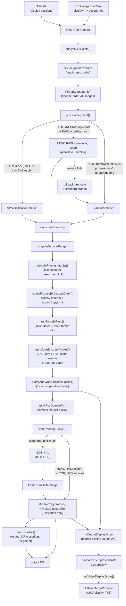

# Code Map: Smart Cut (H.264 / H.265)

**Scope:** The `TTESSmartCut` engine — from a display-order cut list to a written
elementary stream. Covers segment planning (`analyzeCutPoints`), the three
execution branches in `processSegment`, and the bitstream surgery that bridges
the re-encode → stream-copy seam (EOS, `frame_num`, POC, MMCO, SPS).

**Not covered here:**
- MPEG-2 cutting — a separate engine (`TTMpeg2VideoStream::cut` →
  `TTTranscodeProvider`), no `TTESSmartCut` involvement. See `mpeg2-cut.md`.
- Decode-order vs display-order semantics of the *display/navigation* path —
  see `frame-order.md`, which is the authority for `TTDisplayOrderMap` and for
  the RASL / open-GOP cold-start findings this map relies on.

**Codec scope:** `NALU_CODEC_H264` and `NALU_CODEC_H265` only. There is one
class for both; codec and stream-type differences are runtime branches, not
subclasses. That is why this is one map with a variant matrix rather than one
map per codec.

## Data flow

```mermaid
flowchart TD
    UI["Cut list<br/>(display positions)"] --> SCF["smartCutFrames()"]
    DOM["TTDisplayOrderMap<br/>display &lt;-&gt; decode AU"] --> SCF
    SCF --> ACP["analyzeCutPoints()"]
    ACP --> OVR["first-segment override<br/>(leading-pic probe)"]
    OVR --> SEG["TTCutSegmentInfo[]<br/>(decode-order AU ranges)"]
    SEG --> PS["processSegment()"]

    PS -->|"H.264 &amp;&amp; (PAFF or !pocBridgeable)"| UNI["SPS-Unification branch"]
    PS -->|"H.265 &amp;&amp; CRA copy-start<br/>+ RASL + preflight ok"| HSF["HEVC RASL-preserving seam<br/>(planHevcSeamFix)"]
    PS -->|"H.265 otherwise, or H.264<br/>progressive &amp; pocBridgeable"| STD["Standard branch"]

    UNI --> RE["reencodeFrames()"]
    STD --> RE
    HSF --> RE
    HSF -.->|"rewrite fails"| RB["rollback: truncate<br/>+ standard branch"]
    RB --> STD

    RE --> CDR["computeDecodeRange()"]
    CDR --> DEC["decodeFramesIntoList()<br/>(libav decoder, thread_count=1)"]
    DEC --> SEL["selectFramesByDisplayOrder()<br/>display bounds + streamCopyLimit"]
    SEL --> ENC["runEncodePass()<br/>(libx264/x265, bf=0, forced-idr)"]
    ENC --> TEP["transformEncoderPacket()<br/>SPS-unify, HEVC seam rewrite<br/>or reorder-patch"]
    TEP --> BUF["bufferAndWriteEncoderPacket()<br/>(1-packet pending buffer)"]
    BUF --> PDF["applyPocDomainFix()<br/>(patches the last packet)"]
    PDF --> WPP["writePendingPacket()"]

    WPP -->|"standard / unification"| EOS["EOS NAL<br/>(flush DPB)"]
    WPP -->|"HEVC RASL seam:<br/>no EOB, DPB survives"| SC
    EOS --> FND["frameNumDelta bridge"]
    FND --> SC["streamCopyFrames()<br/>+ MMCO neutralize (unification only)"]
    SC --> TAIL["reencodeTail()<br/>(forced-IDR closed sub-segment)"]

    SC --> OUT["output ES"]
    TAIL --> OUT
    BUF --> ODO["mOutputDisplayOrder<br/>(source display idx per AU)"]
    SC --> ODO
    ODO --> CONS["ttavdata / ttcutpreviewtask<br/>ttcutpreview"]
    CONS -->|"setVideoDisplayOrder()"| MKV["TTMkvMergeProvider<br/>(MKV display PTS)"]
```

## Edge semantics

| From → To | What crosses (data / order / invariant) |
|---|---|
| UI cut list → `smartCutFrames` | **Display** positions (Direction A). Every index below this line is a **decode-order AU** index. Conversion is `TTDisplayOrderMap` and nothing else. |
| `smartCutFrames` → `analyzeCutPoints` | Display pairs; `analyzeCutPoints` converts via `displayToDecode`. `endFrame` is the **max AU over a 32-frame trailing display window** — a frame displaying ≤ `endDisplay` can sit at a later AU under B-frame reorder. |
| `analyzeCutPoints` → `TTCutSegmentInfo` | Four mutually exclusive shapes, encoded in the sentinel fields: pure stream-copy (`reencodeStartFrame < 0`), pure re-encode (`streamCopyStartFrame < 0`), mixed (both ≥ 0), mixed + tail (`needsReencodeAtEnd`). |
| `smartCutFrames` → first-segment override | Only for segment 0, only when `streamCopyStartFrame ≥ 0`. Downgrades a Non-IDR re-encode to pure stream-copy **iff** the cut-in keyframe has no leading pictures (probe: any AU in `(startFrame, startFrame+16]` with `decodeToDisplay(au) < cutInDisplay`; `-1` counts as "before"). Decoder starts with an empty `delayed_pic[]`, so no IDR barrier is needed. |
| `processSegment` → `reencodeFrames` | Head mode carries `startDisplay` (display lower bound) and `streamCopyStartFrame` (AU upper bound). Returns `adjustedStreamCopyStart` when the re-encode had to swallow the whole copy GOP. |
| `selectFramesByDisplayOrder` → `ctx.framesToEncode` | Keep-predicate is **mode-dependent**: tail → `au ≥ startFrame && disp ≤ endDisplay`; pure re-encode → `startDisplay ≤ disp ≤ endDisplay`; head/mixed → `disp ≥ startDisplay && au < streamCopyLimit`. `AVFrame::pts` carries the **source AU index**, not a timestamp. |
| `selectFramesByDisplayOrder` → `*adjustedStreamCopyStart` | Boundary crossing: if any AU in `[streamCopyLimit, nextKF)` displays before `startDisplay`, the re-encode extends to `nextKF` and the stream-copy start moves with it. This is the old "Case A/B" distinction, now exact via the map. |
| `runEncodePass` → `bufferAndWriteEncoderPacket` | With `bf=0` the encoder emits packets 1:1 in submission order, so packet *k* belongs to `framesToEncode[k]`. The pending-packet buffer delays the *write* by one packet but preserves FIFO order — this is what lets `applyPocDomainFix` patch the **last** encoder packet after the fact. |
| `reencode → stream-copy` seam | The load-bearing boundary. Carries, in order: EOS NAL (flush DPB) → *(standard only)* source SPS/PPS → `frame_num` continuity via `frameNumDelta` → *(unification + PAFF only)* MMCO neutralization for 32 AUs. Getting any of these wrong drops the first copied GOP. Neutralization is PAFF-only since 2026-07-20: on frame-coded material with load-bearing adaptive marking (ONE-HD) blanket-emptying the ops inverted display order and damaged references deep into the copy. |
| `reencode → stream-copy` seam, **HEVC RASL-preserving variant** | Carries the opposite of the standard seam: source VPS/SPS/PPS are written **before** the re-encode (not at the seam) and **no EOB** is emitted, so the DPB survives and the copy-start CRA's RASL pictures resolve against the re-encode standins instead of being discarded (`NoRaslOutputFlag`). Encoder VPS/SPS are dropped, the encoder PPS is moved to a free `pps_id`, and every encoder slice is rewritten in `rewriteHevcEncoderPacket` (IDR→CRA demotion on packet 0, POC anchoring into the source `poc_lsb` domain, RPS retain extension). An SPS **content** switch at the seam would flush the DPB by itself — that is why the source sets must rule from segment start. |
| `processSegment` → `streamCopyFrames` (`frameNumDelta`) | Bridges the encoder's own `frame_num` sequence (0..N-1) to the source's — computed by `bridgeFrameNum(scStartAU, encLog2Fn)` for both branches. **EOS flushes the DPB but does not reset `PrevRefFrameNum`** — only an IDR does; hence an **IDR copy-start yields delta 0** (never patch an IDR's fn — H.264 7.4.3). Otherwise delta = `lastEncFrameNum - firstScFrameNum`, where `lastEncFrameNum = ((N-1) mod EncMaxFrameNum) + 1`. The modulo matters once `N > EncMaxFrameNum`; without it the decoder floods the DPB with dummy refs and temporal-direct B-frames lose their co-located picture. |
| `frameNumDelta`: which `log2` width? | Unification branch uses **source** `mLog2MaxFrameNum` (slices were rewritten into the source domain); standard branch uses **encoder** `mEncoderLog2MaxFrameNum`. Swapping these silently corrupts the seam. |
| `applyPocDomainFix` → `ctx.pendingPacket` | Patches the last encoder `poc_lsb` so `PicOrderCntMsb` does not wrap into the first copied GOP. Only H.264, only `poc_type == 0`, only when a stream-copy follows. Reads source POC at the *actual* copy start (post-adjustment). |
| `processSegment` → `streamCopyFrames` (segment i → i+1) | Between segments: EOS + `writeParameterSets` + a **cumulative** `frame_num` delta computed from the last non-B AU of segment *i* to the first copied AU of segment *i+1*, modulo `MaxFrameNum`. |
| `streamCopyFrames` → output | Bulk-write (single `mmap` → `write`) **only** when no patching is needed. Any of `patchReorderFrames`, `frameNumDelta ≠ 0`, `neutralizeMmcoFrames > 0` forces the per-AU path. |
| `stream-copy → tail` seam | Clean by construction: the tail's first frame is a **forced IDR**, which resets `PrevRefFrameNum`. No `frameNumDelta`, no MMCO, no SPS unification needed across this boundary — unlike the head seam. |
| `streamCopyFrames` / `runEncodePass` → `mOutputDisplayOrder` | One entry per written AU, in write order, holding the **source display index**. Any anomaly (encoder emits more packets than frames submitted) invalidates the whole vector; the muxer then falls back to legacy linear PTS. |
| `mOutputDisplayOrder` → `TTMkvMergeProvider` | Output-local display rank, used to assign MKV display PTS. Empty vector = "trust the muxer's linear timeline instead". |
| `smartCutFrames` → caller (failure) | The boolean return is **load-bearing**: `createH264PreviewClip` used to swallow it and kept looping over the remaining segments, muxing clips that were never written — on a badly damaged recording that piled up decoder/encoder instances until `pthread_create` failed and the GUI aborted (`ba064f15`, 2026-07-19). Callers must stop the whole preview/cut run on false, not just the current segment. |
| `TTESSmartCut::seamNotes()` → `ttavdata` → `statusReport` | Per-seam fallback notes (English `tr()` strings), filled whenever the HEVC RASL-preserving seam was wanted but a preflight or the rewrite rejected it. Cleared at the start of each `smartCutFrames`. Empty is the normal case — either every seam took the fix path or no CRA+RASL seam occurred. Surfaced in the cut progress window and the log, never as an error. |

## Variant matrix — which branch fires, and what it must guarantee

`processSegment` picks a branch by `codecType()` and `isPAFF()`; `analyzeCutPoints`
picks a segment shape by keyframe/IDR status at the cut-in.

| Stream property | H.264 | H.265 |
|---|---|---|
| **CRA copy-start with RASL window** | n/a (the H.264 analogue is the `seamNeedsUnification` trigger one row down). | **RASL-preserving seam** (defect A / H.265 fix, 2026-07-21). Trigger in `planHevcSeamFix`: copy-start AU is a CRA (slice NAL type 21, not IDR/BLA) **and** ≥ 1 RASL AU (type 8/9) follows in decode order **and** the preflight passes. Preflight (all failures fall back to the standard seam with a note in `seamNotes()`): uniform source SPS, no non-flat scaling lists, all source PPS parsable with a free `pps_id`, CRA slice header + RPS readable, POC window does not wrap the `lsb` cycle, and a **measured** encoder-SPS match — `deriveX265SeamParams` derives `tu-intra/inter-depth`, `amp`, `sao`, `tmvp`, `strong-intra-smoothing` from the source SPS, `probeHevcEncoderSeamSps` opens a throwaway libx265 with `GLOBAL_HEADER` and `hevcSpsSeamCompatible` compares every CABAC-/parse-relevant field. Matching overrides preset defaults. |
| **PAFF** (field pairs) | SPS-Unification branch, always (`isPAFF ⇒ useSpsUnification`). Encoder emits MBAFF; source SPS params (`log2_max_frame_num`, `log2_max_pic_order_cnt_lsb`, `frame_mbs_only_flag`) are stamped back onto the encoder slices. EOS before copy; MMCO neutralized for 32 AUs; `patchH264SpsReorderFrames(isPAFF=true)` raises `num_ref_frames`/`max_dec_frame_buffering` for the MBAFF→PAFF DPB transition. POC anchor stays `-1` (legacy linear numbering, byte-identical output). | **n/a** — `isPAFF()` is an H.264 concept; HEVC never enters this cell. |
| **Progressive / MBAFF**, POC seam bridgeable | Standard branch **only when the copy-start keyframe is IDR or has no leading pictures**. Otherwise the `seamNeedsUnification` trigger (defect A fix, 2026-07-20: probe `kfHasLeadingPics`, non-IDR check on the copy-start AU) routes the seam through unification regardless of bridgeability. Standard seam: EOS → source SPS/PPS → `frameNumDelta` recalculated from the **encoder's** `log2_max_frame_num` → stream-copy. `applyPocDomainFix` bridges the POC seam. No MMCO neutralization. | Standard branch. EOS NAL type 37 → VPS+SPS+PPS → stream-copy. **No** `frame_num`, POC, MMCO or SPS patching at all — every one of those is gated on `NALU_CODEC_H264`. |
| **Progressive**, POC seam **not** bridgeable | SPS-Unification branch (`!pocBridgeable`). Slices rewritten into the **source** POC domain; `mSpsUnificationPocAnchor` = source `poc_lsb` of the first *displayed* copy frame (min-display AU in the copy GOP, not the copy-start AU — its leading B pictures carry smaller POCs). | Cannot occur: `pocBridgeable` is only computed for H.264. |
| **Non-IDR I-frame cut-in** (open GOP, DVB) | `needsReencodeAtStart = !isAtKeyframe \|\| !isAtIDR` → re-encode with `forced-idr=1` produces an IDR barrier. Exception: segment 0 without leading pics → override to pure stream-copy. | Same rule, same override. `findKeyframeBefore/After` accept IDR/CRA/I-slice alike. |
| **Open-GOP leading pictures** at cut-in | Excluded by the display lower bound `disp ≥ startDisplay` in `selectFramesByDisplayOrder`. | Same. HEVC RASL pictures map to `decodeToDisplay == -1` and are therefore treated as "displays before the cut-in". See `frame-order.md`. This concerns the **cut-in**; the RASL window at the **seam** is a different question and is preserved by the row above. |
| **Cut-out mid-GOP** | Tail re-encode: stream-copy ends at `tailStartFrame-1` (whole GOPs only), tail GOP re-encoded as a forced-IDR closed sub-segment bounded by `disp ≤ endDisplay`. Collapses to a pure re-encode when `tailStart ≤ streamCopyStart`. | Identical (codec-agnostic path). |

## Assumptions, contracts & pitfalls

- **`TTESSmartCut::smartCutFrames`** — assumes: the injected or self-built
  `TTDisplayOrderMap` has exactly `frameCount()` entries; hard-fails otherwise
  (a misaligned map cannot cut accurately). Guarantees: all indices below it are
  decode-order AU indices.

- **`analyzeCutPoints`** — assumes: a keyframe exists within the segment,
  otherwise it degrades to a full re-encode. The `endFrame` search window is
  **32 display frames** and the `maxKeptAU` search window is **64 AUs**; a
  reorder depth beyond those windows would silently truncate the segment. Both
  are fixed constants, not derived from `mReorderDelay`.

- **`processSegment` / `useSpsUnification`** — the branch condition is
  `H.264 && (isPAFF || !pocBridgeable)`. **Pitfall:** `CLAUDE.md` describes SPS
  Unification as a PAFF-only mechanism. It is not — a progressive H.264 stream
  with a non-bridgeable POC seam takes the same branch. Likewise the MMCO
  neutralization is documented under "PAFF notes" but is emitted *only* by this
  branch, which is broader than PAFF and narrower than "all H.264".

- **`pocDomainBridgeable`** — since `1893497` the encoder POC width is
  **measured up front** by `probeEncoderPocParams()` (one throwaway libx264
  open with `GLOBAL_HEADER`; the SPS sits in `extradata` without encoding a
  frame; knobs mirrored from parser-derived sources — probe==real verified
  empirically for progressive AND MBAFF). `kExpectedEncoderLog2PocLsb = 4`
  is only the fallback (probe failure / poc_type ≠ 0), and per H.264
  7.4.2.1.1 `log2_max_poc_lsb >= 4`, so the old assumption could only ever
  be conservative — the feared "seam wrongly called bridgeable" direction is
  spec-impossible. `parseEncoderSpsFromPacket` cross-checks probe vs. real
  per-segment SPS and warns loudly on mismatch (log2 AND poc_type).
  **Measured fact (2026-07-12):** libx264 picks **poc_type 2** for
  progressive bf=0 encodes; poc_type 0 (with log2 4) only under interlace
  flags. Every progressive cut has always run with a poc_type-2 encoder —
  `applyPocDomainFix` never fires there (no poc_lsb exists), seam continuity
  is carried by EOS + the frame_num bridge, and the 4-based classification
  is a consequence-free heuristic routing onto proven paths (deliberately
  unchanged; byte-identity is the contract). The old "log2=4" framing
  applies to the interlaced case only.

- **`selectFramesByDisplayOrder`** — guarantees: `AVFrame::pts` carries the
  source AU index. The frame selection filters by the display lower bound
  (`disp >= startDisplay`), not by any AU-index cutoff. (The write-only
  `ctx.realStartAU` leftover this section used to flag was removed in
  `1c0bd2b`; CLAUDE.md no longer mentions it.)

- **`decodeFramesIntoList`** — assumes `thread_count = 1` on the decoder.
  Frame-threading reassigns PTS and would break the AU-index-in-`pts` contract.

- **`runEncodePass`** — assumes `max_b_frames = 0`, which is what makes the
  packet↔frame 1:1 mapping (and therefore `mOutputDisplayOrder`) valid. The
  encoder is recreated per segment because libx264's lookahead cannot restart
  after a flush.

- **`streamCopyFrames`** — **pitfall:** `neutralizeMmcoFrames > 0` sets
  `needsPatching`, which disables the bulk-write fast path *regardless of codec*,
  while the neutralization itself is H.264-gated. Currently unreachable for HEVC
  (only the H.264-only unification branch passes a non-zero count), but the guard
  is a codec check away from being a silent performance cliff.

- **EOS + Non-IDR (defect A — H.264 FIXED 2026-07-20 via `seamNeedsUnification`
  trigger; H.265 RASL loss FIXED 2026-07-21 via the RASL-preserving seam, see
  the variant matrix row "CRA copy-start with RASL window". Everything the
  paragraph below says about the H.265 loss describes the behavior BEFORE that
  fix and the measurements the fix is built on; it is kept because the fallback
  path still produces exactly this behavior when the preflight rejects a seam)**
  — after EOS
  the decoder's DPB is flushed but `PrevRefFrameNum` is not reset. The standard
  branch bridges `frame_num` with `frameNumDelta`, but the **leading pictures of
  the non-IDR copy-start keyframe** still reference pre-EOS frames; the bridge
  makes those references resolve to *wrong* pictures instead of missing ones.
  Measured damage: exactly the copy-start keyframe's leading pics (1 frame at
  `bf=1` synthetic, 3 frames on real ONE-HD 720p50 material), everything after
  bit-identical, frame count preserved — i.e. **silent** corruption (`bf=1`
  produced zero decoder errors; `bf≥2` logs `mmco: unref short failure`).
  The old claim "the extension always fires at `has_b_frames ≥ 2`" is
  **disproven**: the boundary-crossing extension fires only when leading pics
  display *before the cut-in* (cuts landing inside the copy-start keyframe's
  reorder window), never for ordinary mid-GOP cuts. Reachability is real-world:
  ARD/ONE progressive HD DVB is non-IDR throughout (0 IDR in 600-frame probes,
  Tatort/Petrocelli). **H.265 variant (measured 2026-07-17): silent frame LOSS
  instead of corruption** — the copy-start CRA's RASL pictures are discarded
  after the EOS (`NoRaslOutputFlag = 1`): a synthetic x265 open-gop `bf=4` cut
  lost exactly 4 frames (the RASL window, display 196–199), zero decoder
  errors, all delivered frames clean. **Measured 2026-07-20 (both fix-design
  checkpoints resolved):** (1) the extension/next-keyframe idea is refuted —
  every mid-GOP cut already seams at a "next keyframe", and moved seams show
  the identical damage class. Two standard-branch seams (KF with 1 and with 3
  leading Bs) both emit **the keyframe N display slots early, followed by the
  N leading Bs silently corrupted** (hashes match no source frame; 0–1 decoder
  errors; everything from the KF on bit-identical). The same seam class
  through the **unification branch** is benign: correct order, correct
  content at re-encode quality (SSIM 0.97–0.98 vs 0.92 neighbor baseline),
  zero errors — i.e. MMCO neutralization + POC-domain continuity achieve
  standin-resolution WITH the EOS in place; severity is a POC lottery via
  `pocBridgeable`. Evidence-backed fix direction: give the standard-branch
  seam the unification seam treatment. H.265: the RASL loss moves with the
  seam unchanged (next-CRA seam loses exactly its RASL window again).
  (2) The suspected A/V shift is refuted: the app-faithful mux
  (`outputDisplayOrder`) gives RASL AUs their own PTS slots; the MKV timeline
  stays content-true (PTS gap at the seam, full total duration) — the symptom
  is a ~200 ms freeze, no cumulative sync drift. For H.264 the container PTS
  also carry the correct slots, masking the ES-level display inversion on
  PTS-honoring players; the visible symptom is N corrupt frames + a
  non-monotonic PTS wobble. **Fix (2026-07-20, H.264):** non-IDR copy-start
  keyframes with leading pictures take the unification branch
  (`seamNeedsUnification`, probe `kfHasLeadingPics` — decodeToDisplay -1
  counts as "before"); IDR and leading-pic-free seams keep the byte-identical
  standard path. Two latent unification defects fixed with it: RPLM
  short-term diffs are translated from the encoder's modular PicNum domain
  (MaxPicNum 16, full-cycle no-op padding entries!) into the linear source
  numbering, and MMCO neutralization is PAFF-only. Residual: one benign
  `mmco: unref short failure` per seam on periodic-MMCO sources (chain
  reestablishment, pixel-neutral — window-shift proof). Quality gate:
  `tools/diag/gate_h264_seam.sh` (COUNT/DECERR/ORDER/COPY verdicts).
  Repro harnesses:
  `tools/diag/test_smartcut_seam.cpp`, `tools/diag/test_mkvmux.cpp`;
  artifacts `/usr/local/src/CLAUDE_TMP/TTCut-ng/eos_nonidr/`.

- **SPS-Unification × poc_type-2 encoder (defect B — FIXED 2026-07-16)** —
  `rewriteEncoderSliceForSourceSps` step 8 was gated on
  `encLog2MaxPocLsb > 0 && srcLog2MaxPocLsb > 0`: with a progressive
  (poc_type 2) encoder it skipped the `pic_order_cnt_lsb` write entirely, while
  the rewritten slice runs under the **source** SPS (poc_type 0), which
  requires the field. Every rewritten slice header was bit-shifted from that
  point → mass corruption ("illegal reordering_of_pic_nums_idc", "corrupted
  macroblock 0 0"), measured 495 decoder-error lines and 13/1001 frames lost on
  a real Petrocelli cut. Reachable whenever a **progressive** non-IDR source
  hits a non-bridgeable POC seam (~2 of 6 probed cut positions); the MBAFF/PAFF
  unification cases (encoder poc_type 0) were unaffected — and were the only
  ones ever exercised. The probe/real cross-check warnings did not cover this
  hole (both report poc_type 2, consistently); the computed POC anchoring base
  was silently never written.
  **Fix:** the gate is now `srcLog2MaxPocLsb > 0` alone; when the encoder slice
  carries no POC field (`encLog2MaxPocLsb == 0`) nothing is consumed and the
  anchored `pic_order_cnt_lsb` is **inserted** (`delta_pic_order_cnt_bottom`
  written as 0 if the encoder PPS requires its presence). Verified: the broken
  Petrocelli seams heal (0 decoder errors, exactly 1001 frames, copy region
  bit-identical to source outside the defect-A window); MBAFF unification
  (encoder poc_type 0) and the standard branch are **byte-identical** to
  pre-fix. Residual seam drift at such cuts (34 frames, SSIM ≥ 0.84, no
  artifacts) is defect A's cross-seam reference mechanism, tracked separately.

- **SPS-Unification × byte-aligned slice header (defect E — FIXED
  2026-07-19)** — `rewriteEncoderSliceForSourceSps` step 17 read and wrote
  the CABAC alignment bits **unconditionally** (1 alignment bit + pad). Per
  H.264 7.3.4 `cabac_alignment_one_bit` exists only *while* the header is
  not byte-aligned; a header ending exactly on a byte boundary has none.
  The unification deltas (+1 bit frame_num 4→5, +3 bits poc_lsb 4→7,
  +2 bits pps_id 0→1) pushed a 42-bit x264 IDR header to exactly 48 bits →
  a spurious 0xFF byte landed before the CABAC payload → ffmpeg discarded
  the slice silently ("no picture", all 1620 MBs concealed gray), and the
  following bf=0 P-frames (~98 % skip MBs) propagated the gray to the next
  stream-copy IDR. Symptom looked position-local ("only this cut is gray")
  but is pure per-slice header-bit-length luck — a neighbouring seam on the
  same recording had a 50-bit header and was clean. The read side had the
  symmetric bug (would eat 8 payload bits if an x264 header ever ended
  aligned). **Fix:** both sides now pad conditionally (`(8 - pos % 8) % 8`,
  the same pattern `neutralizeMmcoInAU` always used; `patchFrameNumInAU` /
  `applyPocDomainFix` patch values at fixed bit width and were never
  affected). H.265 never enters the rewriter (both transform paths are
  H.264-gated). Gates: gray seam heals (0 concealment, luma matches
  source); progressive/MBAFF/PAFF unification outputs and the standard
  branch stay **byte-identical**. Diag: `tools/diag/test_feed_decode.cpp`
  (decoder-feed isolation), minimal repro streams in
  `/usr/local/src/CLAUDE_TMP/TTCut-ng/befund_e/`.

## Redundancy / consolidation candidates

- **[REMOVED `3191d98`]** Dead branch — `processSegment` "PAFF fallback": was
  guarded by `else if (isPAFF() && codecType() == NALU_CODEC_H264)` after
  `if (useSpsUnification)`, where `useSpsUnification = H264 && (isPAFF ||
  !pocBridgeable)` is always true when `isPAFF && H264` → the else-if was
  unreachable. Deleted, together with its exclusive dead helpers `convertAUToIDR`
  and `convertSliceNalToIDR` (no remaining callers). 372 lines removed, no
  behaviour change.

- **[REMOVED `1c0bd2b`]** Dead field — `ReencodeContext::realStartAU`: was
  written in three places, read only inside one `qDebug()`. Removed; the
  `mDisplayMap.displayToDecode()` lookup is inlined into that debug line so the
  diagnostic output is preserved.

- **[RESOLVED `df20bb3` — with a corrected finding]** ~~Three~~ **Two** encoder→copy
  `frame_num` bridge computations (unification branch, standard branch) — the
  inter-segment block in `smartCutFrames` is a **different** computation
  (source→source, cumulative across segments, load-bearing `int&` semantics) and
  stays separate. The two copies differed in more than the `log2` width: the
  unification guard was `fn > 0` (skipped bridging a non-IDR keyframe wrapped to
  fn 0), the standard guard `fn >= 0` (patched IDR `frame_num` — violates H.264
  7.4.3, tolerated by libav). Both now call `bridgeFrameNum(scStartAU, encLog2Fn)`
  with one semantic: parser `isIDR` test (never patch an IDR; bridge a wrapped
  non-IDR), delta 0 on unreadable fn, the wrap correction once. Verified
  bit-identical on all non-IDR material; on a purpose-built IDR-copy-start
  project the bitstream changes as intended with byte-identical decoded frames.

- **[RESOLVED `24fea34`]** The four EOS-emit sites (`processSegment` unification/
  standard/tail epilogue, `smartCutFrames` inter-segment) now call
  `writeEos(outFile)`; the codec dispatch (H.264 type 11 / H.265 type 37) lives
  once. The unification branch's formerly unconditional H.264 write is unchanged
  in effect (that branch is H.264-only).

- **Parameter-set writing after EOS is asymmetric**: the standard branch (and,
  until its removal in `3191d98`, the fallback branch) calls
  `writeParameterSets` after the EOS; the unification branch
  deliberately does **not** (the first copied keyframe AU carries inline SPS/PPS,
  and writing duplicates makes the h264 parser merge them into one oversized
  packet → "Invalid NAL unit size"). This asymmetry is correct but load-bearing
  and easy to "clean up" into a bug. Documented here so it is not.
