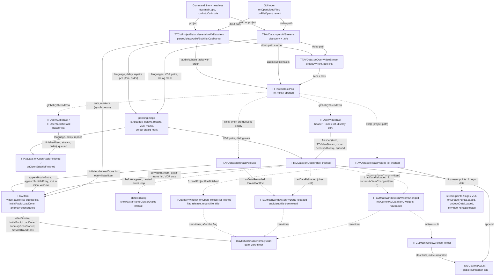

# Code Map: Stream open and project load

**Scope:** from the four entry points (a video file from the GUI, a `.ttcut`
project, the command line, the headless `--auto-cut`/`--screenshots` modes)
through sibling-file discovery and the `.info` metadata, the three open tasks
on `TTAVData`'s thread pool, the completion handlers, up to the main window's
current-item state and the triggers that hang off it (audio sort window,
automatic anomaly scan gate, logo autoload, VDR marks, defect dialog), plus
`closeProject`. Ends where the streams are open and navigable. Not covered:
cutting, the searches (`detection-and-search.md`), the settings values a
load overwrites (`settings-state.md`), the pool's progress bookkeeping
(`progress-reporting.md`).

## Two ways in, one task path

| | Plain open (`TTAVData::openAVStreams`) | Project load (`TTCutProjectData::deserializeAVDataItem`) |
|---|---|---|
| Video | `doOpenVideoStream(path)`, order default | `doOpenVideoStream(path, order)` per `<Video>` |
| Audio | discovered: `<base>*.{mpa,mp2,ac3,aac}` next to the video (`getAudioNames`), order −1 | every `<Audio>` with its `<Order>`; `<Language>`, `<Delay>`, `<Repair>` become pending entries keyed `(item, order)` |
| Subtitles | discovered `<base>*.srt` (`getSubtitleNames`) | every `<Subtitle>` with order, pending language/delay |
| `.info` | read here: languages → pending, VDR marks → `mpPendingVdrMarkers`, item marked for the defect dialog, legacy decode-error warning (modal) | not read here; `onOpenVideoFinished` reads it again for the extra-frame list only |
| Cuts / markers | from VDR marks in `onOpenVideoFinished` | `parseCutSection`/`parseMarkerSection` append synchronously while the tasks still run, then `sortCutItemsByOrder`/`sortMarkerByOrder` |
| Pool abort hook | `aborted → onOpenAVStreamsAborted` (armed per open, dropped in `onThreadPoolExit`) | `exit → onReadProjectFileFinished`, `aborted → onReadProjectFileAborted` (armed in `readProjectFile`) |
| Main window flag | — | `mProjectLoadInProgress` from `openProjectFile` to `onOpenProjectFileFinished`/`Aborted` |

Both paths meet in `doOpenVideoStream`: `createAVItem` (wires the item's
cut and marker lists to the global ones), `mpThreadTaskPool->init(audio+1)`,
`start(TTOpenVideoTask)`. Audio and subtitle tasks are started right behind
it; the pool runs them on `QThreadPool::globalInstance()`.

## Data flow

Solid edges carry data (producer → consumer); dashed edges are triggers or
signal deliveries that carry no payload the receiver keeps.

## Edge semantics

| From → To | What crosses (data / order / invariant) |
|---|---|
| `GUI`/`CLI` → `OPEN`/`PRJ` | `onReadVideoStream` clears `cutVideoName` only when no item exists yet, then `openAVStreams`; `openProjectFile` first runs `closeProject` if anything is open, sets `mProjectLoadInProgress`, arms the two project hooks, then `readProjectFile` (which does `readXml` + `deserializeAVDataItem` synchronously; an exception there goes straight to `onReadProjectFileAborted`). The CLI picks the path by extension (`.prj`/`.ttcut` → project) on a 100 ms timer after the event loop starts; headless modes on a 500 ms timer. |
| `OPEN` → `PEND` | `.info` audio languages are matched to the discovered audio files by file name and stored per `(item, discovery index)`; VDR marks are paired `(in, out)` from consecutive markers, kept only when `in > 0 && out > in`; the item is inserted into `mpPendingExtraFrameDialog` on every fresh open that has an `.info` (project load never marks, so it never shows the dialog). `mExtraFrameIndices` is cleared here so `onOpenVideoFinished` rebuilds it. |
| `PRJ` → `PEND`/`ITEM` | Paths go through `resolveProjectPath` (absolute or relative to the project, no `..`, no control bytes; rejected = section skipped with a warning). Repairs are validated against the real AC3 frame size and file length; invalid ones are DISABLED, not dropped. Cuts and markers are appended before the video stream exists: `appendCutEntry` takes the stored display positions unconverted (see the comment in `parseCutSection`). |
| `DISP` → `POOL` | `init(audioCount + 1)` sizes the pool's progress estimate from the DISCOVERED audio count even on the project path, where the real count comes from the XML. `start()` asserts the pool's own thread, emits `init()` only when nothing is running, and enqueues the task. Ownership: the item is created by `TTAVData`; `TTOpenVideoTask::onUserAbort` deletes it if it is not in the list yet. |
| `TV`/`TA` → `OVF`/`OAF` | `finished` is connected `Qt::QueuedConnection`, so the handler runs on the GUI thread one event-loop turn (or more) after the worker finished — the pool, connected direct in `wireTask`, learns about the same completion first. A task that throws `TTException` ends in `aborted(this)` with a failure message; `TTAVData` connects nothing to the audio/subtitle tasks' `aborted` (its `onOpenAudioAborted`/`onOpenSubtitleAborted` are never connected). Video: header list, index list, `sortDisplayOrder()` all happen in the worker; container extensions are rejected with the demux hint. |
| `OVF` → `ITEM`/`LIST`/`DLG` | Order inside the handler: `setVideoStream` → `.info` re-read → `loadExtraFrameIndices` (MPEG-2 parser field pairs win over `.info`, only if the list is empty) → defect dialog if marked (MODAL: a nested event loop runs here, the pool can drain and `onThreadPoolExit` can run inside it) → `mpAVList->append` → `setInitialAudioLoadDone()` if the pool is already drained (the second setter, added for exactly that dialog) → VDR pairs become cut entries + markers + `VDRImportMarker` stream points (halved when any mark exceeds the frame count: field-rate marks) → `avDataReloaded`/`cutDataReloaded`/`markerDataReloaded` called directly → `mpCurrentAVItem = item`, `currentAVItemChanged` → demuxed audio (legacy, always empty today). |
| `OAF` → `ITEM` | Append, then the pending language/delay are applied at `audioCount() − 1` (the position the entry just got), repairs by their stored track index. Sorting happens per append and only while `!initialAudioLoadDone()`: project tracks (order ≥ 0) restore `<Order>`, discovered tracks (order −1) sort AC3 > language preference > discovery order — per append on purpose, so `audioStreamAt(0)` is right before the pool drains. |
| `POOL` → `PEXIT` | `exit()` fires from `onThreadTaskFinished` or `onThreadTaskAborted` when the queue is empty; `aborted()` precedes `exit()` only when the LAST task to leave was the aborted one. Consequences: a failed audio task while the video task still runs leaves no trace but a log line; a failed audio task that leaves last turns the whole run into an abort. `onThreadPoolExit` drops the open-abort hook, sets `initialAudioLoadDone` on every listed item (not on an item still waiting in `onOpenVideoFinished`'s dialog), emits the `Exit` status unless a cut bracket is open, swallows the exit of an MKV mux run, then `avDataReloaded` + `threadPoolExit`. |
| `PRF` → `MW`/`SP`/`MWP` | Fixed order: `avDataReloaded` → `currentAVItemChanged(avItemAt(0))` (the first video, whatever `onOpenVideoFinished` set last) → `streamPointsLoaded` → `logoDataLoaded` → `deserializeSettings` → `readProjectFileFinished`. Every step is a synchronous signal to the main window. `onReadProjectFileAborted` instead emits `currentAVItemChanged(0)`, which the main window answers with `closeProject`, then `readProjectFileAborted`. |
| `OVF`/`PRF` → `MW` | `onAVItemChanged` returns at once for the current item or when `avItem == 0` (→ `closeProject`). Otherwise: re-wire the subtitle-append hook, set the current item on the stream-point widget with the extra-frame list, frame rate into the stream-point model, `setEncoderCodec(streamType)` (see `settings-state.md`), both frame widgets, audio/subtitle lists, subtitle overlay if a subtitle already landed, `onNewFramePos(currentIndex)`, navigator, `navigationEnabled(true)`, zero-timer to the gate, logo profile cleared and `<video>.logo.pgm` autoload on a zero-timer. |
| `MW`/`MWR`/`MWP` → `GATE` | Three entry points, all deferred by a zero-timer; `maybeStartAutoAnomalyScan` is idempotent: it needs `audioAnomalyScanEnabled`, no project load in progress, a current item with video, `initialAudioLoadDone`, not `anomalyScanStarted`, no stream-point workers running, an AC3 track, and no `AudioAnomaly` marker already in the model. Whichever entry runs last with all conditions true starts the scan. |
| `LIST` → dirty flag | `TTAVList::itemAppended` → `avItemAppended` → `onProjectModified` during BOTH paths; `onOpenProjectFileFinished` resets it to clean at the end, a plain open leaves the window marked modified (unsaved new project). |
| `MW` → `CLOSE` | Aborts the stream-point pool and waits for the global `QThreadPool`, disconnects the two AV signals, nulls every widget, clears the stream-point model and `TTAVData` (`mpAVList`, cut list, marker list; the `TTAVItem`s and their streams die with the list), reloads `TTSettings`, clears project identity and cut name, reconnects. |
| `CLI` (headless) → wait | `runAutoCutMode` and `runScreenshotMode` poll `avCount() > 0` (video appended) with `processEvents` + `msleep`, then sleep a fixed 2 s for the audio tasks — there is no "initial load complete" signal to wait on other than the pool's `exit`. |

## Assumptions, contracts & pitfalls

- **`TTAVData::openAVStreams`** — assumes the video's siblings by base name ARE its audio (a second recording in the same directory with the same base name prefix is picked up too: the filter is `<base>*.<ext>`); guarantees the pending maps are filled before any task can finish (tasks are queued, handlers run later on the GUI thread); pitfall: two modal dialogs can run from here (legacy decode-error warning) and from `onOpenVideoFinished` (defect dialog) — headless callers set `setNonInteractive` for the cut, not for these.
- **`TTAVData::onOpenVideoFinished`** — contract: the item is in the list and current when it returns; pitfall: `onThreadPoolExit` may already have run inside the defect dialog's nested loop, which is why `initialAudioLoadDone` is set here too and why the anomaly gate has three entries (measured 2026-08-20 on a repaired DVB recording, see the comment block above `maybeStartAutoAnomalyScan`).
- **`TTThreadTaskPool`** — `exit` = queue empty, nothing more; it does not wait for queued `finished` deliveries. `aborted` before `exit` depends on which task leaves last, so "run aborted" is not "some task failed". `isDrained()` is the same predicate as the `exit` condition.
- **`TTAVData::onOpenAVStreamsAborted`** — makes the LAST listed item current (not the one that failed to open) and emits `currentAVItemChanged`; with one video open the main window's early return hides it, with several the user is switched to the last video.
- **`TTAVData::onReadProjectFileAborted`** — a project with one unreadable section fails as a whole only if that task is the last to leave the queue (see `POOL → PEXIT`); otherwise the project opens without the track and only the log knows. Read-derived, not measured.
- **`TTCutMainWindow::onAVItemChanged`** — assumes it runs on the GUI thread synchronously with the emit (it is: same thread, auto connection); pitfall: `onOpenAVStreamsAborted`'s emit reaches it during a cut abort if the open hook was never dropped — fixed by the disconnect in `onThreadPoolExit`, documented there.
- **`TTCutProjectData::parseVideoSection`** — `sortCutItemsByOrder` runs per video section on the GLOBAL cut list, i.e. n times for n videos; harmless, but the order key is per item.
- **Headless wait** — the 2 s audio sleep is a guess, not a contract; a slow NAS or a large AC3 header scan can exceed it and the cut then runs with fewer tracks than the project lists.

## Redundancy / consolidation candidates

- **current-item switch (`mpCurrentAVItem = x; emit currentAVItemChanged(x)`)**
  - sites: `data/ttavdata.cpp:TTAVData::onOpenVideoFinished`, `data/ttavdata.cpp:TTAVData::onOpenAVStreamsAborted`, `data/ttavdata.cpp:TTAVData::onChangeCurrentAVItem`, `data/ttavdata.cpp:TTAVData::onReadProjectFileFinished` (emit without the assignment), `data/ttavdata.cpp:TTAVData::onReadProjectFileAborted` (emit 0)
  - shared purpose: tell the GUI which item is current
  - status: consolidate → one `setCurrentAVItem(TTAVItem*)` that assigns and emits; the project-finished site then also keeps `mpCurrentAVItem` in step with what it emits
- **initialAudioLoadDone setter**
  - sites: `data/ttavdata.cpp:TTAVData::onOpenVideoFinished` (if drained), `data/ttavdata.cpp:TTAVData::onThreadPoolExit` (all items)
  - shared purpose: close the audio sort window and open the anomaly gate
  - status: kept separate → the two cover the two orders the dialog can produce; a single site would need the pool to wait for queued deliveries
- **`.info` read**
  - sites: `data/ttavdata.cpp:TTAVData::openAVStreams`, `data/ttavdata.cpp:TTAVData::onOpenVideoFinished`
  - shared purpose: `TTESInfo::findInfoFile` + load for the same video
  - status: consolidate → load once in `openAVStreams`/`doOpenVideoStream` and keep it on the pending map with the item (the project path would then get the extra-frame list from the same place)
- **audio/subtitle open entry**
  - sites: `data/ttavdata.cpp:TTAVData::appendAudioStream`, `data/ttavdata.cpp:TTAVData::doOpenAudioStream` (and the subtitle pair)
  - shared purpose: start one open task for an item
  - status: consolidate → `appendAudioStream`/`appendSubtitleStream` are one-line wrappers that drop their `order` argument; call `doOpen*` directly from the main window
- **headless "wait for the project"**
  - sites: `gui/ttcutmainwindow_headless.cpp:TTCutMainWindow::runAutoCutMode`, `gui/ttcutmainwindow_headless.cpp:TTCutMainWindow::runScreenshotMode`
  - shared purpose: poll `avCount()`, sleep for audio
  - status: consolidate → one helper that waits for `TTAVData::threadPoolExit` (or `readProjectFileFinished`) with a timeout instead of the fixed sleep
- **dead abort slots**
  - sites: `data/ttavdata.cpp:TTAVData::onOpenAudioAborted`, `data/ttavdata.cpp:TTAVData::onOpenSubtitleAborted`
  - shared purpose: none reachable (never connected)
  - status: consolidate → connect them to the tasks' `aborted` and report the failed track, or remove them
