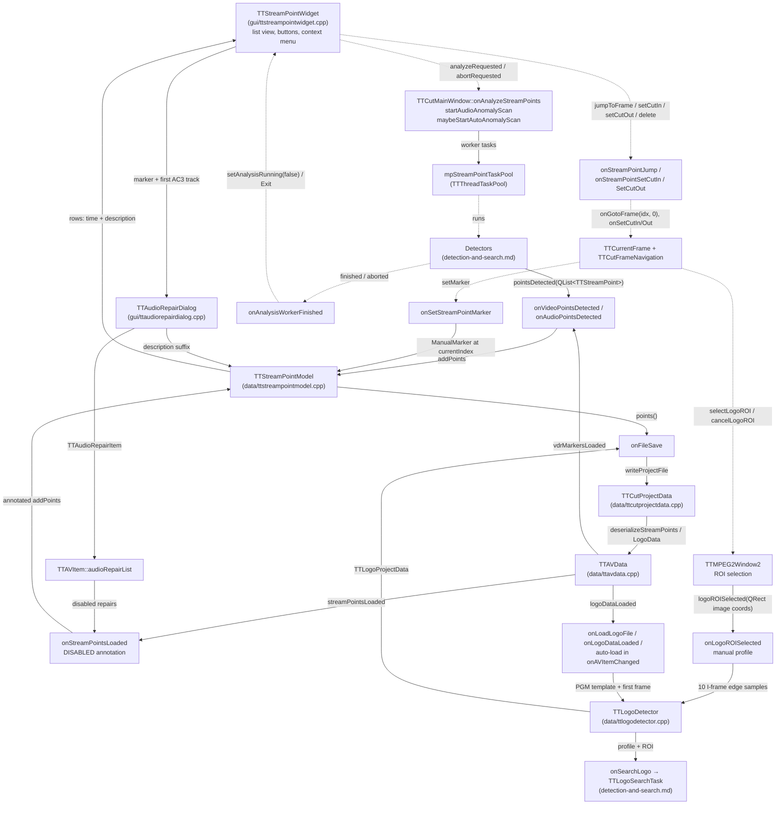

# Code Map: Stream points (Landezonen) in the main window

**Scope:** The consumer side of the stream-point ("Landezonen") feature: how
markers get into `TTStreamPointModel` (analysis dispatch and its result
slots, manual marker, project load, VDR/defect import), what the list widget
does with them (jump, cut-in/out, delete, audio repair), how they are saved,
and the logo profile (`TTLogoDetector`: manual ROI, markad PGM, project
round trip) that feeds the logo search. The detectors themselves — what a
worker scans, in which frame domain it reports, the cancel path — are
mapped in `detection-and-search.md`; this map starts where their
`pointsDetected` leaves them. The cut-time use of a planned audio repair is
in `audio-cut-timing.md`.

## Data flow

Solid edges carry data (producer → consumer); dashed edges are triggers
(signals/calls without a payload that matters here).

## Edge semantics

| From → To | What crosses (data / order / invariant) |
|---|---|
| `TTStreamPointWidget` → `onAnalyzeStreamPoints` | One button: `analyzeRequested` while idle, `abortRequested` while `mAnalysisRunning`. The widget writes no settings; every detection parameter comes from `TTSettings` (`spDetect*`, `spSilence*`, `spPillarbox*`, `audioAnomalyScanEnabled`, `anomaly*`), edited in the settings dialog's Stream Points category (`onStreamPointSettingsRequested` opens category 7 — the dialog owns that order). |
| `onAnalyzeStreamPoints` → `mpStreamPointTaskPool` | First `clearAutoDetected()` on the model (see below), then up to four tasks: `TTStreamPointVideoWorker` (needs a header list — MPEG-2 only), `TTAspectScanTask` (needs an index list; frame index taken from the preview wrapper), `TTAudioAnomalyScanTask` via `startAudioAnomalyScan` (needs an AC3 track — `TTAVItem::firstAc3TrackIndex`, the same rule the repair menu uses), `TTStreamPointAudioWorker` (first audio track). Each start increments `mStreamPointWorkersRunning`. Enabled-but-impossible analyses are collected in `mSkippedAnalysisNotes` and shown/logged when nothing could start, or handed to the progress dialog's details. Re-entrancy guard: returns while `mStreamPointWorkersRunning > 0` (the headless screenshot mode can call it during an auto scan). |
| Detectors → `onVideoPointsDetected`/`onAudioPointsDetected` | `QList<TTStreamPoint>` with `frameIndex` in the **navigation (display) domain** (`detection-and-search.md`: positions from `moveToNext/PrevIndexPos`; the anomaly scan converts seconds with `videoFrameForTime`, extras included). The two workers emit only when not aborted; `TTAudioAnomalyScanTask` emits an **empty** list on cancel and on an undecodable/non-48-kHz track; `TTAspectScanTask` emits its partial list on abort. The anomaly task is wired to `onVideoPointsDetected` although it is audio — both slots are the same one-liner. |
| `TTAVData::vdrMarkersLoaded` → `onVideoPointsDetected` | VDR marks (`VDRImportMarker`) from `openAVStreams` and the "Import as Stream Points" answer of the defect dialogs (`Error` markers, `showImportAsStreamPointsWarning`). Same slot as detector output, but these types are **not** `isAutoDetected()` — a later "Start analysis" keeps them. |
| `TTAVData::streamPointsLoaded` → `onStreamPointsLoaded` | The project's `<StreamPoint>` elements as parsed by `deserializeStreamPoints` (frame, type, description verbatim, confidence, duration; `AudioFrameFrom/To` only when both present and well-formed). Delivered in the fixed project-finished order after `currentAVItemChanged` (`stream-open-project-load.md`), so `mpCurrentAVDataItem` and the model's frame rate are set. Before `addPoints`, every `AudioAnomaly` marker overlapping a **disabled** `TTAudioRepairItem` (range no longer fits the file, see `parseAudioSection`) gets the "repair DISABLED" suffix, with the "planned" suffix stripped first — both through `TTStreamPoint::hasSuffixVariant/stripSuffixVariant` over every known language variant, because the description is stored as plain text. Overlap uses `TTAudioRepairDialog::approxAc3RangeForMarker` (±1 AC3 frame). |
| `onSetStreamPointMarker` → model | `ManualMarker` at `videoStream()->currentIndex()`, triggered by the navigation panel's and the frame widget's `setMarker`. Description is the literal `"Marker (manuell)"` — a German string without `tr()` in the English source (convention violation, see pitfalls). |
| `TTStreamPointModel` (all writers) | `addPoints` appends, **re-sorts by `frameIndex`** and resets the model; `addPoint` inserts sorted; neither deduplicates (`operator==` on frame+type exists but is unused by the model — the same finding twice is two rows). `clearAutoDetected` keeps `ManualMarker`, `VDRImportMarker`, `Error`. `setDescriptionAt` changes text only (no re-sort). `DisplayRole` = `hh:mm:ss` from `frameIndex / mFrameRate` (set in `onAVItemChanged`; 0 before) plus the description; `Error` rows are painted red. |
| Model → `TTStreamPointWidget` | Plain `QListView` on the model. Status label after a run: "%1 stream points detected" counts **all** rows (manual and imported included), "Analysis cancelled – list incomplete" on abort. `setAnalysisRunning(true)` also sets the wait cursor; `false` restores it. |
| Detectors → `onAnalysisWorkerFinished` | Connected to both `finished` and `aborted` of every task; decrements the counter, and at zero calls `onStatusReport(Exit|Canceled)` itself so the progress dialog closes through the same chain as an open or a cut (`progress-reporting.md`) and the widget leaves the running state. `mStreamPointAnalysisAborted` is set by `onAbortStreamPoints` (pool-wide `onUserAbortRequest`). |
| Widget → `onStreamPointJump` | Double click or context menu: `TTCurrentFrame::onGotoFrame(frameIndex, 0)` **deliberately not** `onVideoSliderChanged` — its second argument is a frame *type*, and with FastSlider on a marker landed on the next I frame instead of the marker. Then `checkCutPosition`. |
| Widget → `onStreamPointSetCutIn/SetCutOut` | Jump as above, then `TTCutFrameNavigation::onSetCutIn/onSetCutOut` — the same path as the buttons, so the cut-in/out rules (`isCutInPoint`) apply. |
| Widget → `TTAudioRepairDialog` | Context menu on an `AudioAnomaly` marker only, and only while an AV item with an AC3 track is injected (`setAVItem`, `setExtraFrameIndices` from `onAVItemChanged`; cleared in `closeProject`). Offers "Repair…" or, when an existing `TTAudioRepairItem` on that track overlaps the marker's approximate AC3 range, "Edit repair…"/"Remove repair". Accepting appends the "(repair planned)" suffix unless a variant is already there; removing strips it. The repair itself lives in `TTAVItem::audioRepairList`, not in the marker. |
| `onFileSave` → `TTCutProjectData` | `mpStreamPointModel->points()` — every row, auto-detected included — plus `TTLogoProjectData` (markad path **or** ROI rect, whichever made the profile) through `TTAVData::writeProjectFile`. `serializeStreamPoints` writes confidence and duration with two decimals and the AC3 range only when known. |
| `TTMPEG2Window2` → `onLogoROISelected` | Rubber band in widget pixels, mapped by `widgetToImageRect` to **image coordinates** (scaled by the shown pixmap's geometry, clipped to the frame), emitted only when at least 4×4. Selection mode is armed by the navigation panel's toggle (`selectLogoROI`) and drops itself after one selection. |
| `onLogoROISelected` → `TTLogoDetector` | `setROI`, then edge samples of up to 10 I frames forward from the current position (`moveToIndexPos(current, 1)` / `moveToNextIndexPos`), decoded through a dedicated analysis `TTFFmpegWrapper` for H.26x (index adopted from the preview wrapper) or by moving the preview window for MPEG-2, then `finalizeProfile`: an edge pixel survives when it appeared in ≥ 70 % of the samples (Sobel magnitude > 30). Overlay and logo-search buttons follow success; `clearProfile` on zero samples. |
| markad loaders → `TTLogoDetector::loadMarkadLogo` | PGM `P5` with a `#C<corner>` comment; the template is placed flush into that corner of the **first decoded I frame's** resolution (no scaling: a PGM made for another resolution lands elsewhere). Returns false only on format/decode failure — there is no match test; the status text "Logo profile could not be verified" describes a load failure. Three call sites: `onLoadLogoFile` (file dialog, decodes via the preview window), the auto-load in `onAVItemChanged` (`<video>.logo.pgm` next to the file, deferred by a zero timer, decodes via the preview window, shows progress), and `onLogoDataLoaded` (project, decodes via an analysis wrapper for H.26x). |
| `TTAVData::logoDataLoaded` → `onLogoDataLoaded` | `TTLogoProjectData` from `deserializeLogoData`: markad path (must still exist, else a 5-s status message and no profile) or a saved ROI, which re-runs `onLogoROISelected` — i.e. the manual profile is **rebuilt from the current material**, not restored. |
| `TTLogoDetector` → `onSearchLogo` | `hasProfile()` gates the search; the task gets the detector pointer and matches each frame's ROI edge map against the profile by NCC (`matchScore`). Search mechanics in `detection-and-search.md`. |
| `maybeStartAutoAnomalyScan` (three entry points) | Zero-timer from `onAVDataReloaded`, `onAVItemChanged` and `onOpenProjectFileFinished`; runs the scan when: enabled, no project load in progress, current item with video, `initialAudioLoadDone`, not yet `anomalyScanStarted`, no workers running, an AC3 track present, and **no `AudioAnomaly` marker already in the model** (then it latches `setAnomalyScanStarted` without scanning). The long comment above the function documents why one entry point was not enough (modal defect dialog stalls `onOpenVideoFinished`; the project load restores its markers after the pool exit). |

## Assumptions, contracts & pitfalls

- **Frame domain** — a marker's `frameIndex` is a navigation/display index for every codec; the model shows `frameIndex / fps` without the MPEG-2 field-picture correction the playback uses (`playback.md`), so on field-picture material the `hh:mm:ss` column drifts by the extras before the marker. Read-derived, not measured.
- **`TTStreamPointModel`** — assumes callers pass display indices; guarantees sorted rows; pitfall: no deduplication, so a second "Start analysis" that finds the same points doubles them only if the first set survived — it does not, because `clearAutoDetected` runs first; imported (`Error`, `VDRImportMarker`) and manual rows are the ones that can accumulate.
- **`onAnalyzeStreamPoints`** — assumes the preview wrapper holds the frame index for H.26x (the pillarbox scan adopts it); pitfall: `TTStreamPointVideoWorker` and `TTStreamPointAudioWorker` are started without a `deleteLater` connection (the aspect and anomaly tasks have one, `TTThreadTask` has `setAutoDelete(false)`, the pool does not delete) — read-derived, they appear to be leaked once per run.
- **`startAudioAnomalyScan`** — shared by the explicit analysis and the auto start; the explicit run scans again on purpose after `clearAutoDetected` dropped the earlier findings.
- **`onStreamPointsLoaded`** — the DISABLED annotation depends on `mpCurrentAVDataItem` being set (guaranteed by the project-finished order); the approximate range check is ±1 AC3 frame, fine for overlap, not for what a repair writes (the exact range travels in `AudioFrameFrom/To`).
- **`onSetStreamPointMarker`** — `"Marker (manuell)"` is a German literal in English source without `tr()`; the project stores it verbatim.
- **Logo profile lifetime** — cleared in `onAVItemChanged` (every item switch), by "cancel ROI", and on a failed manual build; `closeProject` clears the marker model but not the profile or its overlay — they go with the next item switch. The logo search buttons are disabled by `navigationEnabled(false)` meanwhile.
- **Three markad loaders, two decode strategies** — the file-dialog and auto-load paths decode through the preview window (`moveToVideoFrame` + `grabFrameImage`), which moves the visible still and restores it at the end; the project path uses an analysis wrapper for H.26x. Same PGM, potentially different first frame.
- **Settings category index** — `onStreamPointSettingsRequested` opens category 7 by number; the dialog's constructor order is the contract.
- **Headless** — `runScreenshotMode` calls `onAnalyzeStreamPoints` directly and polls `mStreamPointWorkersRunning`; the re-entrancy guard exists for exactly that path (an auto scan may still be running).

## Redundancy / consolidation candidates

- **markad logo load**
  - sites: `gui/ttcutmainwindow.cpp:TTCutMainWindow::onLoadLogoFile`, `gui/ttcutmainwindow.cpp:TTCutMainWindow::onLogoDataLoaded` (markad branch), `gui/ttcutmainwindow.cpp:TTCutMainWindow::onAVItemChanged` (auto-load lambda)
  - shared purpose: decodeFn/nextIFn lambdas, `loadMarkadLogo`, overlay, `setLogoSearchEnabled`, status text
  - status: consolidate → one `loadMarkadLogoProfile(path, withProgress)` with a single decode strategy (the analysis wrapper the project path already uses)
- **analysis wrapper for logo work**
  - sites: `gui/ttcutmainwindow.cpp:TTCutMainWindow::onLogoDataLoaded`, `gui/ttcutmainwindow.cpp:TTCutMainWindow::onLogoROISelected`
  - shared purpose: open a dedicated `TTFFmpegWrapper` in analysis mode and adopt the preview index
  - status: consolidate → `createAnalysisWrapper()` (open verdict of code-audit run 3; batch F shortened both blocks to `adoptOrBuildFrameIndex`)
- **detector result slots**
  - sites: `gui/ttcutmainwindow.cpp:TTCutMainWindow::onVideoPointsDetected`, `gui/ttcutmainwindow.cpp:TTCutMainWindow::onAudioPointsDetected`
  - shared purpose: `mpStreamPointModel->addPoints(points)`
  - status: consolidate → one `onPointsDetected`; the anomaly task already uses the "video" one
- **analysis task start**
  - sites: `gui/ttcutmainwindow.cpp:TTCutMainWindow::onAnalyzeStreamPoints` (video worker, aspect task, audio worker), `gui/ttcutmainwindow.cpp:TTCutMainWindow::startAudioAnomalyScan`
  - shared purpose: connect `pointsDetected`, `finished`, `aborted`, start on the pool, count the worker
  - status: consolidate → `startAnalysisTask(task)` that also owns the `deleteLater` wiring the two workers lack
- **auto-scan entry points**
  - sites: `gui/ttcutmainwindow.cpp:TTCutMainWindow::onAVDataReloaded`, `gui/ttcutmainwindow.cpp:TTCutMainWindow::onAVItemChanged`, `gui/ttcutmainwindow.cpp:TTCutMainWindow::onOpenProjectFileFinished`
  - shared purpose: `QTimer::singleShot(0, this, &maybeStartAutoAnomalyScan)`
  - status: kept separate → the three triggers cover three measured orderings (see the function comment); the gate inside is the single implementation
