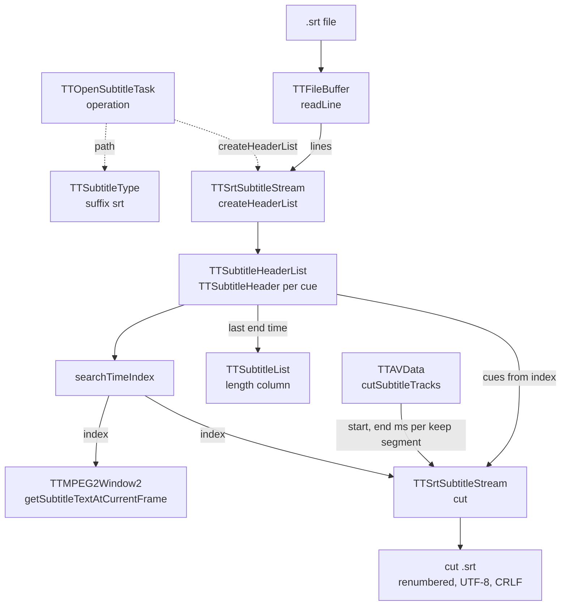

# Code Map: Subtitle core (SRT)

**Scope:** how an `.srt` file becomes a `TTSrtSubtitleStream` with a
`TTSubtitleHeaderList` (one `TTSubtitleHeader` per cue: start, end, text),
the one time lookup every reader uses (`searchTimeIndex`), and what the two
readers do with it: the overlay in the picture window and the subtitle cut
along the keep list.

**Neighbours, not part of this map:** how a subtitle track joins an item, its
language, delay and position ([track-management.md](track-management.md));
the delay's sign convention and the keep list the cut follows
([audio-cut-timing.md](audio-cut-timing.md)); muxing the cut `.srt` and
`--sub-file` playback ([output-mux.md](output-mux.md),
[playback.md](playback.md)); where the SRT comes from — ccextractor OCR or
embedded SubRip in `ttcut-demux` ([ttcut-demux.md](ttcut-demux.md)); DVB
bitmap subtitles (`.mks`), which TTCut-ng does not cut.

## Data flow

Legend: solid = data, dashed = trigger.

## Edge semantics

| From → To | What crosses (data / order / invariant) |
|---|---|
| `TASK` -.-> `TYPE` / `PARSE` | `TTOpenSubtitleTask::operation`: `TTSubtitleType` by suffix only (`srt`); anything else throws “Unsupported subtitle type”. Then `createHeaderList()`; `finished` follows whatever the count. |
| `FILE` → `FB` → `PARSE` | Lines are split on LF and a CR before it is dropped, so CRLF, LF and files mixing both read the same. `TTFileBuffer::readLine` maps each byte 1:1 onto a `QChar` (Latin-1), caps a line at 1 MiB. |
| `PARSE` → `HL` | Per cue: index line (`simplified().toInt()`; a gap in the numbering is only a log warning), timing line matched by `srtTimingLine()` — `h:mm:ss,zzz --> h:mm:ss,zzz` with a comma or a dot, one- or two-digit hours, 1–3 fraction digits, anything after the end time ignored; an unreadable line skips its cue with a warning — then text lines up to an empty line (64 KiB cap), trailing CRLF stripped, text decoded as UTF-8 with Latin-1 fallback (`decodeSrtLine`). Times stored as ms since 00:00. After reading, `sort()` orders the list by start time (stable). |
| `HL` → `LEN` | `streamLengthTime()` = end time of the cue that **starts** last; the subtitle list shows it. |
| `HL` → `SEARCH` | `searchTimeIndex(t)`: linear scan from index 0 for the first cue whose **end** ≥ t; when none, the **last** index; −1 for an empty list. `textAt(t)` starts there and collects every cue with start ≤ t ≤ end, joined by CRLF. |
| `SEARCH` → `OVL` | `getSubtitleTextAtCurrentFrame`: t = `currentIndex / frameRate` in ms **minus the track delay**; `textAt(t)` — overlapping cues show together, one per line. |
| `CUTT` → `CUT` | `cutSubtitleTracks`: per track one target file, per keep segment `cut(startMs, endMs)` with `startMs = round(first·1000) − delay`, `endMs = round(second·1000) − 1 − delay`; `cutInIndex` carries the output position (next segment = previous `cutOutIndex + 1`). A 0-byte result is removed and reported as not ok. |
| `SEARCH` / `HL` → `CUT` → `OUT` | From `searchTimeIndex(start)` on, every cue until one starts after `end`, skipping cues that end before `start` (after the last cue the lookup answers with that cue): start clamped to `start`, end clamped to `end`, both shifted by `cutIn − start`, written as `n\r\nhh:mm:ss,zzz --> hh:mm:ss,zzz\r\ntext\r\n\r\n` (UTF-8, running number across segments). |

## Assumptions, contracts & pitfalls

- **Sorted by start time after reading**; lookup and cut rely on it. The
  cut writes cues in that order, not in file order.
- **Tolerant timing line**, strict about the `-->` and the time fields;
  what `ttcut-demux` writes (ccextractor, ffmpeg SubRip) always fits (ten
  real files, 9065 cues, read identically to an independent parse).
- **Delay moves the lookup, not the cues:** overlay and cut both subtract
  the track delay from the video time (mkvmerge sign convention).
- **The cut writes CRLF and UTF-8** whatever the source used.

### Audit run 14 (reading hypotheses H1–H6, measured)

Throwaway probe on small crafted `.srt` files; gate `subtitle_core`.

- **H1 confirmed and fixed.** Keep segments [0, 2499] + [7000, 8999] over
  cues at 1/3/5 s wrote `00:00:02,500 --> 00:00:01,500 Drei` — end before
  start, text from a removed part. Cues ending before the segment are
  skipped now.
- **H2 confirmed and fixed.** Dot, one-digit hour and position fields gave
  0..0 ms (Qt returns 0 for an invalid `QTime`).
- **H3 confirmed and fixed.** Overlapping cues: the overlay showed one;
  `textAt` shows all.
- **H4 confirmed and fixed.** CRLF then LF: only the first cue survived.
- **H5 not a problem.** A UTF-8 BOM reads fine.
- **H6 confirmed and fixed.** Out-of-order cues were missed by the
  overlay; the list is sorted after reading.

None of the ten real SRT files on disk shows H2/H3/H4/H6; H1 hits any cut
whose last kept part starts after the last cue.

## Redundancy / consolidation candidates

None found: `searchTimeIndex` / `textAt` exist only in
`TTSubtitleHeaderList`, and the parser, the lookup and the cut each have one
site. The cut's clamp and
shift logic lives only in `TTSrtSubtitleStream::cut`.
