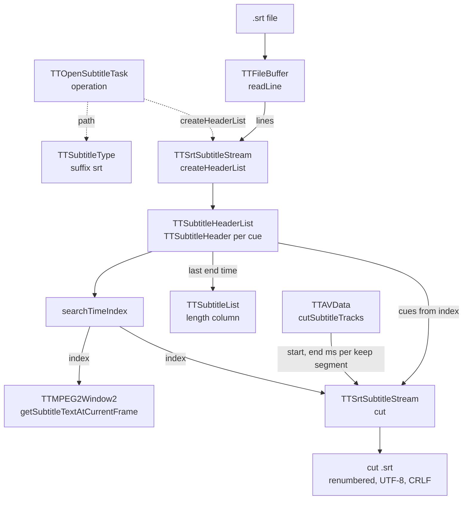

# Code Map: Subtitle core (SRT)

**Scope:** how an `.srt` file becomes a `TTSrtSubtitleStream` with a
`TTSubtitleHeaderList` (one `TTSubtitleHeader` per cue: start, end, text),
the one time lookup every reader uses (`searchTimeIndex`), and what the two
readers do with it: the overlay in the picture window and the subtitle cut
along the keep list.

**Neighbours, not part of this map:** how a subtitle track joins an item, its
language, delay and position ([track-management.md](track-management.md));
the delay's sign convention and the keep list the cut follows
([audio-cut-timing.md](audio-cut-timing.md)); muxing the cut `.srt` and
`--sub-file` playback ([output-mux.md](output-mux.md),
[playback.md](playback.md)); where the SRT comes from — ccextractor OCR or
embedded SubRip in `ttcut-demux` ([ttcut-demux.md](ttcut-demux.md)); DVB
bitmap subtitles (`.mks`), which TTCut-ng does not cut.

## Data flow

Legend: solid = data, dashed = trigger.

## Edge semantics

| From → To | What crosses (data / order / invariant) |
|---|---|
| `TASK` -.-> `TYPE` / `PARSE` | `TTOpenSubtitleTask::operation`: `TTSubtitleType` by suffix only (`srt`); anything else throws “Unsupported subtitle type”. Then `createHeaderList()`; `finished` follows whatever the count. |
| `FILE` → `FB` → `PARSE` | The line end is decided **once** from the first line (`\r\n` if its last byte before `\n` is `\r`, else `\n`); every later `readLine` splits on exactly that string. `TTFileBuffer::readLine` maps each byte 1:1 onto a `QChar` (Latin-1), caps a line at 1 MiB. |
| `PARSE` → `HL` | Per cue: index line (`simplified().toInt()`; a gap in the numbering is only a log warning), timing line — `left(12)` as start, `right(12)` as end, parsed with `hh:mm:ss,zzz` — then text lines up to an empty line (64 KiB cap), trailing CRLF stripped, text decoded as UTF-8 with Latin-1 fallback (`decodeSrtLine`). Times stored as ms since 00:00 (`QTime::msecsSinceStartOfDay`, 0 for an unparsable time). Cues are appended in **file order**; `sort()` exists but nothing calls it. |
| `HL` → `LEN` | `streamLengthTime()` = end time of the **last** cue in file order; the subtitle list shows it. |
| `HL` → `SEARCH` | `searchTimeIndex(t)`: linear scan from index 0 for the first cue whose **end** ≥ t; when none, the **last** index; −1 for an empty list. Assumes cues sorted by time and not overlapping. |
| `SEARCH` → `OVL` | `getSubtitleTextAtCurrentFrame`: t = `currentIndex / frameRate` in ms **minus the track delay**; shows the found cue only if start ≤ t ≤ end. Only the first cue by end time is a candidate — of two overlapping cues the other one is never shown. |
| `CUTT` → `CUT` | `cutSubtitleTracks`: per track one target file, per keep segment `cut(startMs, endMs)` with `startMs = round(first·1000) − delay`, `endMs = round(second·1000) − 1 − delay`; `cutInIndex` carries the output position (next segment = previous `cutOutIndex + 1`). A 0-byte result is removed and reported as not ok. |
| `SEARCH` / `HL` → `CUT` → `OUT` | From `searchTimeIndex(start)` on, every cue until one starts after `end`: start clamped to `start`, end clamped to `end`, both shifted by `cutIn − start`, written as `n\r\nhh:mm:ss,zzz --> hh:mm:ss,zzz\r\ntext\r\n\r\n` (UTF-8, running number across segments). |

## Assumptions, contracts & pitfalls

- **File order = time order.** Parser, lookup and cut all rely on cues
  sorted by time; nothing sorts or checks.
- **One timing-line format.** Exactly `hh:mm:ss,zzz --> hh:mm:ss,zzz` at the
  line's start and end; what `ttcut-demux` writes (ccextractor, ffmpeg
  SubRip) fits.
- **One line-end style per file**, taken from the first line.
- **Delay moves the lookup, not the cues:** overlay and cut both subtract
  the track delay from the video time (mkvmerge sign convention).
- **The cut writes CRLF and UTF-8** whatever the source used.

### Reading hypotheses for audit run 14

From reading only; each needs a runtime proof or refutation first.

- **H1 — a keep segment after the last cue writes that cue again,
  inverted.** `searchTimeIndex` returns the last index when every cue ended
  before `start`; the cut loop does not check the end, clamps the start to
  `start` and keeps the cue's earlier end — a cue with end before start, once
  per such segment.
- **H2 — a timing line in another shape becomes a cue at 00:00:00.** A dot
  instead of the comma, one-digit hours, or coordinates after the end time
  (`X1:… Y1:…`) make `left(12)`/`right(12)` unparsable → 0 ms, silently.
- **H3 — overlapping cues: the overlay shows only one.** mpv, fed the same
  file, shows both.
- **H4 — mixed line ends lose cues.** A file whose first line ends in CRLF
  and later lines in LF (or the reverse) is split on the wrong delimiter:
  lines merge up to the 1 MiB cap or keep a stray `\r`.
- **H5 — a UTF-8 BOM** makes the first index line unparsable: a numbering
  warning, and possibly more.
- **H6 — cues out of time order** break `searchTimeIndex` for the overlay and
  the cut (hand-edited or merged SRTs).

## Redundancy / consolidation candidates

None found: `searchTimeIndex` exists only in `TTSubtitleHeaderList`, and
the parser, the lookup and the cut each have one site. The cut's clamp and
shift logic lives only in `TTSrtSubtitleStream::cut`.
