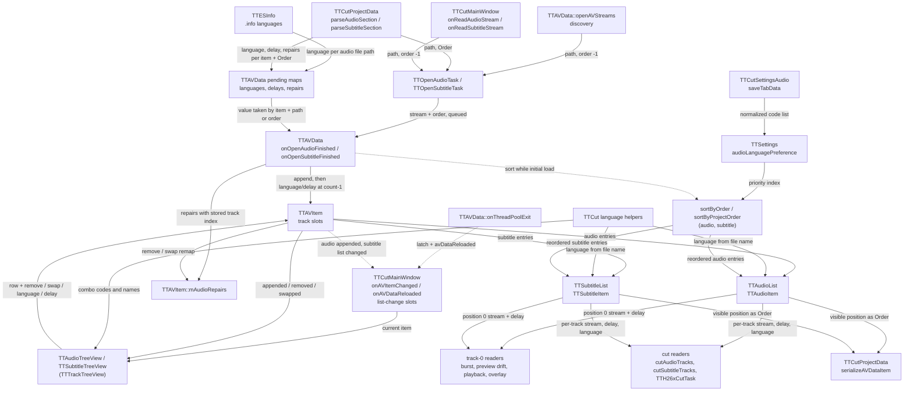

# Code Map: Track management (audio and subtitle tracks)

**Scope:** the per-video list of audio and subtitle tracks while TTCut-ng
runs — how a track gets into the list (discovery, project file, manual
open), how its language, delay and position are decided and changed
(filename, `.info`, project file, user edits, language-preference sort), the
two tree views that show and edit the list, what the main window does when
the list changes (still-frame overlay, length check), and what position,
language and delay mean to the code that reads the list afterwards.

**Neighbours, not part of this map:** the open tasks, the pool and the
project-load outcome ([stream-open-project-load.md](stream-open-project-load.md)),
how a delay becomes an audio cut window ([audio-cut-timing.md](audio-cut-timing.md)),
how language and delay reach the MKV ([output-mux.md](output-mux.md)),
`--sub-file`/`--sub-delay` and the playback MKV ([playback.md](playback.md)),
the dirty flag and the `.ttcut` layout ([project-lifecycle.md](project-lifecycle.md)),
the burst detector on track 0 ([burst-detection.md](burst-detection.md)). The
audio-repair dialog is out of scope; only the track-index remap of repairs
is mapped here.

## Data flow

Legend: solid arrows carry data (producer → consumer); dashed arrows are
triggers only.

Direction measured with `mmdc` (2026-09-25): `TD` viewBox ratio 2.30, `LR` 3.07.

## Edge semantics

| From → To | What crosses (data / order / invariant) |
|---|---|
| `DISC` → `TASK` | One `doOpenAudioStream(item, path)` per `getAudioNames()` hit (`<base>*.{mpa,mp2,ac3,aac}`, `QDir` name order) and one `doOpenSubtitleStream` per `<base>*.srt`, all with the default **order −1**. The open itself: [stream-open-project-load.md](stream-open-project-load.md). |
| `PRJ` → `TASK` | `<Order>` of the section (parsed by `parseSectionHeader`) is passed as the task's order. For `<Subtitle>`, an `<Order>` of −1 (which older projects carry for every discovered or added subtitle) is replaced by the section's position among the `<Subtitle>` sections of its `<Video>` (`parseSubtitleSection`'s `position`). |
| `MAN` → `TASK` | Menu/button open of one file for the **current** item, order −1. `onReadAudioStream` only remembers the absolute path in `mPendingLengthCheckFile`; the length check runs when that file arrives (`ITEM` -.-> `MW`). |
| `INFO` → `PEND` | `openAVStreams` maps `audio_N_lang` (`TTESInfo`, default `"und"`) to the discovered files by file name and parks it in `mPendingInfoAudioLanguages` under `(item, absolute audio file path)`, through `TTCut::canonicalLangCode`. An `und` is not parked, so it never replaces the file-name language. Subtitles get nothing from `.info`. |
| `PRJ` → `PEND` | `<Language>`, `<Delay>` (only when ≠ 0) and `<Repair>` elements (the first two read by `TTCutProjectData::parseTrackLanguageDelay` for both kinds), parked under `(item, order)` right after the task is started. The GUI thread does not return to the event loop in between, so the entries are always in place before the queued finish handler runs. |
| `TASK` → `OAF` | `finished(item, stream, order)` on a `Qt::QueuedConnection`; `order` is the value the task was created with, unchanged. Finish order is arbitrary (pool threads). |
| `PEND` → `OAF` | `applyPending` **takes** the entry and applies it at the index the track was just appended at: first the `.info` language keyed by `(item, stream->filePath())`, then the project language and delay keyed by `(item, order)`, all before the sort. Repairs are taken for `(item, order)` but appended with their stored track index. Entries whose track never arrives stay until their item goes: `dropPendingTrackValues` removes them on `onRemoveAVItem`, `clear()` and `endAbortedProjectLoad` — not at pool exit, because the pool learns about a finished task before this handler runs. |
| `OAF` → `ITEM` | `appendAudioEntry` / `appendSubtitleEntry`, then `onAudioLanguageChanged` / `onAudioDelayChanged` (subtitle: the `onSubtitle…` pair) at `count − 1`. Both lists' `append(item, stream, order)` replace order −1 by the list count. |
| `OAF` → `REP` | `appendAudioRepair` per parked repair; the repair's `trackIndex()` is its saved `<Order>`, which matches the list position only after `sortByProjectOrder` has run. |
| `ITEM` → `AL` / `SL` | The lists own the streams. `clear()` (destructor) deletes them; `remove()` only takes the entry out and does **not** delete the stream (TODO P7). `update(old, new)` replaces the entry found by `operator==` (same stream pointer + same item). |
| `LANG` → `AL` / `SL` | `TTAudioItem` / `TTSubtitleItem` constructors set `mLanguage = TTCut::langFromFilename(path)`: the three-letter suffix `_xyz` or `_xyz_N` of the base name through `canonicalLangCode` (`ger` → `deu`; a code `normalizeLangCode` does not know stays as it is), else the system locale mapped by `iso639_1to2`. Delay starts at 0. |
| `SET` → `PREF` | Settings dialog, audio page: comma list → `normalizeLangCode` each (2-letter, canonical 3-letter, alias table), unknown codes dropped silently, → `setAudioLanguagePreference`. No change signal: the preference is read at sort time, and sorting happens only during an item's initial load, so an edit applies to the next load. |
| `PREF` → `SORT` | `TTAudioItem::operator<` reads the preference **at compare time**: AC3 first, then preference index (empty list: system-locale language = 0, others `INT_MAX`), then `mOrder`. |
| `OAF` -.-> `SORT` | While `!initialAudioLoadDone()`. Audio, after every append once the list has ≥ 2 entries: order ≥ 0 (project) → `sortByProjectOrder` (stable, by `mOrder` = saved `<Order>`); order −1 → `sortByOrder` (`operator<`), per append on purpose so position 0 is right before the pool drains (burst check at the initial VDR-cut add). Subtitles: only project subtitles (order ≥ 0) → `TTSubtitleList::sortByProjectOrder`; discovered ones keep arrival order. |
| `SORT` → `AL` / `SL` | In-place `std::sort` / `std::stable_sort` of the entry list. **No signal**: the views and the overlay learn about it only from the pool-exit reload. |
| `LATCH` -.-> `MW` | `onThreadPoolExit` sets `setInitialAudioLoadDone()` on every item in the list (plus the late-append case in `onOpenVideoFinished` when the pool is already drained) and emits `avDataReloaded` (so does `onReadProjectFileFinished`); `TTCutMainWindow::onAVDataReloaded` rebuilds both views from the model (`onReloadList`) and re-runs `showSubtitleTrackZero`. From then on the track order belongs to the user. |
| `ITEM` -.-> `MW` | `onAVItemChanged` connects the current item's `subtitleItemAppended`, `subtitleItemUpdated`, `subtitleItemsSwapped`, `subtitleItemRemoved(int)` and `audioItemAppended` (and disconnects the previous item's; a pending length check is dropped on the switch). Every subtitle change runs `showSubtitleTrackZero`: overlay stream and delay of subtitle 0, or none, then a still-frame redraw. `onAudioItemAppended` runs `warnIfLengthMismatch` (> 1 s difference → "Length Mismatch") once the appended stream's path equals `mPendingLengthCheckFile`. |
| `MW` → `VIEW` | `onAVItemChanged` calls `onAVDataChanged(item)` on both views: disconnect from the old item, connect to the new one, full rebuild. `closeProject` passes 0 (clear). |
| `ITEM` → `VIEW` | `audioItemAppended` → one row appended; `audioItemRemoved(int)` → row taken; `audioItemsSwapped` → **full rebuild** (per-row editor widgets die with `takeTopLevelItem`). `audioItemUpdated` is **not** connected to the views: a language/delay applied from the pending maps shows only after the pool-exit reload. Same for subtitles. |
| `VIEW` → `ITEM` | `removeItem(row)`, `swapItems(row, row±1)`, `languageChanged(row, code)`, `delayChanged(row, ms)`. The row is looked up when the editor fires (`ttRowOfItemWidget`), not captured at creation, so it survives swaps and removals. The combo carries the code (`itemData`), the spin box ±9999 ms, mkvmerge sign (positive = later). |
| `LANG` → `VIEW` | `populateLanguageCombo`: the fixed 30-code list of `languageCodes()` / `languageNames()`; a current code outside that list gets an entry of its own and is selected, so the combo shows what the track carries. |
| `ITEM` → `REP` | `onRemoveAudioItem(i)`: repairs on track i dropped, higher indices −1. `onSwapAudioItems(a, b)`: indices a and b exchanged. Repairs are rebuilt via the full `TTAudioRepairItem` constructor, `isEnabled()` carried over. Subtitles have no repairs. |
| `AL` / `SL` → `T0` | **Position 0 is the lead track** for every single-track reader: `TTCutTreeView` burst/acmod hints, `TTAVData` burst checks, preview drift (`TTCutPreviewTask`, delay of track 0), preview clip audio, playback audio and output channels (`TTCurrentFrame`), still-frame subtitle overlay (`TTMPEG2Window2::subtitleStream()`, pushed by `showSubtitleTrackZero`) and `--sub-file`/`--sub-delay` (subtitle 0, read at every Play). |
| `AL` / `SL` → `CUT` | By list position: `cutAudioTracks` reads `audioStreamAt(i)` + `getDelayMs()` per index (delay → [audio-cut-timing.md](audio-cut-timing.md)); `TTH26xCutTask` collects `getLanguage()` per position for the mux ([output-mux.md](output-mux.md)); `cutSubtitleTracks` reads stream, language and delay per index. Output track order = list order. |
| `AL` / `SL` → `SAVE` | `<Audio>` / `<Subtitle>` per track with `<Order>` = the **visible list position** `i` (not `mOrder`, which the reorder buttons do not touch), `<Language>` when non-empty, `<Delay>` when ≠ 0; `<Audio>` also carries `<Repair>` children filtered by `trackIndex() == i`. |

## Assumptions, contracts & pitfalls

- **Position 0 is a contract, not a detail.** More than ten single-track
  readers take `audioStreamAt(0)` / `subtitleStreamAt(0)` as "the" track.
  Anything that reorders the list (initial sort, project order, the user's
  up/down buttons) changes what burst detection, preview drift, playback and
  the overlay look at. The overlay follows through `showSubtitleTrackZero`;
  the others read position 0 when they run.
- **`TTAudioList` / `TTSubtitleList`** — assume the caller passes an index
  in range: `at()` and `remove()` (`indexOf` → `takeAt(-1)`) do not check.
  `TTAVItem::onAudioDelayChanged` / `onSubtitleDelayChanged` range-check,
  the language slots do not. `operator==` identifies an entry by stream
  pointer + item, so an entry copy stays valid across `update()`.
- **`mOrder` has two meanings.** For project tracks it is the saved
  `<Order>` (used by `sortByProjectOrder`, keyed into the pending maps); for
  discovered or added tracks it is the list count at arrival (tie-breaker in
  `operator<`). The reorder buttons never update it — which is why the save
  writes the list position instead.
- **The initial-load window.** Sorting happens only while
  `initialAudioLoadDone()` is false (the flag covers subtitles too); the
  latch is set at pool exit (and on the late-append path in
  `onOpenVideoFinished`). A track added by hand after that is appended at
  the end and never sorted — by design (user decision 2026-08-18: after
  loading, the order is the user's).
- **The views are rebuilt, not patched**, whenever the order can have
  changed (swap → full rebuild; sort → pool-exit rebuild). During a load the
  view briefly shows arrival order and file-name languages.
- **Language strings.** File-name suffixes and `.info` values go through
  `canonicalLangCode`; the preference list through `normalizeLangCode`
  (unknown codes dropped); project and combo values are stored as they are.
  A code neither function knows (`mul`) therefore stays raw and never
  matches a preference entry.
- **Pitfall — `langFromFilename` matches any `_xyz` suffix** of three lower
  -case letters, so a base name ending in, e.g., `_cut` yields language
  `cut`.
- **Pitfall — a removed track's stream is not freed** (`remove()` only takes
  the entry). The overlay no longer points at it, but nothing deletes it
  until the item dies; freeing it needs a design of who still holds the
  pointer (TODO P7).
- **Pitfall — the length check depends on the path.** It fires only when
  the appended stream's `filePath()` equals the path `onReadAudioStream`
  stored (`QFileInfo::absoluteFilePath`, as passed to the open task).

## Redundancy / consolidation candidates

- **Two list classes with one shape**
  - sites: `data/ttaudiolist.cpp:TTAudioList`, `data/ttsubtitlelist.cpp:TTSubtitleList` (and the item classes; the audit-run-8 classifier found the same shape in `TTMarkerList` and `TTCutList`), plus the parallel finish handlers `TTAVData::onOpenAudioFinished` / `onOpenSubtitleFinished` and the open tasks `TTOpenAudioTask` / `TTOpenSubtitleTask`
  - shared purpose: ordered track entries with append/remove/update/swap/clear/sortByProjectOrder and the same signal set
  - status: documented → TODO.md P6 (Spur-Listen als eine Vorlage); needs its own design, `cut-edit-and-start.md` records that the lists share no base class yet
- **Four language/delay slots on `TTAVItem`**
  - sites: `data/ttavlist.cpp:onAudioLanguageChanged`, `onAudioDelayChanged`, `onSubtitleLanguageChanged`, `onSubtitleDelayChanged`
  - shared purpose: copy entry, set one field, `update(old, new)`
  - status: documented → TODO.md P6; falls out of the list template (note the missing range check in the language pair)
- **View wiring**
  - sites: `gui/ttaudiotreeview.cpp:onAVDataChanged/onSwapItems/onReloadList`, `gui/ttsubtitletreeview.cpp` same three
  - shared purpose: (dis)connect the item, rebuild on swap, rebuild from model
  - status: kept separate → the class comment of `TTTrackTreeView` keeps the model wiring per subclass because the signal sets differ; revisit together with P6
- **"Lead track" lookups**
  - sites: `gui/ttcurrentframe.cpp`, `gui/ttcutmainwindow.cpp`, `gui/ttcuttreeview.cpp`, `gui/ttcutpreview.cpp`, `data/ttavdata.cpp`, `data/ttcutpreviewtask.cpp`, `data/ttpreviewclip.cpp` (each `audioStreamAt(0)` / `subtitleStreamAt(0)`)
  - shared purpose: pick the track single-track features work on
  - status: documented → TODO.md P6 (one named accessor on `TTAVItem` as part of the list API)
- **Unused API (dead-code candidates, not redundancy)**
  - sites: `TTAudioList::print`, `TTSubtitleList::print` (declared, never defined); list slots `onAppendItem`, `onRemoveItem`, `onUpdateItem`, `onUpdateOrder` (never connected); `TTAVItem` signals `audioItemRemoved(const TTAudioItem&)`, `audioOrderUpdated`, `subtitleItemRemoved(const TTSubtitleItem&)`, `subtitleOrderUpdated` (never emitted)
  - shared purpose: remnants of the original TTCut list design
  - status: consolidate → hand to the dead-code audit
