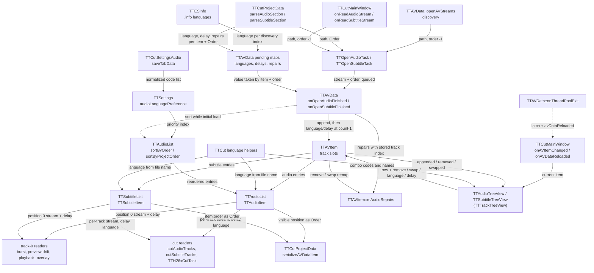

# Code Map: Track management (audio and subtitle tracks)

**Scope:** the per-video list of audio and subtitle tracks while TTCut-ng
runs — how a track gets into the list (discovery, project file, manual
open), how its language, delay and position are decided and changed
(filename, `.info`, project file, user edits, language-preference sort), the
two tree views that show and edit the list, and what position, language and
delay mean to the code that reads the list afterwards.

**Neighbours, not part of this map:** the open tasks, the pool and the
project-load outcome ([stream-open-project-load.md](stream-open-project-load.md)),
how a delay becomes an audio cut window ([audio-cut-timing.md](audio-cut-timing.md)),
how language and delay reach the MKV ([output-mux.md](output-mux.md)),
`--sub-file`/`--sub-delay` and the playback MKV ([playback.md](playback.md)),
the dirty flag and the `.ttcut` layout ([project-lifecycle.md](project-lifecycle.md)),
the burst detector on track 0 ([burst-detection.md](burst-detection.md)). The
audio-repair dialog is out of scope; only the track-index remap of repairs
is mapped here.

## Data flow

Legend: solid arrows carry data (producer → consumer); dashed arrows are
triggers only.

Direction measured: `TD` against `LR`, see the verification note at the end.

## Edge semantics

| From → To | What crosses (data / order / invariant) |
|---|---|
| `DISC` → `TASK` | One `doOpenAudioStream(item, path)` per `getAudioNames()` hit (`<base>*.{mpa,mp2,ac3,aac}`, `QDir` name order) and one `doOpenSubtitleStream` per `<base>*.srt`, all with the default **order −1**. The open itself: [stream-open-project-load.md](stream-open-project-load.md). |
| `PRJ` → `TASK` | `<Order>` of the section (parsed by `parseSectionHeader`, any integer including −1) is passed as the task's order. |
| `MAN` → `TASK` | Menu/button open of one file for the **current** item, order −1. `onReadAudioStream` then runs its length check against `audioStreamAt(audioCount()-1)` **synchronously** — before the queued open can have finished (H4). |
| `INFO` → `PEND` | `openAVStreams` maps `audio_N_lang` (`TTESInfo`, default `"und"`) to the discovered files by file name and parks it under `(item, discovery index 0..n-1)`. The tracks themselves arrive with order −1, so the key never matches (H1). Subtitles get nothing from `.info`. |
| `PRJ` → `PEND` | `<Language>`, `<Delay>` (only when ≠ 0) and `<Repair>` elements, parked under `(item, <Order>)` right after the task is started. The GUI thread does not return to the event loop in between, so the entries are always in place before the queued finish handler runs. |
| `TASK` → `OAF` | `finished(item, stream, order)` on a `Qt::QueuedConnection`; `order` is the value the task was created with, unchanged. Finish order is arbitrary (pool threads). |
| `PEND` → `OAF` | `applyPending` **takes** the entry for `(item, order)` and applies it at the index the track was just appended at. Entries whose key never arrives stay in the maps: nothing clears them, keyed by raw `TTAVItem*` (H7). Repairs are taken for the same key but appended with their stored track index. |
| `OAF` → `ITEM` | `appendAudioEntry` / `appendSubtitleEntry`, then `onAudioLanguageChanged` / `onAudioDelayChanged` (subtitle: the `onSubtitle…` pair) at `count − 1`. Audio `append(item, stream, order)` replaces order −1 by the list count; **subtitle `append` keeps −1** (see `SL` → `SAVE`). |
| `OAF` → `REP` | `appendAudioRepair` per parked repair; the repair's `trackIndex()` is its saved `<Order>`, which matches the list position only after `sortByProjectOrder` has run. |
| `ITEM` → `AL` / `SL` | The lists own the streams. `clear()` (destructor) deletes them; `remove()` only takes the entry out and does **not** delete the stream (H6). `update(old, new)` replaces the entry found by `operator==` (same stream pointer + same item). |
| `LANG` → `AL` / `SL` | `TTAudioItem` / `TTSubtitleItem` constructors set `mLanguage = TTCut::langFromFilename(path)`: the raw three-letter suffix `_xyz` or `_xyz_N` of the base name, **not normalized** (`ger` stays `ger`), else the system locale mapped by `iso639_1to2`. Delay starts at 0. |
| `SET` → `PREF` | Settings dialog, audio page: comma list → `normalizeLangCode` each (2-letter, canonical 3-letter, alias table), unknown codes dropped silently, → `setAudioLanguagePreference`, which emits `audioLanguagePreferenceChanged` — no receiver anywhere (H3). |
| `PREF` → `SORT` | `TTAudioItem::operator<` reads the preference **at compare time**: AC3 first, then preference index (empty list: system-locale language = 0, others `INT_MAX`), then `mOrder`. The item's language is compared as stored, i.e. un-normalized. |
| `OAF` -.-> `SORT` | After **every** audio append while `!initialAudioLoadDone()` and the list has ≥ 2 entries: order ≥ 0 (project) → `sortByProjectOrder` (stable, by `mOrder` = saved `<Order>`); order −1 → `sortByOrder` (`operator<`). Per append on purpose, so position 0 is right before the pool drains (burst check at the initial VDR-cut add). Subtitles are never sorted. |
| `SORT` → `AL` | In-place `std::sort` / `std::stable_sort` of the entry list. **No signal**: the views learn about it only from the reload below. |
| `LATCH` -.-> `MW` | `onThreadPoolExit` sets `setInitialAudioLoadDone()` on every item in the list (plus the late-append case in `onOpenVideoFinished` when the pool is already drained) and emits `avDataReloaded` (so does `onReadProjectFileFinished`); `TTCutMainWindow::onAVDataReloaded` rebuilds both views from the model (`onReloadList`). From then on the track order belongs to the user. |
| `MW` → `VIEW` | `onAVItemChanged` calls `onAVDataChanged(item)` on both views: disconnect from the old item, connect to the new one, full rebuild. `closeProject` passes 0 (clear). |
| `ITEM` → `VIEW` | `audioItemAppended` → one row appended; `audioItemRemoved(int)` → row taken; `audioItemsSwapped` → **full rebuild** (per-row editor widgets die with `takeTopLevelItem`). `audioItemUpdated` is **not** connected to the views: a language/delay applied from the pending maps shows only after the pool-exit reload. Same for subtitles. |
| `VIEW` → `ITEM` | `removeItem(row)`, `swapItems(row, row±1)`, `languageChanged(row, code)`, `delayChanged(row, ms)`. The row is looked up when the editor fires (`ttRowOfItemWidget`), not captured at creation, so it survives swaps and removals. The combo carries the code (`itemData`), the spin box ±9999 ms, mkvmerge sign (positive = later). |
| `LANG` → `VIEW` | `populateLanguageCombo`: the fixed 30-code list of `languageCodes()` / `languageNames()`; the current code is preselected **only if it is in that list**, otherwise index 0 (`und`) is shown while the model keeps the other code (H5). |
| `ITEM` → `REP` | `onRemoveAudioItem(i)`: repairs on track i dropped, higher indices −1. `onSwapAudioItems(a, b)`: indices a and b exchanged. Repairs are rebuilt via the full `TTAudioRepairItem` constructor, `isEnabled()` carried over. Subtitles have no repairs. |
| `AL` / `SL` → `T0` | **Position 0 is the lead track** for every single-track reader: `TTCutTreeView` burst/acmod hints, `TTAVData` burst checks, preview drift (`TTCutPreviewTask`, delay of track 0), preview clip audio, playback audio and output channels (`TTCurrentFrame`), still-frame subtitle overlay and `--sub-file`/`--sub-delay` (subtitle 0). The overlay is re-pushed on `subtitleItemAppended`/`subtitleItemUpdated` only, not on swap or remove (H6). |
| `AL` / `SL` → `CUT` | By list position: `cutAudioTracks` reads `audioStreamAt(i)` + `getDelayMs()` per index (delay → [audio-cut-timing.md](audio-cut-timing.md)); `TTH26xCutTask` collects `getLanguage()` per position for the mux ([output-mux.md](output-mux.md)); `cutSubtitleTracks` reads stream, language and delay per index. Output track order = list order. |
| `AL` → `SAVE` | `<Audio>` per track with `<Order>` = **visible list position** `i` (not `mOrder`, which the reorder buttons do not touch), `<Language>` when non-empty, `<Delay>` when ≠ 0, `<Repair>` children filtered by `trackIndex() == i`. |
| `SL` → `SAVE` | `<Subtitle>` per track with `<Order>` = `item.order()`: −1 for every discovered or manually added subtitle, and unchanged by the reorder buttons (H2). |

## Assumptions, contracts & pitfalls

- **Position 0 is a contract, not a detail.** More than ten single-track readers
  take `audioStreamAt(0)` / `subtitleStreamAt(0)` as "the" track. Anything
  that reorders the list (initial sort, project order, the user's up/down
  buttons) changes what burst detection, preview drift, playback and the
  overlay look at.
- **`TTAudioList` / `TTSubtitleList`** — assume the caller passes an index
  in range: `at()` and `remove()` (`indexOf` → `takeAt(-1)`) do not check.
  `TTAVItem::onAudioDelayChanged` / `onSubtitleDelayChanged` range-check,
  the language slots do not. `operator==` identifies an entry by stream
  pointer + item, so an entry copy stays valid across `update()`.
- **`mOrder` has two meanings.** For project tracks it is the saved
  `<Order>` (used by `sortByProjectOrder`, keyed into the pending maps); for
  discovered audio it is the arrival count (tie-breaker in `operator<`); for
  discovered subtitles it stays −1. The reorder buttons never update it —
  which is why the audio save writes the list position instead.
- **The initial-load window.** Sorting happens only while
  `initialAudioLoadDone()` is false; the latch is set at pool exit (and on
  the late-append path in `onOpenVideoFinished`). A track added by hand
  after that is appended at the end and never sorted — by design (user
  decision 2026-08-18: after loading, the order is the user's).
- **The views are rebuilt, not patched**, whenever the order can have
  changed (swap → full rebuild; sort → pool-exit rebuild). During a load the
  view briefly shows arrival order and file-name languages.
- **Pitfall — "language" is three different strings.** File-name suffix
  (raw), `.info` value (raw), user/project value (combo code). Only the
  preference list is normalized. A `_ger` file therefore neither matches a
  `deu` preference nor shows as `deu` in the combo.
- **Pitfall — `langFromFilename` matches any `_xyz` suffix** of three lower
  -case letters, so a base name ending in, e.g., `_cut` yields language
  `cut`.

### Reading hypotheses for audit run 8

Derived from reading only; none is measured yet. Each needs a runtime
proof (or a refutation) before it becomes a finding.

- **H1 — `.info` languages never applied on a plain open.** Parked under
  `(item, 0..n-1)`, tracks arrive with order −1. The file-name language
  usually hides it (ttcut-demux names files `_deu`/`_eng`). Measure: fixture
  whose `.info` language differs from the file-name suffix; open it; read
  `audioListItemAt(i).getLanguage()`.
- **H2 — subtitle `<Order>` is −1 for discovered/added subtitles.** On
  reload every section parks under `(item, −1)`: later language/delay
  overwrite earlier ones, the survivor is applied to whichever subtitle
  finishes opening first, the rest get nothing; subtitle order is neither
  saved (reorder not persisted) nor restored (no sort). Measure: two SRTs
  with different language and delay, save, read the XML, reload.
- **H3 — `audioLanguagePreferenceChanged` has no receiver.** The comment in
  `TTSettings::setAudioLanguagePreference` still promises a reactive
  re-sort; the 2026-08-18 decision says no re-sort after load. Either the
  signal is dead or the comment is wrong — a ruling, not a fix.
- **H4 — the manual-open length check tests the wrong track.**
  `onReadAudioStream` reads `audioStreamAt(count − 1)` right after queuing
  the open, i.e. the previous last track (or none). Measure: add an audio
  file of clearly different length by hand; no "Length Mismatch" expected.
- **H5 — combo shows `und` for codes outside the 30-code list** (`ger`,
  `mul`, `mac`, `per`) while the model, the mux and the project keep the
  real code. Measure: file `x_ger.ac3`, open, compare combo text with
  `getLanguage()` and with the MKV track language after a cut.
- **H6 — removing or swapping subtitles leaves the overlay on the old
  track.** Overlay stream and delay are pushed on append/update only;
  `remove()` does not delete the stream, so the overlay keeps a valid but
  orphaned pointer (and the stream leaks until the item dies). Same leak for
  removed audio streams.
- **H7 — pending entries outlive their item.** Keyed by raw `TTAVItem*`,
  removed only by a matching `take`; a later item at a reused address with a
  matching order would inherit them. Structural; low likelihood.

## Redundancy / consolidation candidates

- **Two list classes with one shape**
  - sites: `data/ttaudiolist.cpp:TTAudioList`, `data/ttsubtitlelist.cpp:TTSubtitleList` (and the item classes)
  - shared purpose: ordered track entries with append/remove/update/swap/clear and the same signal set
  - status: consolidate → one template list with a per-kind sort policy; the only real differences are the sort and the order default in `append(item, stream, order)` — and that divergence is exactly what H2 hangs on
- **Four language/delay slots on `TTAVItem`**
  - sites: `data/ttavlist.cpp:onAudioLanguageChanged`, `onAudioDelayChanged`, `onSubtitleLanguageChanged`, `onSubtitleDelayChanged`
  - shared purpose: copy entry, set one field, `update(old, new)`
  - status: consolidate → falls out of the template list; until then keep, note the missing range check in the language pair
- **View wiring**
  - sites: `gui/ttaudiotreeview.cpp:onAVDataChanged/onSwapItems/onReloadList`, `gui/ttsubtitletreeview.cpp` same three
  - shared purpose: (dis)connect the item, rebuild on swap, rebuild from model
  - status: kept separate → the class comment of `TTTrackTreeView` keeps the model wiring per subclass because the signal sets differ; revisit together with the list template
- **"Lead track" lookups**
  - sites: `gui/ttcurrentframe.cpp`, `gui/ttcutmainwindow.cpp`, `gui/ttcuttreeview.cpp`, `gui/ttcutpreview.cpp`, `data/ttavdata.cpp`, `data/ttcutpreviewtask.cpp`, `data/ttpreviewclip.cpp` (each `audioStreamAt(0)` / `subtitleStreamAt(0)`)
  - shared purpose: pick the track single-track features work on
  - status: consolidate → one named accessor on `TTAVItem` so the contract is written down once
- **Unused API (dead-code candidates, not redundancy)**
  - sites: `TTAudioList::print`, `TTSubtitleList::print` (declared, never defined); list slots `onAppendItem`, `onRemoveItem`, `onUpdateItem`, `onUpdateOrder` (never connected); `TTAVItem` signals `audioItemRemoved(const TTAudioItem&)`, `audioOrderUpdated`, `subtitleItemRemoved(const TTSubtitleItem&)`, `subtitleOrderUpdated` (never emitted)
  - shared purpose: remnants of the original TTCut list design
  - status: consolidate → hand to the dead-code audit
