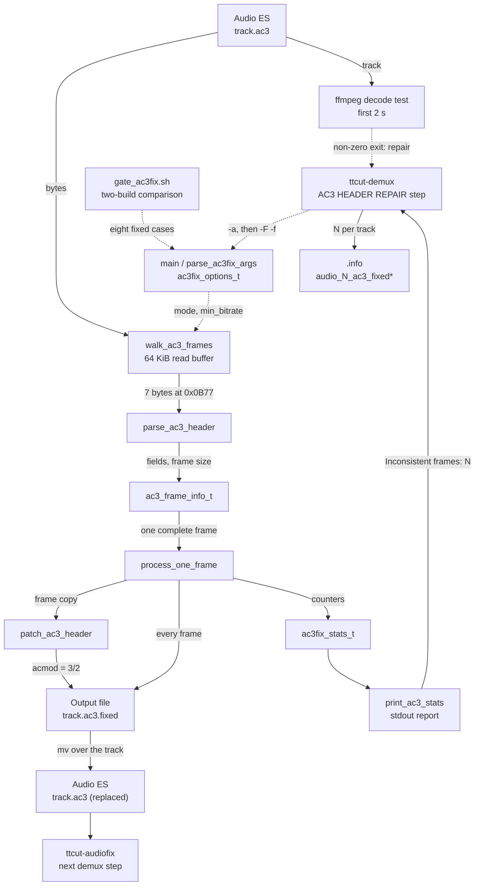

# Code Map: AC3 header repair (ttcut-ac3fix)

**Scope:** `tools/ttcut-ac3fix/ttcut-ac3fix.c`, installed as
`/usr/bin/ttcut-ac3fix`: a standalone C program that walks an AC3 elementary
stream frame by frame, counts frames whose header says stereo (`acmod` 2/0)
at a bitrate of `min_bitrate` (384 kbit/s) or more, and in `--force-fix`
mode rewrites `acmod` of those frames to 3/2. Its only caller is the
"AC3 HEADER REPAIR" step of `tools/ttcut-demux/ttcut-demux`, which reads the
report, decides with a decode test whether to repair, and replaces the track.
Nothing in the TTCut-ng application calls the tool or reads its result.

**Neighbours, not part of this map:** the rest of the demux pipeline and the
sanitizer that runs next ([ttcut-demux.md](ttcut-demux.md)); how TTCut-ng
itself reads AC3 headers ([audio-es-input.md](audio-es-input.md)); the cut-time
answer to mixed channel layouts, which re-encodes minority frames instead of
patching headers (`normalizeAcmod`, [audio-cut-timing.md](audio-cut-timing.md)).

## Data flow

Legend: solid = data, dashed = trigger / configuration.

## Edge semantics

| From → To | What crosses (data / order / invariant) |
|---|---|
| `DEMUX` ⇢ `ARGS` | Per `.ac3` track, unless `-A` (`AC3FIX=false`) or `ttcut-ac3fix` is not in `PATH` (warning, step skipped). First run `ttcut-ac3fix -a <track>` with stdout and stderr captured together; a second run `ttcut-ac3fix -F -f <track> <track>.fixed` only when the first reported a count above 0 **and** the decode test failed. Other audio types (`.mp2`, `.eac3`, `.aac`) never reach the tool. |
| `GATE` ⇢ `ARGS` | `gate_ac3fix.sh run <tag>` captures stdout, stderr, exit code and written files of eight cases (analyze, fix, fix with `-s -v`, fix with `-b 192`, plain copy, missing input, empty input) on generated fixtures and the Tux AC3; `compare` diffs two tags. It needs a baseline build, so it is deliberately not in the `run-gates.sh` table. Its `mixed.ac3` recipe is repeated in `run-gates.sh` (`make_mixed_ac3`) for other gates. |
| `ARGS` ⇢ `WALK` | `ac3fix_options_t`. Rules applied in `main` before any file is touched: no output file → analyze mode (with a note on stdout); `--force-fix` clears analyze mode and then requires an output file; an existing output file is refused without `-f`. First positional = input, second = output, further ones are ignored. `-b` accepts 32–640. Exit code 0 after `--help`, 1 after a usage error. |
| `ESA` → `WALK` | The whole file through `open_ac3_files` (size via `ftell`, an empty file is an error with exit 1) and a 64 KiB buffer that is refilled and compacted with `memmove`. The walker advances **one byte at a time** over everything that is not a parsable header and counts those bytes (`skipped_junk`). |
| `WALK` → `PARSE` | At least 7 bytes starting at a sync word `0x0B77`. |
| `PARSE` → `HDR` | `fscod`, `frmsizecod`, `bsid`, `bsmod`, `acmod`, derived `frame_size` (bytes) and `bitrate` (kbit/s). Accepted **only** for `fscod` 0 (48 kHz) and `frmsizecod` < 38; anything else is "no header" and the walker moves on by one byte. No CRC check, no look at the next sync word, no `bsid` test. `lfeon` is not read from the stream but set to 1 exactly when `acmod` is 3/2; `lfeon`, `bsid`, `bsmod` and `channels` have no reader. |
| `HDR` → `FRAME` | Called only once the whole frame (`frame_size` bytes) is in the buffer; otherwise the walker reads more. Time is counted as frames × 1536/48000 s and is advanced **after** the call, so a message inside it carries the start time of the frame together with a 1-based frame number. |
| `FRAME` → `STATS` | Per frame: total; stereo / 3/2 / other by `acmod`; `inconsistent_frames` when `acmod` is 2/0 **and** `bitrate >= min_bitrate`; `fixed_frames` for the same frames in force-fix mode; `format_changes` whenever `acmod` differs from the previous frame (with `-s` each change is printed). |
| `FRAME` → `PATCH` | The frame is first copied into a local buffer, so the read buffer is never modified. Patched only when the frame is inconsistent, force-fix is on and an output file is open. |
| `PATCH` → `OUT` | Bits 7–5 of byte 6 set to 7 (3/2). Nothing else in the frame changes: neither CRC is recomputed, and the bits after `acmod` keep their position although their meaning depends on `acmod` (2/0 is followed by `dsurmod`, 3/2 by `cmixlev` and `surmixlev`). |
| `FRAME` → `OUT` | Whenever an output file is open — with or without `--force-fix` — **every parsed frame** is written and nothing else. Bytes the walker skipped are not written, so the output is the input minus everything that did not parse. A write error ends the run with exit 1 and no statistics. |
| `STATS` → `REPORT` | stdout: banner (`print_ac3_banner`), then the statistics block; in analyze mode with a count above 0 a recommendation naming `--force-fix`. stderr: progress in steps of 10 %, and one message about unusable bytes — "Partial frame at file edges" (fewer than one frame) or "Warning: N bytes could not be parsed" — which is printed **only when bytes are left in the buffer at end of file**: skipped bytes in the middle of a file whose last frame is complete produce no message (measured 2026-10-02, 3000 junk bytes after frame 100). Exit code 0 whatever was found. |
| `REPORT` → `DEMUX` | A **text contract**: the script takes the number after `Inconsistent frames:` with `grep -oP`, 0 when the line is missing. The exit code of the analyze run is not evaluated, and of the fix run only the last output line is shown (`| tail -1`). |
| `ESA` → `DECODE` | `ffmpeg -v error -i <track> -t 2 -f null -` on the **unrepaired** track, stderr discarded; only the exit status is used and only the first two seconds are decoded. |
| `DECODE` ⇢ `DEMUX` | Exit 0 → "inconsistent headers but decode OK — skipping fix", the track stays as it is. Non-zero → the fix run. The test exists because the bitrate rule alone marks valid stereo tracks at 384 kbit/s and above. |
| `OUT` → `FIXED` | `mv <track>.fixed <track>` when the fix pipeline ended with status 0 and the file is not empty; otherwise a warning and `rm -f`. |
| `DEMUX` → `INFO` | For a replaced track: `audio_N_ac3_fixed=true` and `audio_N_ac3_fixed_frames=<count of the analyze run>`. The application's `.info` parser (`TTESInfo`) does not read either key. |
| `FIXED` → `AUDIOFIX` | The AC3 repair runs before the per-track sanitizer, so `ttcut-audiofix` sees the already replaced track ([ttcut-demux.md](ttcut-demux.md)). |

## Assumptions, contracts & pitfalls

- **Detection rule** (`is_inconsistent_header`) — "stereo header at
  `min_bitrate` or more" is a guess about the broadcaster, not a defect test.
  The count is therefore a candidate count; the decision to repair lies with
  the decode test in `ttcut-demux`.
- **`parse_ac3_header`** — 48 kHz only. A 44.1 or 32 kHz track is walked
  byte by byte, and what parses are chance sync words inside the payload:
  measured 2026-10-02 on an 8 s 44.1 kHz stereo file, 3 "frames" (one of them
  counted as inconsistent) and 443 746 unparsed bytes. A fix run on it writes
  those 3 frames, 4864 of 448 610 bytes.
- **Output is not a copy** — every run with an output file drops the bytes
  that did not parse, and a sync word inside such bytes is accepted as a frame
  without further checks. The tool runs before the sanitizer that would have
  reported those bytes.
- **Patched frames carry stale CRCs and a shifted bit layout** (edge
  `PATCH` → `OUT`). The source comment says so for the CRC ("most players
  ignore CRC errors").
- **Exit code** — 0 also when inconsistent frames were found; 1 for a usage
  error, an unreadable or empty input, a refused or unopenable output and a
  write error. The caller relies on the text, not on the code.
- **`ttcut-demux` runs under `set -e` without `pipefail`** — the status of
  `ttcut-ac3fix -F … | tail -1` is that of `tail`, and the analyze run sits in
  a plain command substitution assignment.
- **Build** — CMake builds the binary into the source directory
  (`tools/ttcut-ac3fix/`, gitignored) so that `debian/rules` can install it
  from there; unlike the two sibling C tools the target sets no `C_STANDARD`.
  The file header names "GPL v2 or later" without an SPDX line.

### Reading hypotheses for audit run 19 (not measured)

- **A1** An analyze run that exits 1 (empty or unreadable `.ac3`) ends the
  whole demux through `set -e`.
- **A2** The "fix failed" branch cannot be reached; a failed fix run is caught
  only by the empty-file test.
- **A3** The decode test answers with the exit status of ffmpeg for the first
  two seconds. Open: what that status is for a track that needs the repair,
  and whether the repair is reached at all on real material.
- **A4** A patched track: does it decode, and does `ttcut-audiofix` report
  every patched frame as CRC-bad (which would surface as audio-defect markers
  in TTCut-ng).
- **A5** Junk before or between frames is removed by the fix run, unreported,
  and a false sync inside it is written as a frame.
- **A6** A 44.1 kHz AC3 track: what the report says and what a fix run writes.
- **A7** `bsid` is not tested; fields without a reader (`lfeon`, `bsid`,
  `bsmod`, `channels`).
- **A8** Messages and arguments: the error text names an option `-o` that
  does not exist; a third positional is ignored; input and output may be the
  same path.
- **A9** The wiki says the tool "detects and corrects automatically"; the
  decode test is not mentioned.

## Redundancy / consolidation candidates

- **AC3 frame-size table**
  - sites: `tools/ttcut-ac3fix/ttcut-ac3fix.c:ac3_frame_sizes_48k`, `tools/ttcut-audiofix/ttcut-audiofix.c:ac3_frame_size_tab`, `avstream/ttac3audioheader.h:AC3FrameLength`
  - shared purpose: frame length in words by `frmsizecod` (the 48 kHz column in all three)
  - status: kept separate → three build units without a shared library (two standalone C programs, the C++ application); the sibling table carries a comment that the columns were compared
- **AC3 frame walk over an elementary stream**
  - sites: `tools/ttcut-ac3fix/ttcut-ac3fix.c:walk_ac3_frames`, `tools/ttcut-audiofix/ttcut-audiofix.c:walk` with `ac3_parse_frame`
  - shared purpose: find sync, read the header, step by frame size, account for bytes that belong to no frame
  - status: kept separate → pending audit run 19; the sibling walk verifies CRC and a chain of frames and knows all three sample rates, this one does not
- **Channel count and name by `acmod`**
  - sites: `tools/ttcut-ac3fix/ttcut-ac3fix.c:ac3_channels`, `tools/ttcut-ac3fix/ttcut-ac3fix.c:ac3_acmod_names`, `avstream/ttac3audioheader.h:AC3AudioCodingMode`, `avstream/ttac3audioheader.h:AC3Mode`, `tools/diag/ac3_acmod_scan.py:MAIN_CHANNELS`
  - shared purpose: main channels and a display name per `acmod`
  - status: kept separate → different languages and build units; eight fixed values from the AC3 specification
