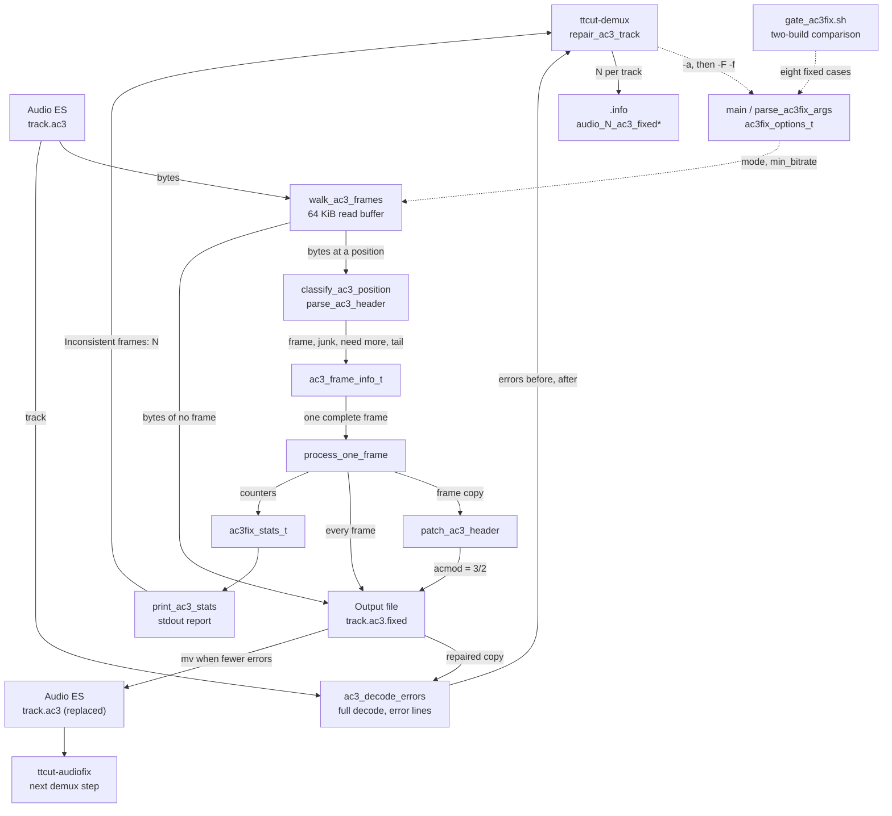

# Code Map: AC3 header repair (ttcut-ac3fix)

**Scope:** `tools/ttcut-ac3fix/ttcut-ac3fix.c`, installed as
`/usr/bin/ttcut-ac3fix`: a standalone C program that walks an AC3 elementary
stream frame by frame, counts frames whose header says stereo (`acmod` 2/0)
at a bitrate of `min_bitrate` (384 kbit/s) or more, and in `--force-fix`
mode rewrites `acmod` of those frames to 3/2. Its only caller is the
"AC3 HEADER REPAIR" step of `tools/ttcut-demux/ttcut-demux`, which reads the
report, decodes the track before and after the repair, and replaces it only
when the repaired copy decodes better.
Nothing in the TTCut-ng application calls the tool or reads its result.

**Neighbours, not part of this map:** the rest of the demux pipeline and the
sanitizer that runs next ([ttcut-demux.md](ttcut-demux.md)); how TTCut-ng
itself reads AC3 headers ([audio-es-input.md](audio-es-input.md)); the cut-time
answer to mixed channel layouts, which re-encodes minority frames instead of
patching headers (`normalizeAcmod`, [audio-cut-timing.md](audio-cut-timing.md)).

## Data flow

Legend: solid = data, dashed = trigger / configuration.

## Edge semantics

| From → To | What crosses (data / order / invariant) |
|---|---|
| `DEMUX` ⇢ `ARGS` | Per `.ac3` track, unless `-A` (`AC3FIX=false`) or `ttcut-ac3fix` is not in `PATH` (warning, step skipped). `repair_ac3_track` first runs `ttcut-ac3fix -a <track>` with stdout and stderr captured together; a second run `ttcut-ac3fix -F -f <track> <track>.fixed` only when the first reported a count above 0 **and** the track does not decode without errors. Other audio types (`.mp2`, `.eac3`, `.aac`) never reach the tool. |
| `GATE` ⇢ `ARGS` | `gate_ac3fix.sh run <tag>` captures stdout, stderr, exit code and written files of eight cases on generated fixtures and the Tux AC3; `compare` diffs two tags. It needs a baseline build, so it is deliberately not in the `run-gates.sh` table. Its `mixed.ac3` recipe is repeated in `run-gates.sh` (`make_mixed_ac3`) for other gates. The self-verdicting gate `ac3fix_contract` (`gate_ac3fix_contract.sh`) is in the table: eleven tool cases and six calls of `repair_ac3_track`, which it takes out of the script by name. |
| `ARGS` ⇢ `WALK` | `ac3fix_options_t`. Rules applied in `main` before any file is touched: `--force-fix` needs an output file (error) and clears analyze mode; no output file → analyze mode (with a note on stdout); when an output will be written, input and output being the same file is an error, and an existing output file is refused without `-f`. First positional = input, second = output, a third is an error. `-b` accepts 32–640. Exit code 0 after `--help`, 1 after a usage error. |
| `ESA` → `WALK` | The whole file through `open_ac3_files` (size via `ftell`, an empty file is an error with exit 1) and a 64 KiB buffer that is refilled and compacted with `memmove`. The walker advances **one byte at a time** over everything that is not a frame and counts those bytes (`skipped_junk`). |
| `WALK` → `PARSE` | The bytes from one position to the end of the buffer, whether the end of the file has been reached, and `in_sync` — whether the previous position was an accepted frame. |
| `PARSE` → `HDR` | A verdict and, for a frame, `fscod`, `frmsizecod`, `acmod`, derived `frame_size` (bytes) and `bitrate` (kbit/s). `parse_ac3_header` accepts **only** a sync word `0x0B77` with `fscod` 0 (48 kHz), `frmsizecod` < 38 and `bsid` ≤ 10 (E-AC3 shares the sync word and uses 11–16). A header directly behind an accepted frame is taken as it is; anywhere else (start of file, behind foreign bytes) it counts only when the next sync word follows the frame or the file ends with it. A header whose frame is cut off by the end of the file is the tail when in sync, a foreign byte otherwise. No CRC check. |
| `HDR` → `FRAME` | Called only for an accepted frame that is completely in the buffer. Time is counted as frames × 1536/48000 s and is advanced **after** the call, so a message inside it carries the start time of the frame together with a 1-based frame number. |
| `FRAME` → `STATS` | Per frame: total; stereo / 3/2 / other by `acmod`; `inconsistent_frames` when `acmod` is 2/0 **and** `bitrate >= min_bitrate`; `fixed_frames` for the same frames in force-fix mode; `format_changes` whenever `acmod` differs from the previous frame (with `-s` each change is printed). |
| `FRAME` → `PATCH` | The frame is first copied into a local buffer, so the read buffer is never modified. Patched only when the frame is inconsistent, force-fix is on and an output file is open. |
| `PATCH` → `OUT` | Bits 7–5 of byte 6 set to 7 (3/2). Nothing else in the frame changes: neither CRC is recomputed, and the bits after `acmod` keep their position although their meaning depends on `acmod` (2/0 is followed by `dsurmod`, 3/2 by `cmixlev` and `surmixlev`). |
| `FRAME` → `OUT` | Whenever an output file is open — with or without `--force-fix` — every accepted frame is written, patched or not. A write error ends the run with exit 1 and no statistics. |
| `WALK` → `OUT` | Every byte that belongs to no frame (`pass_unparsed`), in place: single skipped bytes and whatever is left in the buffer at the end of the file. Together with the row above: **the output has the size of the input and differs from it only in `acmod` bits of patched frames.** |
| `STATS` → `REPORT` | stdout: banner (`print_ac3_banner`), then the statistics block; in analyze mode with a count above 0 a recommendation naming `--force-fix`. stderr: progress in steps of 10 %, and one line about bytes that belong to no frame, wherever in the file they were: "no 48 kHz AC3 frame found" (no frame at all), "Partial frame at file edges" (fewer than one frame in total) or "Warning: N bytes could not be parsed (M of them at end of file)". Exit code 0 whatever was found. |
| `REPORT` → `DEMUX` | A **text contract**: the function takes the number after `Inconsistent frames:` with `grep -oP` (0 when the line is missing) and, from the fix run, the number after `Fixed frames:`. Both exit codes are evaluated: a failing analyze run is a warning and the track stays; a failing fix run, or an empty output, likewise. |
| `ESA` → `DECODE` | `ac3_decode_errors`: a full decode with `-loglevel repeat+error -f ac3`, output = number of error lines. Run on the unrepaired track only when the analyze run counted something. The input format is named because the repaired copy does not end in `.ac3`; `repeat` keeps equal lines from being folded. |
| `OUT` → `DECODE` | The same count on `<track>.fixed`, after a fix run that ended with exit code 0. |
| `DECODE` → `DEMUX` | 0 errors before → "decode OK — skipping fix". Errors after ≥ errors before → "repair does not decode better", the copy is deleted. Only fewer errors after lead to the replacement. The exit status of ffmpeg is not used: it turns non-zero only above an error rate of two thirds. |
| `OUT` → `FIXED` | `mv <track>.fixed <track>` when the copy decodes with fewer errors; in every other case `rm -f`. |
| `DEMUX` → `INFO` | For a replaced track: `audio_N_ac3_fixed=true` and `audio_N_ac3_fixed_frames=<Fixed frames of the fix run>` (`AC3_FIXED_FRAMES`). The application's `.info` parser (`TTESInfo`) does not read either key. |
| `FIXED` → `AUDIOFIX` | The AC3 repair runs before the per-track sanitizer, so `ttcut-audiofix` sees the already replaced track ([ttcut-demux.md](ttcut-demux.md)). |

## Assumptions, contracts & pitfalls

- **Detection rule** (`is_inconsistent_header`) — "stereo header at
  `min_bitrate` or more" is a guess about the broadcaster, not a defect test:
  broadcasters do send stereo at 448 kbit/s (two of four local recordings,
  30 638 and 29 frames, both decode without an error). The count is a
  candidate count; the decision lies with the two decode runs in
  `repair_ac3_track`.
- **What a repair is** — for 5.1 frames whose header says stereo, setting
  `acmod` to 3/2 gives back the original bytes, valid CRC included. For a
  valid stereo frame the same patch leaves stale CRCs and a shifted bit
  layout (`dsurmod` against `cmixlev`/`surmixlev`) and the frame no longer
  decodes. The tool cannot tell the two apart; the caller's decode comparison
  does.
- **48 kHz AC3 only** — a 44.1 or 32 kHz track and an E-AC3 track yield no
  frame and the warning "no 48 kHz AC3 frame found"; the report says
  `Inconsistent frames: 0`, which `ttcut-demux` prints as "headers OK".
- **Frame confirmation is a look at the next sync word, not a CRC** — one
  chance header inside foreign bytes is rejected, two in a row at the right
  distance would pass.
- **Exit code** — 0 also when inconsistent frames were found; 1 for a usage
  error, an unreadable or empty input, a refused or unopenable output and a
  write error.
- **`ttcut-demux` runs under `set -e` without `pipefail`** — which is why
  `repair_ac3_track` takes both exit codes with `|| RC=$?` and uses no
  pipeline on the tool. `ac3_decode_errors` is a pipeline on purpose: its
  status is that of `wc`.
- **Cost of the decode runs** — 2.8–3.5 s for a 70 minute track (measured
  2026-10-02, warm cache), and only for tracks the rule flags.
- **Build** — CMake builds the binary into the source directory
  (`tools/ttcut-ac3fix/`, gitignored) so that `debian/rules` can install it
  from there; unlike the two sibling C tools the target sets no `C_STANDARD`.

## Redundancy / consolidation candidates

- **AC3 frame-size table**
  - sites: `tools/ttcut-ac3fix/ttcut-ac3fix.c:ac3_frame_sizes_48k`, `tools/ttcut-audiofix/ttcut-audiofix.c:ac3_frame_size_tab`, `avstream/ttac3audioheader.h:AC3FrameLength`
  - shared purpose: frame length in words by `frmsizecod` (the 48 kHz column in all three)
  - status: kept separate → three build units without a shared library (two standalone C programs, the C++ application); the sibling table carries a comment that the columns were compared
- **AC3 frame walk over an elementary stream**
  - sites: `tools/ttcut-ac3fix/ttcut-ac3fix.c:walk_ac3_frames`, `tools/ttcut-audiofix/ttcut-audiofix.c:walk` with `ac3_parse_frame`
  - shared purpose: find sync, read the header, step by frame size, account for bytes that belong to no frame
  - status: kept separate → two standalone C programs without a shared library, and different jobs: the sibling walk removes bytes and verifies CRC over all three sample rates, this one keeps every byte and looks at 48 kHz headers only (audit run 19)
- **Channel count and name by `acmod`**
  - sites: `tools/ttcut-ac3fix/ttcut-ac3fix.c:ac3_acmod_names`, `avstream/ttac3audioheader.h:AC3AudioCodingMode`, `avstream/ttac3audioheader.h:AC3Mode`, `tools/diag/ac3_acmod_scan.py:MAIN_CHANNELS`
  - shared purpose: main channels and a display name per `acmod`
  - status: kept separate → different languages and build units; eight fixed values from the AC3 specification
