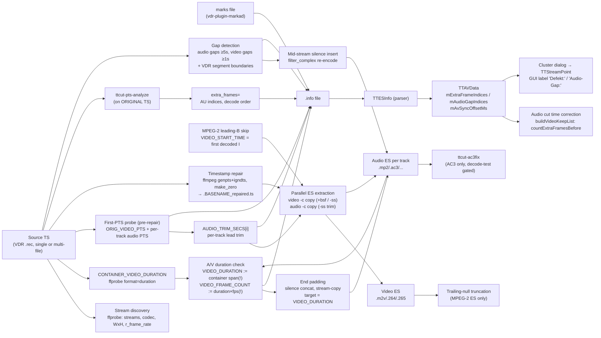

# ttcut-demux — TS→ES demux pipeline and its measurement/reporting chain

Bash script (`tools/ttcut-demux/ttcut-demux`, installed copy at
`/usr/bin/ttcut-demux` — the user copies it there after patches). ES mode
(`-e`) is the TTCut workflow; MKV mode (default) is a separate tail covered
only briefly here. Everything below is ES mode unless stated.

Mapped 2026-07-12 while root-causing the reporting defects found in the
Futurama audit (wrong "video duration", derived frame count, "defective
regions" mislabel) — the measurement edges carry the exact semantics needed
for that fix.

Legend: solid = data flow, dashed = trigger/control.

## Edge semantics

| From → To | Data / order / invariant carried |
|---|---|
| TS → CONTAINER_VIDEO_DURATION | `ffprobe format=duration` of the source = **container span** (latest stream end − earliest stream start). With audio leading video (typical VDR), this **exceeds the video display duration by the audio lead**. VDR multi-file: sum of per-segment format durations (same inflation). |
| CONTAINER_VIDEO_DURATION → duration check | Taken verbatim as `VIDEO_DURATION` whenever non-empty (the normal path). ES-probe / size-estimate fallbacks are dead code in practice. **This is the root of the reporting defect**: not a video duration. |
| duration check → `VIDEO_FRAME_COUNT` | `duration × fps`, rounded — **derived, never counted**. Off by (audio lead × fps) ≈ +9 frames on the Futurama audit (85507 claimed vs 85498 real). |
| duration check → end padding | `TARGET_AUDIO_DUR = VIDEO_DURATION` when `AV_DRIFT_MS > 20`. Audio is physically padded to the inflated target → **over-padding by ≈ audio-lead-vs-first-display** (357 ms measured). Post-pad "Drift" is computed against the same inflated reference → circular ≈ 0. |
| PTS0 → per-track trim | Per audio track: `video_pts − track_pts`, trimmed via decoder-side `-ss` **after** `-i` (input-side seek silently no-ops for TS audio copy). Only positive leads > 10 ms trim; negative logs "may need padding" and trims 0. |
| PTS0 (video) semantics | H.264/H.265: min packet PTS of first 2 s = **first display frame** (leading Bs). MPEG-2: **first packet PTS = the I-frame**, NOT the display start — bitstream-leading open-GOP Bs display up to (M−1)/fps earlier. Audio is therefore aligned to the I's display time, while TTCut's index 0 is the leading B (the "ffmpeg-n = display − 3" ruler, see `mpeg2-cut.md`). |
| MPEG-2 leading-B skip → extraction | Fires only when the **first decoded** frame is not I (ffprobe frame list = decoder output; broken leading Bs the decoder drops are invisible to this check). When it fires: video `-ss FIRST_I_PTS` + all audio trims += `VIDEO_START_TIME`. Futurama: did not fire (first decoded = I), bitstream-leading Bs stay in the ES. |
| TS → ttcut-pts-analyze | Runs on the **original** TS (pre-repair), own mmap TS parser, video PID only. Exit 0 = clean, 1 = extras found, 2 = error. |
| ttcut-pts-analyze → `extra_frames=` | **AU indices in decode/bitstream order** (index into its AU array). Three methods, first hit wins: (1) DTS non-monotonic (≤1 s backward; >1 s = epoch reset, ignored), (2) exact PTS duplicate in 16-AU window, (3) **PTS grid**: runs of half-nominal spacing → off-grid AUs marked. Field-picture material (each field its own PES PTS at half spacing) triggers method 3 **by design of the signature — it cannot distinguish TS corruption from legitimate field encoding**. Futurama: 222 = exactly the second fields of the 222 field pairs. |
| script → warn "defective regions" | Fixed wording for any non-empty extra list — **mislabels valid field pairs as defects**. The count/list itself is correct. |
| gap detection → silence insert | Audio gaps ≥ 5 s (packet PTS jumps in source TS); video gaps ≥ 1 s intersect-matched to classify combined A+V loss (insert only the audio-minus-video remainder). VDR multi-file adds per-boundary duration mismatches (>5 ms) as synthetic rows, same consumer format. |
| .info `[timing]` → TTESInfo | Parsed: `first_video_pts`, `first_audio_pts`, `av_offset_ms` (→ `mAvSyncOffsetMs`, applied in the cut path). **NOT parsed: `video_duration_ms`, `audio_duration_ms`, `duration_drift_ms`, `drift_rate_ms_per_min`** — human-only diagnostics; fixing them changes no app behavior. |
| .info `[audio]` → TTESInfo | Per track: `file/codec/lang/first_pts/trimmed_ms` → per-track delay handling (`TTAudioItem`). |
| .info `es_extra_frames` → TTAVData | → `mExtraFrameIndices`. **Precedence over the MPEG-2 parser extras**: `loadMpeg2FieldExtras` only fills the list when the .info left it empty. Consumed by (a) audio cut time correction (`countExtraFramesBefore`) and (b) the clustering dialog → `TTStreamPoint` markers labeled **"Defekt:"** in the GUI — the mislabel propagates to the user. |
| .info `audio_gap_frames` → TTAVData | → `mAudioGapIndices`, marker visualization only ("Audio-Gap:"), NOT used for audio time correction. Emitted as frame indices relative to `first_video_pts` (`(gap_pts − first_video_pts) × fps`). |
| .info `[markers]` → TTESInfo | Verbatim copy of the VDR marks file (timestamp, frame, start/stop, `*` verified). Faithful (audited 2026-07-12). |

## Assumptions, contracts & pitfalls

- **`VIDEO_DURATION` is a container span, not a video duration.** ffprobe
  `format=duration` = latest end − earliest start across ALL streams; DVB
  audio typically starts ~0.5 s before video. Everything derived from it
  (frame count, drift, padding target, `.info` duration fields) inherits the
  inflation. Correct references: video-stream PTS span (last video PTS + one
  frame − first video **display** PTS) or a real frame count.
- **Two different "first video PTS" per codec family** (see edge table). For
  MPEG-2 the audio alignment target is the I-frame's display time; TTCut's
  display index 0 is the earlier leading B. Any oracle comparing ffmpeg
  output indices with TTCut indices must correct for the dropped leading Bs
  (`mpeg2-cut.md` pitfall, "ffmpeg-n = TTCut-display − 3" on Futurama).
- **pts-analyze indices are decode-order AU positions**, consumed by TTAVData
  as index-list positions (display order). The two spaces differ locally by
  the B-reorder distance (≤ M−1); for the counting-before audio correction
  this is immaterial except for cuts within a pair cluster. Spot-checked at
  the Futurama field cluster: listed values coincide with the display
  positions of the pair second-fields.
- **Method-3 grid detection cannot distinguish corruption from field
  encoding.** Runs of half-duration PTS spacing are the signature of BOTH.
  Any wording/consumer that says "defective" must qualify it; the list itself
  remains correct and is what the audio correction needs.
- **Padding granularity**: end padding appends whole encoded silence frames
  via concat stream-copy (bit-preserving for AC3 acmod changes); mid-stream
  silence insertion re-encodes the whole track (filter_complex). The two
  mechanisms are intentionally different — do not "unify" them.
- **`-ss` placement contract**: audio trim must be decoder-side (`-ss` after
  `-i`); input-side seek silently produces an untrimmed copy for TS audio.
- **Repair step**: `+genpts+igndts -avoid_negative_ts make_zero` normalizes
  to ~0 and passes through PES-corruption warnings (e.g. VDR stop mid-PES at
  recording end — benign, faithfully reported).
- **exit-code contract with the wrapper script**: pts-analyze exit 1 is
  "extras found" (not an error); the demux script must `set +e` around it.

## Redundancy / consolidation candidates

1. **Subtitle extraction block duplicated** between ES mode and MKV mode
   (~40 nearly identical lines: mid-point sampling, dvb_subtitle/srt cases).
2. **Audio output naming with `LANG_COUNT`** duplicated (ES-mode loop, MKV
   extra-tracks loop).
3. **First-video-PTS probe duplicated**: `ORIG_VIDEO_PTS` (pre-repair block)
   and `FIRST_VIDEO_PTS` (sync-offset section) run the identical
   codec-dependent ffprobe on the original input twice.
4. **Audio property probing duplicated**: `repair_audio_with_silence_inserts`
   and the end-padding block each probe codec/bitrate/channels/sample-rate
   with their own defaults table (silence-encoder selection duplicated too).
5. ffmpeg log-grep pattern `error|warning|invalid|corrupt|...` repeated at
   every ffmpeg call site (minor).

## Known defects (TODO.md, Medium — basis for the pending fix)

- `VIDEO_DURATION`/`VIDEO_FRAME_COUNT`/drift/padding chain: see edge table
  rows 1–4. Fix direction: measure the video duration from the video stream
  (PTS span from first **display** PTS, or count frames), keep padding
  target consistent; the `.info` duration fields are human-only.
- "defective regions" wording for grid-method hits: label must allow the
  field-picture cause (e.g. "N doubled-PTS pictures (field pairs or TS
  corruption)"); GUI "Defekt:" label inherits the same problem via
  `TTStreamPoint` descriptions.
