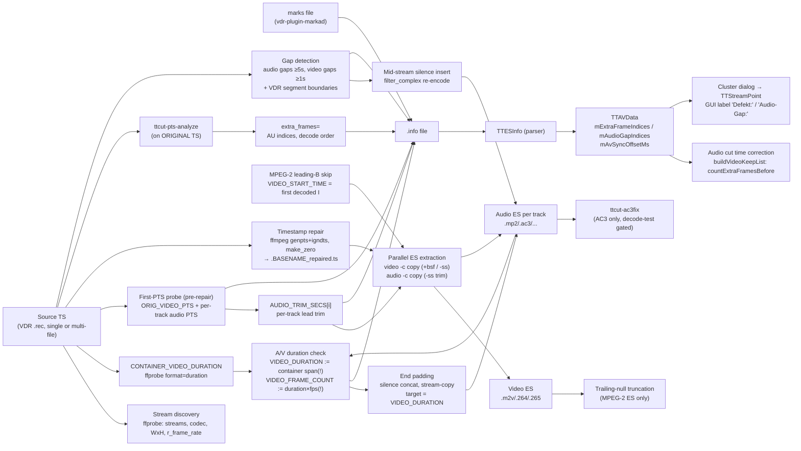

# ttcut-demux — TS→ES demux pipeline and its measurement/reporting chain

Bash script (`tools/ttcut-demux/ttcut-demux`, installed copy at
`/usr/bin/ttcut-demux` — the user copies it there after patches). The ES
demux is the only mode since the normalized-MKV mode (a leftover of the
v0.52 initial import, requiring mkvmerge) was removed in `ce06817`; `-e` is
accepted as a no-op for compatibility.

Mapped 2026-07-12 while root-causing the reporting defects found in the
Futurama audit (wrong "video duration", derived frame count, "defective
regions" mislabel) — the measurement edges carry the exact semantics needed
for that fix.

Legend: solid = data flow, dashed = trigger/control.

## Edge semantics

| From → To | Data / order / invariant carried |
|---|---|
| TS → CONTAINER_VIDEO_DURATION | `ffprobe format=duration` of the source = **container span** (latest stream end − earliest stream start). With audio leading video (typical VDR), this exceeds the video display duration by the audio lead. Since `d7a046b` used only as a **seek hint** for the end-window probe, no longer as the duration. |
| VIDEO_DURATION = video PTS span (FIXED `d7a046b`) | Measured on the repaired TS: `last_video_pts + frame_dur − first_video_pts`, where `first_video_pts` = the video stream's **start_time** (first *decodable* frame — excludes open-GOP leading Bs, which every decoder drops and which the old min-packet-PTS wrongly included). Falls back to the container span (with a warning) only if the repair failed or the probe is empty. Futurama: 3419800 ms = 85495 frames, exact vs ffprobe count_frames (was container 3420269). |
| VIDEO_DURATION → `VIDEO_FRAME_COUNT` | `duration × fps`, rounded — derived, logged with a `~` prefix. Now exact (85495) because the duration is the true video span. |
| VIDEO_DURATION → end padding | `TARGET_AUDIO_DUR = VIDEO_DURATION` when `AV_DRIFT_MS > 20`. Pads to the true video duration → over-pad reduced from ~469 ms (old container basis) to ~one audio-frame granularity (Futurama: +960 ms for a 939 ms real gap). Post-pad drift now computed against the real reference. |
| PTS0 → per-track trim | Per audio track: `video_pts − track_pts`, trimmed via decoder-side `-ss` **after** `-i` (input-side seek silently no-ops for TS audio copy). Only positive leads > 10 ms trim; negative logs "may need padding" and trims 0. |
| PTS0 (video) semantics | H.264/H.265: min packet PTS of first 2 s = **first display frame** (leading Bs). MPEG-2: **first packet PTS = the I-frame**, NOT the display start — bitstream-leading open-GOP Bs display up to (M−1)/fps earlier. Audio is therefore aligned to the I's display time, while TTCut's index 0 is the leading B (the "ffmpeg-n = display − 3" ruler, see `mpeg2-cut.md`). |
| MPEG-2 leading-B skip → extraction | Fires only when the **first decoded** frame is not I (ffprobe frame list = decoder output; broken leading Bs the decoder drops are invisible to this check). When it fires: video `-ss FIRST_I_PTS` + all audio trims += `VIDEO_START_TIME`. Futurama: did not fire (first decoded = I), bitstream-leading Bs stay in the ES. |
| TS → ttcut-pts-analyze | Runs on the **original** TS (pre-repair), own mmap TS parser, video PID only. Exit 0 = clean, 1 = extras found, 2 = error. |
| ttcut-pts-analyze → `extra_frames=` | **AU indices in decode/bitstream order** (index into its AU array). Three methods, first hit wins: (1) DTS non-monotonic (≤1 s backward; >1 s = epoch reset, ignored), (2) exact PTS duplicate in 16-AU window, (3) **PTS grid**: runs of half-nominal spacing → off-grid AUs marked. Field-picture material (each field its own PES PTS at half spacing) triggers method 3 **by design of the signature — it cannot distinguish TS corruption from legitimate field encoding**. Futurama: 222 = exactly the second fields of the 222 field pairs. |
| script → warn (neutral since `f85b237`) | "N pictures with doubled PTS detected (field-picture pairs or TS corruption)" — no longer a "defective regions" verdict. The count/list itself is unchanged. |
| gap detection → silence insert | Audio gaps ≥ 5 s (packet PTS jumps in source TS); video gaps ≥ 1 s intersect-matched to classify combined A+V loss (insert only the audio-minus-video remainder). VDR multi-file adds per-boundary duration mismatches (>5 ms) as synthetic rows, same consumer format. |
| .info `[timing]` → TTESInfo | Parsed: `first_video_pts`, `first_audio_pts`, `av_offset_ms` (→ `mAvSyncOffsetMs`, applied in the cut path). **NOT parsed: `video_duration_ms`, `audio_duration_ms`, `duration_drift_ms`, `drift_rate_ms_per_min`** — human-only diagnostics; fixing them changes no app behavior. |
| .info `[audio]` → TTESInfo | Per track: `file/codec/lang/first_pts/trimmed_ms` → per-track delay handling (`TTAudioItem`). |
| .info `es_extra_frames` → TTAVData (reworked `fc2a573`) | The audio-correction source is chosen by `loadExtraFrameIndices`: for **MPEG-2 the parser's field-pair list wins** (`extraIndices()`, display-index space, `picture_structure`-derived), .info only as fallback; H.264/H.265 keep .info. **Timing:** both the source choice and the cluster dialog run in `onOpenVideoFinished` (not `openAVStreams`), because the parser list is only built once the async open task finishes — running earlier saw an empty parser list. A per-item flag `mpPendingExtraFrameDialog` (set only on fresh open) gates the dialog so project reload stays silent. `showExtraFrameClusterDialog` classifies each .info cluster: confirmed by a parser field-pair within ±4 → **"Feldpaare:"** (hint); otherwise **"Defekt:"** (suspicion). All-confirmed + no audio gaps → markers imported silently, no dialog. |
| .info `audio_gap_frames` → TTAVData | → `mAudioGapIndices`, marker visualization only ("Audio-Gap:"), NOT used for audio time correction. Emitted as frame indices relative to `first_video_pts` (`(gap_pts − first_video_pts) × fps`). |
| .info `[markers]` → TTESInfo | Verbatim copy of the VDR marks file (timestamp, frame, start/stop, `*` verified). Faithful (audited 2026-07-12). |

## Assumptions, contracts & pitfalls

- **`VIDEO_DURATION` is a container span, not a video duration.** ffprobe
  `format=duration` = latest end − earliest start across ALL streams; DVB
  audio typically starts ~0.5 s before video. Everything derived from it
  (frame count, drift, padding target, `.info` duration fields) inherits the
  inflation. Correct references: video-stream PTS span (last video PTS + one
  frame − first video **display** PTS) or a real frame count.
- **Two different "first video PTS" per codec family** (see edge table). For
  MPEG-2 the audio alignment target is the I-frame's display time; TTCut's
  display index 0 is the earlier leading B. Any oracle comparing ffmpeg
  output indices with TTCut indices must correct for the dropped leading Bs
  (`mpeg2-cut.md` pitfall, "ffmpeg-n = TTCut-display − 3" on Futurama).
- **pts-analyze indices are decode-order AU positions**, consumed by TTAVData
  as index-list positions (display order). The two spaces differ locally by
  the B-reorder distance (≤ M−1); for the counting-before audio correction
  this is immaterial except for cuts within a pair cluster. Spot-checked at
  the Futurama field cluster: listed values coincide with the display
  positions of the pair second-fields.
- **Method-3 grid detection cannot distinguish corruption from field
  encoding.** Runs of half-duration PTS spacing are the signature of BOTH.
  Any wording/consumer that says "defective" must qualify it; the list itself
  remains correct and is what the audio correction needs.
- **Padding granularity**: end padding appends whole encoded silence frames
  via concat stream-copy (bit-preserving for AC3 acmod changes); mid-stream
  silence insertion re-encodes the whole track (filter_complex). The two
  mechanisms are intentionally different — do not "unify" them.
- **`-ss` placement contract**: audio trim must be decoder-side (`-ss` after
  `-i`); input-side seek silently produces an untrimmed copy for TS audio.
- **Repair step**: `+genpts+igndts -avoid_negative_ts make_zero` normalizes
  to ~0 and passes through PES-corruption warnings (e.g. VDR stop mid-PES at
  recording end — benign, faithfully reported).
- **exit-code contract with the wrapper script**: pts-analyze exit 1 is
  "extras found" (not an error); the demux script must `set +e` around it.

## Redundancy / consolidation candidates — ALL RESOLVED 2026-07-12

1. **[RESOLVED `ce06817`]** Subtitle extraction block was duplicated between
   ES mode and MKV mode — gone with the MKV-mode removal (one copy left).
2. **[RESOLVED `ce06817`]** `LANG_COUNT` audio naming was duplicated — gone
   with the MKV-mode removal.
3. **[RESOLVED `ce6377c`]** First-video-PTS probe → `probe_first_video_pts`,
   measured once pre-repair; the sync-offset section reuses the value.
4. **[RESOLVED `2edd772`]** Audio property probing → `probe_audio_props`
   (APROBE_* globals, validation + codec bitrate defaults); each call site
   keeps its own fallback application, the two padding mechanisms stay
   separate (see pitfall above).
5. **[RESOLVED `2e0cd62`]** ffmpeg log-grep pattern → readonly
   `FFMPEG_WARN_PATTERN` + `warn_ffmpeg_log` (superset pattern; may surface
   a few more log lines than before — log-only change).

Verified after all five: Futurama ES outputs byte-identical to the
pre-refactor baseline (video, both audio tracks, logo, .info modulo
timestamp/basename); a no-`-e` invocation produces the identical ES set.

## Reporting defects — FIXED 2026-07-12

- **Duration/frame-count/drift/padding chain** (`f85b237` + `d7a046b`):
  `VIDEO_DURATION` is now the video PTS span (start_time to last PTS + one
  frame), not the container span. Frame count, padding target and drift are
  derived correctly; verified on Futurama (3419800 ms = 85495 frames, exact).
- **Warning wording** (`f85b237`): grid-method hits are labelled "N pictures
  with doubled PTS (field-picture pairs or TS corruption)".
- **GUI "Defekt:" mislabel** (`fc2a573`): the cluster dialog now confirms
  field pairs against the MPEG-2 parser and labels them "Feldpaare:"; the
  classification runs in `onOpenVideoFinished` where the parser list exists.
  All-confirmed field-pair sets import silently (no dialog).

Still open (separate): field-picture material double-counts index positions
(fields vs frames) in the video cut path — see `mpeg2-cut.md` Defekt 2.
