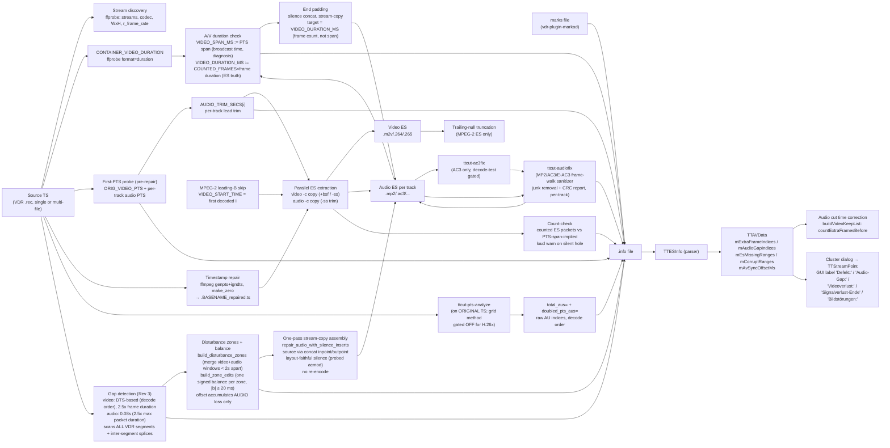

# ttcut-demux — TS→ES demux pipeline and its measurement/reporting chain

Bash script (`tools/ttcut-demux/ttcut-demux`, installed copy at
`/usr/bin/ttcut-demux` — the user copies it there after patches).`-e` is
accepted as a no-op for compatibility.

Mapped 2026-07-12 while root-causing the reporting defects found in the
Futurama audit (wrong "video duration", derived frame count, "defective
regions" mislabel) — the measurement edges carry the exact semantics needed
for that fix.

Legend: solid = data flow, dashed = trigger/control.

```mermaid
flowchart LR
    TS["Source TS<br/>(VDR .rec, single or multi-file)"]
    MARKS["marks file<br/>(vdr-plugin-markad)"]
    PROBE["Stream discovery<br/>ffprobe: streams, codec, WxH, r_frame_rate"]
    CONTDUR["CONTAINER_VIDEO_DURATION<br/>ffprobe format=duration"]
    PTS0["First-PTS probe (pre-repair)<br/>ORIG_VIDEO_PTS + per-track audio PTS"]
    TRIM["AUDIO_TRIM_SECS[i]<br/>per-track lead trim"]
    REPAIR["Timestamp repair<br/>ffmpeg genpts+igndts, make_zero<br/>→ .BASENAME_repaired.ts"]
    EXTRACT["Parallel ES extraction<br/>video -c copy (+bsf / -ss)<br/>audio -c copy (-ss trim)"]
    MPEG2TRIM["MPEG-2 leading-B skip<br/>VIDEO_START_TIME = first decoded I"]
    NULLTRUNC["Trailing-null truncation<br/>(MPEG-2 ES only)"]
    ESV["Video ES<br/>.m2v/.264/.265"]
    ESA["Audio ES per track<br/>.mp2/.ac3/..."]
    PTSA["ttcut-pts-analyze<br/>(on ORIGINAL TS; grid method<br/>gated OFF for H.26x)"]
    EXTRA["total_aus= + doubled_pts_aus=<br/>raw AU indices, decode order"]
    AC3FIX["ttcut-ac3fix<br/>(AC3 only, decode-test gated)"]
    AUDIOFIX["ttcut-audiofix<br/>(MP2/AC3/E-AC3 frame-walk sanitizer<br/>junk removal + CRC report, per-track)"]
    GAPS["Gap detection (Rev 3)<br/>video: DTS-based (decode order), 2.5x frame duration<br/>audio: 0.08s (2.5x max packet duration)<br/>scans ALL VDR segments + inter-segment splices"]
    CLASSIFY["Disturbance zones + balance<br/>build_disturbance_zones (merge video+audio windows &lt; 2s apart)<br/>build_zone_edits (one signed balance per zone, |b| &ge; 20 ms)<br/>offset accumulates AUDIO loss only"]
    ASSEMBLY["One-pass stream-copy assembly<br/>repair_audio_with_silence_inserts<br/>source via concat inpoint/outpoint<br/>layout-faithful silence (probed acmod)<br/>no re-encode"]
    COUNTCHECK["Count-check<br/>counted ES packets vs PTS-span-implied<br/>loud warn on silent hole"]
    DURCHK["A/V duration check<br/>VIDEO_SPAN_MS := PTS span (broadcast time, diagnosis)<br/>VIDEO_DURATION_MS := COUNTED_FRAMES×frame duration (ES truth)"]
    PAD["End padding<br/>silence concat, stream-copy<br/>target = VIDEO_DURATION_MS (frame count, not span)"]
    INFO[".info file"]
    ESINFO["TTESInfo (parser)"]
    AVDATA["TTAVData<br/>mExtraFrameIndices / mAudioGapIndices<br/>mEsMissingRanges / mCorruptRanges<br/>mAvSyncOffsetMs"]
    AUDIOCORR["Audio cut time correction<br/>buildVideoKeepList: countExtraFramesBefore"]
    STREAMPTS["Cluster dialog → TTStreamPoint<br/>GUI label 'Defekt:' / 'Audio-Gap:' /<br/>'Videoverlust:' / 'Signalverlust-Ende' / 'Bildstörungen:'"]

    TS --> PROBE
    TS --> CONTDUR
    TS --> PTS0
    PTS0 --> TRIM
    TS --> REPAIR
    REPAIR --> EXTRACT
    MPEG2TRIM --> EXTRACT
    TRIM --> EXTRACT
    EXTRACT --> ESV
    EXTRACT --> ESA
    ESV --> NULLTRUNC
    EXTRACT --> COUNTCHECK
    TS --> PTSA
    PTSA --> EXTRA
    ESA --> AC3FIX
    ESA --> AUDIOFIX
    AC3FIX -.-> AUDIOFIX
    AUDIOFIX --> ESA
    AUDIOFIX --> INFO
    TS --> GAPS
    GAPS --> CLASSIFY
    CLASSIFY --> ASSEMBLY
    ASSEMBLY --> ESA
    CONTDUR --> DURCHK
    ESA --> DURCHK
    DURCHK --> PAD
    PAD --> ESA
    EXTRA --> INFO
    GAPS --> INFO
    CLASSIFY --> INFO
    COUNTCHECK --> INFO
    TRIM --> INFO
    PTS0 --> INFO
    DURCHK --> INFO
    MARKS --> INFO
    INFO --> ESINFO
    ESINFO --> AVDATA
    AVDATA --> AUDIOCORR
    AVDATA --> STREAMPTS
```

## Edge semantics

| From → To | Data / order / invariant carried |
|---|---|
| TS → CONTAINER_VIDEO_DURATION | `ffprobe format=duration` of the source = **container span** (latest stream end − earliest stream start). With audio leading video (typical VDR), this exceeds the video display duration by the audio lead. Since `d7a046b` used only as a **seek hint** for the end-window probe, no longer as the duration. |
| VIDEO_DURATION = video PTS span (FIXED `d7a046b`) | Measured on the repaired TS: `last_video_pts + frame_dur − first_video_pts`, where `first_video_pts` = the video stream's **start_time** (first *decodable* frame — excludes open-GOP leading Bs, which every decoder drops and which the old min-packet-PTS wrongly included). Falls back to the container span (with a warning) only if the repair failed or the probe is empty. Futurama: 3419800 ms = 85495 frames, exact vs ffprobe count_frames (was container 3420269). |
| REPAIR → progress band | The remux is the run's first long call and used to report nothing while it ran: `progress_set 0` stood above it and `progress_set 10` only after it returned, so a supervising wrapper showed 0 % for the whole phase. It now runs in the background against `-progress` and maps `out_time_us` onto its band, the same way the gap repair does. `-nostats` stays OFF so the `frame=` line the log parser reads survives. The fixed marks after it are spaced by **measured** duration, not by step count: before, the PTS analysis took 13 s but moved the bar 7 points while the ES extraction took 8 s and moved it 15, and the three tail marks all landed in the last seconds — the bar jumped 40 → 76 and the upper half was never walked (measured on a gapless 10.4 GB run, 63 s, idle machine). |
| VIDEO_DURATION → `VIDEO_FRAME_COUNT` | `duration × fps`, rounded — derived, logged with a `~` prefix. Now exact (85495) because the duration is the true video span. |
| VIDEO_DURATION → end padding | `TARGET_AUDIO_DUR = VIDEO_DURATION` when `AV_DRIFT_MS > 20`. The audio side of that drift comes from `audio_es_duration`, not `format=duration` — on a bitrate-switching track the latter can report a third too much, `AV_DRIFT_MS` goes negative and the pad is skipped on a track that actually needed it. Pads to the true video duration → over-pad reduced from ~469 ms (old container basis) to ~one audio-frame granularity (Futurama: +960 ms for a 939 ms real gap). Post-pad drift now computed against the real reference. |
| PTS0 → per-track trim | Per audio track: `video_pts − track_pts`, trimmed via decoder-side `-ss` **after** `-i` (input-side seek silently no-ops for TS audio copy). Only positive leads > 10 ms trim; negative logs "may need padding" and trims 0. |
| PTS0 (video) semantics | H.264/H.265: min packet PTS of first 2 s = **first display frame** (leading Bs). MPEG-2: **first packet PTS = the I-frame**, NOT the display start — bitstream-leading open-GOP Bs display up to (M−1)/fps earlier. Audio is therefore aligned to the I's display time, while TTCut's index 0 is the leading B (the "ffmpeg-n = display − 3" ruler, see `mpeg2-cut.md`). |
| MPEG-2 leading-B skip → extraction | Fires only when the **first decoded** frame is not I (ffprobe frame list = decoder output; broken leading Bs the decoder drops are invisible to this check). When it fires: video `-ss FIRST_I_PTS` + all audio trims += `VIDEO_START_TIME`. Futurama: did not fire (first decoded = I), bitstream-leading Bs stay in the ES. |
| TS → ttcut-pts-analyze | Runs on the **original** TS (pre-repair), own mmap TS parser, video PID only. Exit 0 = clean, 1 = candidates found, 2 = error. **Measured 2026-07-19: analyzing the repaired TS instead is WRONG** — the repair remux erases the MPEG-2 doubled-PTS signature (00x03: 150→0) and genpts re-stamping fabricates candidates on PAFF fields (08x04: 0→247). Original stays the analysis source; TTCut guards the numbering (see below). Capture in the demux is stdout-only; stderr goes to a temp log (the old `2>&1` raced the unbuffered stderr summary into the block-buffered CSV and truncated it — 731 of 1296 entries + garbage suffix). |
| ttcut-pts-analyze → `total_aus=` / `doubled_pts_aus=` | **Raw AU indices in decode/bitstream order** (one AU per PES packet, PAFF fields separate; `total_aus` always printed, candidates only on exit 1). Detection: (1) DTS non-monotonic (≤1 s backward; >1 s = epoch reset, ignored), (2) exact PTS duplicate in 16-AU window, (3) **PTS grid** (runs of half-nominal spacing → off-grid AUs) — **method 3 is SKIPPED for H.264/H.265** (PMT stream_type gate): field-rate PTS is legitimate there and the grid signature cannot distinguish it from corruption (08x04 mixed MBAFF+PAFF: 1296 grid hits, zero real defects; full-PAFF streams dodge only because the field cadence dominates the gap statistics). MPEG-2 keeps all three methods. |
| script → warn (neutral since `f85b237`) | "N pictures with doubled PTS detected (field-picture pairs or TS corruption)" — no longer a "defective regions" verdict. The count/list itself is unchanged. |
| ESA → AUDIOFIX (`ttcut-audiofix`, per-track sanitize) | Runs per audio track (`.mp2`/`.ac3`/`.eac3` only) **after** the AC3 header repair (`AC3FIX`) and the interlace field/frame-rate correction, and **before** the Rev-3 gap detection/repair below — placed there specifically so the ms→video-frame conversion (next row) uses the already-corrected FPS (an interlaced ES reports the doubled field rate until that correction runs). Two-step: analyze mode (`-a`) first; only on exit 1 ("defects found") does the script re-run in fix mode (`-f`, writes to a `.sanitized` temp file with an internal self-check) and `mv` the result over the original. Exit-code contract (`ttcut-audiofix.c`): 0 = clean (no action), 1 = defects found/fixed, 2 = error. The tool's own internal self-check (re-walk of its freshly written output, inside the `-f` run) is **structural, not defect-free**: it fails only on remaining junk, a re-walk error, or a changed count of CRC-bad frames — CRC-bad frames are intentionally copied through and passing them unchanged is a self-check *pass*. **Fail-safe on every branch**: analyze `rc≥2`, or fix `rc>1` (covers that internal self-check failing, which `unlink`s the temp and returns 2), or the script's own `[ -s "$TEMP_FIXED" ]` guard (catches a missing/empty temp file) → the original audio file is left completely untouched (warn only, `rm -f` the temp); `ttcut-audiofix` missing from `PATH` → warn + continue with the unsanitized audio, does not abort the demux. |
| AUDIOFIX → `.info` (report→`.info` conversion, `audiofix_ranges_to_video_frames()`) | Analyze-mode stdout is `key=value` lines: `junk_regions=IDX@MS:BYTES,...` (junk byte spans removed between valid frames), `edge_junk_bytes=N`, `crc_bad_frames=IDX@MS[-IDX@MS],...` (frames left in place, only reported), `dropped_frames=N`. **`edge_junk_bytes` is the partial frame a recording starts and ends on** — a DVB recording is cut mid-frame at both ends, and that remainder is not a valid frame. `ttcut-audiofix` classifies a junk region as an edge when it sits before the first or after the last valid frame (`frame_idx == 0` or `== total_frames`) **and** is smaller than one frame (`ref_frame_size`, measured from the first valid frame — exact for the CBR audio DVB delivers). Such regions are counted here instead of in `junk_regions`; they are still removed, and the exit code still reports 1, so the fix run happens either way. More than one frame's worth at an edge is damage, not a cut, and stays in `junk_regions`. The converter extracts **every** ms position from BOTH lists (junk and CRC-bad together), converts each to a video frame (`int(ms/1000×fps + 0.5)`, using the FPS already corrected for interlaced field/frame rate — see row above), sorts, and clusters with the identical `≤2×fps` ("≤2s") rule used by `corrupt_frame_ranges`. Emitted per track: `audio_${i}_corrupt_ranges` (clustered `S-E,S-E,...` video-frame ranges — junk and CRC positions are not distinguished from each other in this field) **only when something real was found**, and `audio_${i}_junk_bytes` (junk plus edge bytes — everything the sanitizer removed) with `audio_${i}_dropped_frames` whenever anything was removed at all. The two counters therefore appear on their own on an ordinary recording, whose only finding is the trimmed edge frame; `corrupt_ranges` stays absent there, which is what keeps the "Tonstörungen" marker (next row) off every recording. The log line follows the same split: `warn "junk removed …"` with real damage, `info "structure OK (trimmed N bytes …)"` without. Since `133d9b8d` all three range kinds (`audio_N_corrupt_ranges` in the audiofix warn line, `es_missing_ranges` and `corrupt_frame_ranges` at info-file creation) are also rendered into the log as `S-E (~H:MM:SS)` lists via `format_ranges_hms()` instead of pointing the reader at the `.info` file. |
| `.info` `audio_N_corrupt_ranges` → TTESInfo → TTAVData → STREAMPTS | Parsed by `TTESInfo::parseSection` (`avstream/ttesinfo.cpp`) into `TTAudioTrackInfo::corruptRanges` (`TTESRange`, `ms` always `-1` — no duration is reported), hardened exactly like the global `corrupt_frame_ranges` block (item cap `maxExtraFrames`, `toInt` ok-checks, inverted `end<start` range rejected). `audio_N_junk_bytes`/`audio_N_dropped_frames` are deliberately **not** parsed (human diagnostics only, no app behavior depends on them). Consumed by `TTAVData::showExtraFrameClusterDialog` cluster pass 3b (`data/ttavdata.cpp`): each range emits one marker `"Tonstörungen: X–Y (Spur N)"` (1-based track number) — ranges arrive pre-clustered from the demuxer, so no re-clustering happens here. The dialog's early-return guard was extended with `hasAudioCorruptRanges` (true if any track has a non-empty `corruptRanges`) so a recording with **only** an audio-side defect — no video-side extra-frame candidates, no audio gaps, no missing/corrupt video ranges — still opens the cluster dialog instead of returning silently. |
| TS → gap detection (Rev 3, replaces the old ≥5s/≥1s thresholds) | Frame-scale thresholds, not fixed seconds: video `2.5 × nominal frame duration` (`detect_video_gaps`, DTS-based — **decode order**, not PTS, because PTS is non-monotonic under B-frame reorder and produced ~977 false positives at a 0.05 s threshold on clean material during Task 2; reported gap boundaries stay in the PTS domain so overlap math against audio stays comparable); audio `0.08 s` (2.5 × the larger of MP2@48k 24 ms / AC3 32 ms). Both scan **every** VDR segment (`detect_video_gaps_multifile` / `detect_audio_gaps_multifile`), not just the first — a real 5-segment signal-loss recording had ~25 s of within-segment holes invisible to a single-segment scan — and additionally emit the inter-segment **splice gap** (concat demuxer re-bases segment i+1 to start exactly where i ended, silently discarding real broadcast time between them; reported the same way as a within-segment hole). That emission was dead until 2026-08-23: the segment `start_time`/`duration` probes use `-of csv=p=0`, and ffprobe appends an empty trailing field to the **stream row of some streams** — on a VDR `.ts` the video row reads `program,stream,1000.845000,` while the audio row of the same file is clean, a raw `.m2v` carries it, a raw `.264` does not — so `^[0-9]+\.?[0-9]*$` rejected every value and `detect_video_gaps_multifile` always took its "ffprobe failed" branch. `detect_audio_gaps_multifile`'s own track probes were unaffected; its *fallback* to video timing was not. All six probes now strip the comma (a no-op where none appears). Gate: two `.ts` segments built with a known 7.800 s hole (`-output_ts_offset 1000`/`1017`) yield exactly `1010.045000 1017.845000 7800`, against no rows before. DTS-order measurement has a small upward bias (a few frame durations) from B-frame reorder lag. |
| gap detection → zones (`build_disturbance_zones` / `build_zone_edits`) | Video and audio gap windows that overlap or lie **less than 2 s apart** merge into one **disturbance zone**; the 2 s cover the PES muxer lead (~0.5–1 s) that shifts the two streams' windows against each other for one and the same outage. Per zone: `balance = audio_lost − video_lost` over the windows inside it, emitted as a single signed edit when `|balance| ≥ 20 ms` (below that the assembly's frame quantization rounds it to zero anyway). The position offset accumulates **audio loss only** — it translates source PTS into a position in the trimmed audio ES, and only audio loss collapses there. Merging is the safe direction: a zone's balance is a per-stream sum and stays correct however coarsely windows are grouped, whereas grouping too finely lets one outage pay twice. Rows keep the 4-field `CLASSIFIED_FILE` shape (`src_start src_end gap_ms silence_ms`) with `src_end == src_start`, since the offset no longer derives from the row width. Gate: `tools/diag/gate_demux_zonesync.sh`. |
| classify → coalesce (inside `repair_audio_with_silence_inserts`) | Dense micro-gap clusters can produce overlapping or exactly-touching local edit windows (measured: a ~13.7 ms non-monotonic `pos` regression, and two back-to-back inserts collapsing to the identical `pos`) — both crash `ffmpeg -ss/-to` with "-to value smaller than -ss" if left unmerged. Fix: re-sort the local (`pos`,`dur`) pairs ascending (source-row order does not guarantee ascending `pos` once truncation and silence rows interleave), then sweep-merge any entry whose `pos` falls **at or inside** (`<=`, not `<`) the running window end, summing signed durations; near-zero merged results (< 1 ms) are dropped. This only regroups *local* assembly bookkeeping — it never changes a `pos`/`dur` value already computed from the source `CLASSIFIED_FILE` row. |
| coalesce → assembly (`repair_audio_with_silence_inserts`) | Segment **stream-copy** (no re-encode of surviving content): the surviving spans `[prev_end, pos)` are referenced **in place** as concat `inpoint`/`outpoint` entries pointing at the source track itself — one ffmpeg pass for the whole list, not one call per gap. Cut points are first rounded UP onto the codec frame grid (`quantize_up_to_frame`): `inpoint` lands on the frame at or BEFORE its argument while the older `-i file -ss X -to Y` form kept the frame at or AFTER it, so unrounded points gain ~1 frame per segment (measured 287 over 300 segments) and the duration validation below then discards the whole repair. The per-segment extraction remains the fallback when the frame grid is not probeable. Entries are interleaved with the single 40 s silence master referenced via a concat `outpoint` directive, the amount rounded to the **nearest** whole codec frame (n=0 skips the insert; a plain `outpoint=dur` would round up and cost up to a full frame of sync error per insert — measured floor is ±½ frame per splice) (master encoded once per parameter set, capped with a warning past 40 s) or with a truncation (negative `dur` just advances `prev_end`, dropping that span). Never a per-gap trimmed silence FILE: a trim under 2 codec frames (8 ms of MP2) is a 1-frame file the mp3 demuxer cannot open, the concat demuxer aborts the list mid-way **yet ffmpeg exits 0**, silently truncating the track to segment 1 (measured 2026-08-17 "Gerber": 16.464 s left of 7198 s). The fallback path's segment files are referenced **basename-only** (list lives in `work_dir` and the demuxer resolves relative paths against the list file's own directory — a `work_dir`-prefixed entry gets `work_dir` prepended twice); the one-pass entries carry the **absolute** source path instead, with any apostrophe escaped `'\''` — that path ends in the user's `-n` basename, and an unescaped quote in a show title closes the demuxer's quoted string early (measured: the entry silently became `Der Fall OBrien_deu.ac3`). Silence uses the **probed channel layout** (`probe_audio_props` → e.g. `3.0`, `5.1(side)`), not a bare channel count — ffmpeg's default layout for a count doesn't always match the source AC3 acmod (3ch defaults to 2.1, not 3.0/surround). On any ffmpeg step failure the original audio file is left untouched (return non-zero, caller warns) — and because a mid-list concat abort still exits 0, the result **duration is validated** against orig + Σ signed edits (1 s tolerance) before the `mv`; a deviation keeps the original and returns non-zero. The concat runs in the background against `-progress`; `out_time_us` measured against the expected result duration gives a percentage, logged every five per cent (capped at 99 so rounding never announces completion early) — the call is otherwise silent for ~70 s per track on a 3364-gap recording, and its caller's last log line is what the VDR wrapper shows in its progress dialog. Both durations come from `audio_es_duration` (last packet timestamp), **not** `ffprobe format=duration`: on a raw ES the latter extrapolates the first frame's bitrate over the file size, so one 192k→384k switch throws it off by that share (measured on the Tux corpus AC3: 2391.104 s reported vs 1797.056 s real, +33%) — and since inserted silence shifts the bitrate mix, orig and repaired came out wrong by *different* amounts (1.12 s apart) and a correct repair was discarded. |
| assembly → per-track `.info` balance | Sum of the classified file's signed 4th column (positive = inserted silence, negative = removed/truncated) → `audio_${i}_silence_ms` / `audio_${i}_removed_ms`. |
| gap detection (video) → `es_missing_frames` / `es_missing_ranges` | Each `VIDEO_GAPS_FILE` row mapped to **output-ES frame coordinates**: `fs = ((vs − FIRST_VIDEO_PTS) − lost_before) × fps`, where `lost_before` accumulates prior holes' durations (the output ES physically lacks those frames, so everything after a hole shifts earlier). `es_missing_frames` stays the raw, unclustered per-hole `fs` list (informational). `es_missing_ranges` clusters those `fs` positions (same `≤2s`/`2×fps` rule as `corrupt_frame_ranges`, sorted first) into `fs-fe:ms` zones — `fe` is the last cluster member's `fs+1` (the degenerate single-frame span for an isolated hole), `ms` is the sum of member `ms` values with each first clamped to `≥0` (a negative raw `ms` is a DTS/PTS boundary artifact, not real silence). (measured: dozens to hundreds on real signal-loss material, including negative-`ms` and duplicate-position entries). |
| video demux log → `corrupt_frame_ranges` | ffmpeg's "Packet corrupt" DTS ticks (captured during extraction, before ffmpeg's own wrap-correction) are wrap-corrected per tick (`+= 2^33` until non-negative relative to `FIRST_VIDEO_PTS`'s own tick — a raw 33-bit/90kHz PES field, unrelated to `FIRST_VIDEO_PTS`'s wrap-relative value; a real recording had ffmpeg log post-wrap ticks that, subtracted naively, went massively negative and were silently dropped by an `f < 0` filter, losing 69 real corrupt-packet lines), converted to a frame number, and sanity-bounded to `[0, VIDEO_FRAME_COUNT]` — **before** sorting. A tick from a different PTS "era" (VDR re-acquiring signal after a full outage resets the broadcaster's 33-bit counter) can survive the wrap correction as an absurd frame number; sorting raw ticks before wrap-correcting them (the old order) also scrambled chronological order, producing inverted `start>end` ranges. Only after wrap-correct → bound-check → sort does the ≤2s clustering pass run; the emitted range is additionally checked for `start<=end` as a second line of defense. No duration is implied (frames are present, just flagged) — `TTESRange.ms == -1` for these. |
| extraction → count-check (loud warn) | Independent second signal that does not depend on gap detection: `ffprobe -count_packets` on the output ES vs. `EXPECTED_FRAMES = (VIDEO_DURATION_MS/1000) × fps`; a difference > 1 frame warns "Video ES is missing N frames mid-stream ... audio was adjusted, defect positions are reported below (and as markers in TTCut-ng)". Catches a **silent** hole (dropped packets with no PTS discontinuity signature, e.g. right after a damaged GOP) that gap detection alone would miss. ffprobe's raw-`.m2v` CSV writer appends a trailing comma to `nb_read_packets` (a demuxer quirk, not a frame/packet distinction) which silently failed bash's integer test — the check was a no-op for every MPEG-2 run until the trailing comma was stripped. |
| segment boundary → splice gap (PTS wrap) | The splice arithmetic is a plain `seg[i+1].start_time - (seg[i].start_time + seg[i].duration)`, which assumes one continuous PTS timeline across the segments. The 33-bit MPEG PTS wraps every 95443.718 s (26.5 h), and the multi-file corpus fixture does exactly that between its two segments (last video PTS 95386.744 → wrap → first PTS of the next segment 201.426). The difference then comes out around −95185 s, fails the `> threshold` test and silently yields no gap — safe (no false gap) but blind: a real hole at a wrap is missed. **Not handled**, deliberately — but not because the material is doubtful: the fixture is a complete VDR recording (`index`, `info`, `markad.log`, `marks`, channel logos) and a 42 s first segment is what a transmission fault or a VDR problem produces, since VDR splits at 2 GB (user, 2026-08-23). The double-correction that used to argue against handling it is gone: the zone model folds every window covering one outage into a single balance, so a visible splice gap could no longer be charged twice. But handling it is **not** a matter of fixing the subtraction (measured 2026-08-24): `build_disturbance_zones()` sorts all windows globally by start time, so a wrap-corrected splice gap (95386→95645 on the fixture) would sort *after* every within-segment gap of the following segment (201→3140), and the offset would accumulate in the wrong order — the very failure class the zone model removed. A wrap fix therefore has to normalize **all** segments’ PTS onto one continuous axis, not just the splice difference. The content values are known: video gap 258.480 s, audio 258.744 s, balance +264 ms. Tracked in TODO.md (Low), material at `SDTV/MPEG2_SD576i25_16-9_multifile-2part-ptswrap_…_Comedy-Central` with a BESCHREIBUNG.md. |
| classification → damage verdict | One verdict line after gap classification, tripped by **either** measure: missing video frames `(EXPECTED−COUNTED)/EXPECTED > 5%` **or** gap density `((N_NO_SILENCE+N_WITH_SILENCE)/tracks)/minute > 20` — **per track**: both counters run over every `CLASSIFIED_FILE`, so one broadcast outage is counted once per audio track and a two-track recording read double (3419 real gaps counted as 6839, 123/min instead of 61). The per-defect lines say *where* the holes are; on a recording that lost transmission for good they run to the thousand and bury the one fact that matters. Reference case (Futurama 06x03, 2026-08-23): 15.6% and 61 gaps/min per track. The count is of gap ROWS, not of outages as a viewer would count them — the audio threshold is 0.08 s, so a single transmission dropout fragments into many rows: the same stretch gave 302 video defect ranges against 3419 audio gaps. It measures how shredded the track is, not how many interruptions there were. Reports only — the run continues and still produces output, because the damaged/worthless line is the viewer's call. Both inputs are guarded (`EXPECTED_FRAMES` is set only when the ffprobe count-check parsed, `VIDEO_DURATION_MS` can be 0), and either missing means no verdict rather than a division by zero. |
| .info `[timing]` → TTESInfo | Parsed: `first_video_pts`, `first_audio_pts`, `av_offset_ms` (→ `mAvSyncOffsetMs`, applied in the cut path). **NOT parsed: `video_duration_ms`, `audio_duration_ms`, `duration_drift_ms`, `drift_rate_ms_per_min`** — human-only diagnostics; fixing them changes no app behavior. |
| .info `[audio]` → TTESInfo | Per track: `file/codec/lang/first_pts/trimmed_ms` → per-track delay handling (`TTAudioItem`). |
| .info `es_total_aus`/`es_doubled_pts_aus` → TTAVData (contract 2026-07-19; legacy `es_extra_frames` no longer parsed) | The audio-correction source is chosen by `loadExtraFrameIndices`: for **MPEG-2 the parser's field-pair list wins** (`extraIndices()`, display-index space, `picture_structure`-derived), .info only as fallback. **H.26x: candidates are raw-AU-numbered and classified through the PAFF raw→merged map** (`TTFFmpegWrapper::mergePAFFFieldsInIndex` records it; `TTH26xVideoStream::rawAuCount/mapRawAuToDisplayIndex/rawAuIsCollapsedField`): guard `es_total_aus == rawAuCount()` (mismatch → discard + warn), collapsed second fields → legitimate pairs (dropped), no display slot (dropped leading pics) → skipped + warn, survivors → display-space `mExtraFrameIndices`. **Timing:** both the source choice and the cluster dialog run in `onOpenVideoFinished` (not `openAVStreams`), because the parser/frame index is only built once the async open task finishes. A per-item flag `mpPendingExtraFrameDialog` (set only on fresh open) gates the dialog so project reload stays silent. `showExtraFrameClusterDialog`: MPEG-2 clusters the raw .info list and confirms via parser field-pairs within ±4; H.26x clusters the already-classified `mExtraFrameIndices` (everything remaining is a real defect). **Only UNCONFIRMED clusters become a visible `"Defekt:"` stream point** — parser-confirmed field pairs are normal interlaced-encoder output and are counted for the log only, never marked on the timeline (they are not added as Error points, which would clutter the timeline of every interlaced MPEG-2 recording). The internal audio correction is unaffected: it reads the parser positions via `loadExtraFrameIndices`, independent of these markers. Empty list → no dialog. |
| .info `audio_gap_frames` → TTAVData | → `mAudioGapIndices`, with **two** consumers. (1) Marker visualization ("Audio-Gap:"), NOT used for audio time correction. (2) Since the 2026-08-19/20 audio-anomaly-repair work: `TTAVData::audioGapFrameRanges(frameRate)` clusters the same indices (identical `≤2×fps` rule as the other cluster passes) into `QList<QPair<int,int>>` and hands them to `TTAudioAnomalyScanTask` as `gapFrameRanges` — an anomaly finding whose video-frame range overlaps a known audio gap gets its marker description annotated ("(overlaps gap repair)") instead of reading as an unrelated second defect. Both consumers read `mAudioGapIndices` frame indices relative to `first_video_pts` (`(gap_pts − first_video_pts) × fps`); the cluster pass 3 marker path clusters separately inline (`showExtraFrameClusterDialog`'s local `emitGapCluster`), duplicated rather than shared with `audioGapFrameRanges()` because the marker path builds `TTStreamPoint`s directly while the anomaly-scan path needs the raw ranges — see `detection-and-search.md` for the scan side. |
| .info `es_missing_ranges` / `corrupt_frame_ranges` → TTAVData → STREAMPTS | Parsed by `TTESInfo` into `mEsMissingRanges` / `mCorruptRanges` (`TTESRange`, `avstream/ttesinfo.h`), consumed by `TTAVData`'s cluster pass 3 (`data/ttavdata.cpp`) alongside the extra-frame and audio-gap passes. Ranges arrive **pre-clustered** from the demuxer for both fields (`es_missing_ranges` and `corrupt_frame_ranges` both merge raw entries `≤2s`/`2×fps` frames apart, same rule) — TTAVData only emits the marker text, it does not re-cluster. Each `es_missing_ranges` entry emits `"Videoverlust: X–Y (T s) — Audio angepasst"`; a hole `> 2 s` additionally emits a second marker at the range end, `"Signalverlust-Ende (≈T s fehlen)"`, so long outages get a distinct end-of-loss landing zone rather than only a start marker. Each `corrupt_frame_ranges` entry emits `"Bildstörungen: X–Y"` (no duration — `ms == -1`). |
| .info `[markers]` → TTESInfo | Verbatim copy of the VDR marks file (timestamp, frame, start/stop, `*` verified). Faithful (audited 2026-07-12). |
| TS (ORIGINAL) → subtitle export (`--subs`, default off) | Opt-in since 2026-08-16 (`--subs`/`--no-subs`, long-option shim before getopts). Reads `SUBS_INPUT_ARGS` — the PRE-repair source args saved right before the repair remux, because the repaired TS maps only `0:v:0`+`0:a?` and carries NO subtitle streams. Emptiness pre-check = byte count of a 120 s ffmpeg stream-copy sample (mid-point, then file start); ffprobe `-read_intervals` enumerates ZERO packets on real DVB subtitle streams (measured: 678 KB/10 min via `-c copy` where ffprobe saw nothing) and silently skipped every stream before. DVB bitmap: one subs-only TS per stream, rebased to the ES timeline via `-copyts -output_ts_offset -ORIG_VIDEO_PTS -muxdelay 0 -avoid_negative_ts disabled` — ALL FOUR flags are load-bearing: without `-copyts`, ffmpeg's input-start rebase uses the first *subtitle* packet as time zero (the only stream in this output) and `avoid_negative_ts` pins it there, so the offset was silently nullified and every recording's first subtitle landed at the 1.4 s mpegts muxdelay mark regardless of its true position — all cues shifted early by the recording's subtitle-free lead-in (measured 03x06: 37.14 s; masked on material whose subtitles start near the video begin; the ccextractor `-delay` derived from that first packet froze the same error into the SRT; fixed `5b2b0256`). The rebased TS feeds BOTH the `.mks` (`-copyts` again — or the matroska step re-zeroes the track; `-f matroska -map 0` with generous probesize — default stream selection finds no stream on a subtitle-only TS, and the `.sup` muxer accepts only PGS) AND the ccextractor OCR → sanitized `.srt` (invalid UTF-8 dropped, CRLF, markup KEPT — TTCut renders ``/`<i>`/`<b>` since `5c37972a`; ccextractor zeroes its clock on the first cue — measured, `-noautotimeref` does not help — so the lead-in returns via `-delay <first packet PTS>`). After sanitize, `ttcut-ocr-glyphs match` repairs edge glyphs (music note) from a spupng dump against `ocr-glyphs/` templates. The bitmap is authoritative: once a template matches a line edge, the character the OCR put there is replaced — non-word characters always, word characters only when the template's `<stem>.txt` sidecar lists them (`2JF` for the note) AND they stand alone — a listed `J` is taken in `J Weine nicht`, left in `Ja, ich komme`. A word character is otherwise ambiguous (the OCR may have dropped the glyph and the line may really begin with that letter), so it is left standing and the glyph is inserted instead; the standalone guard costs 2 of 138 repairs on the measured recording (`♪ Fit just…` instead of `♪ it just…`) and never loses text. Templates are renderer-specific — a 15×24 px thin-stem note fails `SIZE_SLACK=2` against a 16×30 px one, so each broadcaster's rendering needs its own `learn` call; the size gate is what keeps a rendered digit (19×25 px, measured) out of the note's match path, so a genuine `2 Wanderer …` line is never touched. `ttcut-ocr-glyphs --selftest` checks the edge-repair rules against 19 built-in cases (both edges, listed/unlisted/glued, CRLF-LF-none) and needs no test material. `debian/rules` installs `*.png` AND `*.txt` — a sidecar missing from the package silently degrades repair to punctuation-only. The dump MUST use the same ccextractor time flags as the OCR run (`--ignoreptsjumps`, same `-delay`; different flags drift 1.28 s apart by min 25, measured) and MUST be written via subshell-`cd` with a dot-free relative `-o` name (ccextractor strips everything after the LAST dot of the whole path: `-o .../.spu_glyphs_5/cue` put the PNGs into `.../.d/`, measured). SubRip source tracks → `.srt` directly. `.info` `[subtitles]` keeps `count=0` when export is off. TTCut auto-loads any `<videobasename>*.srt` (`TTAVData`, data/ttavdata.cpp). |

## Assumptions, contracts & pitfalls

- **`VIDEO_DURATION` is a container span, not a video duration.** ffprobe
  `format=duration` = latest end − earliest start across ALL streams; DVB
  audio typically starts ~0.5 s before video. Everything derived from it
  (frame count, drift, padding target, `.info` duration fields) inherits the
  inflation. Correct references: video-stream PTS span (last video PTS + one
  frame − first video **display** PTS) or a real frame count.
- **Two different "first video PTS" per codec family** (see edge table). For
  MPEG-2 the audio alignment target is the I-frame's display time; TTCut's
  display index 0 is the earlier leading B. Any oracle comparing ffmpeg
  output indices with TTCut indices must correct for the dropped leading Bs
  (`mpeg2-cut.md` pitfall, "ffmpeg-n = TTCut-display − 3" on Futurama).
- **pts-analyze indices are raw decode-order AU positions** (one per PES
  packet — PAFF fields count separately!). For MPEG-2, TTAVData consumes them
  as index-list positions (display order); the two spaces differ locally by
  the B-reorder distance (≤ M−1), immaterial for the counting-before audio
  correction except within a pair cluster. **For H.26x the raw space differs
  from TTCut's merged frame index by the cumulative field-pair count** (08x04:
  89800 raw vs 88504 merged, drift up to ~29 s of audio timing) — hence the
  raw→merged map + `es_total_aus` guard on the TTCut side (2026-07-19).
- **Method-3 grid detection cannot distinguish corruption from field
  encoding.** Runs of half-duration PTS spacing are the signature of BOTH.
  For H.26x the method is therefore gated OFF at the source (PMT
  stream_type); for MPEG-2 the list stays as-is and TTCut's parser
  confirmation supplies the field-pair/defect distinction.
- **Concat list paths, both writers**: the demuxer resolves a list entry
  against the **list file's own directory**, so an entry carrying the same
  prefix as the list gets that prefix twice. The two writers avoid it
  differently: the mid-stream repair writes basenames next to its list in
  `work_dir`, while the VDR multi-file list and — since `40087a4c` — the end
  padding write `realpath` absolutes. Before that fix a relative `output_dir`
  killed the padding subshell, and `set -e` tore the script down at the
  `wait`: exit 254, no `.info`, and nothing on screen because the padding log
  goes to `$PAD_LOG_DIR`.
- **Padding granularity**: end padding appends whole encoded silence frames
  via concat stream-copy (bit-preserving for AC3 acmod changes). Mid-stream
  gap repair (Rev 3, `repair_audio_with_silence_inserts`) is **also**
  segment stream-copy now, not the old filter_complex re-encode — both
  mechanisms are stream-copy, but stay two separate implementations (end
  padding appends one silence block against a fixed target; mid-stream
  repair splices N silence/truncate segments at arbitrary interior
  positions) — do not "unify" them.
- **`-ss` placement contract**: audio trim must be decoder-side (`-ss` after
  `-i`); input-side seek silently produces an untrimmed copy for TS audio.
- **Repair step**: `+genpts+igndts -avoid_negative_ts make_zero` normalizes
  to ~0 and passes through PES-corruption warnings (e.g. VDR stop mid-PES at
  recording end — benign, faithfully reported).
- **exit-code contract with the wrapper script**: pts-analyze exit 1 is
  "extras found" (not an error); the demux script must `set +e` around it.
- **Video gap detection is DTS-based, not PTS-based** (Rev 3, reviewer-
  confirmed necessary in Task 2). PTS is not monotonic in decode order once
  B-frames reorder the display sequence — a fixed PTS threshold produced 977
  false positives on clean material at 0.05 s. DTS is monotonic in a healthy
  stream, so a DTS jump is the correct corruption signal; reported gap
  boundaries stay in the PTS domain for overlap math against audio gaps.
- **VDR multi-file gap scanning must cover every segment, not just the
  first.** `ORIGINAL_INPUT` is only `00001.ts`; a naive single-file scan is
  blind to content loss inside segments 2..N (measured: ~25 s of
  within-segment holes on segment 3 of a real 5-segment recording) and to
  the splice gap the concat demuxer silently swallows between segments.
- **Overlapping/touching local repair windows must be coalesced before
  assembly**, or `ffmpeg -ss/-to` aborts with "-to value smaller than -ss"
  and the whole track falls back to unrepaired audio. Dense micro-gap
  clusters (signal degrading gradually before a full outage) are the
  trigger; the merge sweep needs the local `(pos, dur)` pairs sorted
  ascending first — source-row order (by `src_start`) does **not** guarantee
  ascending `pos` once video-only-truncation rows interleave with
  audio-gap rows (measured ~13.7 ms regression on real data) — and must
  treat exactly-touching windows (`<=`) the same as overlapping ones, or a
  zero-width segment triggers the identical ffmpeg abort.
- **The count-check is a distinct, gap-detection-independent signal.** It
  compares counted output-ES packets against what the PTS-span duration
  implies, catching a silent hole (dropped packets with no PTS
  discontinuity) that neither the DTS-jump nor the multi-file scan would
  see. It was a silent no-op for every MPEG-2 run until fixed (ffprobe's
  raw-`.m2v` CSV writer appends a trailing comma to `nb_read_packets`,
  which fails bash's `-eq` integer test silently under `2>/dev/null`).
- **`corrupt_frame_ranges`' DTS ticks need explicit 2^33 wrap correction**
  against `FIRST_VIDEO_PTS`'s own tick before converting to frame numbers —
  they are logged by ffmpeg's demuxer *before* its own wrap-correction runs.
  Skipping this silently drops every corrupt-packet line logged after the
  recording's tick counter has wrapped relative to `FIRST_VIDEO_PTS`
  (measured: 69 real corrupt-packet lines lost on a real recording where
  `first_video_pts` sat close to the wrap boundary).

## Redundancy / consolidation candidates — ALL RESOLVED 2026-07-12

1. Subtitle extraction block was duplicated between
   ES mode and MKV mode — gone with the MKV-mode removal (one copy left).
2. `LANG_COUNT` audio naming was duplicated — gone
   with the MKV-mode removal.
3. First-video-PTS probe → `probe_first_video_pts`,
   measured once pre-repair; the sync-offset section reuses the value.
4. Audio property probing → `probe_audio_props`
   (APROBE_* globals, validation + codec bitrate defaults); each call site
   keeps its own fallback application, the two padding mechanisms stay
   separate (see pitfall above).
5. ffmpeg log-grep pattern → readonly
   `FFMPEG_WARN_PATTERN` + `warn_ffmpeg_log` (superset pattern; may surface
   a few more log lines than before — log-only change).

Verified after all five: Futurama ES outputs byte-identical to the
pre-refactor baseline (video, both audio tracks, logo, .info modulo
timestamp/basename); a no-`-e` invocation produces the identical ES set.

## Reporting defects — FIXED 2026-07-12

- **Duration/frame-count/drift/padding chain** (`f85b237` + `d7a046b`):
  `VIDEO_DURATION` is now the video PTS span (start_time to last PTS + one
  frame), not the container span. Frame count, padding target and drift are
  derived correctly; verified on Futurama (3419800 ms = 85495 frames, exact).
- **Warning wording** (`f85b237`): grid-method hits are labelled "N pictures
  with doubled PTS (field-picture pairs or TS corruption)".
- **GUI "Defekt:" mislabel** (`fc2a573`): the cluster dialog now confirms
  field pairs against the MPEG-2 parser and labels them "Feldpaare:"; the
  classification runs in `onOpenVideoFinished` where the parser list exists.
  All-confirmed field-pair sets import silently (no dialog).

Still open (separate): field-picture material double-counts index positions
(fields vs frames) in the video cut path — see `mpeg2-cut.md` Defekt 2.

## Defect detection and repair — Rev 4 (2026-08-24)

Replaces the earlier fixed-threshold (audio ≥5s / video ≥1s) gap machinery
described above with a frame-scale, all-segment scan and adds actual repair
(not just detection) plus mid-stream loss/corruption reporting. Motivation:
TS-packet corruption and VDR signal-loss segment boundaries are
either invisible (fixed thresholds too coarse, single-segment scan) or
detected-but-unrepaired.

- **Detection**: `detect_video_gaps`/`detect_video_gaps_multifile` (DTS-based,
  decode order, 2.5× frame duration) and `detect_audio_gaps`/
  `detect_audio_gaps_multifile` (0.08 s) scan every VDR segment plus
  inter-segment splices — see the edge-table rows and pitfalls above for the
  DTS-vs-PTS and multi-file rationale.
- **Repair — disturbance-zone model**: `build_disturbance_zones` merges the
  video-gap rows and one audio track's gap rows into zones (gap starts
  within 2 s of each other are the same zone — a real outage shows up as two
  slightly offset windows because the video PES muxer lead shifts video and
  audio gap timestamps against each other; per-zone `video_lost`/`audio_lost`
  are each the sum of that stream's gap durations inside the zone).
  `build_zone_edits` turns each zone into at most one repair edit:
  `balance = audio_lost - video_lost` (positive → insert silence, negative →
  trim audio, |balance| < 20 ms → no edit — a pure A+V outage needs no
  correction, the sync carries itself); the edit position is a running offset
  into the *trimmed* audio ES that advances only by `audio_lost`, since video
  loss cannot be reached from an audio-ES position. One edit per zone (not
  one per gap row) is what fixed the double-counted-outage defect described
  below. Edits feed `repair_audio_with_silence_inserts`, which sorts/coalesces
  them and assembles the repaired track via segment stream-copy (no
  re-encode of surviving audio).
- **Reporting**: new `.info` fields `es_missing_frames` / `es_missing_ranges`
  (video holes, output-ES frame coordinates, each range annotated with its
  summed gap ms), `corrupt_frame_ranges` (frames present but flagged corrupt,
  wrap-corrected DTS-tick clustering), `audio_${i}_silence_ms` /
  `audio_${i}_removed_ms` (per-track repair balance), `es_lost_ms` (picture
  time missing from the output ES, summed over the detected video gaps — see below),
  plus the independent count-check warn for silent (no-PTS-jump) holes.
- **`es_lost_ms`**: sum of the third field over every row of
  `VIDEO_GAPS_FILE` — the same source `es_missing_ranges` sums, so the two
  always report the same loss, splice gaps included. **Not** the difference
  `VIDEO_SPAN_MS − VIDEO_DURATION_MS`: the repair stage runs ffmpeg with
  `-fflags +genpts+igndts`, which irons out the PTS jump at a segment seam
  before the span is measured, so that difference only ever sees loss inside
  one segment (measured 2026-08-24 on the "03x15" fixture: 27178 ms against
  a real 135640 ms).
- **`VIDEO_SPAN_MS` vs `VIDEO_DURATION_MS`**: broadcast span from the PTS
  window against `COUNTED_FRAMES × frame duration`, i.e. what the output ES
  actually holds. The latter is the padding target, so a recording missing
  pictures no longer gets that time appended as silence. Kept as two
  variables deliberately: collapsing them would make
  `EXPECTED_FRAMES == COUNTED_FRAMES` and permanently silence the
  independent silent-hole count-check that reads them. Above 1000 ms,
  `es_lost_ms` is also logged as `Material loss: N s missing at ... -
  picture jumps there, audio stays in sync`.
- **Gate**: `tools/diag/gate_demux_zonesync.sh` extracts `build_disturbance_zones`
  and `build_zone_edits` from the live script (via `awk`, no `source` of the
  whole file — that would run `main`) and checks zone merging, balance math
  and the repair threshold against real measured gap data, including the
  case that motivated the rewrite (one outage across a segment splice must
  become one zone, not two).
- **TTCut GUI**: `TTAVData`'s cluster pass 3 turns `es_missing_ranges` /
  `corrupt_frame_ranges` into clustered error landing zones — see the
  `.info es_missing_ranges / corrupt_frame_ranges → TTAVData → STREAMPTS`
  edge-table row for the exact marker text and the >2s
  "Signalverlust-Ende" double-marker rule.
- **Gates (re-measured 2026-08-24 against the zone model)**: 03x15 (real, one
  outage straddling a VDR segment splice) — merges to one disturbance zone as
  intended (`gate_demux_zonesync.sh`); a full two-segment demux run confirms
  the fix end to end — audio no longer drifts behind picture mid-stream
  (`tools/diag/measure_es_offset.py`, constant offset, spread 21 ms over 9
  sample points across 82 minutes, vs. an 808 ms real drift before the
  rewrite). 07x11 (real, mild damage, H.264) — `duration_drift_ms=-4`.
  07x12 (real, 5 VDR segments, signal loss, H.264) —
  `duration_drift_ms=-16`. Both stay well inside their pre-rewrite bounds
  (−92 ms and −23 ms respectively); no old elementary streams from before
  the rewrite were retained to also re-check the mid-stream offset on these
  two, so only the end-of-file drift number is re-verified here.
- **Known gap** (pre-existing, not new): mid-stream loss/corruption markers
  are populated regardless of interactivity; the fresh-open extra-frame
  cluster dialog itself (`showExtraFrameClusterDialog`, unrelated code path)
  still calls `msgBox.exec()` without an `mNonInteractive` guard — does not
  affect `--auto-cut` (project load bypasses `openAVStreams`), but blocks a
  headless fresh-open. Tracked in `TODO.md`.
